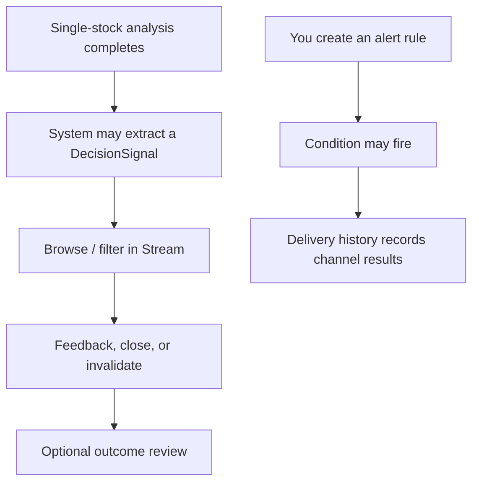

# 06 Signal center

Path: **Signals** (often `/signals`).

The Signal center combines two related ideas in one place:

1. **Decision signals** — structured, filterable advice records extracted mainly from analysis (and related sources).  
2. **Alert rules** — conditions you define (price, percent move, …) that may fire notifications.

> 💡 **One sentence**  
> A signal is a **trackable research record**, **not** an automated broker order. A “buy” label does not mean a fill occurred.

For field-level and API contracts, see [Decision signals](../decision-signals.md) (advanced). This chapter is **UI how-to** only.

## When to use which tab

| Scenario | Tab | Note |
| --- | --- | --- |
| See still-valid AI suggestions | **Stream** | Default focus: `active` |
| Get pinged at a price | **Rules** | Create and enable a rule |
| Suspect a notification never left | **Delivery history** | Channel attempt results |
| Review how past advice behaved | **Review / stats** | Explicit run; not silent full rebuilds |
| Read a full report | Workbench history | Signals index reports; they do not replace them |

## Four tabs

| Tab | Purpose | First beginner step |
| --- | --- | --- |
| **Stream** | Browse structured AI suggestions | View `active` only; open 1–2 details |
| **Rules** | Price, percent, indicator, and related alerts | One simple price rule |
| **Delivery history** | Notification attempts after triggers | Debug “phone never rang” |
| **Review / stats** | Outcomes and summaries | Use after you have some history |

## Signal vs alert

| Concept | Origin | What you do |
| --- | --- | --- |
| **Decision signal** | Mostly analysis / agent extraction; optional manual create | Browse, filter, detail, feedback, status |
| **Alert rule** | Your conditions | Create, enable, watch cooldown, check delivery |
| **Notification** | Delivery attempt after a trigger | Inspect success / failure in delivery history |

The shell **notification bell** often deep-links into a row here ([01 Shell](01-shell_EN.md)).

## Signal stream

1. Open **Stream**.  
2. Prefer **active** signals; if empty, run watchlist analysis first ([03](03-analysis-workbench_EN.md)).  
3. Filter by market, symbol, action, phase, source, and related fields.  
4. **Scope** (all / holdings / watchlist) may apply to list views; delivery history and some stats can stay **global**.  
5. Open **detail** for confidence, horizon, price plan, watch conditions, risk, source report.  
6. Mark closed, invalidated, or archived; **terminal states usually cannot return to active**.  
7. Optional useful / not-useful feedback is for your review process, not a broker fill receipt.

### Detail fields (plain language)

| Field / idea | Meaning |
| --- | --- |
| **action** | Structured direction (buy / add / hold / watch / reduce / sell / avoid / alert, …) with localized labels in UI |
| **confidence** | Stated confidence — not a promised win rate |
| **horizon** | Time scale of interest (intraday, multi-day, swing, …) |
| **entry / stop / target** | Reference plan levels; still your risk decision |
| **invalidation** | When the thesis should be treated as broken |
| **watch_conditions** | What to monitor while the idea is open |
| **status** | `active`, `expired`, `invalidated`, `closed`, `archived` |
| **source** | analysis, agent, alert, manual, … |

> ⚠️ **List label vs full report**  
> Short badges are for scanning. Before acting, open the **source report** and read it with [08 Reading reports](08-reading-reports_EN.md).

### “Current stock” on the page

Some builds expose a **current stock** path separate from advanced list filters:

- After apply, latest active and timeline load for that symbol.  
- Draft text without submit usually does not query.  
- Timelines may cap row count and tell you to narrow the range.

## Alert rules

1. **Rules** → create.  
2. Pick a type (price cross, percent move, volume, MA / RSI / MACD, portfolio risk, market status, … as listed).  
3. Set target scope → save → **enable**.  
4. Prefer **dry-run** when available.  
5. Respect **cooldown** so the same condition does not spam you.

### Beginner setup tips

| Item | Suggestion |
| --- | --- |
| First rule | One familiar ticker + simple price condition |
| Channels | Enable one reliable channel first ([10 Settings](10-settings_EN.md)) |
| Frequency | Keep default or longer cooldown |
| Mental model | Alerts “call you”; decision signals “index advice” — both useful, not the same thing |

## Delivery history and review

| Feature | Use | Caution |
| --- | --- | --- |
| **Delivery history** | Did the system attempt send? Per-channel result? | Fix channel config before re-running analysis endlessly |
| **Review / stats** | Post-hoc evaluation | Explicit UI trigger; defaults are usually conservative |
| **Run outcomes** | May require confirm | Avoid blind “force everything” clicks |

> 💡 **Reading stats**  
> Zero evaluated samples → empty state is normal. Do not over-read percentages on tiny samples.

## Examples

**A. Empty stream**  
Complete at least one analysis → check filters → re-run watchlist → look at `active`.

**B. Price alert**  
Rules → price above X → enable after notification test → verify delivery history on fire.

**C. Understanding a buy-tagged signal**  
Detail → risk and invalidation → source report (ch. 08) → optional chat → your own trade decision → optional rule for monitoring.

## FAQ

**Always empty?**  
Need successful analyses with extraction; very old history may not backfill.

**Why did a suggestion vanish?**  
Expired, invalidated by a newer opposing active signal, closed, or archived — check non-active filters.

**Manual “create signal”?**  
A research note with `manual` provenance when the UI offers it — still not an order.

**Does review change my broker positions?**  
No. Outcomes are evaluation records; see the advanced doc for engine limits.

## Related

- [03 Analysis workbench](03-analysis-workbench_EN.md)
- [08 Reading reports](08-reading-reports_EN.md)
- [07 Portfolio](07-portfolio_EN.md)
- [Decision signals](../decision-signals.md)
- [Alerts](../alerts.md)

Previous: [05 Agent chat](05-agent-chat_EN.md) · Next: [07 Portfolio](07-portfolio_EN.md)
