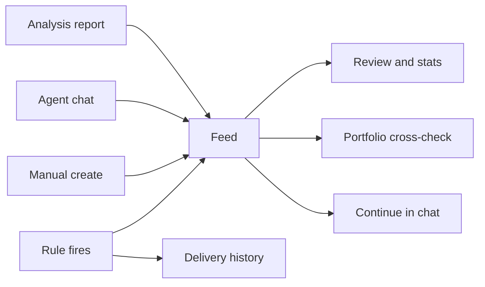
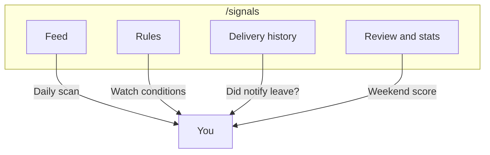
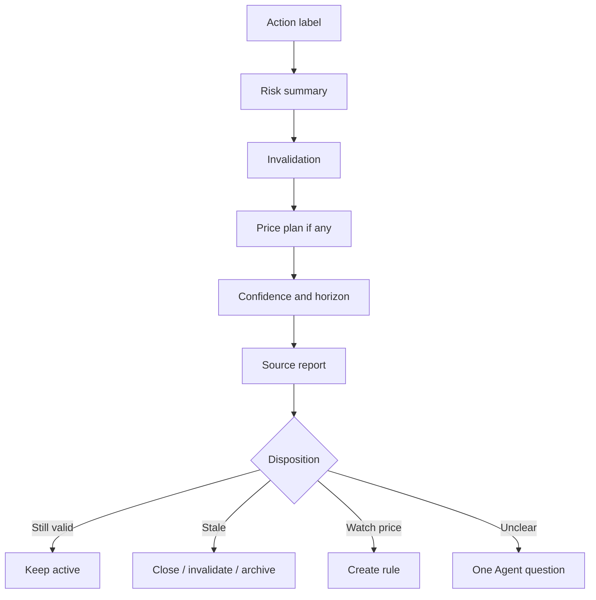
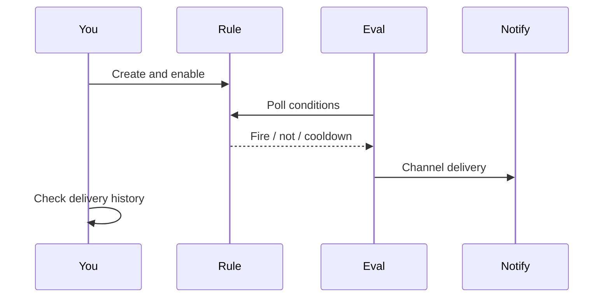

# 06 Signal Center

## What you will learn

1. Signals are **research notes with structure**, not an auto-trading system  
2. How to reach Signal Center when it is **not** in the five primary menus  
3. Four tabs: Feed, Rules, Delivery history, Review & stats  
4. How to read action / risk / invalidation, create manual signals, and build price rules with dry-run  
5. How to handle missing notifications, noisy push, and weekend review  

> 📘 **One-liner**  
> After analysis, full reports are long. Signal Center keeps the important **directional suggestions** as filterable, closable, later-scorable records. You can also configure **price-condition alerts** so you do not need to stare at screens all day.

Boundaries to keep fixed:

- Signals are **research notes + structured labels**, not an execution engine.  
- The product **does not** buy or sell for you.  
- An empty bell is normal if you have never completed analysis and never created rules.

> ⚠️ **Research only**  
> All signal content is for learning — **not investment advice**. Closing a signal or ignoring a ping is a valid research decision.

---

## 1. Mental map

Four tabs by job:

---

## 2. Not in the primary sidebar

Signal Center is **intentionally outside** the five primary menus (Home / Research / Portfolio / Agent / Settings).

> 🧭 **Entry**

| Method | How |
| --- | --- |
| Notification bell | Top bar → “view all” or a specific notice |
| Command palette | `Cmd/Ctrl+K` → try “signal” |
| Address bar | `/signals` |
| Home | Click a **Today’s focus** row |
| Portfolio | Links that jump with holdings scope (as shown) |
| Stock / signal detail | “Create rule from this signal” and similar deep links |

### 2.1 Useful deep links

| Link | Opens |
| --- | --- |
| `/signals?tab=feed` | Feed (default; `tab` often optional) |
| `/signals?tab=rules` | Rules |
| `/signals?tab=rules&createRule=1` | Rules and try open create |
| `/signals?tab=history` | Delivery / trigger history |
| `/signals?tab=history&history=notifications` | Notification-side view when offered |
| `/signals?tab=review` | Review & stats |
| `/signals?scope=holdings` | Holdings-related scope |
| `/signals?scope=watchlist` | Watchlist-related scope |
| `/signals?scope=all` | All |
| `/signals?stock=600519` | Symbol context |

Legacy `/decision-signals` and `/alerts` typically redirect. Old bookmarks often still work.

> 💡 **Tip**  
> On-page **scope** maps to URL `scope`; **tab** maps to `tab`. You can combine them. Whether filters stay linked across tabs depends on the current UI.

---

## 3. Four tabs overview

> 🖼️ **Figure placeholder** · `assets/signals-tabs-empty-en.png`  
> **Capture**: Signal Center four tabs + empty feed (or few demo rows).  
> **Notes**: Main content only OK.  
> **Status**: pending — see [assets/PLACEHOLDERS.md](assets/PLACEHOLDERS.md)

| Tab | Route hint | Job | When |
| --- | --- | --- | --- |
| **Feed** | `tab=feed` | Browse, filter, close, feedback | Daily glance |
| **Rules** | `tab=rules` | Price/change/indicator/portfolio/market alerts | You want pings |
| **Delivery history** | `tab=history` | Did triggers and channels fire? | Phone silent |
| **Review & stats** | `tab=review` | Post-hoc direction scoring | Weekend |

---

## 4. Feed: daily default tab

### 4.1 First filters

1. Status: **active** only (still live).  
2. Scope: **holdings** if you bookkeep (`scope=holdings`); otherwise watchlist or all.  
3. Do not mass-void first—open detail, then decide.  
4. Source filter (if present): `analysis` / `agent` / `alert` / `market_review` / `manual` — who wrote the note.

| scope | Meaning | Fit |
| --- | --- | --- |
| `all` | Everything | Broad scan |
| `holdings` | Holdings-related | Daily risk orientation |
| `watchlist` | Watchlist-related | Observation pool care |

### 4.2 Detail reading order

1. **action** — directional label (buy / add / hold / watch / reduce / sell / avoid / alert, as enumerated).  
2. **Risk summary** — what can go wrong.  
3. **invalidation** — when the logic should be abandoned.  
4. **watch conditions** (if any).  
5. **Price plan** (if any) — entry band, support, resistance, stop, targets; may be incomplete—do not invent missing numbers.  
6. **confidence / horizon** — how assertive the model sounds; rough research window.  
7. **plan quality** — complete / partial / minimal / … — thinner plans need the full report.  
8. **Source report** — full narrative.  
9. **Status** — still active or terminal.

> ✅ **Recommended**  
> Daily feed answers three questions only: which are active? did risks change? did invalidation hit?  
> ❌ **Avoid**  
> Treating confidence as win probability or as a position percentage.

### 4.3 Close, void, archive, feedback

| Action | Plain meaning | Note |
| --- | --- | --- |
| Close / closed | You end tracking | Read confirm dialogs |
| Invalidate / invalidated | Logic broken or you reject it | Terminal states often cannot return to active |
| Archive / archived | Keep for reference | Distinct from “still following” |
| Expire / expired | Time window ended | System or policy expiry |
| Useful / not useful | Reading mark + stats input | Honest marks help future-you |

### 4.4 Empty list?

| Hint | Common cause | Next |
| --- | --- | --- |
| No decision signals | No successful analysis, or no structured suggestion | Run one name on [Workbench](03-analysis-workbench_EN.md) |
| No active for this stock | None active or already expired | Re-analyze or relax status filter |
| Empty bell | No new signals and no rule fires | Normal until analysis or rules exist |
| Empty holdings scope | No portfolio rows, or holdings have no signals | Check [Portfolio](07-portfolio_EN.md) or change scope |

### 4.5 Manual create

1. Open **Create signal** (label as shown).  
2. Fill code, market, action; optional entry band, stop, targets, confidence, horizon.  
3. Source is fixed as **manual**—it will not pretend to be analysis-generated.  
4. Preview, then submit. Dedup may warn if an identical signal exists.  
5. For reminders, **create rule from signal** instead of leaving notes only in sticky pads.

> 📘 **Concept**  
> A **Decision Signal** is a queryable structured research record: action, risks, invalidation, optional prices, and source. It records labels at a research moment—not account fills.

---

## 5. Rules: condition-based reminders

> 🖼️ **Figure placeholder** · `assets/signals-rules-create-en.png`  
> **Capture**: Rules tab create form / createRule flow with a simple price condition.  
> **Notes**: Draft OK; English UI.  
> **Status**: pending — see [assets/PLACEHOLDERS.md](assets/PLACEHOLDERS.md)

Rules answer: “Do not watch all day—ping me when a condition hits.”

### 5.1 First simple price rule

1. Open `/signals?tab=rules&createRule=1` or in-page create.  
2. Start with easy **price cross** (break above / below).  
3. One **familiar** symbol; avoid “whole market” first.  
4. Set threshold and severity (info / warning / critical).  
5. **Dry-run** if offered—check observed values look sensible.  
6. **Save and enable**.  
7. Ensure Settings has **at least one channel that test-pushes green** ([10 Settings](10-settings_EN.md)).

### 5.2 Rule types (as listed in the product)

| Internal type | Common UI name | Plain meaning |
| --- | --- | --- |
| `price_cross` | Price break | Above/below a price |
| `price_change_percent` | Percent move | Stage move past threshold |
| `volume_spike` | Volume spike | Abnormal volume |
| `ma_price_cross` | MA cross | Price vs moving average |
| `rsi_threshold` | RSI threshold | RSI high/low zone |
| `macd_cross` | MACD cross | Fast/slow line cross |
| `kdj_cross` | KDJ cross | KDJ cross |
| `cci_threshold` | CCI threshold | CCI threshold |
| `portfolio_stop_loss` | Portfolio stop | Holdings stop-related |
| `portfolio_concentration` | Concentration | Over-concentration |
| `portfolio_drawdown` | Drawdown | Drawdown over limit |
| `portfolio_price_stale` | Stale price | Price freshness issues |
| `market_light_status` | Market light status | Market-state reminder |
| `market_light_score_drop` | Market light score drop | Score drop reminder |

> ✅ **Recommended**  
> Only types you can explain to yourself.  
> ❌ **Avoid**  
> Filling an indicator grid for “advanced” looks, then drowning in noise.

### 5.3 Target scope

| Scope | Meaning | Beginner guidance |
| --- | --- | --- |
| `single_symbol` | One stock | **Start here** |
| `watchlist` | Watchlist batch | Only if the pool is small |
| `portfolio_holdings` | Holdings dimension | Risk-oriented rules |
| `portfolio_account` | Account-level | Advanced |
| `market` | Market-level | With market-style rules |

### 5.4 Cooldown, enable/disable, noise control

| Concept | Plain meaning | Guidance |
| --- | --- | --- |
| Enable / disable | Whether evaluation runs | Disable noisy rules before deleting |
| Cooldown | Quiet interval after fire | Do **not** set 0 with broad market scans |
| Dry-run | Evaluate without full notify noise | Prefer after create |
| Severity | Reminder weight | Reserve critical for true key conditions |
| Delete rule | Remove definition | Usually **does not** erase past trigger history |

> ⚠️ **Note**  
> Empty rule lists are normal. Use **create rule from signal** to prefill fields.

### 5.5 Layered strategy

| Layer | Do | Do not |
| --- | --- | --- |
| Browse | Feed on watchlist/all for research notes | Require a rule for every row |
| Alert | Rules on holdings top or critical levels | Fine grids on a huge watchlist |
| Review | Weekend: were fires useful? | Rebuild everything after one missed push |

---

## 6. Delivery history: when the phone is silent

> 🖼️ **Figure placeholder** · `assets/signals-delivery-history-en.png`  
> **Capture**: Delivery history tab: triggers or notifications view (may be empty).  
> **Notes**: No real tokens.  
> **Status**: pending — see [assets/PLACEHOLDERS.md](assets/PLACEHOLDERS.md)

History answers:

1. **Did it trigger?** (rule side)  
2. **Did each channel succeed?** (notification side; may be `history=notifications`)

### 6.1 Fixed troubleshooting order

1. Open `/signals?tab=history` for trigger records.  
2. Trigger exists, channel failed → [Settings](10-settings_EN.md) **test push**; fix expired tokens/webhooks.  
3. Test green but no real ping → cooldown, rule disabled, wrong scope/symbol, quiet hours.  
4. No triggers at all → condition never met, evaluator not running, or dry-run mistaken for live notify.  
5. After fix, wait for the **next real fire**—do not delete/recreate rules ten times for luck.

| Symptom | Prefer suspect | Action |
| --- | --- | --- |
| No history rows | Never fired / disabled | Switches and conditions |
| Trigger, no notify | Channel config | Test push |
| Excessive notifications | Short cooldown / sticky condition | Raise cooldown, narrow targets |
| One channel fails | Single credential | Fix per channel |

---

## 7. Review & stats: weekend scorecard

Post-hoc check: past active suggestions, how direction looked later.

### 7.1 Mindset

- Tiny samples → win-rate numbers are **nearly meaningless**.  
- Very new rows may still be in observation/cooldown windows.  
- Stats are often **global reviewed** even if Feed is filtered to holdings—if the page says “global,” trust it.  
- hit / miss / unable (or neutral) are evaluation buckets, not moral verdicts.

### 7.2 Common actions

| Action | Notes |
| --- | --- |
| Run post-hoc | Safe defaults typically fill missing/retryable outcomes; avoid pointless full recalcs |
| hit / miss / unable | Matched / not / cannot evaluate |
| Feedback summary | Your useful/not-useful marks |
| Style reassess (if any) | Preview with another style when source report exists; may be blocked or unavailable |

> ✅ **Recommended**  
> Weekend: in miss buckets, look for “invalidation already hit but I never closed the signal”—improve process, not mood.  
> ❌ **Avoid**  
> Wiping all history because short-term rates look bad, or treating hit as a future guarantee.

---

## 8. Field and status quick reference

### 8.1 Status

| Status | Meaning |
| --- | --- |
| `active` | Still live; daily default |
| `expired` | Timed out |
| `invalidated` | Logic voided |
| `closed` | Closed |
| `archived` | Archived |

### 8.2 Source types

| sourceType | Plain meaning |
| --- | --- |
| `analysis` | From analysis report |
| `agent` | From chat (not every sentence) |
| `alert` | Alert/rule related |
| `market_review` | Market review related |
| `manual` | You created it |

### 8.3 Horizon examples

`intraday`, `1d`, `3d`, `5d`, `10d`, `swing`, `long`, … — research window length, not a promise of payoff by that date.

### 8.4 Plan quality

| Value | Plain meaning |
| --- | --- |
| `complete` | Levels/conditions relatively full |
| `partial` | Some fields present |
| `minimal` | Thin—return to full report |
| `unknown` | Unlabeled |

Field-level contracts (technical, optional): [DecisionSignal topic](../decision-signals.md).

---

## 9. Use cases

**A — After first report** — active feed → action / risk / invalidation only → mark not useful or close if it is not for you.  
**B — Ping near a level** — price rule → dry-run → enable → verify history on fire.  
**C — Channel silent** — history errors → Settings test push → fix token; do not rebuild rules first.  
**D — Holdings risk only** — `scope=holdings` + defensive actions → cross-check [Portfolio](07-portfolio_EN.md).  
**E — Too many rules** — disable half → cooldown/quiet hours → keep 1–3 holdings rules.  
**F — Weekend scoring** — review tab → hit/miss/unable → mark useless → tune habits, not delete-all.  
**G — Bell to decision** — open detail → close / tighter rule / one Agent question.  
**H — Browse wide, alert narrow** — feed may use watchlist; rules prefer holdings top.  
**I — Manual research note** — manual signal with honest source → derive one price rule.  
**J — Market light rules** — after you understand market review context → dry-run → low severity first.

Also see automation and anti-patterns in [11](11-daily-workflows_EN.md).

---

## 10. FAQ

**Q1: Why is there no Signals in the primary nav?**  
Product design places it under bell / palette / deep links. Use §2 entries.

**Q2: Do signals place trades?**  
No. No tab replaces your execution.

**Q3: Many active rows—is the system broken?**  
More often: batch analysis produced many structured suggestions, or you rarely close stale ones. Closing/archiving is normal hygiene.

**Q4: Rule enabled but never fires?**  
Condition strict, symbol halted/no quotes, evaluation interval not reached, or break direction mismatched. Dry-run first.

**Q5: Does deleting a rule delete history?**  
Typically **no** for past triggers; trust the confirm copy.

**Q6: Can review win rate drive position size?**  
Not as a simple input. Sample, regime, and plan quality distort the number. Use it to **review research process**.

**Q7: Do old `/alerts` bookmarks work?**  
Usually redirect; if not, re-bookmark `/signals`.

**Q8: Is confidence 0.9 almost certain?**  
No. Confidence is how assertive the expression is—not promised post-hoc accuracy.

---

## 11. Self-check

### Daily (~5 minutes)

- [ ] Feed, status mainly active  
- [ ] Scope holdings or watchlist before unfiltered all  
- [ ] Scan action / risk / invalidation without full essays  
- [ ] Stale rows closed or feedback applied  
- [ ] Bell badges can be drilled to a disposition  

### When creating rules

- [ ] Notify channel test green  
- [ ] Type you can explain  
- [ ] Target scope as narrow as practical  
- [ ] Dry-run done  
- [ ] Cooldown not 0 unless consequences are understood  
- [ ] Know where to read delivery history  

### Weekend

- [ ] Review hit/miss/unable and feedback  
- [ ] Disable noise before only adding rules  
- [ ] Heavy-name signals still match portfolio reality  
- [ ] Method changes go to reading/rule habits, not data wipes  

---

## 12. Glossary

| Term | Meaning |
| --- | --- |
| Signal Center | `/signals` workspace |
| Decision Signal | One structured suggestion record |
| active | Still live |
| closed / archived / expired / invalidated | Terminal or end states |
| action | Direction label |
| horizon | Rough research window |
| confidence | Assertiveness label, not guaranteed correctness |
| invalidation | When the logic breaks |
| plan quality | Completeness of plan/price fields |
| scope | all / holdings / watchlist |
| Rule | Alert definition that pings when conditions hold |
| dry-run | Trial evaluation before full notify noise |
| cooldown | Quiet interval after fire |
| Delivery history | Triggers and channel delivery records |
| outcome / post-hoc | Later score against price path |
| sourceType | Where the signal came from |

---

## 13. Related

- [08 Reading reports](08-reading-reports_EN.md) — full narrative when jumping from a signal  
- [03 Analysis Workbench](03-analysis-workbench_EN.md) — main upstream  
- [05 Agent chat](05-agent-chat_EN.md) — clarify invalidation  
- [07 Portfolio](07-portfolio_EN.md) — holdings scope and risk cross-check  
- [09 Backtest](09-backtest_EN.md) — another post-hoc lens  
- [10 Settings](10-settings_EN.md) — channels and test push  
- [04 Market review](04-market-review_EN.md) — market context  
- [11 Daily workflows](11-daily-workflows_EN.md) — monitor chain and anti-patterns  
- [DecisionSignal topic](../decision-signals.md) — field contracts (optional)  

Prev: [05 Agent chat](05-agent-chat_EN.md) · Next: [07 Portfolio](07-portfolio_EN.md)
