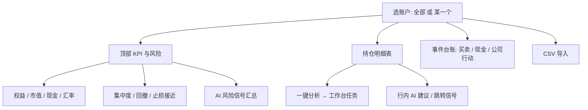
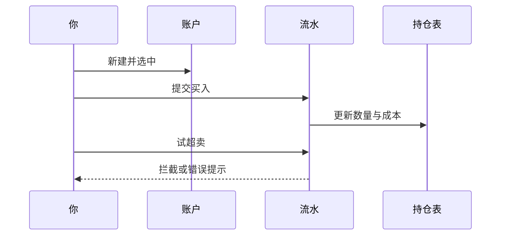
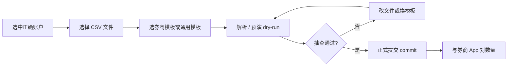

# 07 持仓（组合）

## 本章你会学会

1. 分清持仓记账与 AI 信号、分析报告的边界  
2. 建立账户、录入/导入成交，读懂成本与集中度  
3. 把持仓与信号中心、工作台串成「事实 vs 建议」对照  
4. 在一键分析、多账户、纸交易等场景里控制额度与混账风险  

持仓模块回答的是一件很朴素、也很容易被「AI 建议」盖过的事：

> **你自己的账户里，现在到底有什么、成本大概多少、风险有没有挤在一处。**

它和 AI 信号是 **合作关系**，不是替代关系：

| 角色 | 记录什么 | 不负责什么 |
| --- | --- | --- |
| **持仓 / 组合** | 你的事实：成交、现金、分红、拆并股 | 不替你下单、不自动调仓 |
| **AI 信号** | 研究建议与结构化标签 | 不改写你的数量与成本 |
| **分析工作台** | 研究报告 | 不记账 |

> 📘 **概念**  
> 持仓页上的数字，是 **你录入/导入的台账 + 系统尽力取到的行情** 合成的研究视图。它是「账本与风险温度计」，不是券商官方对账单，也不是自动交易终端。

> ⚠️ **注意**  
> 盈亏数字与行内 AI 建议都只供研究与记录，**不构成投资建议**。真实买卖、税费、清算规则以券商与监管口径为准。若界面提供纸交易 / 模拟账户，请与实盘 **分账本** 查看。

> 💡 **提示**  
> 侧栏导航文案常见是 **组合**；进入后页面标题更常是 **持仓管理**。这是同一功能。找不到时，命令面板搜「持仓」「组合」「portfolio」即可。

---

## 1. 怎么进入

> 🧭 **入口**

| 方式 | 路径 |
| --- | --- |
| 侧栏 | **组合** |
| 地址栏 | `/portfolio` |
| 命令面板 | `Cmd/Ctrl + K`，搜「持仓」「组合」 |
| 从信号中心 | 带 `scope=holdings` 的链接可回对照仓位 |

可收藏：`/portfolio`（多数场景无强制查询参数；以你安装的版本为准）。

---

## 2. 这个页面适合你吗？

| 你的情况 | 建议 |
| --- | --- |
| 只想试用 AI 报告 | **可以先不建持仓**，不影响分析与读报告 |
| 想对照「建议 vs 真实仓位」 | 建 1 个账户，至少录几笔买卖 |
| 有券商导出 CSV | 用导入，但 **必须先预览（dry-run）** |
| 想练手、不敢动真仓 | 若有纸交易 / 模拟账户，用它练流程 |
| 多券商、多币种 | 拆成多个账户，比硬塞进一本账更清晰 |
| 只有自选、尚无真实持仓 | 继续用自选 + 信号即可，不必为了「看起来专业」硬记假仓 |

> ✅ **推荐做法**  
> 研究 → 确认值得跟踪 → 再在组合里开仓记账。  
> ❌ **不推荐**  
> 先乱录一堆持仓，再被 AI 建议带着跑；或把模拟盈亏当成实盘战绩。

---

## 3. 页面结构：逛一遍就不会慌

> 🖼️ **配图占位** · `assets/portfolio-overview-zh.png`  
> **应配内容**：持仓/组合页：账户选择 + 持仓表（空表或演示持仓）+ 关键操作入口。  
> **拍摄要点**：演示数量；禁止真实大额与可识别账号。  
> **状态**：待补图（清单：[assets/PLACEHOLDERS.md](assets/PLACEHOLDERS.md)）

### 3.1 账户切换

| 视图 | 适合 | 注意 |
| --- | --- | --- |
| **全部账户** | 总览权益、风险、跨账户持仓 | 许多 **写入** 操作会被拦住，需先选具体账户 |
| **某一个账户** | 记账、导入、删流水、改账户属性 | 选错账户 = 记错账本 |

> ⚠️ **注意**  
> 界面若提示「当前处于全部账户视图，为避免误写请先选择具体账户」——请当真。这是保护，不是故障。

### 3.2 成本法（成本口径）

界面常见：

| 标签（示例） | 含义 |
| --- | --- |
| **先进先出（FIFO）** | 先买的先拿出来匹配卖出成本 |
| **均价成本（AVG）** | 把持仓摊成一个平均成本 |

换成本法会改变 **成本价、未实现盈亏** 等 **展示口径**，不会抹掉真实历史成交行。

> ✅ **推荐做法**  
> 自己做长期对比时 **固定一种** 成本法。  
> ❌ **不推荐**  
> 今天 FIFO、明天 AVG，数字跳来跳去再怀疑「系统算错了」。

### 3.3 KPI 与风险条：读感觉，不读小数点后八位

常见字段：

| 区域 | 你在看什么 |
| --- | --- |
| 总权益 / 总市值 / 总现金 | 仓位大致规模与现金缓冲 |
| 汇率状态 | 多币种账户时汇率是否过期；可尝试 **刷新汇率** |
| 行业 / 个股集中度 | 钱是不是堆在少数板块或个股上 |
| 回撤监控 | 从高点滑下来多少的感觉（最大 / 当前） |
| 止损接近预警 | 与信号或计划价相关的接近/触发计数（有则看） |
| AI 风险信号 | 持仓相关卖出 / 减仓 / 预警类信号汇总 |

若出现类似标签：

- 「实时行情为尽力获取」  
- 「汇率与成本基础为部分口径」  
- 「行业与风险指标覆盖有限」  

请把数字当成 **方向感**，而不是会计师签字版。

> 📘 **概念：快照 vs 风险模块**  
> **快照**偏「现在持了什么、大概值多少」；**风险模块**偏集中度、回撤等。风险获取失败时，页面可能 **降级为仅展示快照**——这是优雅降级，不是数据被清空。

### 3.4 持仓明细表

每一行大致包含：账户、代码、数量、均价 / 成本、现价、市值、未实现盈亏、收益率、操作（分析）、有时还有 AI 建议摘要。

| 现象 | 怎么理解 |
| --- | --- |
| AI 列转一会儿才出来 | 异步拉取最新 active 信号，正常 |
| AI 列一直空 | 可能没有可展示信号，或加载失败 |
| 点 **分析** | 提交分析任务到 **工作台**，本页不会直接刷出长文 |
| 现价缺失 | 行情尽力获取失败时，市值 / 盈亏可能受限 |

行业集中度图若行业数据不可用，可能 **降级为个股集中度**——标签会提示展示口径。

---

## 4. 教程：从零建账（最稳的五步）

适合：第一次用组合页、手里有少量真实成交。

| 步骤 | 做什么 | 成功长什么样 |
| --- | --- | --- |
| 1 | **新建账户**：名称必填；券商、基准币、市场按真实情况或先填大概 | 提示创建成功，并常自动切到该账户 |
| 2 | 确认右上角 / 账户视图是 **这一个账户**，不是「全部」 | 写入入口可用 |
| 3 | **录一笔买入**：代码、日期、价格、数量；手续费 / 税费能填就填（可留空按 0） | 持仓表出现数量与成本 |
| 4 | 对照券商 App 抽查数量 | 数量一致（成本允许口径差） |
| 5 | 故意试一笔 **超量卖出** | 若被拦截，说明保护在工作——这是好事 |

然后再录：现实中的卖出、出入金、分红 / 拆并股。

> 💡 **提示**  
> 账户可编辑名称、券商、基准币、市场；**删除账户** 通常是从默认列表 / 快照 / 录入入口 **隐藏**，历史流水未必物理抹掉（以界面确认文案为准）。删前请读确认对话框。

---

## 5. 三种流水：分别记什么

| 类型 | 你在记什么 | 典型字段 |
| --- | --- | --- |
| **交易 trade** | 股票成交 | 代码、买/卖、价格、数量、手续费、税费、交易日期 |
| **现金 cash** | 出入金等 | 流入/流出、金额、币种（可默认账户基准币）、日期 |
| **公司行动 corporate** | 分红、拆并股等 | 生效日、类型、每股分红或拆并股比例、代码 |

台账区通常支持：

- 按日期区间、代码、方向 / 行为类型筛选  
- 分页浏览  
- 删除错误行（需单账户视图；有确认）

> ⚠️ **注意**  
> 有些情况会 **禁止删除**（保护一致性）。删错了就 **重新录入正确流水**，不要靠改截图糊弄自己。

### 5.1 分红怎么记（示例）

1. 选对账户。  
2. 打开 **录入公司行为**。  
3. 类型选 **现金分红**。  
4. 填生效日与 **每股分红**。  
5. 提交后回看现金与成本是否按你的预期变化。  
6. 若与券商不一致：先核对除权日、是否已含税、是否漏记税费，再改流水。

### 5.2 拆并股怎么记（示例）

1. 选对账户与代码。  
2. 类型选 **拆并股调整**。  
3. 填生效日与 **拆并股比例**（以界面字段说明为准）。  
4. 提交后核对数量变化是否合理。

### 5.3 出入金怎么记（示例）

银证转入 → **现金 · 流入**；取出 → **流出**。  
这能解释「为什么市值没变但总权益变了」。

---

## 6. CSV 导入：先预览再写入

> 🖼️ **配图占位** · `assets/portfolio-import-preview-zh.png`  
> **应配内容**：CSV/流水导入预览或 dry-run 确认界面（若产品提供）。  
> **拍摄要点**：虚构流水；禁止真实券商账号信息。  
> **状态**：待补图（清单：[assets/PLACEHOLDERS.md](assets/PLACEHOLDERS.md)）

导入能省大量时间，也是最容易「一键导入、一键后悔」的地方。

### 6.1 推荐节奏

1. 选中正确账户。  
2. 打开 **券商 CSV 导入**。  
3. 选择文件。  
4. 选择券商模板；列表为空时换通用模板或刷新券商列表。  
5. 勾选 **仅预演（不写入）**，点 **解析文件**。  
6. 读摘要：有效 / 跳过 / 错误条数。  
7. 抽查至少 **3 只**核心持仓的方向、数量、价格、日期。  
8. 确认无误后取消 dry-run 或走 **提交导入**。  
9. 看写入 / 重复 / 失败计数。  
10. 刷新持仓，用券商 App 对数量。

### 6.2 常见问题

| 现象 | 你可以怎么做 |
| --- | --- |
| 表头对不上 | 换模板或按提示改列名 |
| 乱码 | 另存 **UTF-8** 再试 |
| 重复导入 | 看系统是否提示重复 / 幂等；仍以预览为准，必要时先在测试账户演练 |
| 超卖行 | 在预览阶段改掉错误卖出，不要 commit 后再修半个月 |
| 券商列表为空 | 刷新；仍空则可能暂不可用该模板路径，改手工录入 |

> ✅ **推荐做法**  
> 第一次大导入用 **测试账户** 或极小样本文件练手。  
> ❌ **不推荐**  
> 跳过 dry-run，在未预览核对的情况下，直接将大量历史流水导入实盘账户。

---

## 7. 和 AI 信号一起用

| 现象 | 怎么理解 | 下一步 |
| --- | --- | --- |
| 行内有简短 AI 建议 | 有可展示的最新 active 信号 | 点进信号详情或来源报告 |
| 一直是空 | 没信号，或异步未完成 / 拉取失败 | 对持仓代码跑分析，或打开信号中心 |
| 提示降级 / 不可用 | 展示不完整 | 进信号中心或报告读全文 |
| 想看持仓池全部建议 | — | 打开 `/signals?scope=holdings` |

### 7.1 更好的日常节奏

1. 开盘前 / 收盘后：看 **集中度、回撤、异常仓位**。  
2. 对最不放心的 **1 只** 点分析或进信号中心。  
3. 读完风险与失效条件，再生效 **你自己的** 交易计划。  
4. 计划在你脑子里（或你自己的笔记里），**不在**自动下单里。

> ❌ **不推荐**  
> 把行内「减仓」标签当成系统已替你减仓；或对全部持仓一键分析却不看额度与任务规模。

### 7.2 一键分析前的额度意识

- 看清将分析几只、是 brief 还是 detailed（以工作台实际提交为准）。  
- **重仓优先**，小仓可先观察。  
- 任务提交成功后，去工作台 **运行中任务 / 历史** 读报告，不要死等在持仓页。

---

## 8. 使用案例

### 案例 A：我只有三笔历史成交

新建账户 → 手工录三笔 → 看总市值是否大致合理 → 结束。  
不必一上来就搞 CSV。

### 案例 B：券商导出了一大表

新建「实盘」账户 → dry-run 预览总笔数 → 抽查核心持仓 → commit → 与 App 对数量。

### 案例 C：持仓有了，AI 列空白

对持仓代码在工作台跑一轮分析 → 回持仓刷新 → 或直接打开 `/signals?scope=holdings`。

### 案例 D：多账户都有同一只票

一键分析或读信号时注意账户上下文；记账时 **每笔进对账本**。

### 案例 E：研究完再记账（推荐顺序）

工作台 + 信号确认值得跟踪 → 再在组合开仓记录。避免「先假仓后叙事」。

### 案例 F：集中度吓一跳

持仓页看行业 / 个股权重 → 信号 `scope=holdings` 只读风险向 → 问股只讨论「分散前应观察什么」，**不要**让模型直接下令卖哪几只。

### 案例 G：实盘 + 模拟分开

模拟练流程，实盘单独一本账。看盈亏时先确认当前账户，避免爽感或挫败串台。

### 案例 H：跨市场账户

基准币与市场尽量填准；汇率过期时点 **刷新汇率**，并接受「部分口径」限制提示。

### 案例 I：分红季对账

公司行动记分红 → 对照券商资金流水 → 不一致时查除权日与税，而不是反复改成本法。

### 案例 J：删错流水

单账户视图 → 删除确认 → 重新录入正确行 → 刷新持仓。不要用「再导一次 CSV」掩盖错误方向。

持仓型日常节奏另见 [11 · 角色与组合技](11-daily-workflows.md)。

---

## 9. 常见问题（FAQ）

**Q1：为什么不能在「全部账户」里导入？**  
A：避免写入范围不明确。先选具体账户。

**Q2：删除账户后历史成交还在吗？**  
A：常见实现是隐藏账户入口、不物理清空流水；以确认文案与后续版本为准。重要数据请另有备份习惯。

**Q3：成本和券商 App 差一截正常吗？**  
A：可能。费用、分红、成本法、汇率、未同步流水都会造成差异。先对 **数量**，再对成本。

**Q4：风险模块降级是不是坏了？**  
A：多半是风险接口暂时失败，快照仍可用。可刷新；持续失败再查后端日志 / 网络。

**Q5：纸交易盈亏能当实盘战绩吗？**  
A：不能。滑点、情绪、额度、流动性都不同。

**Q6：持仓页能自动跟信号买卖吗？**  
A：**不能。** 系统设计上不会根据信号自动调仓。

**Q7：港股 / 美股代码怎么写？**  
A：与全站一致，例如 `hk00700`、`AAPL`；以规范化后的代码为准。

**Q8：一键分析后报告在哪？**  
A：分析工作台的任务与历史；持仓页只负责提交入口。

---

## 10. 离开前自检

| # | 自检项 | 通过标准 |
| --- | --- | --- |
| 1 | 当前账户是否正确 | 不是误停在「全部」却想写入 |
| 2 | 成本法是否固定 | 本周内不来回切换 |
| 3 | 核心持仓数量 | 与券商一致 |
| 4 | 局限提示 | 能接受「尽力行情 / 部分口径」 |
| 5 | AI 列 | 空时知道去工作台或信号中心 |
| 6 | CSV | 大导入做过 dry-run |
| 7 | 模拟 / 实盘 | 分账查看 |
| 8 | 研究纪律 | 未把持仓建议当自动下单 |

---

## 11. 术语（白话）

| 术语 | 含义 |
| --- | --- |
| 账户 | 一本独立的账（可对应券商 / 市场 / 模拟） |
| 成本法 / 成本口径 | 怎么算「我的成本价」 |
| FIFO | 先进先出匹配成本 |
| AVG / 均价成本 | 摊成一个平均成本 |
| 已实现盈亏 | 卖掉锁定的盈亏（视实现与展示） |
| 未实现盈亏 | 还拿在手里的浮动盈亏 |
| 总权益 | 市值与现金等合成的总览（视口径） |
| 集中度 | 资金是否堆在少数行业 / 个股 |
| 回撤 | 从高点滑下来多少的感觉 |
| 公司行动 | 分红、拆并股等公司层面变动 |
| dry-run / 预演 | 只解析校验，不写入 |
| commit / 提交导入 | 真正写入流水 |
| 纸交易 | 模拟账户（若产品提供） |
| 快照 | 持仓与估值的当前截面 |
| 风险模块 | 集中度、回撤等风险视图 |

---

## 12. 相关阅读

- [06 信号中心](06-signals.md)  
- [03 分析工作台](03-analysis-workbench.md)  
- [08 阅读报告](08-reading-reports.md)  
- [11 日常工作流](11-daily-workflows.md)  
- [13 个股工作区](13-stock-details.md)  

上一篇：[06 信号中心](06-signals.md) · 下一篇：[08 阅读报告](08-reading-reports.md)
