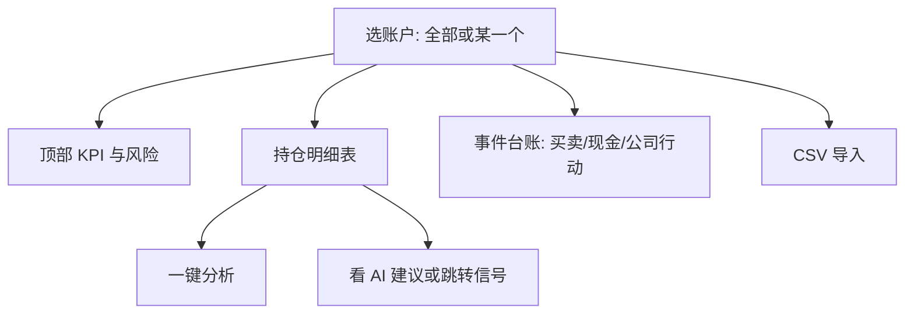

# 07 持仓（组合）：把账记清楚，再谈风险

你好。持仓模块解决的是一件很朴素的事：**你自己的账户里，现在到底有什么、成本大概多少、风险有没有挤在一处**。

它和 AI 信号是合作关系，不是替代关系：

- 持仓记录的是 **你的事实**（成交、现金、分红等）。  
- AI 信号是 **研究建议**，可以显示在持仓行旁边作参考。  
- 系统 **不会** 根据信号自动帮你买卖调仓。

> 💡 **名字为什么有时叫「组合」，有时叫「持仓」？**  
> 侧栏导航文案常见是 **组合**；进到页面后标题更常是 **持仓管理**。这是同一功能，不是两个产品。找不到时搜「持仓」「portfolio」即可。

> ⚠️ 盈亏数字与 AI 建议都只供研究记录，**不构成投资建议**。纸交易（若有）请与实盘分开看。

---

## 怎么进入

| 方式 | 路径 |
| --- | --- |
| 侧栏 | **组合** |
| 地址 | `/portfolio` |
| 命令面板 | 搜「持仓」「组合」 |

---

## 这个页面适合你吗？

| 你的情况 | 建议 |
| --- | --- |
| 只想试用 AI 报告 | 可以先不建持仓，不影响分析 |
| 想对照「建议 vs 真实仓位」 | 建议建 1 个账户，至少录几笔 |
| 有券商导出 CSV | 用导入，但请先预览 |
| 想练手不敢动真仓 | 若界面提供纸交易/模拟账户，用它练流程 |

---

## 页面结构（逛一遍就不会慌）

### 账户切换

- **全部账户**：适合看总览；很多「写入」操作可能被拦住，需要先点进具体账户。  
- **某一个账户**：记账、导入、删流水时请确认选对了——选错账户就像记错账本，很烦人。

### 成本法

界面可能提供 **FIFO（先进先出）** 与 **平均成本** 等（以标签为准）。

换成本法会改变「成本价、盈亏」的 **展示口径**，不会抹掉你真实的历史成交。长期自己对比时，建议 **固定一种**，否则数字跳来跳去会怀疑人生。

### KPI 与风险条（读感觉，不读小数点后八位）

常见会看到：总权益、总市值、现金、汇率状态、集中度、回撤、止损接近、与持仓相关的 AI 风险信号汇总等。

如果出现「实时行情尽力获取」「汇率与成本部分口径」这类局限提示，请把数字当成 **方向感**，而不是会计师签字版。

### 持仓表

每一行大致是：代码、数量、成本、现价、市值、浮动盈亏、操作（分析）、有时还有 AI 建议摘要。

- AI 列可能 **转一会儿才出来**；没有 active 信号时显示空占位是正常的。  
- 点 **分析**：任务会跑到分析工作台，不是在本页直接生成长文。

---

## 从零建账：最稳的五步

1. **新建账户**：名称必填；券商、基础货币、市场按你的真实情况填（或先填大概）。  
2. **选中这个账户**（不要停在「全部」）。  
3. **录一笔买入**：代码、日期、价格、数量；费用能填就填。  
4. 看持仓表数量与成本是否符合预期。  
5. 故意试一笔 **超量卖出**：若被拦截，说明保护在工作——这是好事。

然后再录出现实中的卖出、出入金、分红等。

---

## 三种流水，分别记什么

| 类型 | 你在记什么 | 典型字段 |
| --- | --- | --- |
| **买卖 trade** | 股票成交 | 代码、买/卖、价格、数量、费税、日期 |
| **现金 cash** | 出入金等 | 流入/流出、金额、币种、日期 |
| **公司行动 corporate** | 分红、拆股等 | 生效日、类型、每股分红或拆股比例 |

台账区通常支持按日期、代码、方向筛选，以及分页浏览。删错一行会有确认；有些情况会 **禁止删除**（保护一致性）。

### 分红怎么记（示例）

选对账户 → 选公司行动 → 现金分红 → 填生效日与每股分红 → 提交 → 回来看现金与成本是否按你的预期变化。若与券商不一致，先核对除权日与是否已含税，再改流水。

---

## CSV 导入：请对预览温柔一点

导入能省大量时间，但也是最容易「一键导入、一键后悔」的地方。请按这个节奏：

1. 选中正确账户。  
2. 打开 **CSV 导入**，选择文件。  
3. 选择券商模板或通用模板（列表为空时换通用）。  
4. 先 **解析 / 预览（dry-run）**，不要直接提交。  
5. 抽查 3 只股票的方向、数量、价格、日期。  
6. 确认无误再 **正式写入（commit）**。  
7. 刷新后，用券商 App 对一下数量。

| 常见问题 | 你可以怎么做 |
| --- | --- |
| 表头对不上 | 换模板或按提示改列名 |
| 乱码 | 另存 UTF-8 再试 |
| 重复导入 | 看系统是否提示幂等；仍以预览为准，必要时先清测试账户 |
| 超卖 | 预览阶段改掉错误卖出 |

---

## 和 AI 信号一起用

| 现象 | 怎么理解 |
| --- | --- |
| 行内有简短 AI 建议 | 有可展示的最新 active 信号 |
| 一直是空 | 可能没信号，或还在异步加载 |
| 提示降级 | 展示不完整，请点进信号中心或报告 |
| 想看持仓池全部建议 | 打开 `/signals?scope=holdings` |

更好的日常节奏是：

开盘前看持仓集中度与回撤 → 对最不放心的 1 只点分析或进信号中心 → 读完再生效你的交易计划（计划在你脑子里，不在自动下单里）。

---

## 使用案例

### 案例 A：我只有三笔历史成交

新建账户 → 手工录三笔 → 看总市值是否大致合理 → 结束。不必一上来就搞 CSV。

### 案例 B：券商导出了一大表

新建「实盘」账户 → dry-run 预览总笔数 → 抽查茅台/某只核心持仓 → commit → 与 App 对数量。

### 案例 C：持仓有了，AI 列空白

对持仓代码在工作台跑一轮分析 → 回持仓刷新 → 或直接打开信号中心持仓范围。

### 案例 D：多账户都有同一只票

一键分析时若提示选账户，请选对账本，避免上下文挂错。

---

## 术语（白话）

| 术语 | 人话 |
| --- | --- |
| 账户 | 一本独立的账 |
| 成本法 | 怎么算「我的成本价」 |
| FIFO | 先买的先卖出来匹配成本 |
| 平均成本 | 摊成一个均价 |
| 已实现 / 未实现 | 卖掉锁定的 vs 还拿在手里的浮动 |
| 集中度 | 钱是不是都堆在少数几只上 |
| 回撤 | 从高点滑下来多少的感觉 |
| 公司行动 | 分红、拆股等公司层面的变动 |
| 纸交易 | 模拟账户（若产品提供） |

---

## 相关阅读

- [06 信号中心](06-signals.md)  
- [03 分析工作台](03-analysis-workbench.md)  
- [11 日常工作流](11-daily-workflows.md)  

上一篇：[06 信号中心](06-signals.md) · 下一篇：[08 阅读报告](08-reading-reports.md)
