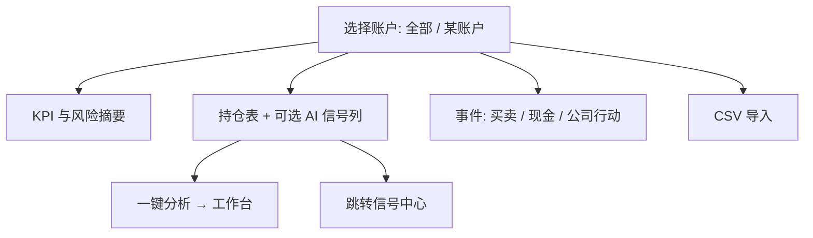

# 07 持仓（组合）

## 页面入口与操作路径

| 方式 | 具体路径 |
| --- | --- |
| 主导航 | 侧栏 **组合**（`layout.nav.portfolio`；中文导航文案为「组合」） |
| 页面标题 | 进入后标题常见为 **持仓**（`layout.route.portfolio.title`） |
| 命令面板 | 搜索「持仓」「组合」「portfolio」 |
| 直链路由 | `/portfolio` |
| 信号中心联动 | 从持仓相关 AI 建议跳到 `/signals?scope=holdings` 等 |

本模块帮你**记账与看风险**，并可从持仓行一键跳到分析。它记录的是你的账户事实；**不会**根据 AI 信号自动调仓。

> 💡 **文案对照**  
> 侧栏叫 **组合**，页面里多叫 **持仓**——是同一模块。本手册两种叫法都会出现，避免你找错菜单。

> ⚠️ **研究免责**  
> 盈亏与 AI 建议仅供研究记录，**不构成投资建议**。模拟 / 纸交易与真实成交分离理解。

## 适用场景

| 场景 | 建议做法 |
| --- | --- |
| 第一次使用 | 先建一个账户，手工录 1～2 笔买卖验证 |
| 已有券商导出 | CSV 导入：先预览（dry-run）再正式写入 |
| 日常开盘前 | 看市值、盈亏、集中度与风险摘要 |
| 想对持仓股做研究 | 行内一键分析 → 分析工作台任务流 |
| 多账户 | 先选对账户再记账 |
| 想练手不想动真仓 | 使用**纸交易 / 模拟账户**（若界面提供「纸交易」类型） |

## 整体结构

| 区域 | 作用 | 小白怎么记 |
| --- | --- | --- |
| **账户切换** | 单账户或全部 | 「哪本账本」 |
| **KPI** | 市值、盈亏、现金等 | 「账上大概怎样」 |
| **风险摘要** | 集中度、回撤、止损接近等 | 「有没有挤在一起」 |
| **持仓表** | 标的、数量、成本、浮动盈亏、可选 AI 建议 | 「明细」 |
| **事件 / 流水** | 买卖、现金、公司行动 | 「流水账」 |
| **导入** | 券商 / 通用 CSV | 「批量记账」 |

## 查看与成本法

1. 打开 `/portfolio`，选择账户或 **全部**。  
2. 切换**成本法**（如 FIFO / 平均成本，**以界面标签为准**）。  
3. 查看市值、盈亏、集中度等 KPI。  
4. 阅读风险摘要。  
5. 持仓行可能**异步**加载最新 AI 信号；无信号时显示空占位（如「—」）属于正常。  
6. 价格旁若出现 **stale / 陈旧** 类提示，解读盈亏时要更保守。

### 术语

| 术语 | 解释 |
| --- | --- |
| **账户** | 一套独立账本；可多账户 |
| **纸交易 / Paper** | 模拟账户类型：用初始现金虚拟成交，不连真实券商（能力以当前版本为准） |
| **成本法** | 计算成本价的规则 |
| **FIFO（先进先出）** | 先买入的份额先卖出 |
| **平均成本** | 把持仓摊成一个均价 |
| **已实现 / 未实现盈亏** | 已卖出锁定的 vs 仍持有浮动的 |
| **集中度** | 重仓占总资产比例 |
| **回撤** | 从阶段高点回落幅度 |
| **price stale** | 价格偏旧或缺失时的降级提示 |
| **公司行动** | 分红、拆股等影响持仓与成本的事件 |
| **现金流水** | 出入金等不直接改变持仓股数的资金变动 |

> ⚠️ **成本法影响盈亏展示**  
> 换成本法可能改变数字观感，但不会改真实成交历史。长期对比请固定一种方法。

## 记账（手工）

| 操作 | 说明 |
| --- | --- |
| 新建 / 归档账户 | 不用的账户可归档，避免列表噪音 |
| 买卖交易 | 录入方向、数量、价格、日期、费用（以表单字段为准） |
| 现金流水 | 出入金，影响现金与总资产 |
| 公司行动 | 分红、拆股等（以界面支持类型为准） |
| 修正 | 在事件列表筛选并编辑 / 删除单条 |
| 超卖保护 | **卖出超过可用数量会被拦截**——是保护，不是故障 |

### 建议配置

| 项目 | 新手建议 |
| --- | --- |
| 账户数量 | 先 1 个实盘账本 |
| 第一笔 | 用真实小额或历史一笔验证 |
| 现金 | 若关心资金曲线，记得录出入金 |
| 纸交易 | 仅当界面提供时用于演练；与实盘数字分开看 |

## CSV 导入

1. 选择券商格式或通用模板。  
2. **先预览（parse / dry-run）**，核对代码、方向、数量、价格、日期。  
3. 确认无误后再 **提交写入（commit）**。  
4. 重复提交时系统会尽量幂等去重；仍以预览为准。

| 常见失败原因 | 处理 |
| --- | --- |
| 表头不匹配 | 按界面提示改列名或换模板 |
| 编码问题 | 尝试 UTF-8 或券商默认导出编码 |
| 重复行 / 超卖 | 预览阶段修正后再导入 |
| 代码格式 | A 股纯数字、港股 `hk` 前缀、美股代码等见 [03](03-analysis-workbench.md) |

## 从持仓一键分析

1. 在持仓行发起分析。  
2. 多账户持有同一标的时，按提示选择账户。  
3. 任务在 **研究 → 分析工作台 → 运行中任务** 跟踪。  
4. 完成后按 [08 阅读报告](08-reading-reports.md) 阅读。  
5. 信号中心可能出现新的 active 信号；持仓行信号列异步刷新。

## 与 AI 信号的关系

| 现象 | 含义 |
| --- | --- |
| 行内有建议摘要 | 存在可展示的最新 active 信号 |
| 空占位 | 无 active 或仍在加载 |
| 「AI 建议降级」类警告 | 信号展示降级，勿当完整报告 |
| 跳转信号中心 | 常用 `scope=holdings` 看持仓范围建议池 |

## 使用案例

**案例 A：从零建账**  
新建账户 → 录入一笔买入 → 核对数量与成本 → 故意超卖应被拦截 → 再录一笔合法卖出。

**案例 B：导入后对账**  
dry-run 预览总笔数 → 抽查 3 只股票数量 → commit → 与券商 App 对一下市值数量。

**案例 C：持仓有了但没有 AI 建议**  
对持仓标的在工作台跑分析 → 回到 `/portfolio` 刷新 → 或打开 `/signals?scope=holdings`。

**案例 D：纸交易演练（若可用）**  
在账户切换处创建纸交易账户 → 用初始现金模拟买卖 → **不要**与实盘 KPI 混在同一决策叙事里。

**案例 E：开盘前 3 分钟**  
打开组合 → 看集中度与回撤 → 对风险最高的 1 只点一键分析或进信号中心。

## 相关

- [06 信号中心](06-signals.md)
- [03 分析工作台](03-analysis-workbench.md)
- [11 日常工作流](11-daily-workflows.md)

## 深度：账户生命周期

| 操作 | 界面能力 | 注意 |
| --- | --- | --- |
| 新建账户 | 名称、券商、基础货币、市场等 | 名称必填 |
| 编辑账户 | 改元数据 | 保存后刷新快照 |
| 删除/归档账户 | 确认框 | 选错账户会清错账本 |
| 全部账户视图 | allAccounts | KPI 为汇总口径 |
| 单账户 | 写入类操作常要求选中具体账户 | 全部视图可能 **writeBlocked** |

### 纸交易 / 模拟（若版本提供）

- 账户类型或创建入口可能含纸交易：初始现金、虚拟成交。  
- **不要**与实盘账户的市值叙事混用。  
- 以界面是否展示为准；未展示则本手册不强制。

## 深度：快照 KPI 与风险条

| 指标（文案方向） | 含义 |
| --- | --- |
| 总权益 totalEquity | 约等于资产总览 |
| 总市值 totalMarketValue | 持仓市值 |
| 现金 totalCash | 账上现金 |
| 汇率 fx | 多币种时；可 **刷新汇率**；stale/latest |
| 行业/持仓集中度 | 重仓是否挤在一处 |
| 回撤 monitor | 最大/当前回撤、是否告警 |
| 止损预警 | 触发/接近计数 |
| AI 风险信号 | 持仓相关 sell/reduce/alert 汇总；可能 unavailable |

局限标签（示例）：实时行情尽力、汇率与成本部分口径、行业与风险指标有限——出现时降低精确感。

## 深度：持仓表列

常见列：账户、代码、数量、成本、最新价、市值、浮动盈亏、收益率、操作（分析）、AI 信号摘要。

- 无持仓：空态引导去录入/导入。  
- 分析：提交工作台任务；成功有 analysisSubmitted 类提示。  
- 价格缺失：盈亏显示保守。

## 深度：事件台账（三类型）

| 类型 eventType | 录入内容 | 用途 |
| --- | --- | --- |
| **trade** 买卖 | 代码、日期、方向买/卖、价格、数量、费税 | 改变持仓 |
| **cash** 现金 | 日期、流入/流出、金额、币种 | 改变现金 |
| **corporate** 公司行动 | 生效日、分红/拆股等、每股分红或比例 | 调整成本与股数 |

台账列表：筛选日期、代码、方向；分页；单行删除（有确认与 deleteBlocked 保护）。

### 手工买卖注意

- 卖出超过可用数量 → 拦截。  
- 未选账户时写入类操作会提示 selectAccountWrite。  
- 费用/税可选但影响成本观感。

## 深度：CSV 导入完整步骤

1. 选账户（需要写入权限的那个）。  
2. **CSV 导入** → 选择文件（可清除重选）。  
3. 选择券商模板（broker 列表空/不可用时换通用模板）。  
4. **解析 / dry-run**：看 parse 汇总，不要跳过。  
5. 抽样核对代码、方向、数量、价格、日期。  
6. **正式提交 commit**：再看 commit 汇总。  
7. 刷新快照与台账，和券商 App 对一下。

| 结果区 | 含义 |
| --- | --- |
| dryCheck | 预检 |
| actualWrite | 真正写入 |
| 幂等 | 重复提交尽量不双记，仍以预览为准 |

## 深度使用案例

**案例：分红登记**  
选账户 → corporate → 现金分红 → 每股分红与生效日 → 提交 → 看成本与现金变化是否符合预期。

**案例：多账户同代码**  
一键分析时按提示选账户，避免分析上下文挂错账本。

上一篇：[06 信号中心](06-signals.md) · 下一篇：[08 阅读报告](08-reading-reports.md)
