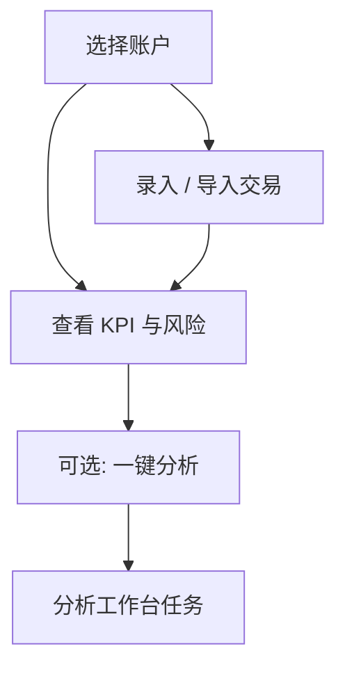

# 07 持仓

路径：导航 **持仓**。

持仓模块帮你**记账与看风险**，并可从持仓行一键跳到分析。它记录的是你的账户事实；**不会**根据 AI 信号自动调仓。

> 💡 **这一章解决什么**  
> 如何建账户、怎么录入或导入成交、成本法是什么、风险摘要怎么读、以及为什么有的行没有 AI 信号。

## 适用场景

| 场景 | 建议做法 |
| --- | --- |
| 第一次使用 | 先建一个账户，手工录 1～2 笔买卖验证 |
| 已有券商导出 | 用 CSV 导入：先预览（dry-run）再正式写入 |
| 日常开盘前 | 看市值、盈亏、集中度与风险摘要 |
| 想对持仓股做研究 | 行内「一键分析」→ 仍走分析工作台任务流 |
| 多账户 | 先选对账户再记账；同标的多账户按提示选择 |

## 整体结构

| 区域 | 作用 | 小白怎么记 |
| --- | --- | --- |
| 账户切换 | 单账户或全部 | 「哪本账本」 |
| KPI | 市值、盈亏、集中度等 | 「现在账上大概怎样」 |
| 风险摘要 | 集中度、回撤、止损接近等 | 「有没有挤在一起 / 伤得重」 |
| 持仓表 | 标的、数量、成本、浮动盈亏 | 「明细」 |
| 事件 / 流水 | 买卖、现金、公司行动 | 「流水账」 |

## 查看与成本法

1. 选择账户或查看全部。  
2. 切换**成本法**（如 FIFO 先进先出 / 平均成本，以界面为准）。  
3. 查看市值、盈亏、集中度等 KPI。  
4. 阅读风险摘要（集中度、回撤、止损接近度等）。  
5. 持仓行可能**异步**显示关联的最新 AI 信号；无信号时显示空占位属于正常。

### 术语

| 术语 | 解释 |
| --- | --- |
| **成本法** | 计算「成本价」的规则；不同方法在多次买卖后成本可能不同 |
| **FIFO（先进先出）** | 先买入的份额先卖出，常用于匹配成本 |
| **平均成本** | 把持仓成本摊成一个均价 |
| **集中度** | 前几大重仓占总资产的比例；过高意味着「鸡蛋少篮子」 |
| **回撤** | 从阶段高点下来的幅度，用于感受浮亏压力 |
| **price stale** | 价格数据偏旧或缺失时的降级提示，解读时要保守 |

> ⚠️ **成本法影响盈亏展示**  
> 换成本法可能改变「已实现 / 未实现」数字的观感，但不会改你真实成交历史。先固定一种方法，再做长期对比。

## 记账（手工）

- 新增或删除（归档）账户。  
- 录入买卖交易、现金流水、公司行动（如分红、拆股，以界面支持为准）。  
- 在事件列表中筛选并修正单条记录。  
- **卖出超过可用数量时会被拦截**——这是保护，不是故障。

### 建议配置

| 项目 | 新手建议 |
| --- | --- |
| 账户数量 | 先 1 个「实盘」账户即可 |
| 第一笔 | 用真实小额或历史一笔验证流程 |
| 现金 | 若关心资金曲线，记得录出入金 |

## CSV 导入

1. 选择券商格式或通用模板。  
2. **先预览（dry-run）**，核对代码、方向、数量、价格、日期。  
3. 确认无误后再正式写入。  
4. 重复提交时系统会尽量按幂等避免记两笔；仍建议以预览为准。

| 常见失败原因 | 处理 |
| --- | --- |
| 表头不匹配 | 按界面提示调整列名或换模板 |
| 编码问题 | 尝试 UTF-8 / 系统默认导出编码 |
| 重复行 / 超卖 | 预览阶段删掉或修正后再导入 |

## 从持仓一键分析

1. 在持仓行发起分析。  
2. 多账户持有同一标的时，按提示选择账户。  
3. 任务仍在**分析工作台**的「运行中任务」里跟踪。  
4. 完成后按 [08 阅读报告](08-reading-reports.md) 阅读；信号中心可能出现新的 active 信号。

## 使用案例

**案例 A：从零建账**  
新建账户 → 录入一笔买入 → 看持仓数量与成本 → 再录一笔卖出验证拦截逻辑（故意超卖应失败）。

**案例 B：导入后对账**  
dry-run 预览 → 核对总笔数与抽样三只股票 → 正式导入 → 用券商 App 抽查市值数量是否一致。

**案例 C：持仓有了但没有 AI 建议**  
信号是异步加载的；该股若没有 `active` 信号，会显示空占位。可先对持仓标的跑一轮分析，再回持仓页刷新。

## 相关

- [06 信号中心](06-signals.md)（持仓范围过滤与最新信号）
- [03 分析工作台](03-analysis-workbench.md)
- [11 日常工作流](11-daily-workflows.md)

上一篇：[06 信号中心](06-signals.md) · 下一篇：[08 阅读报告](08-reading-reports.md)
