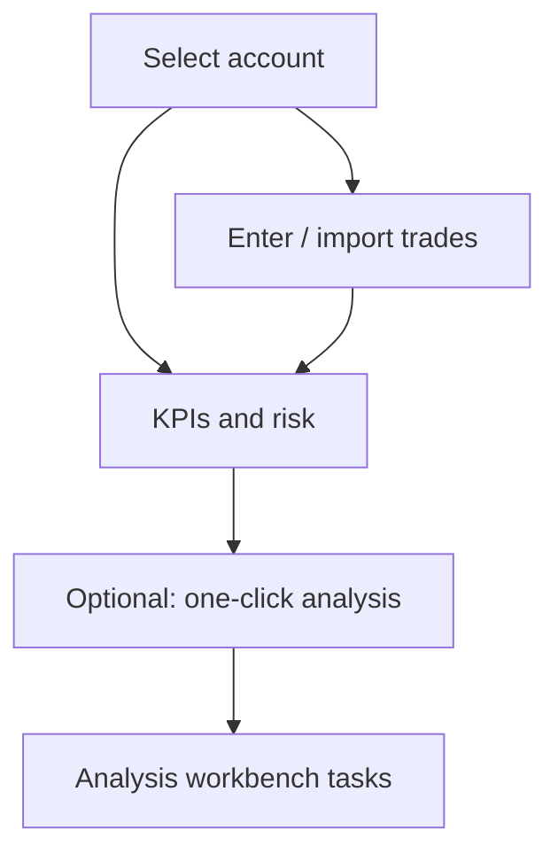

# 07 Portfolio

Path: **Portfolio**.

Portfolio is for **bookkeeping and risk awareness**, plus one-click jump into analysis. It stores your account facts; it does **not** auto-rebalance from AI signals.

> 💡 **What this chapter solves**  
> How to create accounts, enter or import trades, what cost methods mean, how to read risk summaries, and why some rows show no AI signal.

## When to use it

| Scenario | Suggested approach |
| --- | --- |
| First time | Create one account; enter 1–2 trades manually |
| Broker export available | CSV import: dry-run preview, then commit |
| Before the open | Check value, P&L, concentration, risk summary |
| Research a holding | Row action → analysis workbench task flow |
| Multiple accounts | Select the right account before booking |

## Layout

| Area | Role | Plain meaning |
| --- | --- | --- |
| Account switcher | One account or all | “Which ledger?” |
| KPIs | Value, P&L, concentration | “Rough health” |
| Risk summary | Concentration, drawdown, stop proximity | “Crowding / pain” |
| Positions table | Qty, cost, unrealised P&L | Details |
| Events / cash | Trades, cash, corporate actions | Journal |

## Viewing and cost methods

1. Select an account or all.  
2. Switch **cost method** (e.g. FIFO / average cost — as labelled in the UI).  
3. Read value, P&L, concentration KPIs.  
4. Read the risk summary.  
5. Rows may load the latest AI signal **asynchronously**; an empty placeholder is normal when no `active` signal exists.

### Glossary

| Term | Meaning |
| --- | --- |
| **Cost method** | Rule for computing cost basis after multiple lots |
| **FIFO** | First-in, first-out lot matching |
| **Average cost** | Blended unit cost |
| **Concentration** | Weight of top holdings; high means fewer baskets |
| **Drawdown** | Fall from a peak; a stress lens on open risk |
| **Price stale** | Quote is old or missing — interpret conservatively |

> ⚠️ **Cost method changes presentation**  
> Switching methods can change how P&L *looks*; it does not rewrite your trade history. Pick one method for long-term comparison.

## Manual bookkeeping

- Create or archive accounts.  
- Enter buys/sells, cash flows, corporate actions (as supported).  
- Filter and correct individual events.  
- **Selling more than available quantity is blocked** — that is protection, not a bug.

### Beginner defaults

| Item | Suggestion |
| --- | --- |
| Accounts | Start with one live account |
| First trade | A real small lot or one historical fill |
| Cash | Record deposits/withdrawals if you care about equity curves |

## CSV import

1. Pick a broker template or generic template.  
2. **Dry-run preview** codes, side, qty, price, dates.  
3. Commit only when the preview looks right.  
4. Idempotent retries try to avoid double booking; still trust the preview.

| Common failure | Fix |
| --- | --- |
| Header mismatch | Rename columns or switch template |
| Encoding | Try UTF-8 or the broker’s default export encoding |
| Duplicates / oversell | Fix in preview before commit |

## One-click analysis from a position

1. Start analysis from the row.  
2. If the same symbol exists in multiple accounts, pick the account when prompted.  
3. Track the job under the analysis workbench **Running tasks**.  
4. Read the report via [08 Reading reports](08-reading-reports_EN.md); new active signals may appear in the signal center.

## Use cases

**A — First ledger**  
Create account → buy → verify qty/cost → attempt an oversized sell (should fail).

**B — Import and reconcile**  
Dry-run → spot-check three symbols → commit → compare quantities with the broker app.

**C — Positions but no AI advice**  
Signals load asynchronously. Run analysis on the holding, then refresh Portfolio.

## Related

- [06 Signal center](06-signals_EN.md)
- [03 Analysis workbench](03-analysis-workbench_EN.md)
- [11 Daily workflows](11-daily-workflows_EN.md)

Previous: [06 Signal center](06-signals_EN.md) · Next: [08 Reading reports](08-reading-reports_EN.md)
