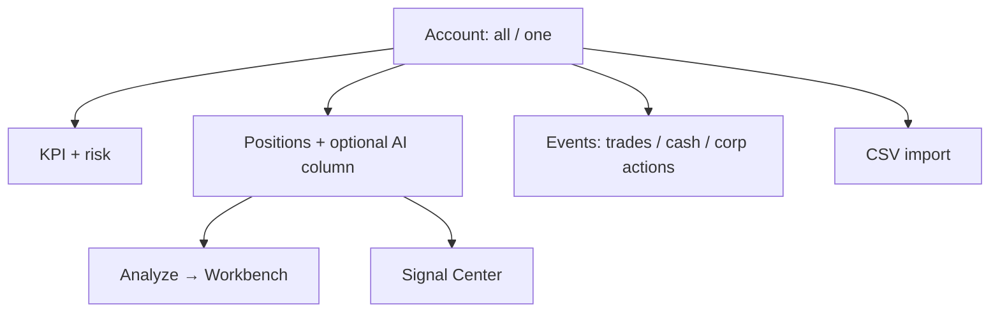

# 07 Portfolio (Holdings)

## Entry points and paths

| Method | Path |
| --- | --- |
| Primary nav | Sidebar **Portfolio** (Chinese UI nav label is often **组合**) |
| Page title | Often **Holdings** / **持仓** inside the page |
| Command palette | “portfolio”, “holdings” |
| Route | `/portfolio` |
| Signal Center | Links such as `/signals?scope=holdings` |

Bookkeeping and risk — **not** auto rebalancing from AI signals.

> 💡 Nav may say **Portfolio** while the page title says **Holdings**. Same module.

> ⚠️ Research / record-keeping only — **not investment advice**. Treat paper accounts separately from live cash.

## When to use

| Scenario | Approach |
| --- | --- |
| First time | One account; enter 1–2 trades |
| Broker export | CSV parse/preview then commit |
| Pre-open | MV, P&L, concentration, risk summary |
| Research a holding | Row action → Analysis Workbench |
| Multi-account | Select the right ledger first |
| Practice | Paper / simulated account if offered |

## Layout

| Area | Role |
| --- | --- |
| **Account switcher** | Which ledger |
| **KPIs** | Value, P&L, cash |
| **Risk summary** | Concentration, drawdown, stop proximity |
| **Positions table** | Qty, cost, floating P&L, optional AI |
| **Events** | Trade / cash / corporate action ledger |
| **Import** | Broker or generic CSV |

## Viewing and cost method

1. Open `/portfolio`; pick account or **all**.  
2. Switch **cost method** (FIFO / average — **as labeled in UI**).  
3. Read KPIs and risk.  
4. AI column may load **asynchronously**; empty placeholder is normal.  
5. **Stale** prices → read P&L conservatively.

### Glossary

| Term | Meaning |
| --- | --- |
| **Account** | Independent ledger |
| **Paper** | Simulated account with virtual cash (if available) |
| **Cost method** | How cost basis is computed |
| **FIFO** | First-in, first-out |
| **Average cost** | Blended unit cost |
| **Realized / unrealized** | Closed vs open P&L |
| **Concentration** | Large weights as % of assets |
| **Drawdown** | Fall from a peak |
| **Price stale** | Old or missing quote |
| **Corporate action** | Dividend, split, etc. |
| **Cash ledger** | Deposits/withdrawals |

> ⚠️ Cost method changes **presentation**, not historical trade rows. Pick one method for long-term comparison.

## Manual bookkeeping

| Action | Note |
| --- | --- |
| Create / archive account | Archive noise accounts |
| Trades | Side, qty, price, date, fees as form allows |
| Cash | Affects cash and total assets |
| Corporate actions | Types as supported |
| Edit events | Filter and correct rows |
| Over-sell guard | Selling more than available is **blocked** on purpose |

## CSV import

1. Pick broker template or generic.  
2. **Preview / parse** first.  
3. **Commit** only when codes, sides, qty, prices, dates look right.  
4. Idempotent retry helps; still trust the preview.

Common failures: headers, encoding, duplicates, over-sell, bad symbol formats ([03](03-analysis-workbench_EN.md)).

## Analyze from a row

1. Start analysis on the position.  
2. If multi-account same symbol, pick account when prompted.  
3. Track job under **Research → Analysis Workbench → Tasks**.  
4. Read via [08](08-reading-reports_EN.md).  
5. New active signals may appear; portfolio AI column refreshes async.

## AI signal column

| Observation | Meaning |
| --- | --- |
| Summary present | Latest displayable active signal |
| Empty | None or still loading |
| Degraded warning | Incomplete presentation — open full report/signal |
| Jump to Signal Center | Often holdings scope |

## Use cases

**A — First ledger**  
Create account → buy → check qty/cost → intentional over-sell should fail → valid sell.

**B — Import reconcile**  
Preview counts → spot-check three symbols → commit → match broker app quantities.

**C — Positions without AI**  
Run Workbench on holdings → refresh `/portfolio` or open `/signals?scope=holdings`.

**D — Paper (if available)**  
Separate paper account → simulate → do not mix into live decision narrative.

**E — Pre-open 3 minutes**  
Concentration + drawdown → analyze or open Signal Center on the riskiest name.

## Related

- [06 Signal Center](06-signals_EN.md)
- [03 Analysis Workbench](03-analysis-workbench_EN.md)
- [11 Daily workflows](11-daily-workflows_EN.md)

Prev: [06 Signal Center](06-signals_EN.md) · Next: [08 Reading reports](08-reading-reports_EN.md)
