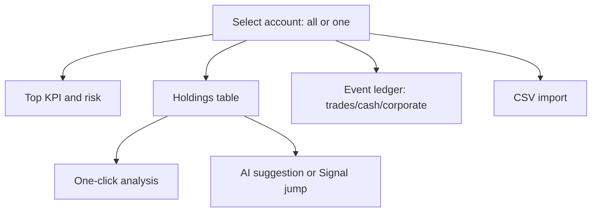

# 07 Portfolio (Holdings)

Portfolio answers a plain question: **what do you hold, at what cost, and is risk concentrated?**

It cooperates with AI signals; it does not replace them:

- Portfolio stores **your facts** (trades, cash, corporate actions).  
- AI signals are **research suggestions** that may appear beside rows.  
- The product **does not** auto-trade from signals.

> **Why “Portfolio” and “Holdings”?**  
> Sidebar nav is often **Portfolio**; the page title is often **Holdings**. Same module—search either word.

> P&L numbers and AI suggestions are research aids only — **not investment advice**. Paper trades are simulated bookkeeping, never real orders; keep them separate from live books.

## How to open

| Way | Path |
| --- | --- |
| Sidebar | **Portfolio** |
| URL | `/portfolio` |
| Palette | “portfolio” / “holdings” |

## Is this page for you?

| Situation | Suggestion |
| --- | --- |
| Only trying AI reports | You can skip bookkeeping; analysis still works |
| Want “advice vs real size” | Create one account; enter a few trades |
| Broker CSV available | Use import; always preview first |
| Practice without live risk | Create a **Paper account** and use its paper-trade flow |

## Page map

### Account switcher

- **All accounts**: overview; many write actions may require a specific account.  
- **One account**: bookkeeping and import—confirm the account before every write.
- At creation, choose a **Real account** or **Paper account**; Real is the default. Paper accounts are labeled in the selector, page heading, and holdings rows. Account type is read-only after creation.

### Cost method

UI may offer **FIFO** and **average cost** (labels as shipped). Changing cost method changes **display** of cost and P&L; it does not erase historical trades. Pick one method and stick to it for self-comparison.

### KPI and risk strip

You may see equity, market value, cash, FX notes, concentration, drawdown, stop proximity, and AI risk summaries. Treat “best-effort quotes / FX caveats” as **directional**, not audited accounting.

### Holdings table

Typical columns: code, qty, cost, last, value, floating P&L, analyze action, optional AI suggestion.

- AI cells may load asynchronously; empty when no active signal is normal.  
- **Analyze** opens a Workbench job—it does not render a full report inside Portfolio.

## First bookkeeping (five steps)

1. **Create account** (name required; choose Real or Paper; broker/currency optional).
2. **Select that account** (not “All”).  
3. **Enter a buy** (code, date, price, qty; fees if known).  
4. Confirm table qty/cost.  
5. Try an oversized sell—if blocked, protections work.

Then add sells, deposits/withdrawals, dividends as needed.

## Paper trading (Paper accounts only)

Selecting a labeled **Paper account** exposes a dedicated **Paper trade** action. Real accounts never show this action, and Paper accounts do not reuse the live/manual fill form with fee and tax fields.

1. Select a Paper account.
2. Choose buy or sell, then enter the ticker, trade date, and quantity. A note is optional.
3. Leave price blank to use the latest available close on or before the trade date, or enter an explicit simulated fill price.
4. After submission, confirm the effective price and source shown in the success message (`entered price` or `latest close`). This message confirms only that the trade was recorded; it does not claim that the follow-up page refresh completed.
5. The page then refreshes cash, holdings, the trade ledger, and risk data without a full-page reload. If that refresh fails, a page-level warning says the paper trade was recorded but the page data is incomplete. Choose **Retry refresh**; do not submit the same trade again.

Paper trades currently exclude fees, taxes, and slippage; the ticket states this explicitly. Actionable failures cover insufficient paper cash, selling more than the held quantity, and unavailable latest-close data. For an unavailable quote, enter an explicit price or change the trade date. A failed submission preserves the draft for correction and retry.

## Event types

| Type | What you record | Typical fields |
| --- | --- | --- |
| **Trade** | Stock fill | code, buy/sell, price, qty, fees, date |
| **Cash** | Cash in/out | direction, amount, currency, date |
| **Corporate** | Dividend, split | effective date, type, amount or ratio |

Ledger filters by date/code/direction are common. Deletes usually confirm; some deletes are blocked for consistency.

## CSV import

1. Pick broker format or generic template.  
2. **Preview / dry-run** first.  
3. Commit only when preview looks right.  
4. Re-submit should prefer idempotency—avoid double books when the UI says duplicates were skipped.

## One-click analysis from holdings

Row action → track in Workbench → read report with [08 Reading reports](08-reading-reports_EN.md). If the same symbol exists in multiple accounts, pick the account when prompted.

## Use cases

**A — Paper trail for one name**  
One account → one buy of `600519` → analyze from the row → compare suggestion vs size.

**B — Broker CSV**  
Preview → fix mapping errors → import → spot-check qty.

**C — Concentration check**  
All accounts view → read concentration / risk strip → open Signal Center with holdings scope.

**D — Practice without a live order**
Create Paper account → select it → open Paper trade → submit a buy with blank price → verify the latest-close source → confirm cash, holdings, and the trade ledger refresh.

## Glossary

| Term | Meaning |
| --- | --- |
| Account | A bookkeeping bucket (live or paper) |
| Cost method | How cost basis is calculated for display |
| Floating P&L | Mark-to-market vs cost under the chosen method |
| Corporate action | Dividend, split, and similar events |
| Dry-run import | Preview without writing |
| Paper account | A clearly labeled simulated book that never sends real orders |
| Paper trade | A simulated fill written only to a Paper account; fees, taxes, and slippage are currently excluded |

## Related

- [06 Signal center](06-signals_EN.md)  
- [03 Analysis workbench](03-analysis-workbench_EN.md)  
- [08 Reading reports](08-reading-reports_EN.md)  

Previous: [06 Signal center](06-signals_EN.md) · Next: [08 Reading reports](08-reading-reports_EN.md)
