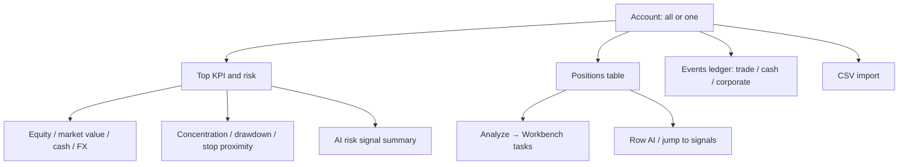
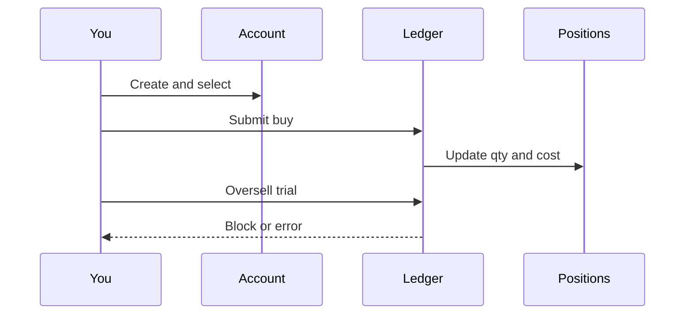
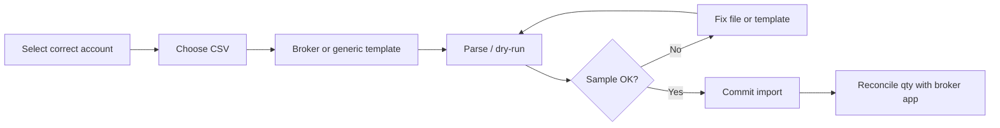

# 07 Portfolio (Holdings)

## What you will learn

1. Separate portfolio bookkeeping from AI signals and analysis reports  
2. Create accounts, enter/import trades, and read cost and concentration  
3. Cross-check holdings with Signal Center and Workbench as **facts vs suggestions**  
4. Control quota and mixed-ledger risk for one-click analyze, multi-account, and paper trading  

The portfolio module answers a plain question that AI suggestions can easily overshadow:

> **What do you hold, roughly at what cost, and is risk bunched in too few places?**

| Role | Records | Does not own |
| --- | --- | --- |
| **Portfolio / holdings** | Your facts: trades, cash, dividends, splits | Orders, auto rebalancing |
| **AI signals** | Research suggestions and structured labels | Your quantities and costs |
| **Analysis Workbench** | Research reports | Bookkeeping |

> 📘 **Concept**  
> Numbers on this page are a research view of **your ledger entries + best-effort market data**. Treat them as a **ledger and risk thermometer**, not a broker statement and not an auto-trading terminal.

> ⚠️ **Note**  
> P&L figures and row-level AI suggestions are for research and records — **not investment advice**. Real trading, tax, and settlement follow broker and regulator rules. If paper/sim accounts exist, keep them **separate ledgers** from live cash stories.

> 💡 **Tip**  
> Sidebar often says **Portfolio**; the page title more often says **Holdings management**. Same feature. If lost, command palette: try “portfolio” / “holdings”.

---

## 1. Entry

> 🧭 **Entry**

| Method | Path |
| --- | --- |
| Sidebar | **Portfolio** |
| Address bar | `/portfolio` |
| Command palette | `Cmd/Ctrl+K` → portfolio / holdings |
| From Signal Center | Holdings-scope links for cross-check |

Bookmark: `/portfolio` (most installs need no query params).

---

## 2. Do you need this page?

| Situation | Guidance |
| --- | --- |
| Only trying AI reports | **Skip portfolio for now**—analysis still works |
| Want advice vs real size | Create one account; enter a few trades |
| Broker CSV available | Import with **dry-run preview first** |
| Practice without live risk | Use paper/sim if the UI offers it |
| Multi-broker / multi-currency | Prefer multiple accounts over one forced ledger |
| Watchlist only, no real holdings | Keep watchlist + signals; no need for fake positions |

> ✅ **Recommended**  
> Research → decide tracking is worth it → then book the position.  
> ❌ **Avoid**  
> Fake books first, then chase AI narrative; or treat paper P&L as live performance.

---

## 3. Page structure

> 🖼️ **Figure placeholder** · `assets/portfolio-overview-en.png`  
> **Capture**: Portfolio page: account selector + holdings table (empty or demo).  
> **Notes**: Demo sizes only.  
> **Status**: pending — see [assets/PLACEHOLDERS.md](assets/PLACEHOLDERS.md)

### 3.1 Account switch

| View | Fit | Note |
| --- | --- | --- |
| **All accounts** | Overview of equity, risk, cross-account positions | Many **writes** are blocked until you pick one account |
| **One account** | Bookkeeping, import, delete events, edit account | Wrong account = wrong ledger |

> ⚠️ **Note**  
> If the UI warns “all-accounts view—select a specific account before write,” treat that as protection, not a bug.

### 3.2 Cost method

| Label (examples) | Meaning |
| --- | --- |
| **FIFO** | First-in lots match sells first |
| **Average cost (AVG)** | Blended average cost |

Changing method changes **cost and unrealized P&L presentation**. It does not erase historical trade rows.

> ✅ **Recommended**  
> Freeze one cost method for long comparisons.  
> ❌ **Avoid**  
> Switching daily, then blaming “calculation bugs” for jumping numbers.

### 3.3 KPI and risk strip

| Area | What you learn |
| --- | --- |
| Total equity / market value / cash | Rough scale and cash buffer |
| FX status | Multi-currency freshness; try **refresh FX** when offered |
| Sector / name concentration | Whether money is piled on few themes or names |
| Drawdown monitor | Feel of peak-to-now slide (max / current as labeled) |
| Stop proximity | Counts near plan/signal stops when present |
| AI risk signals | Holdings-related sell / reduce / alert summary |

Limitation tags such as best-effort quotes, partial FX/cost basis, or limited industry coverage mean: read as **direction**, not auditor-signed totals.

> 📘 **Concept: snapshot vs risk module**  
> **Snapshot** ≈ what you hold and rough value now. **Risk module** ≈ concentration, drawdown, etc. If risk fetch fails, the page may **degrade to snapshot only**—graceful degradation, not a wipe.

### 3.4 Positions table

Typical columns: account, code, quantity, average/cost, last, market value, unrealized P&L, return, **Analyze**, sometimes AI summary.

| Observation | Interpretation |
| --- | --- |
| AI column spins then fills | Async fetch of latest active signals—normal |
| AI always empty | No displayable signal, or load failed |
| **Analyze** | Submits Workbench tasks—this page does not render the full essay |
| Missing last price | Best-effort quote failed; value/P&L may be limited |

Industry concentration charts may fall back to **name concentration** when sector data is unavailable—labels typically state the mode.

---

## 4. Tutorial: five steady steps from zero

| Step | Action | Success looks like |
| --- | --- | --- |
| 1 | **Create account** (name required; broker/base currency/market as known) | Success toast; often auto-selects the account |
| 2 | Confirm view is **this account**, not “all” | Write controls available |
| 3 | **Enter one buy**: code, date, price, qty; fees/tax if known | Positions show qty and cost |
| 4 | Spot-check quantity vs broker app | Qty matches (cost may differ by convention) |
| 5 | Try an intentional **oversell** | Block or error means safeguards work |

Then record real sells, deposits/withdrawals, dividends/splits.

> 💡 **Tip**  
> Accounts can edit name/broker/base currency/market. **Delete account** often **hides** from default lists rather than physically wiping history—read the confirm dialog.

---

## 5. Three event types

| Type | What you record | Typical fields |
| --- | --- | --- |
| **trade** | Stock fills | Code, buy/sell, price, qty, fees, tax, trade date |
| **cash** | Deposits/withdrawals | In/out, amount, currency (may default to account base), date |
| **corporate** | Dividends, splits, … | Effective date, type, per-share dividend or split ratio, code |

Ledger area typically supports date range, code, direction/type filters, paging, and delete with confirm (single-account view).

> ⚠️ **Note**  
> Some deletes are **blocked** to protect consistency. Fix by **re-entering correct rows**, not by editing screenshots.

### 5.1 Dividend example

Select account → **corporate action** → cash dividend → effective date + per-share amount → submit → check cash/cost vs broker (ex-date, tax, missing fee rows).

### 5.2 Split example

Select account and code → split adjustment → effective date + ratio (as labeled) → verify quantity change.

### 5.3 Cash move example

Broker transfer in → **cash inflow**; out → **outflow**. Explains equity moves when market value is flat.

---

## 6. CSV import: preview before commit

> 🖼️ **Figure placeholder** · `assets/portfolio-import-preview-en.png`  
> **Capture**: CSV import preview / dry-run if available.  
> **Notes**: Fictional ledger rows.  
> **Status**: pending — see [assets/PLACEHOLDERS.md](assets/PLACEHOLDERS.md)

### 6.1 Recommended rhythm

1. Select the correct account.  
2. Open broker CSV import.  
3. Choose file.  
4. Pick broker template (or generic; refresh list if empty).  
5. Enable **dry-run / preview only** → parse.  
6. Read valid / skipped / error counts.  
7. Spot-check at least **three** core holdings (side, qty, price, date).  
8. Commit when clean.  
9. Review write / duplicate / fail counts.  
10. Refresh positions and reconcile quantity with the broker app.

### 6.2 Common issues

| Symptom | Action |
| --- | --- |
| Header mismatch | Change template or rename columns |
| Garbled text | Re-save **UTF-8** |
| Duplicate import | Trust preview/idempotency hints; practice on a test account |
| Oversell rows | Fix in preview—not after two weeks of bad commits |
| Empty broker list | Refresh; if still empty, fall back to manual entry |

> ✅ **Recommended**  
> First large import on a **test account** or tiny sample file.  
> ❌ **Avoid**  
> Skip dry-run and commit years of history into a live ledger blind.

---

## 7. Working with AI signals

| Observation | Meaning | Next |
| --- | --- | --- |
| Short AI suggestion on a row | Displayable active signal | Open signal detail or source report |
| Always empty | No signal, async not done, or fetch fail | Analyze holdings codes or open Signal Center |
| Degraded / unavailable badge | Incomplete display | Full signal or report |
| Want all holdings suggestions | — | `/signals?scope=holdings` |

### 7.1 Daily rhythm

1. Pre-open / after close: **concentration, drawdown, odd positions**.  
2. At most **one** worrying name → Analyze or Signal Center.  
3. Read risks and invalidation, then apply **your** plan.  
4. The plan lives in your head/notes—not in auto-execution.

> ❌ **Avoid**  
> Treating a “reduce” label as “the system already sold”; or one-click analyzing every holding without counting quota and tasks.

### 7.2 Before one-click analyze

- Know how many symbols and brief vs detailed (as submitted to Workbench).  
- Prefer **heavy holdings**; small sleeves can wait.  
- After submit success, read reports under Workbench **Tasks / History**—do not only wait on Portfolio.

---

## 8. Use cases

**A — Three historical trades** — new account → three manual buys → rough market value sanity check. No CSV required.  
**B — Large broker export** — “live” account → dry-run counts → sample core holdings → commit → app reconcile.  
**C — AI column blank** — Workbench on holdings codes → refresh, or open `/signals?scope=holdings`.  
**D — Same symbol in multiple accounts** — pick the right ledger when analyzing or booking.  
**E — Research then book** — Workbench + signal first → open position only if tracking is intentional.  
**F — Concentration shock** — holdings concentration → holdings-scope risk signals → Agent for observation only, not sell orders.  
**G — Paper vs live** — separate accounts; confirm account before reading P&L.  
**H — Multi-market account** — fill base currency/market carefully; refresh FX when stale; accept partial-basis labels.  
**I — Dividend season reconcile** — corporate dividend → broker cash flow; fix ex-date/tax, not cost-method thrash.  
**J — Deleted wrong event** — single-account delete → re-enter correct row → refresh; do not “re-import CSV” to hide bad side.

Also: [11 Daily workflows](11-daily-workflows_EN.md).

---

## 9. FAQ

**Q1: Why can’t I import under “all accounts”?**  
To avoid ambiguous write scope. Select one account first.

**Q2: After delete account, are trades gone?**  
Commonly the account is hidden from entry points without a full physical wipe—trust confirm copy and keep your own backups for important data.

**Q3: Cost differs from the broker app—normal?**  
Often yes: fees, dividends, cost method, FX, missing events. Reconcile **quantity** first, then cost.

**Q4: Risk module degraded—broken?**  
Usually temporary risk API failure; snapshot may still work. Refresh; if persistent, check backend/network.

**Q5: Can paper P&L be live performance?**  
No. Slippage, emotion, limits, and liquidity differ.

**Q6: Does Portfolio auto-trade from signals?**  
**No.** By design, signals do not rebalance the book.

**Q7: HK / US codes?**  
Same as the rest of the product, e.g. `hk00700`, `AAPL`; trust normalized codes.

**Q8: Where is the report after one-click Analyze?**  
Workbench Tasks and History. Portfolio only starts the job.

---

## 10. Self-check

| # | Item | Pass |
| --- | --- | --- |
| 1 | Current account | Not stuck on “all” when writing |
| 2 | Cost method | Fixed within the week |
| 3 | Core quantities | Match broker |
| 4 | Limitation tags | Accept best-effort quotes / partial basis |
| 5 | AI column | Empty → know Workbench or Signal Center path |
| 6 | CSV | Large imports dry-run first |
| 7 | Paper / live | Separate ledgers |
| 8 | Discipline | No “auto trade from suggestion” assumption |

---

## 11. Glossary

| Term | Meaning |
| --- | --- |
| Account | One independent ledger (broker / market / paper) |
| Cost method | How “my cost” is computed |
| FIFO | First-in first-out cost matching |
| AVG | Average cost |
| Realized P&L | Locked after sells (as implemented/displayed) |
| Unrealized P&L | Mark-to-market while held |
| Total equity | Market value + cash style total (by basis) |
| Concentration | Money piled on few sectors/names |
| Drawdown | Peak-to-now slide feel |
| Corporate action | Dividends, splits, etc. |
| dry-run | Parse/validate without write |
| commit | Actually write events |
| Paper trading | Simulated account when offered |
| Snapshot | Current positions and valuation cut |
| Risk module | Concentration, drawdown, related views |

---

## 12. Related

- [06 Signal Center](06-signals_EN.md)  
- [03 Analysis Workbench](03-analysis-workbench_EN.md)  
- [08 Reading reports](08-reading-reports_EN.md)  
- [11 Daily workflows](11-daily-workflows_EN.md)  
- [13 Stock workspace](13-stock-details_EN.md)  

Prev: [06 Signal Center](06-signals_EN.md) · Next: [08 Reading reports](08-reading-reports_EN.md)
