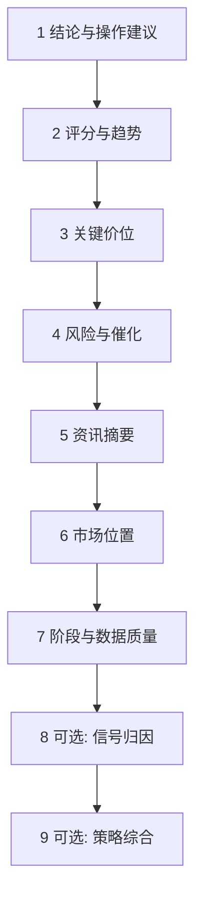

# 08 阅读报告

打开任意**个股**历史报告时，建议按固定顺序阅读。这样你不会一上来就被长文淹没，也不会漏掉风险。

> 💡 **阅读目标**  
> 先回答三个问题：① 系统现在更偏多、偏空还是观望？② 主要风险是什么？③ 若看错，什么条件算失效？  
> 不要先纠结每一个技术指标名词。

## 推荐阅读顺序

> **服务说明（与上一历史版本比较）**
> 后端历史比较服务可对两个已保存版本执行确定性的字段级差异计算（`compare_analyses` / `get_latest_delta`）。版本使用唯一的历史记录主键；可重复的查询 ID 仅作为关联元数据。最新版本比较限定在明确的报告类型内，且没有隐藏的历史天数截断。详见 [分析差异比较服务契约（英文）](../analysis-delta-comparison.md)。Web 端“相比上次分析”的展示属于后续 UI 任务；只有一条匹配历史记录时，服务返回“无基线”，而不是“无变化”。

| 顺序 | 看什么 | 字段 / 概念 | 小白解释 |
| --- | --- | --- | --- |
| 1 | 核心结论与操作建议 | `operation_advice`、结构化 `action` | 买 / 加 / 持 / 观 / 减 / 卖 / 回避 等方向性表述 |
| 2 | 评分与趋势 | 情绪分、趋势判断 | 「系统觉得偏强还是偏弱」的量化味道，不是保证 |
| 3 | 关键价位 | 支撑、压力、参考买卖点、止损思路 | 支撑≈下方可能有买盘；压力≈上方可能有卖压；止损≈错了怎么认 |
| 4 | 风险与催化 | 风险警报、利好催化 | 坏消息与可能的推动因素，需交叉验证 |
| 5 | 舆情与业绩摘要 | 新闻、基本面摘要 | 可能过时或噪声，注意时间戳 |
| 6 | 市场位置 | 题材、个股角色（A 股更常见） | 你是主线龙头还是边缘跟随？缺证据时不要脑补 |
| 7 | 阶段与数据质量 | 盘前/盘中/盘后、降级标记 | 盘中日线未完成 → 降低仓位结论权重 |
| 8 | （可选）信号归因 | 技术 / 新闻 / 基本面 / 大盘权重 | 解释「为什么偏多」，不是下单指令 |
| 9 | （可选）策略综合 | 综合信号、共识、支持/反方策略、冲突 | 看多策略是否真正一致，并保留反方证据 |

## 操作建议怎么理解（八态直觉）

| 常见表述 | 直觉 | 注意 |
| --- | --- | --- |
| 买入 / 加仓 | 偏积极 | 仍要看风险与失效条件 |
| 持有 / 持有观察 | 已有仓可继续观察 | 不是无条件加仓 |
| 观望 / 等待 | 空仓或轻仓等待 | 常见于震荡、证据不足 |
| 减仓 / 卖出 | 偏防守 | 结合你的持仓与风险承受 |
| 回避 | 明确不参与 | 不等于「立刻对倒」 |

> ⚠️ **术语：不是投资建议**  
> 即便出现「买入」字样，也只是研究输出的结构化标签。是否交易、用多大仓位，由你自己决定。

## 关键价位术语

| 术语 | 含义 |
| --- | --- |
| **支撑（Support）** | 价格回调时，历史上较容易出现买盘兴趣的区域 |
| **压力（Resistance）** | 价格上涨时，历史上较容易出现卖盘压力的区域 |
| **止损（Stop-loss）** | 预先设定的离场条件，用于限制单笔亏损 |
| **目标价 / 止盈思路** | 若逻辑成立，可能关注的上方区域；不是承诺 |

## 阶段与数据质量（为什么有时很「怂」）

| 情况 | 报告可能更保守的原因 |
| --- | --- |
| 盘前 | 今日走势尚未发生，不能写成「今天已经涨完」 |
| 盘中 / 午间 / 临近收盘 | 日线可能 **partial（未完成）**，实时价会变 |
| 数据降级 / 缺失 | 行情或新闻源失败，系统应降低置信而不是编造 |
| 非交易日 | 复用最近交易日数据，表述应保守 |

## 结构化决策区

新生成的同步报告、异步任务结果和历史报告详情共用同一个可选结构化展示契约。报告有对应数据时，会在正文前部显示以下独立区块：

| 区块 | 重点阅读 |
| --- | --- |
| 阶段决策 | 当前市场阶段、当前动作、行动窗口、观察条件、判断依据、阶段提醒与数据限制 |
| 信号归因 | 技术 / 新闻 / 基本面 / 市场环境的可见百分比，以及最强看多、看空证据；百分比不等于收益概率 |
| 策略综合 | 综合信号、加权分、置信度、共识、冲突等级、支持与反方策略、冲突参与者及未采纳意见数 |

这些区块只消费结构化字段，不从中文、英文或韩文叙事中猜测结论。旧报告、单策略报告或缺少对应字段的部分报告可以不显示某些区块；原始 JSON、Markdown 和证据分层仍保留用于追溯。字段损坏时，界面会忽略损坏区块而不是编造占位结论。

## 报告证据分层（已合入 main）

当前 main 的 **完整报告** Web 视图可展示固定证据分层（事实 / 缺口与冲突 / 模型推断 / 风险与反证 / 与个人框架对齐 / 非投资建议免责声明），避免把流畅叙事误读成已核验事实。

| 你在界面上 | 怎么理解 |
| --- | --- |
| 看到分层区块 | 按块阅读；**不要**把「模型推断」当成「已核实事实」 |
| 历史报告没有分层 | 正常：旧报告可省略；免责声明仍应可见 |
| 想对照工程合同 | 见 `docs/report-strata-contract.md` |

操作手册不替代工程合同；分层标签以你当前 UI 文案为准。

## 阅读纪律

- 震荡且资金方向不清时，更常看到观望或持有，而不是高频翻转买卖——这往往是**特性**不是 bug。  
- 出现「日线未完成」或数据降级时，降低对盘中结论的权重。  
- 把「利好催化」当线索去查原始公告 / 新闻，而不是当确定事件。  
- 所有内容仅供研究，不构成投资建议。

## 使用案例

**案例：报告写「观望」，但股价大涨**  
1. 先看阶段是否盘中、数据是否降级。  
2. 看压力位是否已被放量突破，以及风险栏是否有未消化利空。  
3. 用历史趋势看系统是否一贯偏谨慎。  
4. 用问股追问：「若收盘站上某某价，观察点应如何调整？」而不是要求系统保证收益。

## 大盘复盘报告

见 [04 大盘复盘](04-market-review.md)。阅读侧重点是指数、板块与情绪，不要与个股操作建议混读。

上一篇：[07 持仓](07-portfolio.md) · 下一篇：[09 回测](09-backtest.md)
