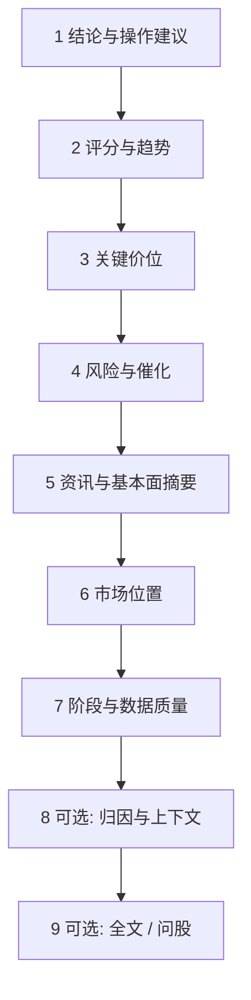

# 08 阅读报告

读报告时建议先抓住三件事，而不是从头扫到尾，或只看「买入/观望」：

1. 系统现在更偏多、偏空，还是观望？  
2. 最重要的风险是什么？  
3. 如果看错了，什么条件算失效？  

把这三个问题答清楚，这份报告就「读值了」。其余指标名词，可以以后再慢慢学。

> ⚠️ 即便出现「买入」字样，也只是研究输出的标签与叙述，**不构成投资建议**。仓位与交易由你自己决定。

---

## 报告从哪里打开

个股报告一般 **没有** 单独的一级菜单，常见入口：

| 入口 | 说明 |
| --- | --- |
| 分析工作台 → 历史 | 最完整、最常用 |
| 任务完成提示 | 点「查看报告」 |
| 首页 → 最近分析 | 快捷入口 |
| 信号详情 → 来源报告 | 从建议跳回完整叙事 |
| 问股前的报告页 | 继续追问时带着上下文 |

大盘复盘报告请去 [04 大盘复盘](04-market-review.md)，不要和个股操作建议混着读。

---

## 新手模式与专业模式

| 模式 | 读感 | 适合 |
| --- | --- | --- |
| 新手 / Beginner | 更短、更保守、少堆字段 | 第一次读、只想抓重点 |
| 专业 | 结构更全、可看数据上下文与长文 | 想核对证据、降级原因 |
| brief / detailed | 发起分析时的详略 | 先 brief 骨架，再 detailed |

同一次分析记录，在不同展示模式下「看起来多少」可能不同，但底层结论通常同源。觉得新手太短，可以开专业或打开全文 Markdown，**不一定**是系统没分析完。

---

## 推荐阅读顺序（请尽量固定）

固定顺序的好处是：你每次都知道自己读到哪一步，不容易被中间的新闻段落带走。

### 第 1 步：结论与操作建议（先定方向感）

看叙述性的操作建议，以及结构化的 **action**（如买入、加仓、持有、观望、减仓、卖出、回避、提醒等）。

| 常见方向 | 怎么理解 |
| --- | --- |
| 买入 / 加仓 | 系统偏积极，仍要看风险与失效条件 |
| 持有 | 已有仓可继续观察，不是无脑加仓 |
| 观望 | 证据不足或震荡，空仓/轻仓等待很常见 |
| 减仓 / 卖出 | 偏防守，请结合你真实仓位 |
| 回避 | 明确不参与，不等于叫你立刻做空 |
| 提醒 | 先读「为什么提醒」 |

### 第 2 步：评分与趋势（知道「温度」）

情绪分、趋势判断之类，是「偏强还是偏弱」的量化味道。  
请记住：**分数高 ≠ 保证赚钱**。

### 第 3 步：关键价位（把抽象变成可观察）

| 词 | 含义 |
| --- | --- |
| 支撑 | 往下走时，历史上比较容易有人愿意买的区域 |
| 压力 | 往上走时，历史上比较容易遇到卖压的区域 |
| 止损思路 | 错了怎么认输离场，用来限制单笔伤害 |
| 目标 / 止盈思路 | 逻辑成立时可能关注的上方区域，**不是承诺** |

如果价位写得很残缺，不要自行脑补成精确交易计划。

### 第 4 步：风险与催化（先听坏消息）

风险警报、利好催化都要看，但建议 **先读风险**。  
催化请当「线索」：去核验公告或新闻，而不是当成已经发生的确定事件。

### 第 5 步：资讯与基本面摘要

注意时间戳。过时新闻混进摘要时，你的任务是识别「这还重要吗」，而不是全盘接受。

### 第 6 步：市场位置（尤其 A 股主题时）

它在讲：你这只票大概处在什么题材角色（主线还是边缘等）。缺证据时，宁可不下结论。

### 第 7 步：阶段与数据质量（决定你信几分）

| 情况 | 为什么结论可能更「怂」 |
| --- | --- |
| 盘前 | 今天的故事还没开演 |
| 盘中 | 日线可能还没收完（partial） |
| 数据降级 / 缺失 | 系统不该瞎编，应降低置信 |
| 质量分较差 | 输入块很多没进来 |

报告里若有 **数据上下文 / 输入数据块** 面板，会标注哪些数据 available、missing、fetch_failed、stale……  
这表示「**这次进模型的输入**」如何，不等于「全世界数据源永远坏了/永远好」。

### 第 8～9 步：归因、全文、问股（可选）

- 归因：解释「为什么偏多/偏空」的权重感。  
- 全文 Markdown：适合需要引用段落时。  
- **继续问股**：把失效条件、价位依据问清楚，见 [05](05-agent-chat.md)。

---

## 报告页上还能做什么

| 操作 | 适合场景 |
| --- | --- |
| 加入 / 移出自选 | 以后批量分析、首页摘要 |
| 历史趋势 | 看系统是不是翻烧饼 |
| 继续问股 | 某一段读不懂 |
| 运行流 | 任务阶段排障（进阶） |
| 跳到信号 | 已提取 Decision Signal 时 |

---

## 使用案例

### 案例 A：报告写观望，股价却大涨

先看是不是盘中、数据是否降级 → 压力位是否已明显被放量突破 → 历史趋势是否一贯偏谨慎 → 用问股问：「若收盘站上某某价，观察条件怎么调整？」  
请不要逼模型保证「还能涨多少」。

### 案例 B：只有三分钟

只做三步：看 action → 风险前三条 → 支撑/压力/止损有没有写清。其余折叠，明天再读。

### 案例 C：上下文一片 missing

记下缺的是新闻还是行情 → 去设置补数据源 → 同一代码再跑一次 → 对比质量是否变好。数据很差时，不要加重仓叙事。

### 案例 D：信号和报告好像不一致

以 **更新的报告 + 信号生命周期** 为准。旧报告 + 已关闭信号，不要拼成一套新故事。

---

## 阅读纪律（送给未来的自己）

- 震荡市里多看观望/持有，往往是特性，不是软件坏了。  
- 日线未完成时，降低对盘中豪言壮语的权重。  
- 同一天无意义连跑同一只，既费钱也制造噪声信号。  
- 读完仍不确定，就 **观望**——观望也是一种决定。

---

## 术语速查

| 术语 | 一句话 |
| --- | --- |
| action | 结构化方向标签 |
| operation_advice | 叙述性操作建议 |
| partial bar | 还没走完的日线 |
| Analysis Context | 进入模型的数据块清单与质量 |
| invalidation | 逻辑失效条件 |
| 来源报告 | 信号/问股所依附的那次历史记录 |

---

## 相关阅读

- [03 分析工作台](03-analysis-workbench.md)  
- [05 问股对话](05-agent-chat.md)  
- [06 信号中心](06-signals.md)  
- [04 大盘复盘](04-market-review.md)  

上一篇：[07 持仓](07-portfolio.md) · 下一篇：[09 回测](09-backtest.md)
