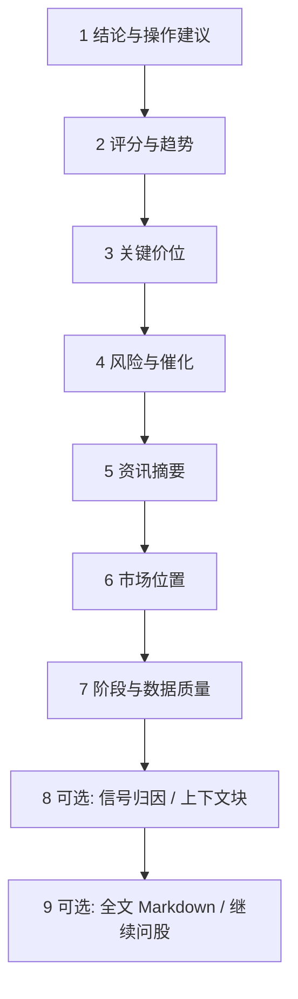

# 08 阅读报告

## 页面入口与操作路径

个股报告**没有**单独的一级导航页，通常嵌在分析工作台历史、首页最近分析、或报告抽屉中：

| 方式 | 具体路径 |
| --- | --- |
| 分析工作台 | **研究 → 分析工作台 → 历史与对比**，选中一条记录（URL 常含 `segment=history&recordId=`） |
| 首页 | 展开「最近分析」点开一条 |
| 运行完成提示 | 任务完成后的「查看报告」类按钮 |
| 信号详情 | 来源报告链接（回到对应历史记录） |
| 问股 | 从报告点「继续问股」时，报告仍可作为上下文来源 |

本分册讲的是**个股研究报告**怎么读。大盘复盘见 [04](04-market-review.md)。

> 💡 **阅读目标**  
> 先回答三个问题：① 系统现在更偏多、偏空还是观望？② 主要风险是什么？③ 若看错，什么条件算失效？  
> 不要先纠结每一个技术指标名词。

> ⚠️ **研究免责**  
> 报告输出仅供学习与研究，**不构成投资建议**。

## 界面形态：新手 vs 专业

| 模式 | 你通常看到 | 适合 |
| --- | --- | --- |
| **新手 / Beginner** | 更短的结论卡、更保守的风险表达、少暴露原始字段 | 第一次读报告 |
| **专业** | 完整摘要、结构块、Markdown 正文、上下文质量面板 | 对照证据与降级原因 |
| **brief / detailed** | 发起分析时可选的详略（若界面提供） | brief 先骨架，再开 detailed 复跑或看历史 |

可在设置或工作台切换模式；**同一份历史记录**在不同模式下的展示密度可能不同，但底层结论字段同源。

## 推荐阅读顺序

| 顺序 | 看什么 | 字段 / 概念 | 小白解释 |
| --- | --- | --- | --- |
| 1 | 核心结论与操作建议 | `operation_advice`、结构化 `action` | 买 / 加 / 持 / 观 / 减 / 卖 / 回避 等 |
| 2 | 评分与趋势 | 情绪分、趋势判断 | 「偏强还是偏弱」的量化味道，**不是保证** |
| 3 | 关键价位 | 支撑、压力、参考买卖点、止损思路 | 见术语表 |
| 4 | 风险与催化 | 风险警报、利好催化 | 坏消息与可能推动因素，需交叉验证 |
| 5 | 舆情与业绩摘要 | 新闻、基本面摘要 | 可能过时或噪声，注意时间戳 |
| 6 | 市场位置 | 题材、个股角色（A 股更常见） | 主线还是边缘？缺证据别脑补 |
| 7 | 阶段与数据质量 | 盘前/盘中/盘后、降级标记、质量分 | 未完成日线 → 降权 |
| 8 | （可选）信号归因 | 技术 / 新闻 / 基本面 / 大盘权重 | 解释「为什么偏多」 |
| 9 | （可选）上下文块 | Analysis Context / 输入数据块状态 | 哪些数据进了模型、哪些缺失 |

## 操作建议怎么理解（八态直觉）

| 常见表述 / action | 直觉 | 注意 |
| --- | --- | --- |
| 买入 / buy | 偏积极 | 仍要看风险与失效条件 |
| 加仓 / add | 已有仓可考虑加强观察 | 不是无脑加倍 |
| 持有 / hold | 维持观察 | 不是无条件加仓 |
| 观望 / watch | 空仓或轻仓等待 | 震荡、证据不足时常见 |
| 减仓 / reduce | 偏防守 | 结合你的真实持仓 |
| 卖出 / sell | 偏退出 | 不是程序化下单 |
| 回避 / avoid | 明确不参与 | 不等于「立刻对倒」 |
| 提醒 / alert | 事件或条件提示 | 先读触发原因 |

> ⚠️ **结构化 action ≠ 下单指令**  
> 是否交易、仓位多大，由你自己决定。信号中心会沉淀同类 action，见 [06](06-signals.md)。

## 关键价位术语

| 术语 | 含义 |
| --- | --- |
| **支撑（Support）** | 回调时历史上较易出现买盘兴趣的区域 |
| **压力（Resistance）** | 上涨时历史上较易出现卖盘压力的区域 |
| **止损（Stop-loss）** | 预先设定的离场条件，限制单笔亏损 |
| **目标价 / 止盈思路** | 若逻辑成立可能关注的上方区域；**不是承诺** |
| **入场区间** | 计划关注的介入带；可能只有一侧 |
| **失效条件（invalidation）** | 逻辑被打破时应重估的条件 |

## 阶段与数据质量

| 情况 | 报告可能更保守的原因 |
| --- | --- |
| 盘前 premarket | 今日走势尚未发生 |
| 盘中 / 午间 / 临近收盘 | 日线可能 **partial（未完成）** |
| 盘后 postmarket | 可用完整日线，但仍非预测 |
| 数据降级 / 缺失 | 行情或新闻失败 → 应降置信而非编造 |
| 非交易日 | 可能复用最近交易日数据 |
| 质量分 limited / poor | 输入块大量缺失或过期 |

### 输入数据块（Analysis Context）常见状态

报告中的「数据上下文 / 输入数据块」可能标注：

| 状态 | 含义 | 你怎么做 |
| --- | --- | --- |
| available | 该块进入本次分析 | 正常参考 |
| missing | 未进入 | 相关结论可能不完整 |
| fetch_failed | 抓取失败 | 查数据源 / 网络后可重跑 |
| not_supported | 市场/标的不支持 | 换其他证据 |
| fallback | 走了备用路径 | 结合告警复核 |
| stale | 非最新 | 看时间戳，必要时重跑 |
| estimated / partial | 估算或部分可用 | 降低权重 |

> 💡 **evidenceScope**  
> 界面可能提示：这些状态**只代表进入本次 LLM 的输入**，不等于「数据源全局永远健康」。

## 报告页常用操作

| 操作 | 说明 |
| --- | --- |
| 加入 / 移出自选 | 方便批量分析与首页摘要 |
| 打开全文 Markdown | 读完整叙述与章节 |
| 历史趋势 | 同一标的多次结论是否翻烧饼 |
| 继续问股 | 带上下文进 `/chat`，见 [05](05-agent-chat.md) |
| 查看运行流 | 任务阶段诊断（进阶） |
| 跳转信号 | 若已提取 Decision Signal |

## 阅读纪律

- 震荡且资金方向不清时，更常看到观望或持有——往往是**特性**不是 bug。  
- 出现「日线未完成」或数据降级时，降低对盘中结论的权重。  
- 把「利好催化」当线索去查原始公告 / 新闻，而不是当确定事件。  
- 新手模式更短，不代表「更准」；专业模式更长，不代表「必须执行」。  
- 同一天对同一标的无意义连跑，只会浪费额度并制造噪声信号。

## 使用案例

**案例 A：报告写「观望」，但股价大涨**  
1. 看阶段是否盘中、数据是否降级。  
2. 看压力位是否已被放量突破，风险栏是否有未消化利空。  
3. 用历史趋势看系统是否一贯偏谨慎。  
4. 问股：「若收盘站上某某价，观察点应如何调整？」而不是索要保证收益。

**案例 B：第一次只读 3 分钟**  
只看：① action/操作建议 ② 风险列表前三条 ③ 支撑/压力/止损是否写明。其余折叠，明天再读资讯。

**案例 C：上下文大量 missing**  
1. 打开输入数据块，记下缺失项（如新闻）。  
2. 到 [10 设置](10-settings.md) 补数据源 Key。  
3. 在工作台对**同一代码**再跑一次，对比质量分是否改善。  
4. 不要在数据很差时加仓叙事。

**案例 D：与信号中心对照**  
报告 action=watch，信号中心同股 active 也是 watch → 一致。若信号已 closed 而你还在读旧报告 → 以信号生命周期 + 最新报告为准。

**案例 E：新手模式觉得「太少」**  
切换专业模式或打开 Markdown 全文；不要误以为系统「没分析完」。

## 大盘复盘报告

见 [04 大盘复盘](04-market-review.md)。侧重点是指数、板块与情绪，**不要与个股操作建议混读**。

## 术语表（汇总）

| 术语 | 一句话 |
| --- | --- |
| **个股报告** | 单标的研究产出，含摘要 + 可选正文 |
| **action** | 结构化方向标签 |
| **operation_advice** | 叙述性操作建议文案 |
| **partial bar** | 未完成的日线 |
| **Analysis Context** | 进入模型的数据块清单与质量 |
| **Beginner mode** | 更短、更保守的展示 |
| **来源报告** | 信号/问股所依附的历史 record |

## 相关

- [03 分析工作台](03-analysis-workbench.md)
- [05 问股对话](05-agent-chat.md)
- [06 信号中心](06-signals.md)
- [04 大盘复盘](04-market-review.md)

上一篇：[07 持仓](07-portfolio.md) · 下一篇：[09 回测](09-backtest.md)
