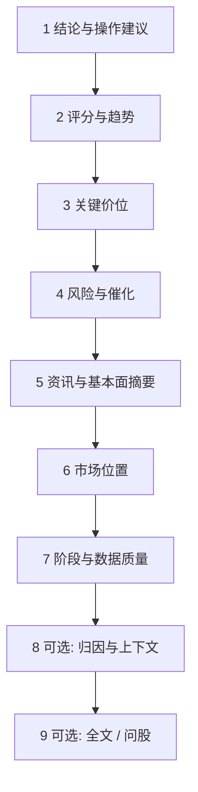
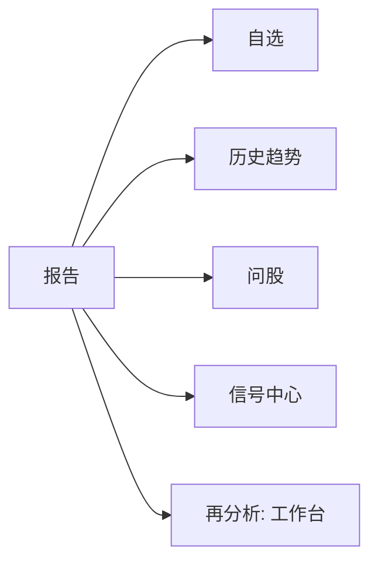

# 08 阅读报告

## 本章你会学会

1. 用固定阅读顺序抓住结论、风险与失效条件  
2. 从工作台历史、任务完成、首页、信号等多入口打开报告  
3. 区分新手/专业、brief/detailed 的读感差异  
4. 在 3 分钟速读与完整精读之间切换，并衔接到问股与信号  

一份 AI 个股报告往往又长又密。新手常见两种读法，都不理想：

1. **从头扫到尾**——读完只记得情绪，答不出「风险是什么」；  
2. **只看「买入 / 观望」**——跳过证据与失效条件，把标签当成交易指令。

更稳妥的方法是先抓住 **三件事**：

1. 系统现在更偏多、偏空，还是观望？  
2. 最重要的风险是什么？  
3. 如果看错了，什么条件算失效？  

把这三个问题答清楚，这份报告就「读值了」。其余指标名词，可以以后再慢慢学。

> ⚠️ **注意**  
> 即便出现「买入」「加仓」字样，也只是研究输出的标签与叙述，**不构成投资建议**。仓位、时机与交易执行由你自己决定，损益自负。

> 📘 **概念**  
> 报告 = 某次分析任务的 **结构化摘要 + 叙述正文 +（可选）数据上下文质量**。  
> 信号 = 从报告等来源提炼的 **可筛选建议资产**。  
> 两者同源时也要以 **更新时间 + 生命周期** 对齐，不要把旧报告和新信号硬拼成一套新故事。

---

## 1. 报告从哪里打开

个股报告一般 **没有** 单独的一级菜单。常见入口：

> 🧭 **入口**

| 入口 | 说明 |
| --- | --- |
| **分析工作台 → 历史** | 最完整、最常用 |
| 任务完成提示 | 点「查看报告」 |
| **首页 → 最近分析** | 快捷入口 |
| **信号详情 → 来源报告** | 从建议跳回完整叙事 |
| 问股前的报告页 | 继续追问时带着上下文 |
| 持仓「分析」完成后 | 去工作台历史打开，而不是只盯持仓行 |

大盘复盘报告请去 [04 大盘复盘](04-market-review.md)，**不要**和个股操作建议混着读。

> 💡 **提示**  
> 工作台地址常在 `/research/analysis`；带 `segment=history&recordId=…` 时可直接打开某次历史。界面文案以你屏幕为准。

---

## 2. 新手模式与专业模式

| 模式 / 详略 | 读感 | 适合 |
| --- | --- | --- |
| **新手 / Beginner** | 更短、更保守、少堆字段 | 第一次读、只想抓重点 |
| **专业** | 结构更全，可看数据上下文与长文 | 想核对证据、降级原因 |
| **brief** | 发起分析时的简略骨架 | 批量扫、先筛 |
| **detailed** | 发起分析时的更详输出 | 重仓、深度研究 |

> 📘 **概念**  
> 同一次分析记录，在不同 **展示模式** 下「看起来多少」可能不同，但底层结论通常同源。觉得新手太短，可以切专业或打开全文 Markdown——**不一定**是系统没分析完。

> ✅ **推荐做法**  
> 第一次：brief / 新手抓三问 → 值得深挖再 detailed / 专业。  
> ❌ **不推荐**  
> 同一天无意义连跑 detailed「刷存在感」，既费额度，也制造噪声信号。

---

## 3. 推荐阅读顺序（请尽量固定）

> 🖼️ **配图占位** · `assets/report-header-action-phase-zh.png`  
> **应配内容**：个股报告页头：操作建议/action 方向、以及阶段或数据质量相关信息（以界面字段为准）。  
> **拍摄要点**：脱敏演示报告；裁剪页头区域。  
> **状态**：待补图（清单：[assets/PLACEHOLDERS.md](assets/PLACEHOLDERS.md)）

固定顺序的好处是：你每次都知道自己读到哪一步，不容易被中间的新闻段落带走。

> ✅ **推荐做法**  
> 把下面 1～7 步当成默认路径；8～9 仅在需要时展开。  
> ❌ **不推荐**  
> 先读新闻情绪再回头找结论——顺序一乱，偏见会替你做决定。

---

### 第 1 步：结论与操作建议（先定方向感）

**目标：** 用一句话回答「系统现在偏哪边」。

看两类信息：

1. **叙述性操作建议**（operation advice / 文字段落）；  
2. **结构化 action**（买入、加仓、持有、观望、减仓、卖出、回避、提醒等）。

| 常见方向 | 怎么理解 | 容易误读成 |
| --- | --- | --- |
| 买入 / 加仓 | 系统偏积极，仍要看风险与失效条件 | 「保证会涨」 |
| 持有 | 已有仓可继续观察 | 「直接加仓」 |
| 观望 | 证据不足或震荡，空仓/轻仓等待很常见 | 「软件坏了不会给方向」 |
| 减仓 / 卖出 | 偏防守，请结合你真实仓位 | 「系统已替你卖掉」 |
| 回避 | 明确不参与研究上的进攻 | 「立刻做空」 |
| 提醒 / alert | 先读「为什么提醒」 | 「小问题可忽略」 |

新手摘要里还可能有 **风险等级徽章**（偏高 / 中等 / 未评级一类）——它常由 action 粗映射，是阅读辅助，不是独立风控系统。

**本步结束自问：**

- 我能否用一句话复述方向？  
- 若我已有仓，这个方向是加、减、还是不动？

---

### 第 2 步：评分与趋势（知道「温度」）

**目标：** 知道系统觉得偏强还是偏弱，而不是背下每一个分数。

常见会看到：情绪分、趋势判断、评分仪表等。

> ⚠️ **注意**  
> **分数高 ≠ 保证赚钱**。高分 + 数据质量差，置信应下调；低分 + 清晰失效条件，有时比空喊口号更有用。

**本步结束自问：**

- 温度是偏热、偏冷，还是中性？  
- 温度和 action 是否打架？（打架时优先读风险与数据质量。）

---

### 第 3 步：关键价位（把抽象变成可观察）

**目标：** 把「多空」落成「价格附近发生什么时，我要重新评估」。

| 词 | 含义 | 使用边界 |
| --- | --- | --- |
| **支撑** | 往下时历史上较容易有买盘的区域 | 区域感，不是精确到分的圣杯 |
| **压力** | 往上时历史上较容易遇卖压的区域 | 突破与否要用成交与收盘等自己验证 |
| **止损思路** | 错了怎么认输离场 | 限制单笔伤害，不是「建议你立刻挂单」 |
| **目标 / 止盈思路** | 逻辑成立时可能关注的上方区域 | **不是收益承诺** |

> 💡 **提示**  
> 若价位写得很残缺，**不要自行脑补**成精确交易计划。残缺本身就是信息：输入不足或模型不敢给。

**本步结束自问：**

- 我能否指出「看错时大致看哪个价区」？  
- 没有价位时，我是否改用时间 / 事件失效条件？

---

### 第 4 步：风险与催化（先听坏消息）

**目标：** 先建立「最坏可能」，再看「可能的利好线索」。

建议顺序：

1. **风险警报 / 风险列表**（先读完前几条）；  
2. 再读 **催化 / 利好线索**。

| 类型 | 当什么用 | 不当什么用 |
| --- | --- | --- |
| 风险 | 仓位与观察优先级的刹车 | 恐吓式永远空仓的唯一理由 |
| 催化 | 去核验公告 / 新闻的线索 | 已经发生的确定事件 |

> ✅ **推荐做法**  
> 风险读不懂 → 用问股只问「这条风险的观察指标是什么」。  
> ❌ **不推荐**  
> 只收藏催化段落，截图发给朋友当「内幕」。

**本步结束自问：**

- 我能否说出至少三条风险？  
- 催化是否已在公开信息中可核验？

---

### 第 5 步：资讯与基本面摘要

**目标：** 判断叙事有没有「过期新闻」或「基本面空洞」。

注意：

- **时间戳**与来源；  
- 摘要是否与第 1 步结论矛盾；  
- 基本面段落是否大量缺失（可能数据未进入本次分析）。

> 📘 **概念**  
> 报告页上的「相关资讯」有时由 **独立接口补充展示**；**不等于** 这些新闻一定进入了当次 LLM 上下文。是否进入模型，以 **数据上下文 / 输入数据块** 为准（见第 7～8 步）。

**本步结束自问：**

- 最关键的一条新闻是什么时候的？  
- 若新闻缺失，我的结论权重是否应下降？

---

### 第 6 步：市场位置（尤其 A 股主题时）

**目标：** 理解这只票大概处在什么题材角色（主线、跟风、边缘等）——**有证据时才信**。

可能看到：板块 / 概念角色、结构状态、主题阶段等。

> ⚠️ **注意**  
> 缺证据或结构状态不完整时，**宁可不下结论**，不要用「我觉得是主线」填空。

**本步结束自问：**

- 角色判断有没有数据支撑？  
- 是否需要先去大盘复盘看市场气质？

---

### 第 7 步：阶段与数据质量（决定你信几分）

**目标：** 给整份报告乘上一个「置信折扣」。

| 情况 | 为什么结论可能更「怂」或更不稳 |
| --- | --- |
| **盘前** | 今天的故事还没开演 |
| **盘中** | 日线可能还没收完（partial bar） |
| **盘后** | 相对更完整，但仍受数据源质量影响 |
| **数据降级 / 缺失** | 系统应降低置信度，而不是编造缺失数据 |
| **质量分较差** | 多个输入块没进来或质量受限 |

报告里若有 **数据上下文 / 输入数据块** 面板，会标注各块状态。常见状态含义：

| 状态 | 白话 |
| --- | --- |
| available | 可用，进入了本次分析 |
| missing | 缺失，未进入 |
| fetch_failed | 抓取失败，未使用 |
| not_supported | 当前市场/标的不支持 |
| fallback | 走了备用路径 |
| stale | 用了不够新的数据 |
| estimated | 估算数据 |
| partial | 仅部分可用 |

> 📘 **概念**  
> 这些状态描述的是 **「这次进模型的输入」**，不等于「全世界数据源永远坏了 / 永远好」。

质量分常见档位（以界面文案为准）：良好 / 可用 / 受限 / 较差。

**本步结束自问：**

- 我要给这份报告打几折信任？  
- 缺的是行情、新闻还是基本面？要不要补数据源后重跑？

---

### 第 8 步（可选）：归因与更细上下文

- **归因**：解释「为什么偏多 / 偏空」的权重感。  
- **运行流 / 诊断**：任务阶段排障（进阶）。  
- **局限说明**：模型或流水线主动声明的限制。

适合：结论奇怪、或你要写研究笔记时引用「依据结构」。

---

### 第 9 步（可选）：全文 Markdown 与问股

| 操作 | 适合场景 |
| --- | --- |
| 全文 Markdown | 需要引用段落、复制到笔记 |
| **继续问股** | 某一段读不懂、想澄清失效条件 |
| 跳到信号 | 已提取 Decision Signal 时 |

问股纪律见 [05 问股对话](05-agent-chat.md)：问题里写清代码，少问「保证能涨多少」。

---

## 4. 报告页上还能做什么

| 操作 | 适合场景 | 备注 |
| --- | --- | --- |
| 加入 / 移出自选 | 以后批量分析、首页摘要 | 与持仓不是一回事 |
| 历史趋势 | 看系统结论是否反复变化 | 同代码多次结论对比 |
| 继续问股 | 读不懂的局部 | 带着报告上下文 |
| 运行流 | 任务阶段排障 | 进阶 |
| 跳到信号 | 已有结构化建议 | 注意信号是否仍 active |
| 切换新手 / 专业 | 控制信息密度 | 不改变底层记录本身 |

---

## 5. 三分钟速读法（教程）

> 🖼️ **配图占位** · `assets/report-reading-order-zh.png`  
> **应配内容**：报告正文前部：结论/操作建议与风险相关段落同时可见。  
> **拍摄要点**：可淡标注「1 结论 → 2 风险」阅读起点；无外传敏感仓位。  
> **状态**：待补图（清单：[assets/PLACEHOLDERS.md](assets/PLACEHOLDERS.md)）

时间不够时，**只做压缩版固定顺序**：

| 分钟 | 动作 |
| --- | --- |
| 0:00–0:40 | action + 一句话结论 |
| 0:40–1:40 | 风险前三条 |
| 1:40–2:40 | 支撑 / 压力 / 止损是否写清 |
| 2:40–3:00 | 扫一眼阶段与数据质量徽章 |

其余全部折叠，明天再按完整 1～7 步读。

> ✅ **推荐做法**  
> 速读后若准备动真格研究，再开详细模式补第 4～7 步。

---

## 6. 使用案例

### 案例 A：报告写观望，股价却大涨

1. 看是不是盘中、数据是否降级。  
2. 压力位是否已明显被放量突破（用个股工作区或券商行情核）。  
3. 历史趋势是否一贯偏谨慎。  
4. 问股：「若收盘站上某某价，观察条件怎么调整？」  
5. **不要**逼模型保证「还能涨多少」。

### 案例 B：只有三分钟

用第 5 节速读法；把三问记在便签上即可。

### 案例 C：上下文一片 missing

1. 记下缺的是新闻还是行情 / 基本面。  
2. 去设置补数据源或检查网络。  
3. 同一代码再跑一次。  
4. 对比质量分是否变好。  
5. 数据很差时，不要加重仓叙事。

### 案例 D：信号和报告好像不一致

以 **更新的报告 + 信号生命周期** 为准。旧报告 + 已关闭信号，不要拼成一套新故事。

### 案例 E：brief 觉得太浅

先确认三问能答；再对同一代码跑 detailed 或切专业视图。不必同一分钟连点三次。

### 案例 F：从报告到规则

读完价位与失效条件 → `/signals?tab=rules&createRule=1` 建简单价格提醒 → 试运行 → 启用。规则是「盯条件」，不是「复制 action」。

### 案例 G：和大盘一起读

先 [04 大盘复盘](04-market-review.md) 看市场气质 → 再读个股市场位置与风险 → 避免「大盘强 = 我的票强」。

### 案例 H：持仓对照读

打开 `/portfolio` 核对真实数量 → 再读减仓 / 持有类 action → 问股只讨论观察点。

---

## 7. 阅读纪律（送给未来的自己）

- 震荡市里多看观望 / 持有，往往是特性，不是软件坏了。  
- 日线未完成时，降低对盘中豪言壮语的权重。  
- 同一天无意义连跑同一只，既费钱也制造噪声信号。  
- 读完仍不确定，就 **观望**——观望也是一种决定。  
- 截图分享时去掉 Key、账户、过度仓位信息。  
- 报告语言与界面语言可不同：菜单 English、报告中文完全合法。

---

## 8. 常见问题（FAQ）

**Q1：为什么新手模式这么短？是不是分析失败了？**  
A：不一定。先看专业模式或全文；同时看任务是否显示成功完成。

**Q2：action 是「买入」，我是不是该立刻买？**  
A：**不是。** 这是研究标签。请完成风险、价位、数据质量三步后再由你自己决定。

**Q3：资讯区有新闻，数据上下文却显示新闻 missing？**  
A：可能。展示用资讯接口与「进入 LLM 的输入」可以不同步。以数据上下文为准评估模型依据。

**Q4：partial bar 是什么？**  
A：还没走完的 K 线（常见于盘中日线）。基于它的结论应降权。

**Q5：历史趋势结论反复变化怎么办？**  
A：降低对该代码短线建议的权重；检查是否盘中反复重跑；周末用回测 / 信号再评估看整体习惯，而不是指责单次分数。

**Q6：大盘报告和个股报告哪个优先？**  
A：问「市场气质」看大盘；问「这只票怎么办」看个股。不要混读操作建议。

**Q7：没有失效条件的报告怎么用？**  
A：自行补观察条件，或问股请模型帮你列出可观察的失效信号；没有失效条件就不应重仓叙事。

**Q8：报告可以当合规投顾意见吗？**  
A：**不可以。** 产品定位是研究辅助。

---

## 9. 离开前自检

| # | 自检项 | 通过标准 |
| --- | --- | --- |
| 1 | 方向 | 能一句话说清偏多 / 空 / 观望 |
| 2 | 风险 | 至少三条，且先于催化阅读 |
| 3 | 失效 | 有价格、时间或事件条件 |
| 4 | 价位 | 残缺时未脑补 |
| 5 | 数据质量 | 知道自己信几分 |
| 6 | 阶段 | 盘中 / 盘前已降权 |
| 7 | 与信号 | 未用过期信号覆盖新报告（或相反） |
| 8 | 行动 | 若不确定，选择观望或只建提醒规则 |

---

## 10. 术语速查

| 术语 | 一句话 |
| --- | --- |
| action | 结构化方向标签 |
| operation_advice | 叙述性操作建议 |
| analysis_summary | 分析摘要 / 结论段 |
| partial bar | 还没走完的 K 线 |
| Analysis Context | 进入模型的数据块清单与质量 |
| invalidation | 逻辑失效条件 |
| catalyst | 催化 / 利好线索 |
| support / resistance | 支撑 / 压力 |
| 来源报告 | 信号或问股所依附的那次历史记录 |
| brief / detailed | 发起分析时的详略 |
| beginner / professional | 报告展示密度模式 |
| Decision Signal | 从分析中提炼的可管理建议资产 |

---

## 11. 相关阅读

- [03 分析工作台](03-analysis-workbench.md)  
- [05 问股对话](05-agent-chat.md)  
- [06 信号中心](06-signals.md)  
- [04 大盘复盘](04-market-review.md)  
- [07 持仓](07-portfolio.md)  
- [09 回测](09-backtest.md)  
- [13 个股工作区](13-stock-details.md)  

上一篇：[07 持仓](07-portfolio.md) · 下一篇：[09 回测](09-backtest.md)
