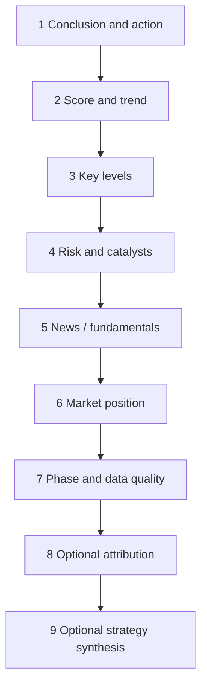

# 08 Reading reports

When you open any **single-stock** history report, read in a fixed order so you are not buried by length and do not skip risk.

> 💡 **Goal**  
> Answer three questions first: (1) lean bullish, bearish, or neutral? (2) main risks? (3) what invalidates the idea?  
> Do not start by memorizing every indicator name.

## Suggested order

> **Service note (delta vs prior run)**  
> Backend history comparison can compute a deterministic field-level delta between two stored runs (`compare_analyses` / `get_latest_delta`). See [Analysis Delta Comparison](../analysis-delta-comparison.md). Web “since last analysis” presentation is a separate UI task; when only one history row exists the service returns **no baseline**, not “no change.”

| Step | What | Concepts | Plain meaning |
| --- | --- | --- | --- |
| 1 | Conclusion / action | `operation_advice`, structured `action` | Buy / add / hold / watch / reduce / sell / avoid |
| 2 | Score and trend | sentiment-like scores, trend labels | Directional lean, not a guarantee |
| 3 | Key levels | support, resistance, reference entries, stop ideas | Support ≈ demand zone below; resistance ≈ supply above |
| 4 | Risk and catalysts | risk alerts, positive catalysts | Must be cross-checked |
| 5 | News / fundamentals | headlines, basic financials | May be noisy or delayed |
| 6 | Market position | theme / role (more common on A-shares) | Leader vs fringe; do not invent missing evidence |
| 7 | Phase and quality | pre/in/post session, degradation | Intraday partial bar → lower confidence |
| 8 | Optional attribution | technical / news / fundamental / market weights | Explains lean; not an order |
| 9 | Optional strategy synthesis | final signal, consensus, support/opposition, conflicts | Shows whether strategies actually agree and preserves dissent |

## Action labels (intuition)

| Label family | Intuition | Caution |
| --- | --- | --- |
| Buy / add | Constructive | Still read risk and invalidation |
| Hold / hold-and-watch | Stay with existing risk | Not a blank check to add |
| Watch / wait | Stay light or flat | Common when evidence is thin |
| Reduce / sell | Defensive | Match to your own position |
| Avoid | Do not engage | Not automatic shorting advice |

> ⚠️ **Not investment advice**  
> Even if the UI shows “buy”, it is research labeling. Position size and whether to trade are yours.

## Level vocabulary

| Term | Meaning |
| --- | --- |
| **Support** | A lower area where demand has often appeared |
| **Resistance** | An upper area where supply has often appeared |
| **Stop-loss** | Pre-planned exit when the thesis fails |
| **Target / take-profit idea** | Upside area **if** the thesis holds; not a promise |

## Phase and data quality

| Situation | Why tone may be cautious |
| --- | --- |
| Pre-market | Today’s path has not happened yet |
| Intraday / lunch / closing window | Daily bar may be **partial** |
| Degraded / missing data | Sources failed; system should not invent |
| Non-trading day | Reuses last session; stay conservative |

## Structured decision sections

New synchronous reports, completed task results, and history details share one optional presentation contract. When the underlying structured data exists, the report shows these first-class sections near the top:

| Section | What to read |
| --- | --- |
| Phase Decision | market phase, immediate action, action window, watch conditions, rationale, phase warnings, and data limitations |
| Signal Attribution | visible technical / news / fundamental / market percentages plus the strongest bullish and bearish evidence; percentages are not return probabilities |
| Strategy Synthesis | final signal, weighted score, confidence, consensus, conflict severity, supporting and opposing strategies, conflict participants, and excluded-opinion count |

These sections consume structured fields only; they do not infer meaning from Chinese, English, or Korean narrative text. Older, single-strategy, and partial reports may omit any unavailable section. Raw JSON, Markdown, and evidence strata remain available for traceability. A malformed optional section is ignored rather than replaced with an invented conclusion.

## Report evidence strata (shipped on main)

On current main, the **full report** Web view can show fixed evidence strata (verified facts / gaps & conflicts / model inference / risks & counter-evidence / framework alignment / non-investment-advice disclaimer) so fluent prose is not misread as verified fact.

| What you see | How to read it |
| --- | --- |
| Strata sections present | Read by block; do **not** treat model inference as verified fact |
| Older reports without strata | Expected; disclaimer should still be visible |
| Engineering contract | `docs/report-strata-contract_EN.md` |

UI labels win over this manual when wording differs.

## Reading discipline

- Range-bound markets with unclear flow often yield hold/watch — often a **feature**.  
- Respect “partial bar” and quality limitations.  
- Treat catalysts as leads to primary sources.  
- Research only; not investment advice.

## Example

Report says “watch” while price spikes: check phase and data quality, whether resistance was broken on volume, risk section, history trend consistency, then ask Agent chat about **observation conditions** — not for guaranteed returns.

Market-review reports: [04 Market review](04-market-review_EN.md).

Previous: [07 Portfolio](07-portfolio_EN.md) · Next: [09 Backtest](09-backtest_EN.md)
