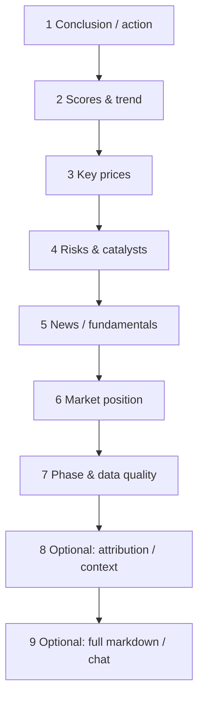

# 08 Reading reports

## Entry points and paths

Single-stock reports are **not** a top-level nav item. Open them from:

| Method | Path |
| --- | --- |
| Analysis Workbench | **Research → Analysis Workbench → History** (`segment=history&recordId=`) |
| Home | Expand **Recent analyses** |
| Task completion | “View report” style CTA |
| Signal detail | Source report link |
| Agent chat | **Continue in chat** from a report (report remains context) |

This chapter covers **single-stock research reports**. Market reviews: [04](04-market-review_EN.md).

> 💡 **Reading goal**  
> Answer: (1) bullish / bearish / wait? (2) main risks? (3) invalidation?  
> Skip jargon deep-dives on first pass.

> ⚠️ Research only — **not investment advice**.

## Beginner vs professional UI

| Mode | You usually see | Best for |
| --- | --- | --- |
| **Beginner** | Shorter cards, more conservative risk tone | First read |
| **Professional** | Full summary, structure blocks, markdown, context quality | Evidence & degradation |
| **brief / detailed** | Density chosen at launch (if offered) | Skeleton first, depth later |

Same underlying record; presentation density can differ.

## Recommended order

| Step | Look at | Fields / concepts | Plain meaning |
| --- | --- | --- | --- |
| 1 | Conclusion & advice | `operation_advice`, structured `action` | buy / add / hold / watch / reduce / sell / avoid … |
| 2 | Scores & trend | Sentiment, trend labels | Lean strong/weak — **not a guarantee** |
| 3 | Key prices | Support, resistance, stops | See glossary |
| 4 | Risks & catalysts | Risk alerts, positive drivers | Verify externally |
| 5 | News / fundamentals | Summaries | Check timestamps |
| 6 | Market position | Theme / role (more common for A-shares) | Leader vs fringe |
| 7 | Phase & quality | Session phase, degradation, quality score | Incomplete bar → down-weight |
| 8 | Attribution | Tech / news / fundamentals / market weights | Why the lean |
| 9 | Analysis context | Input block statuses | What entered the model |

## Understanding action (eight-state intuition)

| Label / action | Intuition | Caution |
| --- | --- | --- |
| buy | Constructive | Still read risks / invalidation |
| add | Add only if you already hold & thesis holds | Not “double blindly” |
| hold | Keep observing | Not automatic add |
| watch | Wait / light | Common in chop |
| reduce | Defensive | Match your real size |
| sell | Exit bias | Not auto-routing |
| avoid | Do not participate | Not “force short” |
| alert | Condition/event flag | Read why it fired |

> ⚠️ Structured **action ≠ order ticket**. Signal Center stores the same family of labels ([06](06-signals_EN.md)).

## Price glossary

| Term | Meaning |
| --- | --- |
| **Support** | Zone where buyers historically appeared on dips |
| **Resistance** | Zone where sellers historically appeared on rallies |
| **Stop-loss** | Pre-planned exit to cap loss |
| **Target / take-profit idea** | Upside zone **if** thesis works — not a promise |
| **Entry band** | Planned involvement zone (may be one-sided) |
| **Invalidation** | When the thesis is broken |

## Phase and data quality

| Situation | Why the report may sound cautious |
| --- | --- |
| Premarket | Session not under way |
| Intraday | Daily bar may be **partial** |
| Postmarket | Full daily bar available; still not prediction |
| Degraded / missing feeds | Lower confidence, not invention |
| Non-trading day | May reuse last session |
| Quality limited / poor | Many missing/stale input blocks |

### Analysis Context block statuses

| Status | Meaning | What you do |
| --- | --- | --- |
| available | Used in this run | Normal reference |
| missing | Not in the run | Incomplete conclusions possible |
| fetch_failed | Fetch error | Fix source/network; re-run |
| not_supported | Market/symbol N/A | Use other evidence |
| fallback | Backup path | Re-check warnings |
| stale | Not latest | Check timestamps; re-run |
| estimated / partial | Weak completeness | Down-weight |

Evidence scope: statuses describe **what entered this LLM call**, not eternal health of every provider.

## Common on-report actions

| Action | Note |
| --- | --- |
| Add / remove watchlist | Batch analysis & Home summaries |
| Full markdown | Full narrative |
| History trend | Flip-flopping over time? |
| Continue in chat | `/chat` with context — [05](05-agent-chat_EN.md) |
| Run flow | Stage diagnostics |
| Open signal | If a Decision Signal was extracted |

## Reading discipline

- Watch/hold in chop is often a **feature**, not a bug.  
- Incomplete bar or degradation → lower weight on intraday bravado.  
- Treat catalysts as **leads** to verify, not facts.  
- Beginner mode shorter ≠ more accurate; pro mode longer ≠ must execute.  
- Do not spam re-runs of the same symbol the same day without a reason.

## Use cases

**A — Report says watch; price rips**  
Check phase/quality → resistance break on volume? → history trend → chat about **observation conditions**, not guaranteed returns.

**B — Three-minute first read**  
Only: (1) action (2) top risks (3) support/resistance/stop. Fold the rest.

**C — Many missing context blocks**  
Note missing inputs → Settings data sources → re-run same code → compare quality — do not build size on bad inputs.

**D — Align with Signal Center**  
Report watch + active signal watch = consistent. Closed signal + old report → prefer latest lifecycle + newest report.

**E — Beginner feels “too thin”**  
Switch professional / open markdown — analysis may already be complete.

## Market review reports

See [04](04-market-review_EN.md). Do not mix index narratives with single-name action labels.

## Glossary (summary)

| Term | One line |
| --- | --- |
| **Stock report** | Single-symbol research artifact |
| **action** | Structured direction label |
| **operation_advice** | Prose advice text |
| **partial bar** | Incomplete daily candle |
| **Analysis Context** | Input-block inventory & quality |
| **Beginner mode** | Shorter, more conservative chrome |
| **Source report** | History record a signal/chat hangs on |

## Related

- [03 Analysis Workbench](03-analysis-workbench_EN.md)
- [05 Agent chat](05-agent-chat_EN.md)
- [06 Signal Center](06-signals_EN.md)
- [04 Market review](04-market-review_EN.md)

Prev: [07 Portfolio](07-portfolio_EN.md) · Next: [09 Backtest](09-backtest_EN.md)
