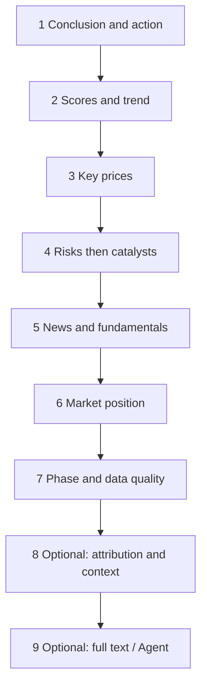
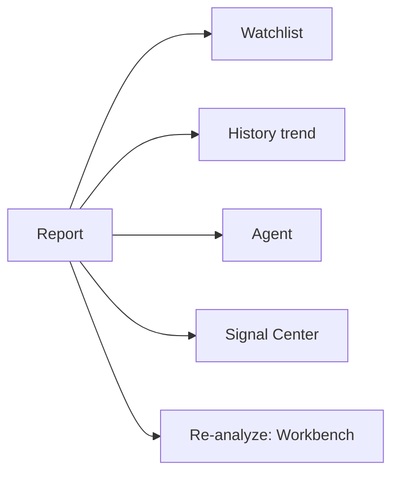

# 08 Reading reports

## What you will learn

1. A fixed reading order for conclusion, risks, and invalidation  
2. Where reports open (Workbench history, tasks, Home, signals, …)  
3. How Beginner/professional and brief/detailed change the reading feel  
4. How to switch between a 3-minute skim and a full deep read, then hand off to Agent and signals  

AI single-stock reports are often long and dense. Two common failure modes:

1. **Read every paragraph** — remember mood, cannot restate risks.  
2. **Only glance at buy/watch** — skip evidence and invalidation; treat labels as orders.

A stabler method answers **three questions**:

1. Is the system leaning bullish, bearish, or wait?  
2. What are the main risks?  
3. If wrong, what invalidates the thesis?

If you can answer those, the report paid for itself. Indicator jargon can wait.

> ⚠️ **Note**  
> Even words like “buy” or “add” are research labels and narrative — **not investment advice**. Size, timing, and execution remain yours; P&L is yours.

> 📘 **Concept**  
> **Report** = one analysis task’s structured summary + narrative body + (optional) input quality context.  
> **Signal** = a filterable suggestion asset distilled from reports and other sources.  
> When they share lineage, align by **update time + lifecycle**—do not glue an old report to a new signal into a new story.

---

## 1. Where reports open

Single-stock reports typically have **no** primary menu of their own.

> 🧭 **Entry**

| Entry | Notes |
| --- | --- |
| **Workbench → History** | Most complete, most used |
| Task completion CTA | **View report** |
| **Home → Recent analyses** | Shortcut |
| **Signal detail → source report** | Jump back to full narrative |
| Report before Agent follow-up | Context-aware continue |
| After Portfolio **Analyze** | Open Workbench history—not only the positions row |

Market review reports live in [04 Market review](04-market-review_EN.md)—**do not** mix them with single-name action labels.

> 💡 **Tip**  
> Workbench base path is usually `/research/analysis`; `segment=history&recordId=…` can open a specific history row. Trust on-screen labels.

---

## 2. Beginner vs professional; brief vs detailed

| Mode / density | Feel | Fit |
| --- | --- | --- |
| **Beginner** | Shorter, more conservative, fewer fields | First read, key points |
| **Professional** | Fuller structure, context quality, long text | Evidence, degradation reasons |
| **brief** | Skeleton at generation time | Batch scan, first pass |
| **detailed** | Richer generation | Heavy holdings, deep work |

> 📘 **Concept**  
> The same analysis record can **look denser or thinner** under different **display** modes; underlying conclusions are typically the same. Thin Beginner view does **not** always mean analysis failed—try professional view or full Markdown.

> ✅ **Recommended**  
> First: brief/Beginner three questions → detailed/professional only when depth is justified.  
> ❌ **Avoid**  
> Same-day detailed re-runs for “presence”—expensive and noisy for Signal Center.

---

## 3. Fixed reading order

> 🖼️ **Figure placeholder** · `assets/report-header-action-phase-en.png`  
> **Capture**: Report header: action direction and phase/quality affordances as shown.  
> **Notes**: Demo report; crop header.  
> **Status**: pending — see [assets/PLACEHOLDERS.md](assets/PLACEHOLDERS.md)

A fixed order prevents news paragraphs from hijacking the whole session.

> ✅ **Recommended**  
> Steps 1–7 as default; 8–9 only when needed.  
> ❌ **Avoid**  
> News-first, conclusion-later—order collapse invites bias.

---

### Step 1: Conclusion and action

**Goal:** One sentence—“which side is the system leaning?”

Look for:

1. Narrative operation advice (paragraphs).  
2. Structured **action** (buy, add, hold, watch, reduce, sell, avoid, alert, …).

| Direction | How to read | Easy misread |
| --- | --- | --- |
| Buy / add | Constructive bias; still need risks and invalidation | “Guaranteed upside” |
| Hold | Existing size may keep observing | “Add immediately” |
| Watch | Evidence thin or choppy; cash/light is common | “Software broken” |
| Reduce / sell | Defensive bias; combine with real holdings | “System already sold for you” |
| Avoid | Research stance: stay out of offense | “Short now” |
| Alert | Read *why* it alerts | “Minor, ignore” |

Beginner summaries may show a **risk level badge**—often a coarse map from action. Reading aid, not a standalone risk system.

**Exit self-check:** Can I restate direction in one sentence? If I hold, is this add / reduce / hold still?

---

### Step 2: Scores and trend

**Goal:** Temperature, not memorizing every score.

You may see sentiment scores, trend judgments, gauges.

> ⚠️ **Note**  
> **High score ≠ guaranteed profit.** High score + poor data quality → lower trust. Low score + clear invalidation can be more useful than slogans.

**Exit self-check:** Hot / cold / neutral? Does temperature fight action? (If yes, prioritize risks and quality.)

---

### Step 3: Key prices

**Goal:** Turn lean into “what price zone forces re-evaluation?”

| Term | Meaning | Boundary |
| --- | --- | --- |
| **Support** | Downside area where demand often appeared historically | Zone sense, not a holy tick |
| **Resistance** | Upside area where supply often appeared | Break confirmation needs volume/close you verify |
| **Stop idea** | How wrong looks in price space | Limits single-trade harm—not “place this order now” |
| **Target / take-profit idea** | Upside zones if thesis holds | **Not a return promise** |

> 💡 **Tip**  
> If levels are incomplete, **do not invent** a precise plan. Thinness is itself information: weak inputs or cautious model.

**Exit self-check:** Can I name an approximate wrong-side zone? If no prices, did I switch to time/event invalidation?

---

### Step 4: Risks then catalysts

**Goal:** Worst case first, then optional upside clues.

1. Risk alerts / risk list (first several items).  
2. Then catalysts / positive leads.

| Type | Use as | Not as |
| --- | --- | --- |
| Risks | Brake on size and observation priority | Sole reason for permanent zero exposure |
| Catalysts | Leads to verify in public filings/news | Already-certain events |

> ✅ **Recommended**  
> Unclear risk → Agent: “what observable metric tracks this risk?”  
> ❌ **Avoid**  
> Screenshot only catalysts as “alpha tips.”

**Exit self-check:** At least three risks named? Catalysts checkable in public info?

---

### Step 5: News and fundamentals summary

**Goal:** Spot stale news or hollow fundamentals.

Watch timestamps and sources; conflict with step-1 conclusion; large fundamental gaps (data may not have entered this run).

> 📘 **Concept**  
> “Related news” on the report page may be **display-side enrichment**. It does **not** guarantee those items entered the LLM context. Whether they entered is judged by **Analysis Context / input blocks** (steps 7–8).

**Exit self-check:** When is the most critical item from? If news is missing, should trust decline?

---

### Step 6: Market position (especially theme-heavy A-shares)

**Goal:** Role in a theme (leader, follower, fringe, …)—**only when evidence exists**.

You may see sector/concept role, structure state, theme phase.

> ⚠️ **Note**  
> Missing evidence or incomplete structure → **prefer no conclusion** over filling with “I feel it is the leader.”

**Exit self-check:** Is the role data-backed? Do you need Market review for market tone first?

---

### Step 7: Phase and data quality (trust discount)

**Goal:** Multiply the whole report by a confidence discount.

| Situation | Why conclusions may be softer or unstable |
| --- | --- |
| **Premarket** | Session story not started |
| **Intraday** | Daily bar may be incomplete (partial bar) |
| **Postmarket** | More complete, still limited by source quality |
| **Degraded / missing data** | System should lower confidence, not invent data |
| **Poor quality score** | Multiple input blocks missing or constrained |

Analysis Context / input blocks may list statuses:

| Status | Plain meaning |
| --- | --- |
| available | Used in this analysis |
| missing | Not present, not used |
| fetch_failed | Fetch failed, not used |
| not_supported | Not supported for this market/symbol |
| fallback | Backup path used |
| stale | Stale data used |
| estimated | Estimated data |
| partial | Only partly available |

> 📘 **Concept**  
> Statuses describe **inputs for this model call**, not eternal provider health worldwide.

Quality tiers are typically labeled good / usable / limited / poor (as shown).

**Exit self-check:** What trust discount do I apply? Missing quotes, news, or fundamentals? Re-run after fixing sources?

---

### Step 8 (optional): Attribution and finer context

- **Attribution** — weight sense for why lean long/short.  
- **Run flow / diagnostics** — task stages (advanced).  
- **Limitation notes** — pipeline or model-declared limits.

Use when conclusions look odd, or when you write research notes that need “basis structure.”

---

### Step 9 (optional): Full Markdown and Agent

| Action | Fit |
| --- | --- |
| Full Markdown | Quote paragraphs into notes |
| **Continue in chat** | One unclear section; clarify invalidation |
| Jump to signal | When a Decision Signal was extracted |

Agent discipline: [05](05-agent-chat_EN.md)—code explicit; avoid “guarantee how much it will rise.”

---

## 4. What else the report page can do

| Action | Fit | Note |
| --- | --- | --- |
| Watchlist add/remove | Later batch analysis, Home summaries | Not the same as holdings |
| History trend | Conclusion reversals on same code | Multi-run compare |
| Continue in chat | Local confusion | Carries report context |
| Run flow | Task stage debug | Advanced |
| Jump to signal | Structured suggestion exists | Check still active |
| Beginner / professional toggle | Information density | Does not rewrite the underlying record |

---

## 5. Three-minute skim (tutorial)

> 🖼️ **Figure placeholder** · `assets/report-reading-order-en.png`  
> **Capture**: Upper report body: conclusion/action and risks visible.  
> **Notes**: Optional soft markers 1→2; no real portfolio sizes.  
> **Status**: pending — see [assets/PLACEHOLDERS.md](assets/PLACEHOLDERS.md)

When time is tight, use a compressed fixed order:

| Time | Action |
| --- | --- |
| 0:00–0:40 | action + one-sentence thesis |
| 0:40–1:40 | first three risks |
| 1:40–2:40 | support / resistance / stop clarity |
| 2:40–3:00 | phase and data-quality badges |

Fold the rest; finish steps 1–7 later.

> ✅ **Recommended**  
> After a skim that becomes real research, open denser view and complete steps 4–7.

---

## 6. Use cases

**A — Report says watch while price rips** — check phase/quality → resistance break on chart/broker → history tone → Agent on observation conditions, not guaranteed upside.  
**B — Only three minutes** — §5 skim; jot the three questions.  
**C — Context full of missing** — note which blocks → fix data sources → re-run same code → compare quality; do not build heavy-size narrative on bad inputs.  
**D — Signal vs report conflict** — prefer **newer report + signal lifecycle**. Old report + closed signal ≠ new story.  
**E — brief feels thin** — answer three questions first; then one detailed or professional view—not three clicks in one minute.  
**F — Report to rule** — levels + invalidation → `/signals?tab=rules&createRule=1` → dry-run → enable. Rules watch conditions; they do not “copy action.”  
**G — With market review** — [04](04-market-review_EN.md) for tone → stock market position and risks → never “market strong = my name strong.”  
**H — Holdings cross-read** — `/portfolio` quantities → reduce/hold-style actions → Agent on observation points only.

---

## 7. Reading discipline

- Choppy markets often show watch/hold—that can be a feature, not a bug.  
- Incomplete daily bars deserve less weight for assertive intraday claims.  
- Same-day meaningless re-runs waste quota and create signal noise.  
- Still unsure → **watch**—waiting is also a decision.  
- Screenshots shared outside: strip keys, accounts, oversized position details.  
- UI language and report language can differ (English menus + Chinese body is valid).

---

## 8. FAQ

**Q1: Beginner mode is very short—did analysis fail?**  
Not necessarily. Try professional view or full text; also confirm the task shows success.

**Q2: Action is “buy”—should I buy now?**  
**No.** Research label. Finish risks, levels, and data quality before any personal decision.

**Q3: News panel has items but context shows news missing?**  
Possible. Display news APIs and LLM inputs can diverge. Use Analysis Context for “what the model saw.”

**Q4: What is a partial bar?**  
An unfinished candle (common for intraday daily). Discount conclusions based on it.

**Q5: History trend keeps reversing?**  
Lower weight on short-horizon suggestions for that code; check repeated intraday re-runs; weekend tools ([09](09-backtest_EN.md), signal review) for process—not one score’s blame game.

**Q6: Market review vs stock report—which first?**  
Market tone → market review. “What about this name?” → stock report. Do not mix action labels.

**Q7: Report has no invalidation—how to use it?**  
Add your own observation conditions, or Agent to list observable invalidation. No invalidation → avoid heavy-size narrative.

**Q8: Is a report compliant investment advice?**  
**No.** Research assistance only.

---

## 9. Self-check

| # | Item | Pass |
| --- | --- | --- |
| 1 | Direction | One sentence bullish / bearish / watch |
| 2 | Risks | ≥3, read before catalysts |
| 3 | Invalidation | Price, time, or event condition |
| 4 | Levels | No invented precision when incomplete |
| 5 | Data quality | Explicit trust discount |
| 6 | Phase | Premarket/intraday discounted |
| 7 | vs signals | No stale signal covering new report (or reverse) |
| 8 | Action | Unsure → watch or reminder rule only |

---

## 10. Glossary

| Term | One line |
| --- | --- |
| action | Structured direction label |
| operation_advice | Narrative operation text |
| analysis_summary | Summary / thesis block |
| partial bar | Unfinished candle |
| Analysis Context | Input blocks and quality for this model call |
| invalidation | When the thesis breaks |
| catalyst | Upside lead to verify |
| support / resistance | Support / resistance zones |
| Source report | History record a signal or chat attaches to |
| brief / detailed | Generation density |
| beginner / professional | Display density modes |
| Decision Signal | Manageable suggestion asset distilled from analysis |

---

## 11. Related

- [03 Analysis Workbench](03-analysis-workbench_EN.md)  
- [05 Agent chat](05-agent-chat_EN.md)  
- [06 Signal Center](06-signals_EN.md)  
- [04 Market review](04-market-review_EN.md)  
- [07 Portfolio](07-portfolio_EN.md)  
- [09 Backtest](09-backtest_EN.md)  
- [13 Stock workspace](13-stock-details_EN.md)  

Prev: [07 Portfolio](07-portfolio_EN.md) · Next: [09 Backtest](09-backtest_EN.md)
