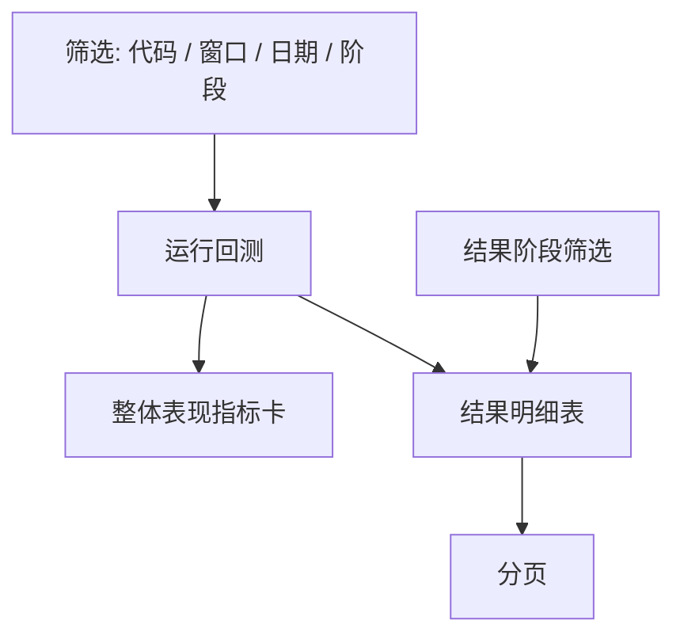
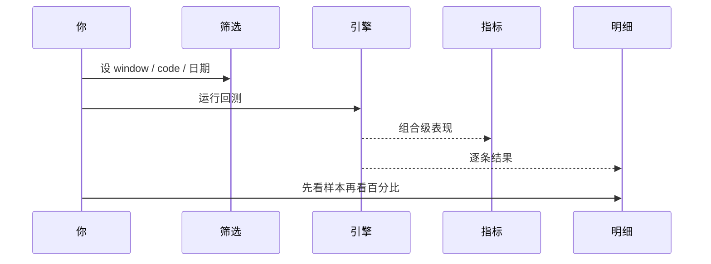
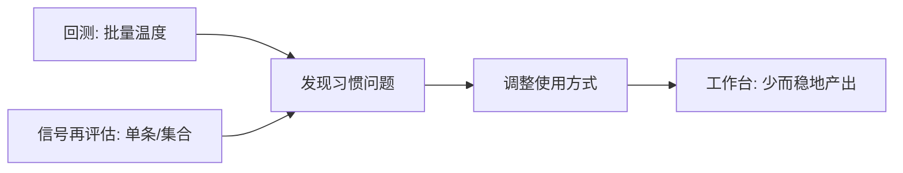

# 09 回测

回测页用来冷静回答：

> 过去一段时间，系统给出的 AI 建议，事后看起来是偏乐观、偏保守，还是样本太少啥也看不出来？

请先建立边界感：

| 它是 | 它不是 |
| --- | --- |
| 对 **已经产生的历史建议** 做事后验证 | 完整量化回测 IDE |
| 方向、胜率、模拟收益等 **研究指标** | 对你真实成交单的复原 |
| 帮助校准「我该多信这些建议」 | 未来收益承诺 |
| 与信号中心再评估互补的批量视图 | 滑点、冲击成本、组合优化引擎 |

> ⚠️ **注意**  
> 回测指标 **不构成** 投资建议，也不是未来收益承诺。样本少时，任何漂亮百分比都可以先当故事看。

> 📘 **概念**  
> 这里的「策略回测」名称偏产品页面标题；实质是 **AI 历史分析 / 建议的事后表现评估**，不是你在 quant 平台里写的因子策略回测全套。

---

## 1. 怎么进入

> 🧭 **入口**

| 方式 | 路径 |
| --- | --- |
| 导航 | **研究** → **回测** |
| 地址 | `/research/backtest` |
| 命令面板 | 搜「回测」 |
| 旧地址 | `/backtest` 一般会跳到规范路径 |

### 1.1 可收藏的查询参数

示例：

```text
/research/backtest?code=600519&window=30&phase=all
```

| 参数 | 含义 | 备注 |
| --- | --- | --- |
| `code` | 只看某一只 | 留空表示全部（以界面为准） |
| `window` | 评估窗口天数 | 常见上限 **120**，须为正整数 |
| `from` / `to` | 分析日期范围 | ISO 日期 `YYYY-MM-DD` |
| `phase` | 阶段过滤 | `all` / `premarket` / `intraday` / `postmarket` / `unknown` |
| `page` | 结果分页 | 浏览明细时用 |

> 💡 **提示**  
> URL 与筛选状态联动时，浏览器前进 / 后退常可恢复条件——适合周末固定复盘书签。

---

## 2. 什么时候来，什么时候先别来

| 场景 | 建议 |
| --- | --- |
| 已经稳定使用几周 | **值得来**；选真实使用过的窗口 |
| 刚装好、几乎没报告 | **可先跳过**；样本为 0 很正常 |
| 只关心一只长线票 | 加 `code` 下钻 |
| 和信号中心后验一起看 | 中心偏单条生命周期；本页偏批量统计 |
| 想靠回测「证明」该重仓 | **先别来**；工具会放大确认偏误 |

> ✅ **推荐做法**  
> 先积累真实使用轨迹，再回测；用结果 **调整自己的使用习惯**（何时信、何时降权）。  
> ❌ **不推荐**  
> 样本不足 10 条就外推「准确率 80% = 稳赚」；或在同一天内反复强制重跑以刷指标。

---

## 3. 页面结构

> 🖼️ **配图占位** · `assets/backtest-results-zh.png`  
> **应配内容**：回测页：筛选条件区 + 结果区（样本数与主要指标；样本不足时的说明亦可）。  
> **拍摄要点**：`/research/backtest`；窗口示例 30 日。  
> **状态**：待补图（清单：[assets/PLACEHOLDERS.md](assets/PLACEHOLDERS.md)）



| 区域 | 作用 |
| --- | --- |
| 筛选条 | 代码、评估窗口、开始/结束日期、阶段、1 日验证、强制重跑 |
| 运行 | 提交回测任务并展示处理计数 |
| 整体表现 | 方向准确率、胜率、平均模拟收益等 |
| 结果表 | 每条历史分析的预测 vs 实际 |
| 结果筛选 | 仅过滤下方表格，**不会**因此重跑（以界面提示为准） |

---

## 4. 操作教程：标准一次回测

1. 进入 `/research/backtest`。  
2. （可选）填股票代码，例如 `600519`；留空看全部。  
3. 设 **评估窗口**（例如 30）。窗口必须是 1～120 的整数。  
4. （可选）设开始 / 结束日期；开始不能晚于结束。  
5. 阶段先选 **全部阶段**，除非你明确只研究盘后建议。  
6. 点 **运行回测**。  
7. 等待完成后，**先看评估数 / 样本数**，再看准确率与胜率。  
8. 下钻明细：AI 预测、实际表现、方向是否匹配、盈/亏/中、状态。  
9. 无结果时读页面诊断（样本不足、范围太窄、数据不足等），避免连续重复点击。



### 4.1 1 日验证模式

界面可能提供 **1 日验证** 开关或说明：

- 用 **下一个交易日收盘表现** 校验 AI 预测；  
- 也可把评估窗口设为 `1` 达到类似「短窗核对」目的。  

适合：快速看「隔日方向感」，不适合当作完整持有期研究。

### 4.2 强制重跑

当缓存结果可疑、或你刚大量补跑历史分析时，可开 **强制重跑**（以界面为准）。  
日常复盘不必每次强制——浪费时间也未必改变结论结构。

---

## 5. 指标怎么读

| 指标 | 含义 | 阅读注意 |
| --- | --- | --- |
| **方向准确率** | 涨跌方向是否与建议同向 | 震荡市会很难看或很偶然 |
| **胜率** | 有明确胜负时的比例 | **先看评估数** |
| **平均模拟收益** | 按规则模拟的参考 | 没算你的真实摩擦与情绪 |
| **平均个股收益** | 标的自身区间表现参考 | 与「建议质量」不是同一回事 |
| **止损 / 止盈触发率** | 计划价有没有碰到过 | 没写计划的信号参考弱 |
| **平均命中天数** | 到触发的平均时间感 | 样本少时不稳定 |
| **盈 / 亏 / 中** | 结果分布 | 中性桶大量出现时别只吹胜率 |
| **阶段分布** | 盘前/盘中/盘后占比 | 盘中建议天然更噪 |

### 5.1 状态与结果标签

| 标签方向 | 含义 |
| --- | --- |
| 已完成 completed | 这条评估算完了 |
| 数据不足 insufficient | 缺行情或无法评估 |
| 错误 error | 该条失败，查原因而非并进胜率吹牛 |
| 盈利 / 亏损 / 中性 | 事后结果桶 |
| 上涨 / 下跌 / 持平 | 实际价格运动标签 |
| 方向匹配 是/否 | 预测方向与实际是否一致 |

> 💡 **提示**  
> 过新的记录可能还在 **冷却窗口**，暂时进不了统计——这是保护，不是系统偷懒。

> ❌ **不推荐**  
> 只截「方向准确率」分享；至少同时带上 **评估数、窗口、阶段、时间范围**。

---

## 6. 和信号中心「再评估」的差别

| | 信号中心 review | 本回测页 |
| --- | --- | --- |
| 入口 | `/signals?tab=review` | `/research/backtest` |
| 更适合 | Decision Signal 生命周期 / outcome | 历史分析建议的批量事后表现 |
| 粒度 | 偏信号资产 | 偏分析记录 × 窗口 |
| 典型问题 | 「这条信号后来怎样」 | 「最近 30 天建议整体怎样」 |

两边都是研究工具，可以一起用：



设置里的 **回测 → 引擎**（`/settings` 下 backtesting 段）属于更进阶的默认开关，日常用户通常保持默认即可。

---

## 7. 使用案例

### 案例 A：周末 15 分钟复盘

1. 打开 `/research/backtest?window=30&phase=all`。  
2. 看评估数是否大致够看（经验上至少两位数更有讨论价值，仍非统计证明）。  
3. 若准确率乱跳，去信号中心看是否大量 `watch` 或盘中阶段。  
4. 调整自己的习惯：盘中少当最终结论、观望期少追涨。  
5. **不要**立刻换模型赌运气。

### 案例 B：单股信任校准

`code=600519&window=60` → 结论是否反复变化 → 结合工作台历史趋势与 [08 阅读报告](08-reading-reports.md) 一起看。

### 案例 C：刚装好

空结果 → 正常。先去工作台积累报告，两周后再来。

### 案例 D：只信盘后建议

阶段选 `postmarket`，窗口 30～60，看盘后样本是否更稳。若样本过少，结论无效。

### 案例 E：1 日验证 vs 30 日窗口

先开 1 日验证看隔日方向感；再跑 30 日窗口看稍长持有假设。两者数字不可直接「谁大听谁」。

### 案例 F：与持仓对照

回测显示某类减仓建议事后较好 → 打开 `/portfolio` 与 `/signals?scope=holdings` 做对照笔记。  
仍 **不** 自动下单。

### 案例 G：指标很好但你总亏钱

回测没算你的迟到、加仓情绪、滑点。问题在 **执行与仓位**，不在「再刷一个 90%」。

---

## 8. 常见问题（FAQ）

**Q1：为什么评估数是 0？**  
A：可能没有足够历史分析、日期范围太窄、代码过滤过严、或仍在冷却。先放宽条件。

**Q2：窗口最大多少？**  
A：常见上限 120 天；以校验提示为准。

**Q3：结果阶段筛选会不会重跑？**  
A：界面通常提示 **仅筛选下方结果，不会重跑**。改评估窗口 / 日期 / 强制重跑才会重新计算。

**Q4：方向准确率和胜率差很多？**  
A：统计口径不同（方向匹配 vs 盈亏桶）。以样本与定义为前提解读，不要只挑好看的那个。

**Q5：能回测我的实盘成交吗？**  
A：本页不是券商成交回放。持仓记账在 [07](07-portfolio.md)。

**Q6：强制重跑越用越准吗？**  
A：不会魔法变准；只是重新计算。准度取决于历史建议质量与市场环境。

**Q7：这是投资建议吗？**  
A：**不是。** 仅供研究校准。

---

## 9. 离开前自检

| # | 自检项 | 通过标准 |
| --- | --- | --- |
| 1 | 样本 | 先看评估数，再看百分比 |
| 2 | 窗口 | 与自己真实使用周期接近 |
| 3 | 阶段 | 知道盘中噪声更大 |
| 4 | 单股过滤 | 需要时才加 code |
| 5 | 与 review | 知道和信号再评估的分工 |
| 6 | 行动 | 用结果改习惯，不改成重仓梭哈 |
| 7 | 分享 | 截图含样本与窗口 |

---

## 10. 术语

| 术语 | 含义 |
| --- | --- |
| 评估窗口 | 建议产生后观察表现的天数 |
| 方向准确率 | 预测方向与实际运动是否一致的比率 |
| 胜率 | 落入盈利桶的比例（定义以引擎为准） |
| 模拟收益 | 规则化回放的参考收益，非实盘 |
| 冷却窗口 | 过新记录暂不纳入统计的保护期 |
| 1 日验证 | 用次日收盘核对预测的短窗模式 |
| 强制重跑 | 忽略缓存重新计算 |
| phase | 盘前 / 盘中 / 盘后 / 未知等市场阶段 |
| insufficient | 数据不足无法评估 |
| outcome | 盈 / 亏 / 中性等事后结果 |

---

## 11. 相关阅读

- [06 信号中心](06-signals.md)  
- [08 阅读报告](08-reading-reports.md)  
- [03 分析工作台](03-analysis-workbench.md)  
- [07 持仓](07-portfolio.md)  
- [11 日常工作流](11-daily-workflows.md)  
- [10 设置](10-settings.md)（回测引擎进阶）  

上一篇：[08 阅读报告](08-reading-reports.md) · 下一篇：[10 设置](10-settings.md)
