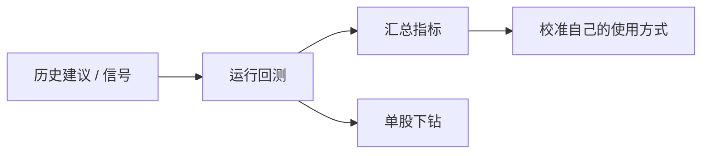

# 09 回测

回测页用于评估**历史 AI 建议**事后表现，帮助你感受「系统过去偏乐观还是偏保守」。它**不是**完整的量化回测平台（没有复杂滑点引擎、组合优化器等替代品定位）。

> 💡 **阅读目标**  
> 用后验结果校准信任，而不是用短期胜率决定下一笔交易。样本少时，数字可以看，但不要当真理。

## 适用场景

| 场景 | 建议做法 |
| --- | --- |
| 用了一段时间，想自我复盘 | 选一段有足够已完成建议的日期范围再跑 |
| 只关心某只股票 | 限定代码后下钻单股表现 |
| 刚开始用 | 可以先跳过；等信号与报告积累后再来 |
| 与信号中心配合 | 信号中心偏「单条生命周期」；回测偏「批量事后统计」 |

## 操作步骤

1. 进入回测相关页面（导航位置以当前版本为准；也可从日常工作流入口进入）。  
2. （可选）限定股票或分析日期范围。  
3. 点击运行回测。  
4. 查看结果列表与汇总指标。  
5. 可下钻单股表现。

## 如何理解指标

| 概念 | 含义 | 小白注意 |
| --- | --- | --- |
| **方向准确率** | 涨跌方向是否与建议一致 | 震荡市可能看起来「很差」或「很偶然」 |
| **胜率** | 有明确胜负结果时的胜负比 | 先看样本数，再看百分比 |
| **模拟收益** | 按规则模拟执行后的收益参考 | 未计入你的真实滑点、税费与情绪 |
| **止盈 / 止损触发率** | 计划价位是否曾触及 | 有计划的信号才有意义 |

> ⚠️ **冷却与样本**  
> 过新的记录可能仍在冷却窗口内，不会纳入。无结果时请阅读页面诊断（样本不足、日期范围过窄、无可评估期限等）。

## 建议配置

| 项目 | 新手建议 |
| --- | --- |
| 日期范围 | 先覆盖你真实使用过的几周，而不是「从项目诞生到今天」 |
| 标的 | 先不限制，看整体；再对重点股下钻 |
| 解读 | 同时看「方向」与「样本数」两列 |

## 使用案例

**案例 A：周末 15 分钟复盘**  
1. 不限股票，选择最近 30 天。  
2. 运行回测，先看样本数是否 > 20。  
3. 若方向准确率波动很大，回到信号中心检查是否多数是 `watch` 或盘中未完成日线阶段。  
4. 调整自己的习惯：减少无意义连跑，而不是立刻换模型「赌」下一笔。

**案例 B：单股信任校准**  
对长期跟踪的一只股票限定代码 → 看建议是否来回翻烧饼 → 结合 [08 阅读报告](08-reading-reports.md) 的历史趋势一起看。

## 与信号后验的区别

| 能力 | 更适合 |
| --- | --- |
| 信号中心「再评估 / 统计」 | 围绕 Decision Signal 生命周期与 outcome 引擎 |
| 本回测页 | 面向历史建议的批量事后表现（以当前产品实现为准） |

两者都是研究工具；都**不构成**未来收益承诺。

## 相关

- [06 信号中心](06-signals.md)
- [08 阅读报告](08-reading-reports.md)
- [11 日常工作流](11-daily-workflows.md)

上一篇：[08 阅读报告](08-reading-reports.md) · 下一篇：[10 设置](10-settings.md)
