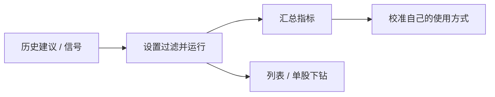

# 09 回测

## 页面入口与操作路径

| 方式 | 具体路径 |
| --- | --- |
| 主导航 | **研究** → **回测** |
| 命令面板 | 搜索「回测」「backtest」 |
| 直链路由 | `/research/backtest` |
| 旧链接 | `/backtest` 会重定向到研究下的规范路径（以当前路由表为准） |

回测页用于评估**历史 AI 建议**事后表现，帮助你感受「系统过去偏乐观还是偏保守」。它**不是**完整的量化回测平台（没有复杂滑点引擎、组合优化器等替代品定位）。

> 💡 **阅读目标**  
> 用后验结果校准信任，而不是用短期胜率决定下一笔交易。样本少时，数字可以看，但不要当真理。

> ⚠️ **研究免责**  
> 回测指标**不构成**未来收益承诺，也不是实盘成交记录。

## 适用场景

| 场景 | 建议做法 |
| --- | --- |
| 用了一段时间，想自我复盘 | 选一段有足够已完成建议的日期范围再跑 |
| 只关心某只股票 | 用代码过滤后下钻 |
| 刚开始用 | 可以先跳过；等信号与报告积累后再来 |
| 与信号中心配合 | 信号中心偏单条生命周期；本页偏批量事后统计 |

## 页面参数（可收藏筛选）

| 查询参数 | 含义 | 备注 |
| --- | --- | --- |
| `code` | 限定股票代码 | 如 `code=600519` |
| `window` | 回看窗口（天） | 有上限（实现中常见上限约 120 天，以界面为准） |
| `from` / `to` | 日期范围 | 与 window 二选一或组合，以页面控件为准 |
| `phase` | 市场阶段过滤 | `all` / `premarket` / `intraday` / `postmarket` / `unknown` 等 |
| `page` | 分页 | 结果列表翻页 |

示例：`/research/backtest?code=AAPL&window=30&phase=all`

## 操作步骤

1. 进入 **研究 → 回测**（`/research/backtest`）。  
2. （可选）填写股票代码、窗口天数或起止日期、阶段过滤。  
3. 点击运行 / 查询回测（按钮文案以界面为准）。  
4. 查看汇总指标与结果列表。  
5. 下钻单股或单条建议（若提供）。  
6. 无结果时阅读页面诊断，而不是反复狂点。

## 如何理解指标

| 概念 | 含义 | 小白注意 |
| --- | --- | --- |
| **方向准确率** | 涨跌方向是否与建议一致 | 震荡市可能很差或很偶然 |
| **胜率** | 有明确胜负时的比例 | **先看样本数** |
| **模拟收益** | 按规则模拟的收益参考 | 未计入你的真实滑点、税费与情绪 |
| **止盈 / 止损触发率** | 计划价位是否曾触及 | 没有价位计划的信号参考意义弱 |
| **无法评估** | 数据不足、期限未到、冷却中等 | 正常桶，不是系统坏了 |
| **阶段（phase）** | 建议产生时的盘前 / 盘中 / 盘后等 | 盘中建议与收盘后建议不好直接比 |

> ⚠️ **冷却与样本**  
> 过新记录可能仍在冷却窗口内，不会纳入。无结果时请读诊断：样本不足、日期过窄、无可评估期限、代码无历史等。

## 建议配置

| 项目 | 新手建议 |
| --- | --- |
| 日期 / 窗口 | 先覆盖你真实用过的几周，而不是「从宇宙大爆炸到今天」 |
| 标的 | 先不限制看整体，再对重点股加 `code` |
| 阶段 | 新手先用 `all` |
| 解读 | 同时看「方向」与「样本数」 |

## 术语表

| 术语 | 解释 |
| --- | --- |
| **回测（本产品语境）** | 对**已产生的 AI 建议**做事后验证，不是任意编写交易策略的回测 IDE |
| **window** | 回看天数窗口 |
| **phase** | 市场阶段过滤 |
| **样本数** | 参与统计的建议条数；过小则百分比无意义 |
| **冷却窗口** | 新产生记录暂不纳入评估的时间缓冲 |
| **outcome** | 后验结果对象；信号中心也有 outcome 引擎，口径可能不同 |

## 使用案例

**案例 A：周末 15 分钟复盘**  
1. 打开 `/research/backtest?window=30&phase=all`。  
2. 运行后先看样本数是否大致 > 20。  
3. 若方向准确率剧烈波动，到信号中心检查是否大量 `watch` 或盘中阶段。  
4. 调整习惯：减少无意义连跑，而不是立刻换模型赌下一笔。

**案例 B：单股信任校准**  
`/research/backtest?code=600519&window=60` → 看建议是否来回翻烧饼 → 结合 [08 阅读报告](08-reading-reports.md) 历史趋势。

**案例 C：刚装好就打开**  
几乎无历史 → 空状态或样本为 0 → **正常**。先去工作台积累报告与信号，两周后再来。

## 与信号中心后验的区别

| 能力 | 入口 | 更适合 |
| --- | --- | --- |
| 信号中心「再评估与统计」 | `/signals?tab=review` | Decision Signal 生命周期与 outcome 引擎 |
| 本回测页 | `/research/backtest` | 历史建议批量事后表现（以当前实现为准） |

两者都是研究工具；都**不构成**未来收益承诺。设置中的 **回测 → 引擎** 分类可能提供引擎级开关，属进阶配置。

## 相关

- [06 信号中心](06-signals.md)
- [08 阅读报告](08-reading-reports.md)
- [10 设置](10-settings.md)
- [11 日常工作流](11-daily-workflows.md)

上一篇：[08 阅读报告](08-reading-reports.md) · 下一篇：[10 设置](10-settings.md)
