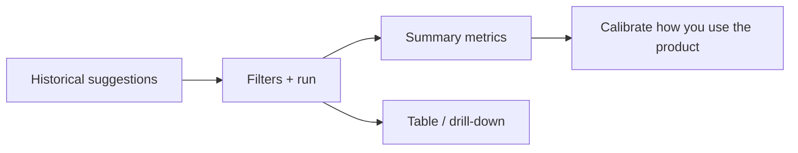

# 09 Backtest

## Entry points and paths

| Method | Path |
| --- | --- |
| Primary nav | **Research** → **Backtest** |
| Command palette | “backtest” |
| Route | `/research/backtest` |
| Legacy | `/backtest` redirects to the canonical research path when configured |

This page scores **historical AI suggestions** after the fact. It is **not** a full quant backtester (no full slippage engine / portfolio optimizer product claim).

> ⚠️ Research only — metrics are **not** promises of future returns.

## When to use

| Scenario | Approach |
| --- | --- |
| After weeks of use | Window with enough completed suggestions |
| One symbol | Filter by `code` |
| Brand new install | Skip until you have history |
| With Signal Center | Center = single lifecycle; here = batch scorecard |

## Query params (bookmarkable filters)

| Param | Meaning | Notes |
| --- | --- | --- |
| `code` | Symbol filter | e.g. `code=600519` |
| `window` | Lookback days | UI enforces a max (often ~120) |
| `from` / `to` | Date range | Per page controls |
| `phase` | Session phase | `all` / `premarket` / `intraday` / `postmarket` / `unknown` … |
| `page` | Pagination | Result pages |

Example: `/research/backtest?code=AAPL&window=30&phase=all`

## Steps

1. Open **Research → Backtest**.  
2. Optional: code, window/dates, phase.  
3. Run / query.  
4. Read summary + table.  
5. Drill into a symbol/row if offered.  
6. On empty results, read diagnostics — do not spam the button.

## Reading metrics

| Concept | Meaning | Caution |
| --- | --- | --- |
| **Directional accuracy** | Direction matched suggestion | Choppy markets look random |
| **Win rate** | When a win/loss is defined | **Sample size first** |
| **Simulated return** | Rule-based reference | Not your fees/slippage/emotions |
| **TP/SL touch rate** | Plan prices hit | Needs a plan |
| **Not evaluable** | Too new, missing data, cooling | Normal bucket |
| **phase** | Premarket / intraday / post | Don’t mix phases blindly |

> ⚠️ New rows may sit in a **cooldown** and stay out of stats.

## Beginner defaults

| Item | Suggestion |
| --- | --- |
| Window | Weeks you actually used the product |
| Symbol | All first, then `code` |
| Phase | `all` |
| Interpretation | Accuracy **and** sample count |

## Glossary

| Term | Meaning |
| --- | --- |
| **Backtest (here)** | Post-hoc scoring of **produced** AI suggestions |
| **window** | Lookback length in days |
| **phase** | Market session filter |
| **Sample size** | Count of evaluated suggestions |
| **Cooldown** | New items temporarily excluded |
| **outcome** | Evaluation object; Signal Center has a related engine with its own defaults |

## Use cases

**A — Weekend 15 minutes**  
`window=30&phase=all` → require decent sample count → if accuracy swings wildly, check for many `watch` or intraday-phase signals → change habits, not “model lottery”.

**B — Single-name trust**  
`code=600519&window=60` → flip-flopping? read report history ([08](08-reading-reports_EN.md)).

**C — Fresh install**  
Zero history → empty is expected. Accumulate Workbench reports first.

## vs Signal Center review

| Capability | Entry | Best for |
| --- | --- | --- |
| Signal Center review | `/signals?tab=review` | Decision Signal lifecycle / outcome engine |
| This page | `/research/backtest` | Batch historical suggestion scorecard |

Settings → **Backtesting → Engine** may expose advanced engine toggles.

## Related

- [06 Signal Center](06-signals_EN.md)
- [08 Reading reports](08-reading-reports_EN.md)
- [10 Settings](10-settings_EN.md)
- [11 Daily workflows](11-daily-workflows_EN.md)

Prev: [08 Reading reports](08-reading-reports_EN.md) · Next: [10 Settings](10-settings_EN.md)
