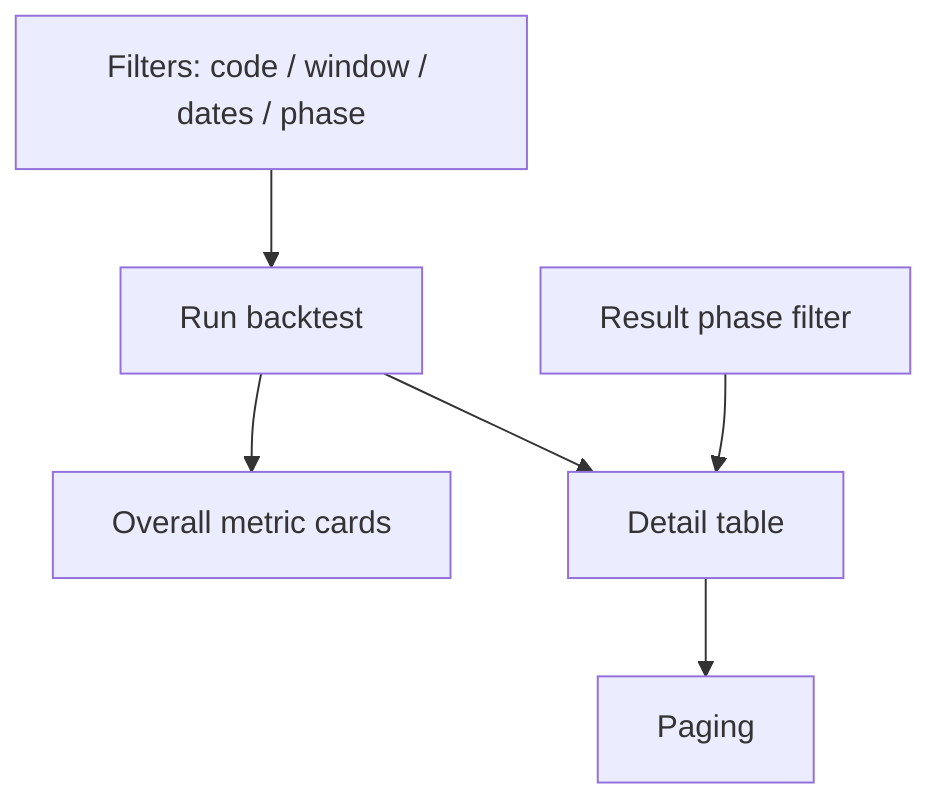
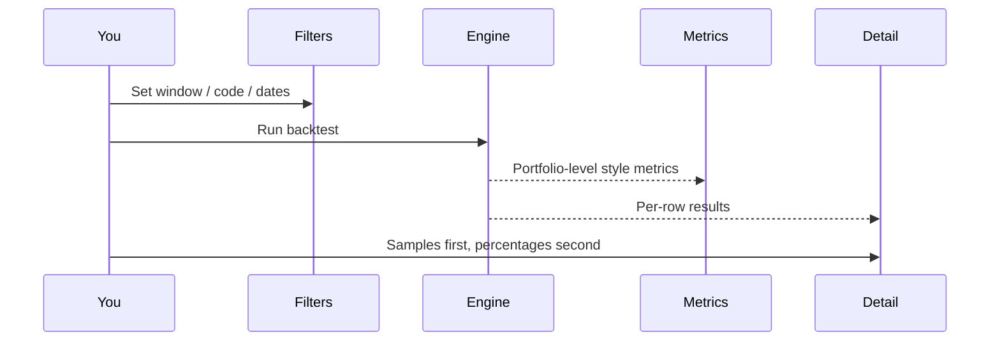
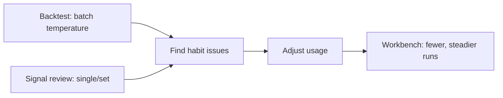

# 09 Backtest

## What you will learn

1. Treat this page as **post-hoc scoring of past AI suggestions**, not a full quant IDE  
2. Open `/research/backtest` with useful filters and URL parameters  
3. Run a standard backtest and read sample size before percentages  
4. Compare with Signal Center review and use results to adjust **habits**, not next-trade overconfidence  

This page calmly asks:

> Over a past window, did system AI suggestions look optimistic, conservative, or too thin to say anything?

| It is | It is not |
| --- | --- |
| Post-hoc evaluation of **already produced** historical suggestions | Full quant backtest IDE |
| Direction, win-rate style, simulated-return **research metrics** | Replay of your real broker fills |
| Help calibrating how much to trust suggestions | Future return promise |
| Batch view complementary to Signal Center review | Slippage, impact, portfolio optimizer |

> ⚠️ **Note**  
> Metrics are **not investment advice** and not future promises. With few samples, pretty percentages are stories first.

> 📘 **Concept**  
> The page title may say “strategy backtest,” but the substance is **post-hoc performance of historical AI analysis/suggestions**, not a full factor-strategy lab.

---

## 1. Entry

> 🧭 **Entry**

| Method | Path |
| --- | --- |
| Nav | **Research** → **Backtest** |
| URL | `/research/backtest` |
| Command palette | Try “backtest” |
| Legacy | `/backtest` typically redirects |

### 1.1 Bookmarkable parameters

```text
/research/backtest?code=600519&window=30&phase=all
```

| Parameter | Meaning | Notes |
| --- | --- | --- |
| `code` | One symbol only | Empty often means all (as shown) |
| `window` | Evaluation window in days | Common max **120**; positive integer |
| `from` / `to` | Analysis date range | ISO `YYYY-MM-DD` |
| `phase` | Session phase filter | `all` / `premarket` / `intraday` / `postmarket` / `unknown` |
| `page` | Results paging | Detail browsing |

> 💡 **Tip**  
> When URL and filters stay linked, browser back/forward often restores conditions—handy for weekend bookmarks.

---

## 2. When to visit

| Situation | Guidance |
| --- | --- |
| Stable use for weeks | **Worth it**; pick windows matching real use |
| Fresh install, almost no reports | **Skip**; zero samples are normal |
| One long-horizon name | Filter with `code` |
| With Signal Center post-hoc | Center = signal lifecycle; this page = batch stats |
| Want “proof” to go heavy | **Do not start here**—confirmation bias amplifier |

> ✅ **Recommended**  
> Accumulate real usage first; use results to adjust **when to trust / discount**.  
> ❌ **Avoid**  
> Extrapolating “80% accuracy = easy money” from under 10 samples; or same-day force re-run loops.

---

## 3. Page structure

> 🖼️ **Figure placeholder** · `assets/backtest-results-en.png`  
> **Capture**: Backtest filters + results (sample count and key metrics, or insufficient-sample message).  
> **Notes**: /research/backtest; ~30d window.  
> **Status**: pending — see [assets/PLACEHOLDERS.md](assets/PLACEHOLDERS.md)



| Area | Role |
| --- | --- |
| Filter bar | Code, window, start/end, phase, 1-day verify, force re-run |
| Run | Submit backtest; show processing counts |
| Overall performance | Directional accuracy, win rate, avg simulated return, … |
| Results table | Per historical analysis: prediction vs realized |
| Result filters | Filter the table only—**typically does not re-run** (trust on-page hints) |

---

## 4. Tutorial: one standard run

1. Open `/research/backtest`.  
2. Optional: set code (e.g. `600519`); leave empty for all.  
3. Set **evaluation window** (e.g. 30). Window must be an integer in the allowed range (commonly 1–120).  
4. Optional dates; start cannot be after end.  
5. Phase: **all** unless you intentionally study postmarket-only suggestions.  
6. Click **Run backtest**.  
7. After completion, read **evaluated count / sample size** before accuracy or win rate.  
8. Drill details: AI prediction, realized path, direction match, win/loss/neutral, status.  
9. Empty results → read diagnostics (insufficient samples, narrow range, data gaps); avoid rapid re-click.



### 4.1 1-day verification

When offered:

- Check AI prediction against **next session close** behavior.  
- Setting window to `1` can serve a similar short-check purpose.  

Fit: quick “next-day direction feel.” Not a full holding-period study.

### 4.2 Force re-run

Use when cached results look wrong or you bulk-added historical analyses. Everyday review does not need force every time.

---

## 5. How to read metrics

| Metric | Meaning | Reading note |
| --- | --- | --- |
| **Directional accuracy** | Direction matched suggestion lean | Choppy markets look random |
| **Win rate** | Share of clear win/loss buckets | **Sample size first** |
| **Avg simulated return** | Rule-based reference | Ignores your friction and emotion |
| **Avg stock return** | Underlying interval return reference | Not the same as “suggestion quality” |
| **Stop / target hit rates** | Whether plan prices were touched | Weak when plans were never written |
| **Avg days to hit** | Timing feel to trigger | Unstable on thin samples |
| **Win / loss / neutral** | Outcome distribution | Large neutral bucket → do not only brag win rate |
| **Phase distribution** | Premarket/intraday/postmarket mix | Intraday suggestions are noisier |

### 5.1 Status and result labels

| Label direction | Meaning |
| --- | --- |
| completed | Evaluation finished |
| insufficient | Missing quotes or cannot evaluate |
| error | Row failed—do not blend into win-rate brag |
| win / loss / neutral | Outcome buckets |
| up / down / flat | Realized price-move labels |
| direction match yes/no | Prediction vs realized direction |

> 💡 **Tip**  
> Very new rows may still be in a **cooldown window**—protection, not laziness.

> ❌ **Avoid**  
> Screenshot only “directional accuracy.” Include **sample count, window, phase, and date range**.

---

## 6. vs Signal Center review

| | Signal Center review | This backtest page |
| --- | --- | --- |
| Entry | `/signals?tab=review` | `/research/backtest` |
| Best for | Decision Signal lifecycle / outcome | Batch post-hoc of historical analysis suggestions |
| Grain | Signal assets | Analysis records × window |
| Typical question | “How did this signal fare?” | “How did last 30 days of suggestions look overall?” |

Use both as research tools:



Settings **Backtest → engine** (`/settings` backtesting section) is advanced defaults—daily users can leave defaults.

---

## 7. Use cases

**A — Weekend 15 minutes** — `/research/backtest?window=30&phase=all` → sample size → if rates jump, check watch-heavy or intraday mix in signals → adjust habits (discount intraday finality; less chase in watch regimes) → **do not** swap models for luck.  
**B — Single-name trust** — `code=600519&window=60` → reversals? pair with Workbench history trend and [08](08-reading-reports_EN.md).  
**C — Fresh install** — empty is normal; accumulate reports first.  
**D — Postmarket only** — `phase=postmarket`, window 30–60; tiny sample → no conclusion.  
**E — 1-day vs 30-day** — short check then longer window; do not pick “whichever percentage is larger.”  
**F — With holdings** — if reduce-style suggestions look better ex-post → notes with `/portfolio` and `/signals?scope=holdings` — still **no auto trade**.  
**G — Metrics good, you still lose** — backtest ignores late entries, add-on emotion, slippage. Problem is often **execution and size**, not “need 90%.”

---

## 8. FAQ

**Q1: Evaluated count is 0?**  
Not enough history, dates too narrow, code filter too strict, or cooldown. Relax filters.

**Q2: Max window?**  
Commonly 120 days; trust validation messages.

**Q3: Does result phase filter re-run?**  
Usually **filters the table only**. Changing window/dates/force re-run recalculates.

**Q4: Directional accuracy and win rate diverge?**  
Different definitions (direction match vs P&L buckets). Interpret with samples and definitions—do not cherry-pick the prettier one.

**Q5: Can I backtest real fills?**  
This page is not broker trade replay. Bookkeeping is [07 Portfolio](07-portfolio_EN.md).

**Q6: Does force re-run make it more accurate?**  
No magic—recalculates. Quality depends on historical suggestions and market regime.

**Q7: Is this investment advice?**  
**No.** Research calibration only.

---

## 9. Self-check

| # | Item | Pass |
| --- | --- | --- |
| 1 | Samples | Count before percentages |
| 2 | Window | Matches real usage horizon |
| 3 | Phase | Intraday noise acknowledged |
| 4 | Code filter | Added only when needed |
| 5 | vs review | Know division of labor |
| 6 | Action | Change habits, not all-in sizing |
| 7 | Sharing | Screenshots include samples and window |

---

## 10. Glossary

| Term | Meaning |
| --- | --- |
| Evaluation window | Days after suggestion to observe path |
| Directional accuracy | Share of matching predicted vs realized direction |
| Win rate | Share of win bucket (engine definition) |
| Simulated return | Rule replay reference, not live |
| Cooldown window | New rows temporarily excluded |
| 1-day verification | Next-close style short check |
| Force re-run | Ignore cache and recompute |
| phase | Premarket / intraday / postmarket / unknown |
| insufficient | Cannot evaluate for data reasons |
| outcome | Win / loss / neutral style post-hoc result |

---

## 11. Related

- [06 Signal Center](06-signals_EN.md)  
- [08 Reading reports](08-reading-reports_EN.md)  
- [03 Analysis Workbench](03-analysis-workbench_EN.md)  
- [07 Portfolio](07-portfolio_EN.md)  
- [11 Daily workflows](11-daily-workflows_EN.md)  
- [10 Settings](10-settings_EN.md) (backtest engine, advanced)  

Prev: [08 Reading reports](08-reading-reports_EN.md) · Next: [10 Settings](10-settings_EN.md)
