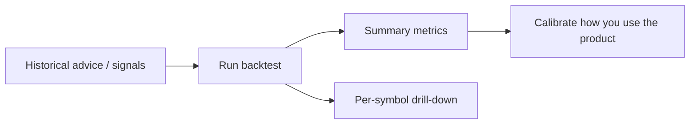

# 09 Backtest

The backtest view evaluates **historical AI suggestions** after the fact. It helps you sense whether the system has been optimistic or conservative — it is **not** a full quantitative backtesting platform (no complex slippage engine or portfolio optimiser positioning).

> 💡 **Reading goal**  
> Calibrate trust with outcomes; do not size the next trade from a short win-rate spike. Thin samples are informative only as anecdotes.

## When to use it

| Scenario | Suggested approach |
| --- | --- |
| You have used the product for a while | Pick a date range with enough completed suggestions |
| One symbol focus | Filter the symbol and drill down |
| Brand new user | Skip until reports and signals accumulate |
| With Signal center | Signals track single-item lifecycle; backtest is batch post-hoc stats |

## Steps

1. Open the backtest page (navigation label may vary by version).  
2. Optionally limit symbols or analysis dates.  
3. Run the backtest.  
4. Read the summary metrics and result list.  
5. Drill into single-symbol performance when needed.

## How to read metrics

| Concept | Meaning | Beginner note |
| --- | --- | --- |
| **Direction accuracy** | Whether price direction matched the suggestion | Choppy markets can look random |
| **Win rate** | Wins among resolved outcomes | Check sample size before the percentage |
| **Simulated return** | Rule-based paper execution reference | Ignores your real slippage, tax, and behaviour |
| **TP / SL touch rate** | Whether planned levels were touched | Only meaningful when a plan existed |

> ⚠️ **Cooldown and samples**  
> Very new rows may still be inside a cooldown window. Empty results usually include an on-page diagnosis (too few samples, narrow dates, non-evaluable horizons).

## Recommended settings

| Item | Beginner suggestion |
| --- | --- |
| Date range | Cover the weeks you actually used the product |
| Symbol filter | Start unrestricted, then drill your focus names |
| Interpretation | Always pair the rate with the sample count |

## Use cases

**A — 15-minute weekend review**  
Last 30 days, all symbols → require a reasonable sample → if accuracy swings wildly, check how many suggestions were `watch` or intraday partial bars → change habits (fewer spam re-runs), not just the model.

**B — Trust calibration on one name**  
Filter one long-followed symbol → see whether advice flip-flops → read together with history trend on the report page.

## Versus signal outcomes

| Surface | Better for |
| --- | --- |
| Signal center review / stats | Decision Signal lifecycle and outcome engine |
| This backtest page | Batch post-hoc performance of historical advice (as implemented) |

Both are research tools; neither promises future returns.

## Related

- [06 Signal center](06-signals_EN.md)
- [08 Reading reports](08-reading-reports_EN.md)
- [11 Daily workflows](11-daily-workflows_EN.md)

Previous: [08 Reading reports](08-reading-reports_EN.md) · Next: [10 Settings](10-settings_EN.md)
