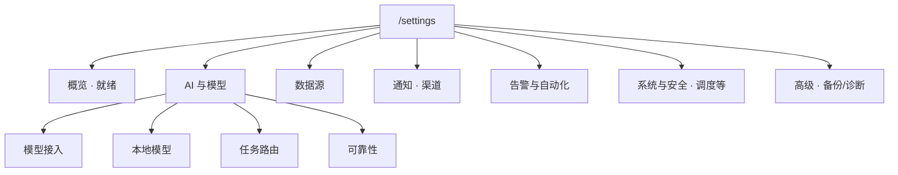
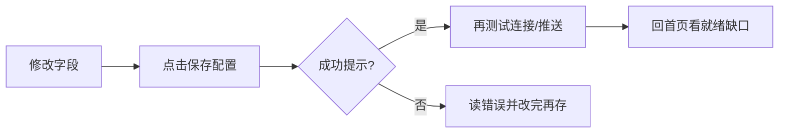
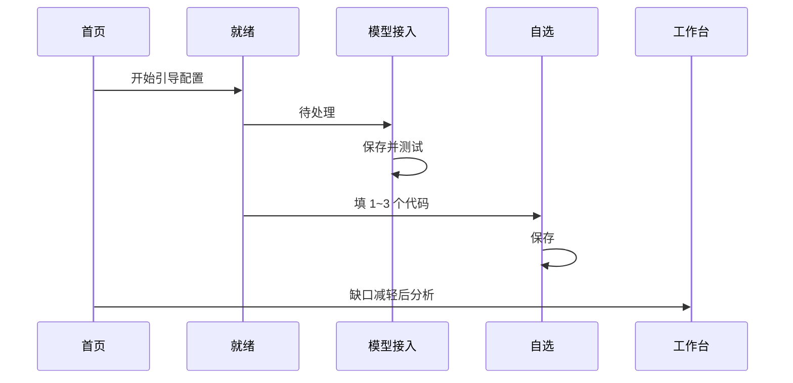
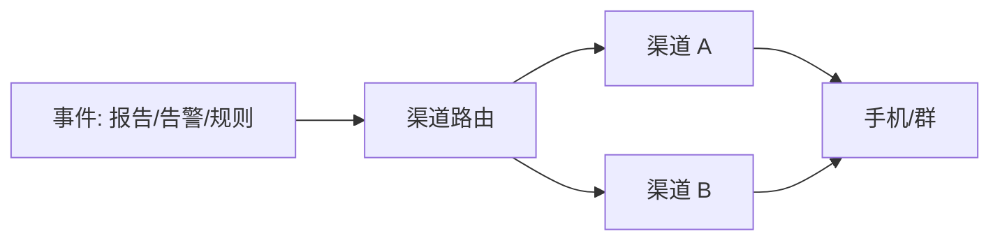
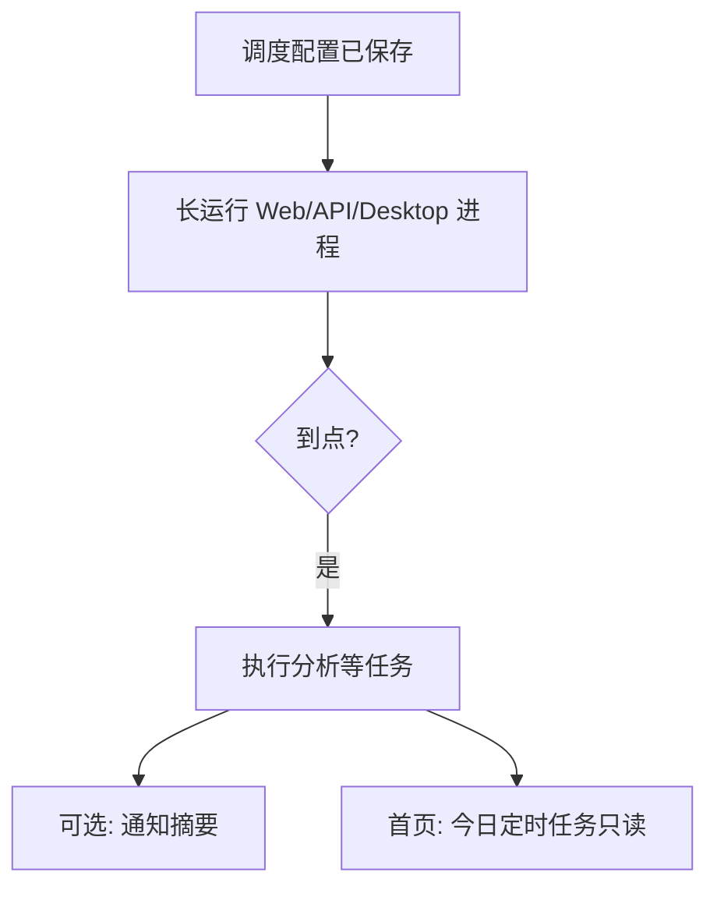
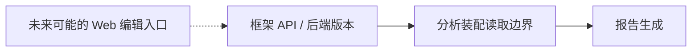

# 10 设置

设置项很多，上手时优先完成这三项：

1. **模型能连上**（否则没有报告）；  
2. **自选股有几个代码**（否则不知道分析谁）；  
3. **（可选）通知渠道能测通**（否则规则响了你收不到）。

其它项目，等主链路跑通再慢慢加，完全来得及。

> 💡 **提示**  
> 这一章只讲 **界面怎么点**。申请云厂商账号、服务器端口、Docker 映射，请看 [完整指南](../full-guide.md) 与 [客户端安装](../beginner-client-setup.md)。  
> 字段级「是什么 / 怎么填」字典见 [14 设置字段速查](14-settings-fields.md)。

> ⚠️ **注意**  
> 改完配置后，请养成习惯：**先保存，再测试，再离开**。只改输入框不点保存，是新手最常见的「明明填了却还提示未完成」。  
> 密钥不要截图外传；产品输出仅供研究，**不构成投资建议**。

> 🧭 **入口**  
> 侧栏 **设置** · 地址 `/settings` · 首页「开始引导配置」· 深链如 `/settings?section=ai_models&view=connections`

---

## 1. 设置页的信息架构

左侧是 **分段（section）**，有的分段还有 **子视图（view）**。新手模式可能把高级项藏起来——若找不到某项，看看是否要切换到完整 / 专业列表。

### 1.1 分段速查（界面常见顺序）

| 分段 | 典型 view | 你什么时候需要 |
| --- | --- | --- |
| **概览** | 就绪状态 | 第一次配置、查缺口 |
| **AI 与模型** | 总览 / 模型接入 / 本地模型 / 任务路由 / 可靠性 | 出报告、问股 |
| **数据源** | 行情与资讯 / 情报源 / 数据提供方 | 增强新闻与行情 |
| **Agent 行为** | 执行 | 调整 Agent 边界（进阶） |
| **对话** | 上下文 | 问股很长、压缩策略 |
| **报告** | 输出 | 报告语言等输出相关 |
| **告警与自动化** | 推送路由 / 行为与频控 / 事件监控 | 通知行为、频控 |
| **通知** | 渠道 | Webhook / Bot 等 |
| **用量与成本** | （独立用量页感） | 看 token / 花费 |
| **回测** | 引擎 | 回测默认（进阶） |
| **系统与安全** | 调度 / 系统设置 / 服务与日志 / 认证 / 版本 | 定时任务、登录、更新 |
| **高级** | 后端状态 / 配置备份 / 诊断等 | 导出、排障 |

> 📘 **概念（进阶）**  
> 设置页左侧是 **分段**，部分分段下还有 **子视图**。收藏链接时可能看到 URL 参数 `section`、`view`——它们只是页面定位，日常使用点左侧名称即可。

### 1.2 常用深链

| 深链 | 打开什么 |
| --- | --- |
| `/settings` | 默认设置入口 |
| `/settings?section=ai_models&view=connections` | 模型接入 |
| `/settings?section=ai_models&view=local_models` | 本地模型 |
| `/settings?section=ai_models&view=task_routing` | 任务路由 |
| `/settings?section=notifications&view=channels` | 通知渠道 |
| `/settings?section=system_security&view=runtime` | 调度（历史 id 名 runtime） |
| `/settings?section=advanced` | 高级（备份等，view 以界面为准） |

---

## 2. 最重要的纪律：保存

> 🖼️ **配图占位** · `assets/settings-save-control-zh.png`  
> **应配内容**：设置页保存配置按钮所在工具条；若可复现，包含「有未保存修改」类提示。  
> **拍摄要点**：任意分段；高亮保存控件。  
> **状态**：待补图（清单：[assets/PLACEHOLDERS.md](assets/PLACEHOLDERS.md)）

请把设置页想象成一份表格：你填完格子，还需要「提交」。

| 好习惯 | 为什么 |
| --- | --- |
| 改完就保存 | 首页就绪检查读的是 **已保存** 配置 |
| 保存后再测试 | 避免测到旧草稿 |
| 留意「有未保存修改」 | 离开页面可能会丢草稿 |
| 部分自动保存 | 等到「已自动保存」再走 |
| 冲突时先读提示 | 服务器与本地草稿不一致时，明确选保留哪边 |

保存按钮常在顶部或底部工具条；窄屏请滚动找一次，别改了半天没提交。

> ✅ **推荐做法**  
> 一次只改一个主题（例如只配模型），保存 → 测试 → 再改下一主题。  
> ❌ **不推荐**  
> 同时改模型、通知、调度十几个字段，失败时不知道哪一步坏了。

---

## 3. 第一次配置：跟着就绪检查走

> 🧭 **入口**  
> 设置 **概览 → 就绪状态**，或首页 **开始引导配置**。

### 3.1 分步教程

1. 打开设置，或从首页点 **开始引导配置**。  
2. 看 **概览 / 就绪**：哪些是「待处理」，哪些是「已配置」。  
3. 优先点开待处理项，通常是 **AI 与模型** 和 **自选**。  
4. 每一处改完都 **保存**。  
5. 模型：保存后 **测试连接**（或 JSON 冒烟，以按钮为准）。  
6. 若有 **简短试跑**，在基础项齐全后点一次，验证最小链路。  
7. 回首页，确认缺口提示消失或明显减轻。  
8. 去工作台跑 **一只** 你熟悉的股票，形成第一份报告。

> 💡 **提示**  
> 就绪检查是「最小可分析」清单，不是「配完世界上所有 Key」。新闻、多渠道通知、调度都可以第二周再加。

---

## 4. AI 与模型：让报告「生得出来」

> 🖼️ **配图占位** · `assets/settings-model-connections-zh.png`  
> **应配内容**：AI 与模型 → 模型接入：服务列表或添加模型服务入口。  
> **拍摄要点**：**必须遮罩 API Key**；可用空列表或演示名。  
> **状态**：待补图（清单：[assets/PLACEHOLDERS.md](assets/PLACEHOLDERS.md)）

### 4.1 模型接入（你最该先会的）

路径：`/settings?section=ai_models&view=connections`

1. 进入 **AI 与模型 → 模型接入**。  
2. **添加模型服务**，选 Anspire Open、AIHubMix、OpenAI 兼容或本地 Ollama 等（以列表为准）。  
3. 粘贴 **API Key**；若需要，填 **Base URL**（兼容接口常以 `/v1` 结尾）。  
4. **获取模型** 并勾选，或手动填控制台已开通的模型名。  
5. 指定 **主分析模型 / 主要模型**（写个股 / 大盘报告时默认用它）。  
6. 需要的话，再指定 **问股 / Agent 模型**（可以先与主模型相同）。  
7. 可选：配置 **备用模型**（主模型失败时按序尝试）。  
8. **保存** → **测试连接**（或 JSON 冒烟）。  

看到测试成功，你已经跨过最大的门槛。

| 概念 | 含义 |
| --- | --- |
| API Key | 访问模型服务的钥匙 |
| Base URL | 兼容接口的服务地址根路径 |
| 主分析模型 | 写报告默认用的模型 |
| Agent 模型 | 问股等 Agent 场景，可继承主模型 |
| 备用模型 | 主模型失败时的云端 / 连接级后备 |
| Vision 模型 | 图片理解任务（若使用相关能力） |

> ⚠️ **注意**  
> 「备用模型」≠「备用生成方式」。前者是模型列表后备；后者是本地 CLI 失败后是否回退默认模型配置（见任务路由）。

### 4.2 本地模型

路径：`view=local_models`

在 **本地模型** 子视图可浏览推荐、拉取 / 注册、激活。桌面端可能自带或优先使用本机 Ollama。  
删模型时若提示受保护，请相信界面：有些目录模型不宜随意删除。

**模型包导入（部分版本 / 进行中的能力）**

若界面提供「导入模型包 / Import pack」一类入口：

1. 入口仍在 **AI 与模型 → 本地模型** 一带。  
2. 可导入版本化的本地模型包归档。  
3. 绑定快照后再激活。  
4. **是否出现以你安装的版本为准**；主分支若尚未包含该能力，请勿按不存在的按钮操作。  
5. 相关能力合入后，仍以屏幕文案与帮助为准。

> 📘 **概念**  
> 本地模型降低云端费用与数据外发顾虑，但 **不等于** 完全离线：行情、新闻、索引更新仍可能访问网络。问股工具在某些本地 CLI 路径下也可能不可用。

### 4.3 任务路由与生成方式（进阶，但很实用）

路径：`view=task_routing`

| 概念 | 含义 |
| --- | --- |
| 任务路由 | 不同类型的活（写报告、问股工具）走哪条后端 |
| 默认模型配置 | 最省心的日常选择 |
| 本地 CLI 生成 | 实验能力：用本机命令行程序生成 |
| 备用生成方式 | 本地 CLI 失败后，是直接报错还是再试云端默认配置 |

> ✅ **推荐做法**  
> 新手保持「默认模型配置」。  
> ❌ **不推荐**  
> 还没搞懂 CLI 登录与权限就切本地生成，然后误以为「软件坏了」。

### 4.4 可靠性

超时、重试、并发之类。没有明确故障时，**保持默认** 就好。乱加大并发可能把本地 CLI 或限流配额打爆。

### 4.5 用量与成本

在 **用量与成本** 分段查看 token / 花费趋势（展示以版本为准）。  
用来回答：「钱花在批量 detailed 了，还是问股长对话了？」

---

## 5. 自选股：告诉系统你关心谁

自选股列表（常在基础 / 就绪相关配置里，字段名可能是「自选股列表」）是手动分析、定时任务和许多通知的基础输入。

### 5.1 怎么填更省事

- 推荐英文逗号：`600519,hk00700,AAPL`  
- 从表格粘贴时，中文逗号、顿号、空格、换行也常能识别，保存后会规范成英文逗号。  
- 先写 **1～3** 个你认识的代码，比一上来贴 200 个更友好。  
- 个股工作区 `/stocks/:code` 的 **加入自选** 也会写入同一套列表逻辑（以后端为准）。

### 5.2 自选 vs 持仓 vs 发现候选

| 列表 | 是什么 |
| --- | --- |
| **自选** | 你想跟踪 / 批量分析的代码 |
| **持仓** | 真实或模拟账户里的数量与成本 |
| **发现候选** | 一次性短名单，不会自动变自选 |

改完请 **保存**。之后首页、批量分析、部分通知范围都会读这份列表。

> ⚠️ **注意**  
> 自选过长会让定时任务与批量分析又慢又贵。宁可短列表 + 高质量报告。

---

## 6. 数据源：锦上添花，但很有用

| 子视图 | 你在配什么 |
| --- | --- |
| 行情与资讯 | 增强行情、新闻搜索 Key、Tushare / TickFlow 等 |
| 情报源 | 社区 / 情报类，多半默认关 |
| 数据提供方 | Provider 状态与插件 |

不配新闻，也常常能跑出 **偏技术面** 的基础分析；但舆情、事件、催化会变薄。  
用 Anspire 时，有时同一个 Key 也能兼顾新闻相关能力（以界面字段为准）；用其它聚合平台时，可能需要 SerpAPI / Tavily 等。

> 💡 **提示**  
> 报告里「新闻 missing」时，先回这里查搜索 Key 与网络，再重跑同一代码对比数据上下文。

AlphaSift 相关开关也可能出现在数据源或专用卡片：默认常关；开启后 Web 会检查后端适配层。详见字段速查与 [12 发现](12-discover.md)。

---

## 7. 通知与告警

> 🖼️ **配图占位** · `assets/settings-notification-cards-zh.png`  
> **应配内容**：通知渠道卡片列表，含已配置/未配置状态。  
> **拍摄要点**：无真实 Webhook/Token；可只展示卡片外壳。  
> **状态**：待补图（清单：[assets/PLACEHOLDERS.md](assets/PLACEHOLDERS.md)）

### 7.1 通知 → 渠道

路径：常为 `/settings?section=notifications&view=channels`

设置里的通知区通常以 **渠道卡片** 展示（企业微信、飞书、Telegram、Discord、邮件、钉钉、自定义 Webhook 等，以界面列表为准）：

1. 先只开 **一个** 你每天会看的渠道。  
2. 点开卡片，填 Webhook / Bot Token / Chat ID 等字段。  
3. 卡片上会显示大致是否「已配置 / 未配置」。  
4. 用 **测试推送** 验证（有的测试走当前草稿且不落库——看按钮旁说明）。  
5. **保存配置**。通了再加第二个渠道。

还可配置 **通知渠道路由**（哪类事件走哪些渠道）。字段说明见 [14](14-settings-fields.md) 或字段旁帮助。

### 7.2 通知渠道插件

部署侧可挂载额外通知渠道插件（示例见仓库 `examples/plugins/example-notification-channel/`）。

- 界面是否单独列出插件渠道，取决于部署是否加载了对应插件。  
- 配置字段仍出现在通知 / 相关分类下。  
- 合同见 `docs/notifications.md`、`docs/plugin-extension-contract.md`。

> 📘 **概念**  
> 插件扩展的是 **送达通道**，不改变「信号不是自动下单」的产品边界。

### 7.3 告警与自动化

这里主要是 **推送路由、行为与频控、事件监控**（静默时段、冷却、限频等）。  
「价格到了提醒我」这类规则，在 [信号中心 → 规则](06-signals.md) 里建。

| 你想做的事 | 去哪里 |
| --- | --- |
| 配 Webhook / Bot | 设置 · 通知 · 渠道 |
| 哪类事件走哪渠 | 设置 · 告警路由 / 通知路由 |
| 夜里勿扰 | 行为与频控 · 静默时段 |
| 到价提醒规则 | `/signals?tab=rules` |
| 查有没有真正推出去 | 信号中心 · 推送历史 |

> ✅ **推荐做法**  
> 一个渠道测通 → 再建规则 → 再看推送历史。  
> ❌ **不推荐**  
> 一次开五个渠道却从不看历史，出问题无法定位。

---

## 8. 系统与安全 · 调度（定时任务）

> 🖼️ **配图占位** · `assets/settings-scheduling-zh.png`  
> **应配内容**：系统与安全 → 调度：启用开关、执行时间、下次执行或立即执行（以界面为准）。  
> **拍摄要点**：section=system_security&view=runtime；无生产密钥。  
> **状态**：待补图（清单：[assets/PLACEHOLDERS.md](assets/PLACEHOLDERS.md)）

路径：`/settings?section=system_security&view=runtime`（文案常为 **调度**）

在此可：

- 开启 / 关闭自动分析；  
- 设置每日执行时间（单点或多点，以字段为准）；  
- 查看下次执行；  
- 需要时 **立即执行一次**（以界面与权限为准）。

> ⚠️ **注意**  
> 保存后，需要 **长运行** 的 Web / API / Desktop 进程才会按点执行。  
> 进程睡了、容器停了、笔记本电脑合盖休眠了，到点都不会跑。

首页的 **今日定时任务** 只读展示当日运行情况，**不在这里改规则**。

更完整的任务类型（含研究简报、风险检查等）与 API 合同见 `docs/scheduled-tasks.md`。

### 8.1 调度小教程：收盘后分析 + 手机摘要

1. 自选维护好并保存。  
2. 调度设收盘后时间并保存。  
3. 通知开一个渠道并测通。  
4. 报告 / 事件路由到该渠道（可仅摘要，若选项支持）。  
5. 确认进程长运行。  
6. 次日首页看今日定时任务；手机看是否收到。  
7. 没消息时：推送历史 → 区分「没跑 / 跑了没推 / 被静默」。

---

## 9. 报告语言 vs 界面语言

| 设置 | 改什么 | 不改什么 |
| --- | --- | --- |
| 界面语言 | 按钮、菜单、空状态 | 报告正文语言 |
| 报告语言 | 分析报告等正文 | 菜单语言 |
| 主题 | 浅色 / 深色 | 业务逻辑 |

菜单可以 English，报告可以中文。  
产品 UI 支持多语言；手册多语言见 [i18n/README.md](i18n/README.md)。

报告输出相关项也可能在 **报告 → 输出** 分段，以界面为准。

---

## 10. 个人投资框架（当前以 API / 后端为主）

产品已提供 **版本化个人投资框架** 的后端与 API（创建、更新版本、启停、历史）。

**当前阶段通常没有完整的独立 Web 编辑页**；分析装配侧有稳定读取边界，但不等于界面上处处可见「已按你的框架执行」。

若后续版本在设置或其它页增加编辑入口，以界面为准。合同说明见 `docs/personal-investment-framework.md`。

> 💡 **提示**  
> 在完整 UI 出现前，不要假设「设置里某开关 = 已加载我的框架全文」。以文档与 API 状态为准。

---

## 11. 其它分段，用到再学

| 分段 | 什么时候才需要认真看 |
| --- | --- |
| 对话 · 上下文 | 问股很长、想调压缩策略时 |
| Agent 行为 | 要改 Agent 执行边界时（进阶） |
| 用量与成本 | 想知道钱 / token 花哪了 |
| 回测 · 引擎 | 改回测引擎默认（进阶） |
| 认证与安全 | 开启登录保护、修改管理员密码 |
| 服务与日志 | 日志级别、服务相关（排障） |
| 版本与更新 | 桌面端检查更新、确认构建号 |
| 高级 · 配置备份 | 重装前导出；出问题时导入 |
| 高级 · 诊断 / 后端状态 | 排障时给自己或协助者看 |

### 11.1 配置备份

- **导出**：留下一份已保存配置的备份。  
- **导入**：会覆盖备份里出现的键并重载；若有未保存草稿，会警告你。  

> ✅ **推荐做法**  
> 桌面端升级或重装前，先导出一次配置备份。  
> ❌ **不推荐**  
> 把含真实 Key 的备份提交到公开 Git 仓库或发到群文件。

### 11.2 认证与安全

开启登录保护后，未登录无法在未登录时修改配置。修改管理员密码后请妥善保存；锁死自己时按部署文档的恢复路径处理（不在本章展开运维细节）。

---

## 12. 离开页面时的提示

| 提示 | 意思 | 你该做什么 |
| --- | --- | --- |
| 有未保存修改 | 草稿还在 | 先保存或放弃 |
| 离开设置页？ | 你要走了，草稿可能丢 | 确认去留 |
| 放弃模型草稿？ | 模型表单还没存 | 存完再走或确认放弃 |
| 导入会覆盖草稿 | 导入优先覆盖 | 先导出当前若需要 |
| 配置冲突 | 服务器与本地不一致 | 明确选 server 或 local |

---

## 13. 使用案例

### 案例 A：今晚只想跑通第一份报告

就绪检查 → 模型接入添加一个云端服务 → 保存并测试成功 → 自选填 `600519` 并保存 → 回首页 → 去工作台分析。

### 案例 B：菜单英文、报告中文

界面语言切 English；报告语言保持 `zh`。打开报告确认正文仍是中文即可。

### 案例 C：规则会触发，手机没消息

通知渠道测试推送 → 修 Token → 保存 → 再看信号中心推送历史与冷却。

### 案例 D：问股不能用工具

任务路由 / 生成后端显示本地 CLI 限制 → 问股改走支持工具的云端路径，或换模型接入方式。

### 案例 E：要重装桌面端

高级 → 配置备份 → 导出 → 重装 → 导入 → 测连接 → 简短试跑。

### 案例 F：收盘后自动分析 + 手机摘要

自选维护好 → 调度设收盘后时间并保存 → 通知开一个渠道并测通 → 报告路由到该渠道（可仅摘要）→ 次日首页看今日定时任务。  
进程需要保持长运行，否则到点不会执行。

### 案例 G：夜里不想被推送吵醒

通知 / 告警 → 静默时段例如 `23:00-07:00` + 正确时区 → 保存。次日用推送历史区分「没触发」和「被静默」。

### 案例 H：主模型贵，想本地试水

本地模型拉取 / 激活 → 任务路由按界面说明尝试 → 问股若工具不可用，分析仍走云端或换回支持工具的路径。  
模型包 Import pack 仅在你的版本有按钮时使用。

### 案例 I：多渠道分流

渠道 A 收报告摘要，渠道 B 收告警（若路由支持）→ 先各测推送 → 再配渠道路由。不要一次开五个渠道却从不看历史。

### 案例 J：新闻上下文总是 missing

数据源 → 行情与资讯 → 配搜索 Key → 保存 → 同一代码重跑 → 看报告数据上下文是否变为 available。

### 案例 K：团队共用一台服务

认证与安全开启登录 → 每人不用共享管理员密码到聊天工具 → 密钥仍集中保管。

### 案例 L：回测引擎误触

回测 · 引擎改乱后，对照字段帮助恢复默认；日常回测页 `/research/backtest` 仍可用。

更多自动化与反模式：[11 日常工作流](11-daily-workflows.md)。

---

## 14. 常见问题（FAQ）

**Q1：填了 Key 仍提示未配置？**  
A：多半没点保存，或保存失败。看错误摘要与冲突提示。

**Q2：测试连接成功但分析失败？**  
A：可能是模型名未开通、额度不足、超时、或数据源问题。看任务错误原文。

**Q3：调度到点没跑？**  
A：检查开关、时间、时区、进程是否长运行、当日是否已有失败日志。

**Q4：测试推送有，真实报告没有？**  
A：查渠道路由、静默时段、冷却、任务是否真的完成、推送历史状态。

**Q5：本地模型是全离线吗？**  
A：一般不是。分析链路仍可能访问行情与新闻网络。

**Q6：个人投资框架在设置哪一项？**  
A：当前通常 **没有** 完整 Web 编辑页；见第 10 节与 API 文档。

**Q7：模型包导入按钮找不到？**  
A：可能版本尚未包含。不要按文档硬找不存在的控件。

**Q8：导入配置后 Key 变了？**  
A：导入会覆盖备份中的键。导入前先导出当前备份。

**Q9：新手模式少了很多项？**  
A：可能被折叠。切换完整列表或从深链进入具体 section。

**Q10：这是投资建议配置吗？**  
A：不是。设置只影响研究工具的连接与行为。

---

## 15. 离开前自检

| # | 自检项 | 通过标准 |
| --- | --- | --- |
| 1 | 保存 | 无未保存徽章 / 已成功提示 |
| 2 | 模型 | 测试连接成功 |
| 3 | 自选 | 至少 1 个熟悉代码已保存 |
| 4 | 首页就绪 | 关键缺口消失或可解释 |
| 5 | 通知（若需要） | 测试推送到达 |
| 6 | 调度（若需要） | 时间正确且进程长运行 |
| 7 | 备份 | 重大变更前已导出 |
| 8 | 密钥安全 | 未截图外传、未提交仓库 |

---

## 16. 术语

| 术语 | 含义 |
| --- | --- |
| API Key | 访问模型服务的钥匙，勿截图外传 |
| Base URL | 兼容接口的服务地址根路径 |
| 主分析模型 | 写报告默认用的模型 |
| 任务路由 | 哪种活走哪条后端 |
| 就绪 / 配置缺口 | 最小可分析还差什么 |
| 测试推送 | 发一条假消息验证渠道 |
| 通知渠道路由 | 哪类事件走哪些通知渠道 |
| 调度 | 按设定时间自动跑分析等任务 |
| 静默时段 | 不推送或降噪的时间窗 |
| 本地 CLI 生成 | 用本机命令行程序生成分析（实验） |
| 备用生成方式 | CLI 失败后是否回退默认模型配置 |
| 备用模型 | 主模型失败时的模型级后备 |
| 模型包 | 版本化本地模型归档（若 UI 支持导入） |
| 配置备份 | 导出 / 导入已保存配置 |
| 个人投资框架 | 版本化投资原则（当前偏 API） |
| 分段 / 子视图 | 设置页左侧导航；深链参数可能写作 section / view |

字段级说明：设置页字段旁的帮助，或 [14 设置字段速查](14-settings-fields.md)。

---

## 17. 相关阅读

- [02 首页](02-home.md)  
- [01 导航与顶栏](01-shell.md)  
- [03 分析工作台](03-analysis-workbench.md)  
- [06 信号中心](06-signals.md)  
- [09 回测](09-backtest.md)  
- [11 日常工作流](11-daily-workflows.md)  
- [12 发现](12-discover.md)  
- [14 设置字段速查](14-settings-fields.md)  
- [客户端安装](../beginner-client-setup.md)  
- [LLM 配置指南](../LLM_CONFIG_GUIDE.md)  
- [定时任务说明](../scheduled-tasks.md)  
- [个人投资框架](../personal-investment-framework.md)  
- [通知说明](../notifications.md)  

上一篇：[09 回测](09-backtest.md) · 下一篇：[11 日常工作流](11-daily-workflows.md)
