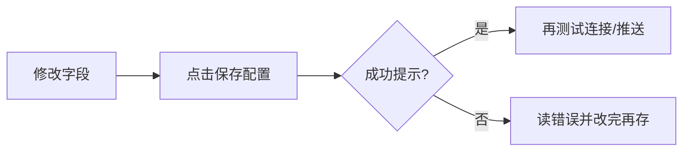

# 10 设置

设置项很多，上手时优先搞定这三件：

1. **模型能连上**（否则没有报告）；  
2. **自选股有几个代码**（否则不知道分析谁）；  
3. **（可选）通知渠道能测通**（否则规则响了你收不到）。

其它项目，等主链路跑通再慢慢加，完全来得及。

> 💡 这一章只讲 **界面怎么点**。申请云厂商账号、服务器端口、Docker 映射，请看 [完整指南](../full-guide.md) 与 [客户端安装](../beginner-client-setup.md)。

> ⚠️ 改完配置后，请养成习惯：**先保存，再测试，再离开**。只改输入框不点保存，是新手最常见的「明明填了却还提示未完成」。

---

## 怎么进入设置

| 方式 | 路径 |
| --- | --- |
| 侧栏 **设置** | 最常用 |
| 地址 `/settings` | 可收藏 |
| 首页「开始引导配置」 | 会进就绪检查，适合第一次 |
| 深链示例 | `/settings?section=ai_models&view=connections` |

左侧是 **分段**，有的分段还有 **子视图**。新手模式可能把高级项藏起来——若找不到某项，看看是否要切换到完整/专业列表。

---

## 最重要的纪律：保存

请把设置页想象成一份表格：你填完格子，还需要「提交」。

| 好习惯 | 为什么 |
| --- | --- |
| 改完就保存 | 首页就绪检查读的是已保存配置 |
| 保存后再测试 | 避免测到旧草稿 |
| 留意「有未保存修改」 | 离开页面可能会丢草稿 |
| 部分自动保存 | 等到「已自动保存」再走 |

保存按钮常在顶部或底部工具条；窄屏请滚动找一次，别改了半天没提交。

---

## 第一次配置：跟着就绪检查走

1. 打开设置，或从首页点 **开始引导配置**。  
2. 看 **概览 / 就绪**：哪些是「待处理」，哪些是「已配置」。  
3. 优先点开待处理项，通常是 **AI 与模型** 和 **自选**。  
4. 每一处改完都保存。  
5. 若有 **简短试跑**，在基础项齐全后点一次，验证最小链路。  
6. 回首页，确认缺口提示消失或明显减轻。

---

## AI 与模型：让报告「生得出来」

### 模型接入（你最该先会的）

1. 进入 **AI 与模型 → 模型接入**（`section=ai_models&view=connections`）。  
2. **添加模型服务**，选 Anspire Open、AIHubMix、OpenAI 兼容或本地 Ollama 等（以列表为准）。  
3. 粘贴 **API Key**；若需要，填 **Base URL**。  
4. **获取模型** 并勾选，或手动填控制台已开通的模型名。  
5. 指定 **主分析模型**（写个股/大盘报告时默认用它）。  
6. 需要的话，再指定 **问股 / Agent 模型**（可以先与主模型相同）。  
7. **保存** → **测试连接**（或 JSON 冒烟）。  

看到测试成功，你已经跨过最大的门槛。

### 本地模型

在 **本地模型** 子视图可浏览推荐、拉取/注册、激活。桌面端可能自带或优先使用本机 Ollama。  
删模型时若提示受保护，请相信界面：有些目录模型不能随便删。

### 任务路由与生成方式（进阶，但很实用）

| 概念 | 含义 |
| --- | --- |
| 任务路由 | 不同类型的活（写报告、问股工具）走哪条后端 |
| 默认模型配置 | 最省心的日常选择 |
| 本地 CLI 生成 | 实验能力：用本机命令行程序生成；**不等于完全离线**，且问股工具可能不可用 |
| 备用生成方式 | 本地 CLI 失败后，是直接报错还是再试云端默认配置 |

如果你只是想「主模型挂了换另一个云端模型」，请在连接里配置 **备用模型**，不要和「备用生成方式」搞混。

### 可靠性

超时、重试之类。没有明确故障时，**保持默认** 就好。

---

## 自选股：告诉系统你关心谁

自选股列表（常在基础/就绪相关配置里，字段名可能是「自选股列表」）是手动分析、定时任务和许多通知的基础输入。

**怎么填更省事：**

- 推荐英文逗号：`600519,hk00700,AAPL`  
- 从表格粘贴时，中文逗号、顿号、空格、换行也常能识别，保存后会规范成英文逗号。  
- 先写 1～3 个你认识的代码，比一上来贴 200 个更友好。

改完请保存。之后首页、批量分析、部分通知范围都会读这份列表。

---

## 数据源：锦上添花，但很有用

| 子视图 | 你在配什么 |
| --- | --- |
| 行情与资讯 | 增强行情、新闻搜索 Key 等 |
| 情报源 | 社区/情报类，多半默认关 |
| 数据提供方 | Provider 状态与插件 |

不配新闻，也常常能跑出 **偏技术面** 的基础分析；但舆情、事件、催化会变薄。  
用 Anspire 时，有时同一个 Key 也能兼顾新闻相关能力（以界面字段为准）；用其它聚合平台时，可能需要 SerpAPI/Tavily 等。

---

## 通知与告警：让提醒真的「叫得醒你」

### 通知 → 渠道

1. 只选 **一个** 你每天会看的渠道（企业微信/飞书 Webhook、Telegram、Discord、邮件等）。  
2. 填好 Token/Webhook/Chat ID。  
3. 点 **测试推送**（有的测试用的是当前草稿且不写入——请读按钮旁说明）。  
4. 成功后再 **保存**。  
5. 通了再考虑加第二个渠道。

### 告警与自动化

这里更多是 **推送路由、频控、事件监控**。  
「价格到了提醒我」这类规则本体，仍在 [信号中心 → 规则](06-signals.md) 里建。

---

## 报告语言 vs 界面语言（超容易混）

| 设置 | 改的是什么 | 不会改什么 |
| --- | --- | --- |
| 界面语言 | 按钮、菜单、空状态 | 报告正文语言 |
| 报告语言 | 分析报告等正文 | 菜单语言 |
| 主题 | 浅色/深色 | 任何业务逻辑 |

所以你可以：**菜单用英文，报告用中文**——两者独立。

产品界面可能有很多语言；本操作手册以简中 + 英文维护，见 [TRANSLATION.md](TRANSLATION.md)。

---

## 其它分段，用到再学

| 分段 | 什么时候才需要认真看 |
| --- | --- |
| 对话 · 上下文 | 问股很长、想调压缩策略时 |
| Agent 行为 | 要改 Agent 执行边界时（进阶） |
| 用量与成本 | 想知道钱/ token 花哪了 |
| 回测 · 引擎 | 改回测引擎默认（进阶） |
| 系统与安全 · 调度 | 想每天自动跑分析时 |
| 认证与安全 | 开启登录保护、修改管理员密码 |
| 版本与更新 | 桌面端检查更新、确认构建号 |
| 高级 · 配置备份 | 重装前导出；出问题时导入 |
| 高级 · 诊断 | 排障时给自己或给协助者看 |

### 调度（定时）

**当前 main 已提供。** 首页 **今日定时任务** 只读；改时间表请在本分段。

开启后，需要 **长运行** 的 Web/API/Desktop 进程才能按点执行。可看「下次执行」，也可「立即执行一次」（以权限与状态为准）。  
更偏实现的说明见 `docs/scheduled-tasks.md`。

### 配置备份

- **导出**：留下一份已保存配置的备份。  
- **导入**：会覆盖备份里出现的键并重载；若有未保存草稿，会警告你。  
桌面端升级或重装前，先导出一次配置备份。

---

## 离开页面时的提示

| 提示 | 意思 |
| --- | --- |
| 有未保存修改 | 先保存或放弃 |
| 离开设置页？ | 你要走了，草稿可能丢 |
| 放弃模型草稿？ | 模型表单还没存 |
| 导入会覆盖草稿 | 导入比本地未保存更优先覆盖 |

---

## 使用案例

### 案例 A：今晚只想跑通第一份报告

就绪检查 → 模型接入添加一个云端服务 → 保存并测试成功 → 自选填 `600519` 并保存 → 回首页 → 去工作台分析。

### 案例 B：菜单英文、报告中文

界面语言切 English；报告语言保持 `zh`。打开报告确认正文仍是中文即可。

### 案例 C：规则会触发，手机没消息

通知渠道测试推送 → 修 Token → 保存 → 再看信号中心推送历史与冷却。

### 案例 D：问股不能用工具

任务路由/生成后端显示本地 CLI 限制 → 问股改走支持工具的云端路径，或换模型接入方式。

### 案例 E：要重装桌面端

高级 → 配置备份 → 导出 → 重装 → 导入 → 测连接 → 简短试跑。

---

## 术语（白话）

| 术语 | 含义 |
| --- | --- |
| API Key | 访问模型服务的钥匙，勿截图外传 |
| Base URL | 兼容接口的服务地址根路径 |
| 主分析模型 | 写报告默认用的模型 |
| 任务路由 | 哪种活走哪条后端 |
| 就绪 / 配置缺口 | 最小可分析还差什么 |
| 测试推送 | 发一条假消息验证渠道 |

字段级说明在设置页点字段旁的帮助时，也会看到产品内嵌文案（与 `settingsHelp` 同源思路）。

---

## 与 main 对齐的功能状态（2026-07）

以下条目按 **当前 `origin/main`** 是否已合入来写。若你的运行版本较旧，仍以屏幕上是否出现入口为准。

| 能力 | main 状态 | 界面入口 | 手册怎么用 |
| --- | --- | --- | --- |
| **定时任务 / 调度** | **已合入** | 设置 → **调度与运行**（启用、每日时间、下次执行、立即执行一次）；首页 **今日定时任务** 只读列表 | 见上文「调度」与 [02 首页](02-home.md)；工程合同见 `docs/scheduled-tasks.md` |
| **通知渠道插件** | **已合入** | 设置 → 通知 / 数据源相关插件区（若本机构建启用了插件发现） | 先配好内置渠道并 **测试推送**；插件渠道以界面列表为准 |
| **个人投资框架** | **后端已合入**；**尚无完整 Web 编辑页** | 以 API / 工程文档为主，不要在操作手册里假装有完整设置 UI | 见 `docs/personal-investment-framework.md`（后端切片合同）；界面出现编辑页后再扩写分册 |
| **本地模型包导入** | **已合入** | 设置 → **AI 与模型 → 本地模型** 中的导入模型包 / Import Model Pack（文案以界面为准） | 目录拉取与激活仍可用；导入路径见 `docs/model-packs.md` 与界面帮助 |
| **HITL 人工审批** | **已合入**（默认关闭） | **不在一级侧栏**；路由 `/approvals`；首页 **查看人工审批** / **Review human approvals**；需已开启管理员登录 | 见 [01 壳层](01-shell.md)；合同 `docs/human-approvals.md`。这是风险否决的一次性例外审批，**不是**券商下单审批 |
| **报告证据分层** | **已合入** | 完整报告 Web 视图中的分层区块（标签以界面为准） | 见 [08 阅读报告](08-reading-reports.md)；合同 `docs/report-strata-contract.md` |
| **分析质量离线面板** | **已合入**（工程 / CI 夹具） | **无 Web 操作页**；`tests/fixtures/analysis_quality/` + 本地 runner | 贡献者见 `docs/analysis-quality-panel.md`；不要写成产品侧栏功能 |

> 已合入能力请用「当前 main 已提供」写法；仅当你的安装版本明显落后时，用「若界面没有该入口，请升级」一句带过。**不要**把已合入能力写成「未合并 / 即将上线」。

## 相关阅读

- [02 首页](02-home.md)  
- [01 壳层](01-shell.md)  
- [06 信号中心](06-signals.md)  
- [客户端安装](../beginner-client-setup.md)  
- [LLM 配置指南](../LLM_CONFIG_GUIDE.md)  

上一篇：[09 回测](09-backtest.md) · 下一篇：[11 日常工作流](11-daily-workflows.md)
