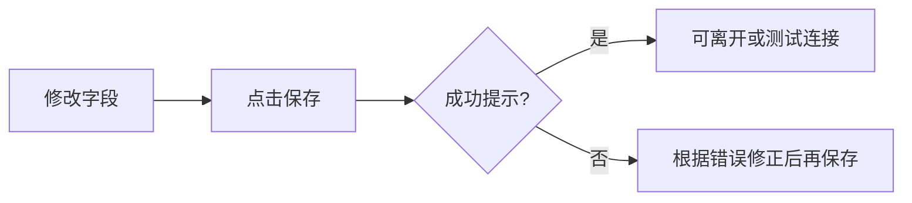

# 10 设置（界面操作）

路径：导航 **设置 / 系统设置**。

设置页是「让产品能跑起来」的控制台：模型、自选、通知、数据源、语言与主题等。**每改一组配置后请点击保存**，看到成功提示再离开页面。

> 💡 **这一章只讲界面怎么点**  
> 不讲如何在云厂商官网申请 Key、不讲 Docker 端口映射。那些请看 [完整指南](../full-guide.md) 与 [小白客户端安装](../beginner-client-setup.md)。

## 适用场景

| 场景 | 你要动哪些块 |
| --- | --- |
| 第一次打开 | AI 模型 + 自选股 |
| 报告是中文、菜单想英文 | 界面语言 vs 报告语言（两处独立） |
| 收不到推送 | 通知渠道 + 测试推送 |
| 舆情很空 | 新闻 / 搜索类 Key |
| 换电脑 / 重装 | 配置备份的导出 / 导入（桌面端尤其建议） |

## 保存纪律（最重要）

| 习惯 | 原因 |
| --- | --- |
| 改完就保存 | 未保存 = 首页仍可能显示配置缺口 |
| 保存后再「测试连接」 | 避免测的是旧配置 |
| 一次只改一类再保存 | 出问题时容易定位 |

> ⚠️ **保存按钮位置**  
> 常见在页面底部或顶部工具条。窄屏请先滚到底部找一次，避免改了却没提交。

## AI 与模型

1. 添加模型服务（如 Anspire、AIHubMix、OpenAI 兼容、本地 Ollama 等）。  
2. 粘贴 API Key，选择或拉取模型列表。  
3. 指定**主分析模型**；需要时单独指定问股 / Agent 模型。  
4. 使用 **测试连接**。  
5. 本地模型：在本地模型相关面板浏览、安装/注册后再选用（以客户端是否提供该面板为准）。

### 建议配置（新手）

| 项目 | 建议 |
| --- | --- |
| 先配几个服务 | **一个**稳定云端服务即可跑通 |
| 主模型 | 按服务商推荐的通用对话 / 分析模型 |
| 问股模型 | 可与主模型相同；额度紧时再拆分 |
| 温度等高级项 | 先保持默认 |

### 术语

| 术语 | 解释 |
| --- | --- |
| **API Key** | 访问模型服务的密钥；不要发到聊天群或截图公开 |
| **Base URL** | 兼容 OpenAI 接口时的服务根地址 |
| **主分析模型** | 生成个股报告时默认调用的模型 |
| **Agent / 问股模型** | 多轮对话使用的模型，可与主模型不同 |

## 基础与自选股

- 编辑自选股列表，多个代码用逗号分隔，例如 `600519,hk00700,AAPL`。  
- 保存后，首页与分析页的自选入口会更新。  
- 代码格式见 [03 分析工作台](03-analysis-workbench.md) 的格式表。

## 数据源与新闻

- 按需填写增强行情或搜索类 Key（Tushare、SerpAPI、Tavily 等）。  
- **不配新闻源仍可能完成基础技术分析**，但舆情、事件与催化因素质量会下降。  
- 免费行情源可零配置试用；稳定性不保证时再考虑 token 型数据源。

## 通知

1. 按渠道填写 Webhook、Bot Token、Chat ID、邮箱等字段。  
2. 使用页面上的 **测试推送**（若有）。  
3. 可调整报告详略、是否单股推送等行为项（以实际开关为准）。  
4. 告警类推送还依赖信号中心的规则是否启用。

| 渠道示例 | 你需要准备 |
| --- | --- |
| 企业微信 / 飞书 | 机器人 Webhook |
| Telegram | Bot Token + Chat ID |
| Discord | Webhook URL |
| 邮件 | 发件账号与授权方式 |

> 💡 **先保证「能收到」**  
> 不要一次开满所有渠道。先一个渠道测通，再按需增加。

## 语言、主题与其他

| 项目 | 说明 |
| --- | --- |
| **界面语言** | 导航、按钮、空状态；不自动改报告正文 |
| **报告语言** | 分析报告与部分通知中的报告文案；常见 `zh` / `en` / `ko` |
| **主题** | 浅色 / 深色，多保存在本机 |
| **管理员密码** | 若开启登录 |
| **用量与成本看板** | 观察模型消耗 |
| **配置备份** | 导入 / 导出；桌面端重装前建议导出 |

## 使用案例

**案例 A：从零到可分析**  
1. AI 与模型 → 添加一个云端服务 → 保存 → 测试连接成功。  
2. 自选股填入 `600519` → 保存。  
3. 回首页，配置缺口应减轻 → 去分析工作台跑第一份报告。

**案例 B：菜单英文、报告中文**  
只切界面语言为 English；报告语言保持 `zh`。二者互不影响。

**案例 C：通知失败排查**  
设置里测试推送 → 失败则检查 Token/Webhook 是否过期 → 成功则到信号中心确认规则已启用且冷却未挡住。

## 本手册不覆盖的内容

密钥申请平台账号、服务器端口、Docker 映射、GitHub Actions Secrets 清单等见部署与完整指南，不在界面手册展开。

## 相关

- [01 壳层](01-shell.md)（语言与主题入口也可能在顶栏）
- [02 首页](02-home.md)（配置缺口提示）
- [06 信号中心](06-signals.md)
- [小白客户端安装](../beginner-client-setup.md)

上一篇：[09 回测](09-backtest.md) · 下一篇：[11 日常工作流](11-daily-workflows.md)
