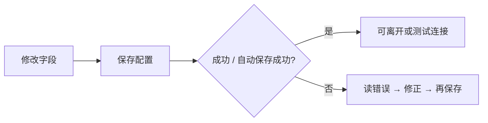

# 10 设置（界面操作）

## 页面入口与操作路径

| 方式 | 具体路径 |
| --- | --- |
| 主导航 | **设置** |
| 命令面板 | 搜索「设置」「模型」「通知」等 |
| 直链 | `/settings` |
| 分段深链 | `/settings?section=<分段 id>&view=<子视图 id>` |
| 旧参数 | `?category=` / `?sub=` 仍可能被识别并迁移为 `section` / `view` |

设置页是「让产品能跑起来」的控制台。页面标题常见为 **系统设置**。

> 💡 **这一章只讲界面怎么点**  
> 不讲云厂商申请 Key、Docker 端口。那些见 [完整指南](../full-guide.md) 与 [小白客户端安装](../beginner-client-setup.md)。

## 适用场景

| 场景 | 你要去的分段（中文标签） |
| --- | --- |
| 第一次打开 | **概览**（就绪状态）+ **AI 与模型** |
| 报告中文、菜单英文 | 界面语言（壳层 / 系统）vs **报告 → 输出** 的报告语言 |
| 收不到推送 | **通知 → 渠道** + **告警与自动化** |
| 舆情很空 | **数据源** |
| 换电脑 / 重装 | **高级 → 配置备份** |
| 看模型花了多少钱 | **用量与成本** |
| 定时自动分析 | **系统与安全 → 调度** |

## 左侧分段一览（与当前信息架构对齐）

| 分段（zh） | 分段（en） | 常见子视图 | 新手是否必看 |
| --- | --- | --- | --- |
| 概览 | Overview | 就绪状态 | 是 |
| AI 与模型 | AI & Models | 总览 / 模型接入 / 本地模型 / 任务路由 / 可靠性 | 是（至少「模型接入」） |
| 数据源 | Data Sources | 行情与资讯 / 情报源 / 数据提供方 | 按需 |
| Agent 行为 | Agent Behavior | 执行 | 进阶 |
| 对话 | Conversation | 上下文 | 问股重度用户 |
| 报告 | Reports | 输出 | 要改报告语言 / 详略时 |
| 告警与自动化 | Alerts & Automation | 推送路由 / 行为与频控 / 事件监控 | 用规则推送时 |
| 通知 | Notifications | 渠道 | 要推送时 |
| 用量与成本 | Usage & cost | — | 观察消耗 |
| 回测 | Backtesting | 引擎 | 进阶 |
| 系统与安全 | System & Security | 调度 / 系统设置 / 服务与日志 / 认证与安全 / 版本与更新 | 登录与定时 |
| 高级 | Advanced | 后端状态 / 开发者诊断 / 配置备份 | 备份时 |

新手模式下界面可能**折叠**非必要分段；可在设置内切换完整列表（以界面「新手 / 专业」或类似开关为准）。

深链示例：

- 模型接入：`/settings?section=ai_models&view=connections`  
- 本地模型：`/settings?section=ai_models&view=local_models`  
- 任务路由：`/settings?section=ai_models&view=task_routing`  
- 用量：`/settings?section=usage`

## 保存纪律（最重要）

| 习惯 | 原因 |
| --- | --- |
| 改完确认已保存 | 未保存 = 首页仍可能显示配置缺口 |
| 保存后再「测试连接 / 测试推送」 | 避免测到旧草稿 |
| 注意「有未保存修改」徽章 | 离开页可能弹出确认 |
| 部分字段自动保存 | 以界面「自动保存中 / 已自动保存」提示为准，仍建议等成功态 |

> ⚠️ **保存按钮位置**  
> 常见在顶部或底部工具条。窄屏请先滚一遍，避免改了却没提交。

## 概览：首次启动配置检查

| 元素 | 作用 |
| --- | --- |
| 就绪状态卡片 | 检查自选、模型、通知等是否满足**最小可分析** |
| 状态标签 | 已配置 / 已继承 / 待处理 / 可选 等 |
| 简短试跑 | 在基础配置足够时提交一次冒烟分析 |
| 隐藏 / 再展开 | 可暂时隐藏引导，需要时再打开 |

状态为「待处理」时，按卡片指引跳到对应分段，不要先去高级项。

## AI 与模型

### 模型接入（connections）

1. 添加模型服务（Anspire、AIHubMix、OpenAI 兼容、本地 Ollama 等，以列表为准）。  
2. 粘贴 **API Key**，填写 **Base URL**（若需要）。  
3. 选择或拉取模型列表。  
4. 指定**主分析模型**；需要时单独指定 Agent / 问股模型。  
5. **测试连接** / JSON 冒烟（以按钮为准）。  
6. **保存配置**。

### 本地模型（local_models）

- 浏览目录推荐、拉取 / 注册本地权重、激活后选用。  
- 桌面端可能捆绑 Ollama 运行时；系统已安装 Ollama 时通常优先用系统实例。  
- 删除 / 恢复以界面保护策略为准（部分目录模型不可随意删）。

### 任务路由（task_routing）

- 配置不同任务（报告生成、问股工具等）走哪条后端 / 模型。  
- **本地 CLI 类后端**往往只适合报告生成，**不一定支持问股工具调用**——界面的生成后端状态会提示。

### 建议（新手）

| 项目 | 建议 |
| --- | --- |
| 服务数量 | 先 **一个** 稳定云端服务跑通 |
| 主模型 | 服务商推荐的通用对话 / 分析模型 |
| 问股模型 | 可先与主模型相同 |
| 温度等高级项 | 保持默认 |

### 术语

| 术语 | 解释 |
| --- | --- |
| **API Key** | 访问密钥；勿截图外传 |
| **Base URL** | OpenAI 兼容接口根地址 |
| **主分析模型** | 个股 / 大盘报告默认模型 |
| **Agent / 问股模型** | 多轮对话模型 |
| **任务路由** | 哪类任务用哪套后端 |
| **生成后端** | LiteLLM 云 API、本地 CLI 等实现路径 |
| **Prompt Cache** | 提供商缓存相关高级项；普通用户可忽略 |

## 数据源

| 子视图 | 你在配什么 |
| --- | --- |
| 行情与资讯 | 行情增强、新闻搜索 Key 等 |
| 情报源 | 社区 / 情报类可选源（多默认关闭） |
| 数据提供方 | Provider 级状态与插件 |

**不配新闻源仍可能完成基础技术分析**，但舆情与催化质量会下降。免费行情可零配置试用。

## 通知与告警

1. **通知 → 渠道**：Webhook、Bot Token、Chat ID、邮箱等。  
2. 使用 **测试推送**（测的是当前草稿/已保存配置，以提示为准；有的测试**不会**写入配置）。  
3. **告警与自动化**：推送路由、行为与频控、事件监控。  
4. 规则本身在 [06 信号中心](06-signals.md) 的 **规则** Tab 管理。

| 渠道示例 | 你需要准备 |
| --- | --- |
| 企业微信 / 飞书 | 机器人 Webhook |
| Telegram | Bot Token + Chat ID |
| Discord | Webhook URL |
| 邮件 | 发件账号与授权 |

> 💡 **先保证一个渠道能收到**  
> 不要一次开满所有渠道。

## 报告语言 vs 界面语言

| 项目 | 控制什么 | 常见位置 |
| --- | --- | --- |
| **界面语言** | 导航、按钮、空状态 | 壳层语言切换 或 系统设置 |
| **报告语言** | 分析报告正文等 | **报告 → 输出** |
| **主题** | 浅色 / 深色 | 壳层或系统设置 |

二者**互不影响**。产品界面语言可能包含 zh / en / zh-TW / ja / ko 等多种；**本操作手册**以简体中文 + English 维护，见 [TRANSLATION.md](TRANSLATION.md)。

## 系统与安全 · 调度

| 能力 | 说明 |
| --- | --- |
| 定时任务开关 | 按配置时间自动跑分析（需长运行的 Web/API/Desktop 进程） |
| 下次执行 | 展示计划时间 |
| 立即执行一次 | 手动触发一轮（以权限与状态为准） |

更完整的调度语义见仓库文档 `docs/scheduled-tasks.md`（偏实现与运维；本手册只点到界面入口）。

## 高级 · 配置备份

- **导出**当前已保存配置备份。  
- **导入**会覆盖备份中出现的键并重载；有未保存草稿时会警告。  
- 桌面端重装前**强烈建议**先导出。

## 使用案例

**案例 A：从零到可分析**  
1. 概览确认缺口。  
2. AI 与模型 → 模型接入 → 添加云端服务 → 保存 → 测试连接成功。  
3. 自选 / 基础配置填入 `600519`（入口以概览指引或数据/系统相关项为准）→ 保存。  
4. 回首页，缺口应减轻 → 分析工作台跑第一份报告。

**案例 B：菜单英文、报告中文**  
界面语言 English；报告语言保持 `zh`。

**案例 C：通知失败**  
通知渠道测试推送 → 失败则换 Token/Webhook → 成功再到信号中心确认规则已启用且冷却未挡住。

**案例 D：问股不能用工具**  
任务路由 / 生成后端显示本地 CLI 不支持工具 → 问股改走支持 Agent 工具的后端，或换云端模型路径。

**案例 E：重装桌面端**  
高级 → 配置备份 → 导出 → 重装后导入 → 核对模型与通知 → 简短试跑。

## 本手册不覆盖的内容

密钥平台注册、服务器端口、Docker 映射、GitHub Actions Secrets、生产加固清单等见部署与完整指南。

## 相关

- [01 壳层](01-shell.md)
- [02 首页](02-home.md)
- [06 信号中心](06-signals.md)
- [小白客户端安装](../beginner-client-setup.md)
- [LLM 配置指南](../LLM_CONFIG_GUIDE.md)

## 深度：分段 × 子视图操作地图

下列与 `settingsInformationArchitecture` 对齐。新手模式可能隐藏部分分段。

### 概览 · 就绪状态

| 你做什么 | 细节 |
| --- | --- |
| 读检查项 | 自选 / 模型 / 通知等状态芯片 |
| 跳转修复 | 卡片链到对应 section |
| 简短试跑 | 最小分析冒烟；不可用时看原因 |
| 隐藏引导 | 可再展开 |

### AI 与模型

| 子视图 | 你要完成的操作 |
| --- | --- |
| 总览 overview | 看主模型、后端是否可运行 |
| 模型接入 connections | 增删服务、Key、Base URL、拉模型、主/备用、测试连接、保存 |
| 本地模型 local_models | 目录推荐、拉取、激活、主模型/Agent 分配、删除保护 |
| 任务路由 task_routing | 报告生成 vs 问股工具等路由；注意 CLI 限制 |
| 可靠性 reliability | 超时、重试、降级相关（保持默认除非有明确问题） |

模型接入逐步（展开）：

1. 添加服务 → 选预设或 OpenAI 兼容。  
2. 粘贴 Key（勿截图外传）。  
3. 获取模型列表并勾选。  
4. 指定主分析模型；可选 Agent 模型。  
5. 保存 → 测试连接 / JSON 冒烟。  
6. 回首页看就绪是否变绿。

### 数据源

| 子视图 | 内容 |
| --- | --- |
| 行情与资讯 sources | Tushare/新闻搜索等 Key |
| 情报源 intelligence | 社区情报等，多默认关 |
| 数据提供方 providers | Provider 状态与插件 |

### Agent 行为 · 执行

控制 Agent 执行相关开关与边界（进阶）。改前先能稳定出报告。

### 对话 · 上下文

与问股上下文长度、压缩策略等相关；和 Chat 页压缩开关可能联动，以保存成功为准。

### 报告 · 输出

| 项 | 说明 |
| --- | --- |
| 报告语言 | zh/en/… 与 UI 语言独立 |
| 详略/模板相关 | 影响默认输出形态（以字段为准） |

### 告警与自动化

| 子视图 | 说明 |
| --- | --- |
| 推送路由 | 哪类事件走哪些渠道 |
| 行为与频控 | 冷却、合并、打扰上限 |
| 事件监控 | 监控类事件（进阶） |

规则本体仍在信号中心配置。

### 通知 · 渠道

| 步骤 | 细节 |
| --- | --- |
| 填 Webhook/Token | 每个渠道字段不同 |
| 测试推送 | 可能用草稿且不保存——读按钮说明 |
| 保存 | 测试成功后再保存固化 |

### 用量与成本

观察 token/费用看板；路由常在 `section=usage`。用于发现「批量 detailed 是否烧钱」。

### 回测 · 引擎

引擎级开关与默认窗口等（进阶）；日常回测 UI 在研究 → 回测。

### 系统与安全

| 子视图 | 你能做的事 |
| --- | --- |
| 调度 | 定时分析开关、时间、下次执行、立即跑一次 |
| 系统设置 | 通用系统项、主题等相关（部分也可能在壳层） |
| 服务与日志 | 服务绑定、日志级别（部署向字段仍以界面暴露为准） |
| 认证与安全 | 管理员密码、登录保护、改密 |
| 版本与更新 | 桌面更新检查、构建号确认 |

### 高级

| 子视图 | 风险 |
| --- | --- |
| 后端状态 | 只读诊断为主 |
| 开发者诊断 | 给排障，不是日常开关盘 |
| 配置备份 | 导出/导入；导入覆盖键并重载 |

## 深度：未保存与离开保护

| 提示 | 含义 |
| --- | --- |
| 有未保存修改 | 先保存或放弃 |
| 离开设置页？ | 路由切换确认 |
| 放弃模型草稿？ | LLM 表单草稿 |
| 导入覆盖草稿 | 导入前丢本地未保存 |

## 深度使用案例

**案例：只开 Telegram 通知**  
通知渠道填 Bot Token + Chat ID → 测试推送成功 → 保存 → 信号中心建一条价格规则 → 触发后看推送历史。

**案例：本地模型当主分析**  
local_models 拉取并激活 → 设为主分析 → 任务路由确认报告走本地 → 工作台跑一只小票验证 → 问股若失败再检查是否需云端 Agent 路径。

上一篇：[09 回测](09-backtest.md) · 下一篇：[11 日常工作流](11-daily-workflows.md)
