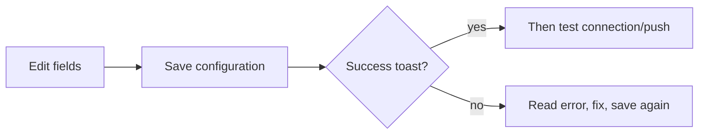

# 10 Settings (UI operations)

Settings looks crowded. For first success you usually need three wins:

1. **A model that connects** (or there is no report),  
2. **A few watchlist codes** (or there is no “who”),  
3. **(Optional) one notify channel that tests green** (or rules fire into silence).

Everything else can wait until the main path works.

> This chapter is **UI clicking only**. Cloud signups, server ports, and Docker live in the [full guide](../full-guide.md) and [beginner setup](../beginner-client-setup_EN.md).

> Habit: **Save → test → leave**. Typing without Save is the #1 “I filled it but Home still complains” story.

## How to open

| Way | Path |
| --- | --- |
| Sidebar **Settings** | Most common |
| URL `/settings` | Bookmarkable |
| Home **Start guided setup** | Good for first run |
| Deep link example | `/settings?section=ai_models&view=connections` |

Left rail = sections; some have child views. Beginner mode may hide advanced items—switch to the full list if something is missing.

## Save discipline

| Habit | Why |
| --- | --- |
| Save after edits | Home readiness reads **saved** config |
| Test after save | Avoid testing an old draft |
| Watch “unsaved changes” | Leaving may drop drafts |
| Autosave (when present) | Wait for “saved” before leaving |

Save control is often on the top or bottom toolbar—scroll once on narrow screens.

## First-time: readiness checklist

1. Open Settings or Home **Start guided setup**.  
2. Read **Overview / readiness**: needs action vs configured.  
3. Fix **AI & Models** and **watchlist** first.  
4. Save after each change.  
5. Optional smoke run when basics are green.  
6. Return Home—gap banner should ease or vanish.

## AI & Models

### Model Access (primary skill)

1. **AI & Models → Model Access** (`section=ai_models&view=connections`).  
2. **Add model service** — Anspire Open, AIHubMix, OpenAI-compatible, local Ollama, etc.  
3. Paste **API key**; set **Base URL** when required.  
4. **Fetch models** and select, or type console-enabled model names.  
5. Set **primary analysis model**.  
6. Optionally set **Agent** model (can match primary at first).  
7. **Save** → **Test connection**.

### Local models

Browse catalog, pull/register, activate. Desktop may prefer bundled Ollama. Respect delete protections on catalog models.

### Task routing / generation backend (advanced)

| Concept | Meaning |
| --- | --- |
| Task routing | Which backend handles which job type |
| Default model config | Calm daily choice |
| Local CLI generation | Experimental; not fully offline; Agent tools may be unavailable |
| Fallback generation backend | After local CLI failure: fail vs try cloud default |

A **backup model on a connection** is not the same as **fallback generation backend**.

## Watchlist

Comma-separated codes, e.g. `600519,hk00700,AAPL`. Paste from tables often works; Save normalizes separators. Start with 1–3 familiar names. Home, batch analysis, and some notification scopes read this list.

## Data sources

News / search keys improve events and themes; technical-only runs may still work without them. Intel sources are often default-off. Provider panels show status and plugins when present.

## Notifications & alerts

1. Pick **one** channel you actually read.  
2. Fill Token / Webhook / Chat ID.  
3. **Test push** (some tests use draft values—read the help text).  
4. **Save** after a green test.  
5. Only then add a second channel.

**Alerts & Automation** is mostly routing and rate limits. Price/condition **rules** live in [Signal Center → Rules](06-signals_EN.md).

## UI language vs report language

| Setting | Changes | Does not change |
| --- | --- | --- |
| UI language | Menus and buttons | Report body language |
| Report language | Analysis body | Menu language |
| Theme | Light/dark | Business logic |

English menus + Chinese reports is valid.

## Learn later

| Section | When you need it |
| --- | --- |
| Conversation · context | Long Agent chats / compression |
| Agent behavior | Advanced Agent boundaries |
| Usage & cost | Token / spend visibility |
| Backtest · engine | Engine defaults |
| System & security · scheduling | Daily auto analysis (long-running process required) |
| Auth & security | Login protection / admin password |
| Version & updates | Desktop updates / build id |
| Advanced · config backup | Export before reinstall; import on recovery |
| Advanced · diagnostics | Troubleshooting |

### Scheduling

When enabled, a **long-running** Web/API/Desktop process must stay up. You may see next-run times and “run once” actions. Implementation notes: `docs/scheduled-tasks.md`.

### Config backup

Export a saved snapshot before desktop reinstall; import reloads keys and may warn about unsaved drafts.

## Use cases

**A — First report tonight**  
Readiness → add one cloud connection → Save + test → watchlist `600519` → Save → Home → Workbench.

**B — English UI, Chinese reports**  
UI language English; report language `zh`; open a report and confirm body language.

**C — Rules fire, phone silent**  
Settings test push → fix token → Save → Signal Center delivery history / cooldown.

**D — Agent tools blocked**  
Local CLI path → switch Agent generation to a cloud-capable path.

**E — Reinstall desktop**  
Advanced → export backup → reinstall → import → test connection → short smoke run.

## Glossary

| Term | Meaning |
| --- | --- |
| API key | Provider credential—never screenshot publicly |
| Base URL | Root of a compatible API |
| Primary analysis model | Default model for stock/market reports |
| Task routing | Which backend handles which job |
| Readiness / config gap | What still blocks minimal analysis |
| Test push | Synthetic notification to verify a channel |

## Feature status aligned with main (2026-07)

Trust **current `origin/main`**. Older running builds may still lack entries—believe the screen.

| Capability | Status on main | UI entry | How to use this manual |
| --- | --- | --- | --- |
| **Scheduled tasks** | **Shipped** | Settings → **Scheduling** (enable, daily times, next run, run once); Home **Today's scheduled tasks** (read-only) | See Scheduling above and [02 Home](02-home_EN.md); contract: `docs/scheduled-tasks.md` |
| **Notification channel plugins** | **Shipped** | Settings → notifications / plugin surfaces when discovery is enabled | Prove one built-in channel with **test push** first; plugin channels follow the UI list |
| **Personal investment framework** | **Backend shipped**; **no full Web editor yet** | API / engineering docs primarily | See `docs/personal-investment-framework.md` (backend slice); expand UI chapters only after a real editor ships |
| **Local model pack import** | **Shipped** | Settings → **AI & Models → Local Models** → Import Model Pack (labels as in UI) | Catalog pull/activate still apply; import path: `docs/model-packs.md` and in-product help |

For shipped capabilities, write “available on current main”. Use a single “if your UI lacks this entry, upgrade” note only when the install is older.

## Related

- [02 Home](02-home_EN.md)  
- [01 Shell](01-shell_EN.md)  
- [06 Signal center](06-signals_EN.md)  
- [Beginner client setup](../beginner-client-setup_EN.md)  
- [LLM config guide (EN)](../LLM_CONFIG_GUIDE_EN.md)  

Previous: [09 Backtest](09-backtest_EN.md) · Next: [11 Daily workflows](11-daily-workflows_EN.md)
