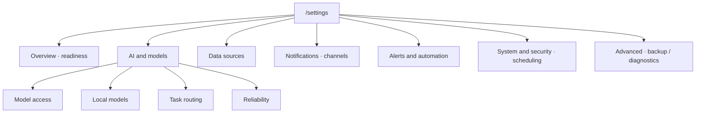
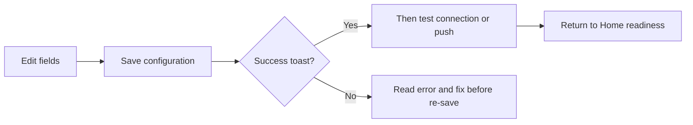
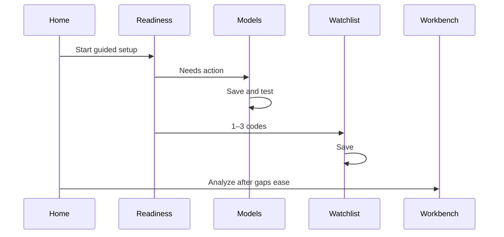
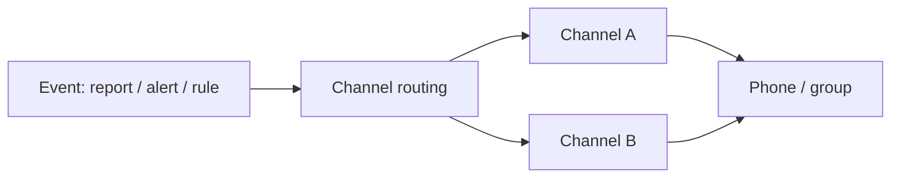
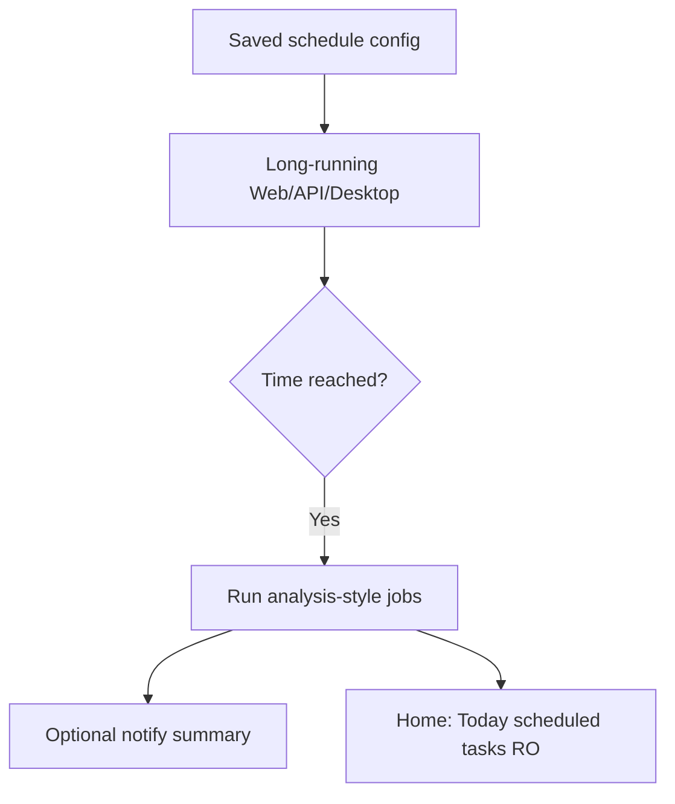
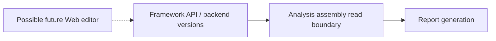

# 10 Settings

## What you will learn

1. Finish the minimal path: model connects → short watchlist → optional notify test  
2. Navigate sections/views, deep links, and **Save → test → leave** discipline  
3. Configure AI models, data sources, notifications, and scheduling accurately  
4. Separate UI language from report language; know conditional capabilities (model packs, plugins, investment framework)  
5. Backup, troubleshoot, and self-check before relying on automation  

Settings has many fields. For first use, get these three working:

1. **A model that connects** (or you get no reports)  
2. **A short watchlist** (or the system does not know what to analyze)  
3. **(Optional) one notification channel that passes test push** (or rules fire and you never hear them)  

Everything else can wait until that path works.

> 💡 **Tip**  
> This chapter is **how to click in the UI**. Cloud signups, ports, and Docker live in the [full guide](../full-guide_EN.md) and [beginner setup](../beginner-client-setup_EN.md).  
> Field-level “what / how to fill” dictionary: [14 Settings fields](14-settings-fields_EN.md).

> ⚠️ **Note**  
> After edits: **Save → test → leave**. Typing without Save is the usual reason Home still shows setup incomplete.  
> Do not screenshot secrets publicly. Product output is research only — **not investment advice**.

> 🧭 **Entry**  
> Sidebar **Settings** · URL `/settings` · Home **Start guided setup** · deep links such as `/settings?section=ai_models&view=connections`

---

## 1. Information architecture

Left rail = **sections**; some sections have **views**. Beginner mode may hide advanced items—if something is missing, switch to the full/professional list.

### 1.1 Section quick map

| Section | Typical views | When you need it |
| --- | --- | --- |
| **Overview** | Readiness | First setup, gap check |
| **AI & Models** | Overview / connections / local / task routing / reliability | Reports and Agent |
| **Data sources** | Market & news / intel / providers | Richer news and quotes |
| **Agent behavior** | Execution | Agent boundaries (advanced) |
| **Conversation** | Context | Long chats, compression |
| **Reports** | Output | Report language and related output |
| **Alerts & automation** | Routing / rate limits / event monitoring | Notify behavior and frequency |
| **Notifications** | Channels | Webhooks / bots / email |
| **Usage & cost** | Usage views | Token / spend trends |
| **Backtest** | Engine | Engine defaults (advanced) |
| **System & security** | Scheduling / system / services / auth / version | Schedules, login, updates |
| **Advanced** | Backend status / backup / diagnostics | Export, troubleshooting |

> 📘 **Concept (advanced)**  
> Deep links may show URL params `section` and `view`. They only locate the page—daily use can click the left names.

### 1.2 Common deep links

| Deep link | Opens |
| --- | --- |
| `/settings` | Default Settings entry |
| `/settings?section=ai_models&view=connections` | Model access |
| `/settings?section=ai_models&view=local_models` | Local models |
| `/settings?section=ai_models&view=task_routing` | Task routing |
| `/settings?section=notifications&view=channels` | Notification channels |
| `/settings?section=system_security&view=runtime` | Scheduling (historical id name `runtime`) |
| `/settings?section=advanced` | Advanced (backup etc.; views as shown) |

---

## 2. Save discipline

> 🖼️ **Figure placeholder** · `assets/settings-save-control-en.png`  
> **Capture**: Settings toolbar with Save configuration control; unsaved badge if reproducible.  
> **Notes**: Any section; English UI.  
> **Status**: pending — see [assets/PLACEHOLDERS.md](assets/PLACEHOLDERS.md)

Treat Settings like a form: fill fields, then submit.

| Habit | Why |
| --- | --- |
| Save after meaningful edits | Home readiness reads **saved** config |
| Test after save | Avoid testing an old draft |
| Watch “unsaved changes” | Leaving may drop drafts |
| Wait for autosave confirmation | Some fields autosave—leave only after “saved” |
| Resolve conflicts deliberately | Server vs local draft—choose which side to keep |

Save controls usually sit on top or bottom toolbars; scroll once on narrow screens.

> ✅ **Recommended**  
> One theme at a time (e.g. models only): Save → test → next theme.  
> ❌ **Avoid**  
> Changing models, notify, and schedules together—failures become untraceable.

---

## 3. First-time: follow readiness

> 🧭 **Entry**  
> Settings **Overview → readiness**, or Home **Start guided setup**.

1. Open Settings or guided setup from Home.  
2. Read readiness: needs action vs configured.  
3. Prioritize **AI & Models** and **watchlist**.  
4. **Save** after each meaningful edit.  
5. Model: Save → **test connection** (or JSON smoke, as labeled).  
6. If a **short smoke run** is offered, use it after base items are ready.  
7. Return to Home; confirm gap banner eases.  
8. Workbench: analyze **one** familiar symbol for the first report.

> 💡 **Tip**  
> Readiness is a **minimal analyzable** checklist—not “configure every key in the world.” News, multi-channel notify, and schedules can wait for week two.

---

## 4. AI & Models

> 🖼️ **Figure placeholder** · `assets/settings-model-connections-en.png`  
> **Capture**: AI & Models → connections list or add-provider entry.  
> **Notes**: Mask API keys.  
> **Status**: pending — see [assets/PLACEHOLDERS.md](assets/PLACEHOLDERS.md)

### 4.1 Model access (start here)

Path: `/settings?section=ai_models&view=connections`

1. Open **AI & Models → Model access**.  
2. **Add** a provider (Anspire Open, AIHubMix, OpenAI-compatible, local Ollama, …—**as listed**).  
3. Paste **API key**; set **Base URL** when required (compatible endpoints often end with `/v1`).  
4. **Fetch models** and select, or type a console-enabled model name.  
5. Set **primary analysis model** (default for single-name / market reports).  
6. Optionally set **Agent model** (can match primary for now).  
7. Optional: **backup models** (tried in order when primary fails).  
8. **Save** → **test connection**.

A successful test is the main setup milestone.

| Concept | Meaning |
| --- | --- |
| API key | Credential for the model service |
| Base URL | Root of a compatible API endpoint |
| Primary analysis model | Default for written reports |
| Agent model | Agent scenarios; may inherit primary |
| Backup model | Model-list fallback when primary fails |
| Vision model | Image tasks when used |

> ⚠️ **Note**  
> **Backup model** ≠ **fallback generation backend**. The former is connection-level model fallback; the latter is whether local CLI failure falls back to the default model config (task routing).

### 4.2 Local models

Path: `view=local_models`

Browse catalog, pull/register, activate. Desktop may prefer local Ollama. If delete is blocked, trust the UI—some catalog entries are protected.

**Model pack import (some builds / in progress)**

If the UI shows **Import pack** (or similar):

1. Entry remains under **AI & Models → Local models**.  
2. Import a versioned local model-pack archive.  
3. Bind a snapshot, then activate.  
4. **Whether the control appears depends on your build.** If missing on your install, do not invent steps.  
5. After the capability ships, trust on-screen help.

> 📘 **Concept**  
> Local models can reduce cloud cost and data egress concern, but they are **not fully offline**: quotes, news, and index updates may still need network. Agent tools may be unavailable on some local CLI paths.

### 4.3 Task routing and generation backend (advanced)

Path: `view=task_routing`

| Concept | Meaning |
| --- | --- |
| Task routing | Which backend handles reports vs Agent tools |
| Default model config | Calm daily choice |
| Local CLI generation | Experimental local CLI path |
| Fallback generation backend | If local CLI fails: error vs fall back to cloud default |

> ✅ **Recommended**  
> Beginners keep default model config.  
> ❌ **Avoid**  
> Switching to local CLI before understanding login/permissions, then concluding “the product is broken.”

### 4.4 Reliability

Timeouts, retries, concurrency. Leave defaults unless chasing a known failure. Oversized concurrency can thrash local CLI or rate limits.

### 4.5 Usage & cost

Use the **Usage & cost** section for token/spend trends (as shown). Answer: “Did money go to batch detailed, or long Agent threads?”

---

## 5. Watchlist

The watchlist (often under base/readiness config) feeds manual analysis, **scheduled tasks**, and many notifications.

### 5.1 Filling the list

- Prefer English commas: `600519,hk00700,AAPL`  
- Pastes with Chinese commas, spaces, or newlines often normalize on Save  
- Start with **1–3** familiar codes  
- Stock workspace `/stocks/:code` **Add to watchlist** writes the same list logic (backend is authoritative)

### 5.2 Watchlist vs holdings vs Discover candidates

| List | What it is |
| --- | --- |
| **Watchlist** | Codes you track / batch-analyze |
| **Holdings** | Real or paper quantities and costs |
| **Discover candidates** | One-shot shortlist; does not auto-join watchlist |

Save after edits. Home, batch analysis, and some notify scopes read this list.

> ⚠️ **Note**  
> Huge watchlists make schedules and batch runs slow and expensive. Prefer a short list + high-quality reports.

---

## 6. Data sources

| View | What you configure |
| --- | --- |
| Market & news | Quotes, news search keys, Tushare / TickFlow, etc. |
| Intel sources | Community/intel feeds (often off by default) |
| Data providers | Provider status and plugins |

Technical-leaning runs can work without news keys; events and catalysts get thinner. Anspire may cover more than one capability with one key (trust field help); other aggregators may need SerpAPI / Tavily, etc.

> 💡 **Tip**  
> When reports show news `missing`, return here for search keys and network, then re-run the same code and compare Analysis Context.

AlphaSift-related switches may appear under data sources or a dedicated card—often default off; enabling requires a healthy backend adapter. See field reference and [12 Discover](12-discover_EN.md).

---

## 7. Notifications and alerts

> 🖼️ **Figure placeholder** · `assets/settings-notification-cards-en.png`  
> **Capture**: Notification channel cards with configured badges.  
> **Notes**: No real webhooks.  
> **Status**: pending — see [assets/PLACEHOLDERS.md](assets/PLACEHOLDERS.md)

### 7.1 Notifications → channels

Path often: `/settings?section=notifications&view=channels`

Channels typically appear as **cards** (WeCom, Feishu, Telegram, Discord, email, DingTalk, custom webhook, …—**as listed**):

1. Enable **one** channel you actually read.  
2. Open the card; fill webhook / bot token / chat id.  
3. Note configured vs not-configured badges.  
4. **Test push** (some tests use the draft and do not persist—read the hint).  
5. **Save**. Only then add a second channel.

Configure **notification channel routing** (which event classes go where). Field help: [14](14-settings-fields_EN.md) or in-app tooltips.

### 7.2 Notification channel plugins

Deployments can load extra channel plugins (example under `examples/plugins/example-notification-channel/`).

- Whether a plugin channel appears depends on whether the deploy loaded the plugin.  
- Config fields still live under Notifications / related categories.  
- Contracts: `docs/notifications.md`, `docs/plugin-extension-contract.md`.

> 📘 **Concept**  
> Plugins extend **delivery channels**. They do not change the boundary that **signals are not auto-trading**.

### 7.3 Alerts & automation

Primarily **push routing, behavior/rate limits, event monitoring** (quiet hours, cooldowns, frequency caps).  
“Ping me at this price” rules live in [Signal Center → Rules](06-signals_EN.md).

| Goal | Where |
| --- | --- |
| Webhook / bot credentials | Settings · Notifications · channels |
| Which events to which channels | Settings · alert / notify routing |
| Quiet nights | Behavior & rate limits · quiet hours |
| Price condition rules | `/signals?tab=rules` |
| Did notify really leave? | Signal Center · delivery history |

> ✅ **Recommended**  
> One channel green → then rules → then delivery history.  
> ❌ **Avoid**  
> Five channels at once with no history checks.

---

## 8. System & security · Scheduling

> 🖼️ **Figure placeholder** · `assets/settings-scheduling-en.png`  
> **Capture**: System & Security → Scheduling: enable, times, next run / run now if shown.  
> **Notes**: runtime view; English UI.  
> **Status**: pending — see [assets/PLACEHOLDERS.md](assets/PLACEHOLDERS.md)

Path: `/settings?section=system_security&view=runtime` (label often **Scheduling**)

Here you can typically:

- Enable / disable automatic analysis  
- Set daily run time(s) (single or multi, as fields allow)  
- View next run  
- **Run once now** when UI and permissions allow  

> ⚠️ **Note**  
> After Save, a **long-running** Web / API / Desktop process must stay up for the clock to fire.  
> Sleeping laptop, stopped container, or stopped service means nothing runs at the appointed time.

Home **Today’s scheduled tasks** is **read-only**—edit schedules here, not on Home.

Fuller task types (research brief, risk check, …) and API contract: `docs/scheduled-tasks.md`.

### 8.1 Mini tutorial: after-close analysis + phone digest

1. Maintain watchlist and Save.  
2. Set after-close schedule and Save.  
3. Enable one channel; test push green.  
4. Route report/events to that channel (summary-only if offered).  
5. Keep process long-running.  
6. Next day: Home scheduled tasks + phone receipt.  
7. Silence: delivery history → separate “did not run / ran no push / quiet hours.”

---

## 9. UI language vs report language

| Setting | Changes | Does not change |
| --- | --- | --- |
| UI language | Buttons, menus, empty states | Report body language |
| Report language | Analysis report body | Menu language |
| Theme | Light / dark | Business logic |

English menus + Chinese reports is valid. Product UI locales are separate from this manual’s language packs—see [i18n/README.md](i18n/README.md).

Report output items may also live under **Reports → Output** (as shown).

---

## 10. Personal investment framework (API / backend first)

The product already has a **versioned personal investment framework** backend and API (create, version, enable/disable, history).

**There is typically no full standalone Web editor yet.** A stable read adapter for analysis assembly does **not** mean every UI surface visibly “runs your framework.”

If a later release adds an editor under Settings or elsewhere, trust the screen. Contract: `docs/personal-investment-framework_EN.md` / `docs/personal-investment-framework.md`.

> 💡 **Tip**  
> Until a full UI exists, do not assume “some Settings toggle = my full framework is loaded.” Trust docs and API state.

---

## 11. Learn when you need them

| Section | When it matters |
| --- | --- |
| Conversation · context | Long Agent chats, compression policy |
| Agent behavior | Execution boundaries (advanced) |
| Usage & cost | Where tokens / money went |
| Backtest · engine | Engine defaults (advanced) |
| Auth & security | Login protection, admin password |
| Services & logs | Log level, service troubleshooting |
| Version & updates | Desktop updates, build id |
| Advanced · config backup | Export before reinstall; import to restore |
| Advanced · diagnostics / backend | Debug with yourself or a helper |

### 11.1 Config backup

- **Export** a copy of saved config.  
- **Import** overwrites keys present in the file and reloads; unsaved drafts may be warned.

> ✅ **Recommended**  
> Export once before desktop upgrade or reinstall.  
> ❌ **Avoid**  
> Committing backups that contain real keys to public git or group chat files.

### 11.2 Auth & security

With login protection on, unauthenticated users cannot change config while logged out. Store admin password carefully; recovery paths live in deploy docs (ops detail is out of scope here).

---

## 12. Leave-page prompts

| Prompt | Meaning | Action |
| --- | --- | --- |
| Unsaved changes | Draft still open | Save or discard |
| Leave Settings? | Draft may be lost | Confirm leave or stay |
| Discard model draft? | Model form not saved | Save first or accept discard |
| Import overwrites draft | Import wins | Export current first if needed |
| Config conflict | Server vs local mismatch | Choose server or local deliberately |

---

## 13. Use cases

**A — First report tonight** — readiness → one cloud provider → Save + test → watchlist `600519` → Home → Workbench.  
**B — English menus, Chinese reports** — UI English; report language `zh`; open a report and confirm body language.  
**C — Rules fire, phone silent** — test push → fix token → Save → Signal Center delivery history and cooldowns.  
**D — Agent tools blocked** — local CLI limits → point Agent at a tool-capable path.  
**E — Reinstall desktop** — Advanced → config backup → export → reinstall → import → test connection → short smoke.  
**F — After-close auto + digest** — watchlist → schedule Save → one channel test → optional summary routing → next-day Home tasks (process must stay long-running).  
**G — Quiet nights** — quiet hours e.g. `23:00-07:00` + correct timezone → next day separate no-fire vs quiet.  
**H — Local model trial** — pull/activate → follow task routing help → if tools unavailable, keep analysis on cloud or switch back. Import pack only if shown.  
**I — Split channels** — channel A reports, channel B alerts (if routing allows) → test each → then routing.  
**J — News always missing** — data sources → search keys → Save → re-run same code → check Analysis Context.  
**K — Shared service** — enable login; do not share admin password in chat; keys stay centralized.  
**L — Backtest engine touched by mistake** — restore defaults via field help; `/research/backtest` still usable.

More automation and anti-patterns: [11](11-daily-workflows_EN.md).

---

## 14. FAQ

**Q1: Key typed, still “not configured”?**  
Usually Save missing or Save failed. Read error summary and conflict prompts.

**Q2: Connection test green but analysis fails?**  
Model name not enabled, quota, timeout, or data-source issues. Read task error text.

**Q3: Schedule did not fire?**  
Switch, time, timezone, long-running process, same-day failure logs.

**Q4: Test push works, real report push does not?**  
Routing, quiet hours, cooldown, whether the job finished, delivery history status.

**Q5: Are local models fully offline?**  
Typically no. Analysis may still need quote/news network.

**Q6: Where is personal investment framework in Settings?**  
Usually **no** full Web editor yet—see §10 and API docs.

**Q7: Cannot find Import pack?**  
Your build may not include it yet. Do not hunt for non-existent controls.

**Q8: Keys changed after import?**  
Import overwrites keys in the file. Export current first.

**Q9: Beginner mode hides many fields?**  
Switch full list or deep-link the section.

**Q10: Is Settings “investment advice config”?**  
No. Settings only connect and tune research tooling behavior.

---

## 15. Self-check

| # | Item | Pass |
| --- | --- | --- |
| 1 | Save | No unsaved badge / success toast |
| 2 | Model | Connection test green |
| 3 | Watchlist | ≥1 familiar code saved |
| 4 | Home readiness | Critical gaps gone or explainable |
| 5 | Notify (if needed) | Test push arrives |
| 6 | Schedule (if needed) | Time correct + process long-running |
| 7 | Backup | Exported before major change |
| 8 | Secret hygiene | No public screenshots / public git |

---

## 16. Glossary

| Term | Meaning |
| --- | --- |
| API key | Model service credential—do not share publicly |
| Base URL | Compatible API endpoint root |
| Primary analysis model | Default for written reports |
| Task routing | Which job type uses which backend |
| Readiness / setup gap | What is still missing for minimal analysis |
| Test push | Dummy message to verify a channel |
| Channel routing | Which event classes go to which channels |
| Scheduling | Clock-driven auto analysis and related tasks |
| Quiet hours | Window with no push or reduced noise |
| Local CLI generation | Experimental local CLI analysis path |
| Fallback generation backend | Whether CLI failure falls back to default model config |
| Backup model | Model-level fallback when primary fails |
| Model pack | Versioned local model archive (if UI supports import) |
| Config backup | Export / import of saved configuration |
| Personal investment framework | Versioned investment principles (API-first today) |
| Section / view | Settings left nav; deep-link params |

Field-level tables: in-app help or [14 Settings fields](14-settings-fields_EN.md).

---

## 17. Related

- [02 Home](02-home_EN.md)  
- [01 Navigation and top bar](01-shell_EN.md)  
- [03 Analysis Workbench](03-analysis-workbench_EN.md)  
- [06 Signal Center](06-signals_EN.md)  
- [09 Backtest](09-backtest_EN.md)  
- [11 Daily workflows](11-daily-workflows_EN.md)  
- [12 Discover](12-discover_EN.md)  
- [14 Settings fields](14-settings-fields_EN.md)  
- [Beginner setup](../beginner-client-setup_EN.md)  
- [LLM guide](../LLM_CONFIG_GUIDE_EN.md)  
- [Scheduled tasks](../scheduled-tasks.md)  
- [Personal investment framework](../personal-investment-framework_EN.md)  
- [Notifications](../notifications.md)  

Prev: [09 Backtest](09-backtest_EN.md) · Next: [11 Daily workflows](11-daily-workflows_EN.md)
