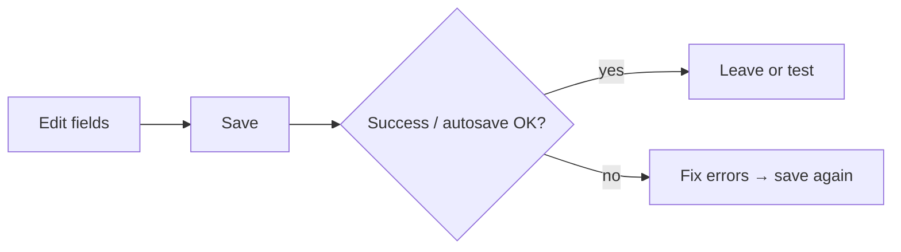

# 10 Settings (UI operations)

## Entry points and paths

| Method | Path |
| --- | --- |
| Primary nav | **Settings** |
| Command palette | “settings”, “model”, “notification” |
| Route | `/settings` |
| Section deep link | `/settings?section=<id>&view=<id>` |
| Legacy | `category` / `sub` may migrate to `section` / `view` |

This chapter is **how to click the Settings UI**, not how to register cloud keys or map Docker ports. See [full guide](../full-guide.md) and [beginner client setup](../beginner-client-setup.md).

## When to use

| Scenario | Section (EN labels) |
| --- | --- |
| First launch | **Overview** + **AI & Models** |
| English chrome, Chinese reports | UI language vs **Reports → Output** |
| No pushes | **Notifications → Channels** + **Alerts & Automation** |
| Thin news | **Data Sources** |
| Reinstall | **Advanced → Config Backup** |
| Cost watch | **Usage & cost** |
| Scheduled analysis | **System & Security → Scheduling** |

## Left-nav sections (current IA)

| Section (zh) | Section (en) | Typical views | Beginner? |
| --- | --- | --- | --- |
| 概览 | Overview | Readiness | Yes |
| AI 与模型 | AI & Models | Overview / Model Access / Local Models / Task Routing / Reliability | Yes (Model Access) |
| 数据源 | Data Sources | Sources / Intel / Providers | As needed |
| Agent 行为 | Agent Behavior | Execution | Advanced |
| 对话 | Conversation | Context | Heavy chat users |
| 报告 | Reports | Output | Report language / density |
| 告警与自动化 | Alerts & Automation | Push routing / Behavior & limits / Event monitor | If using rules |
| 通知 | Notifications | Channels | If pushing |
| 用量与成本 | Usage & cost | — | Monitor spend |
| 回测 | Backtesting | Engine | Advanced |
| 系统与安全 | System & Security | Scheduling / System / Web & logs / Auth / Version | Auth & schedule |
| 高级 | Advanced | Backend status / Diagnostics / Config backup | Backup |

Beginner mode may hide non-essential sections.

Deep-link examples:

- Model Access: `/settings?section=ai_models&view=connections`  
- Local Models: `/settings?section=ai_models&view=local_models`  
- Task Routing: `/settings?section=ai_models&view=task_routing`  
- Usage: `/settings?section=usage`

## Save discipline

| Habit | Why |
| --- | --- |
| Confirm saved | Unsaved → Home still shows gaps |
| Save before test connection / test push | Avoid testing stale drafts |
| Watch “unsaved” badge | Leave may confirm discard |
| Autosave | Wait for “saved” state when shown |

> ⚠️ Find the save control on narrow screens (top or bottom bar).

## Overview: first-run readiness

Cards check watchlist / models / notifications for a **minimum runnable** path. Status chips: configured / inherited / needs action / optional. **Smoke run** submits a short analysis when ready.

## AI & Models

### Model Access

1. Add a provider (Anspire, AIHubMix, OpenAI-compatible, Ollama, …).  
2. Paste **API key**, **Base URL** if needed.  
3. Pick models; set **primary analysis** model; optional Agent model.  
4. **Test connection** / smoke.  
5. **Save**.

### Local Models

Catalog browse, pull/register, activate. Desktop may ship embedded Ollama; system Ollama usually wins when present.

### Task Routing

Map tasks (report generation, Agent tools, …) to backends. **Local CLI** backends often generate reports but **do not** support Agent tool calling — UI status explains this.

### Beginner defaults

One stable cloud provider first; keep advanced sampling defaults.

### Glossary

| Term | Meaning |
| --- | --- |
| **API key** | Secret credential |
| **Base URL** | OpenAI-compatible root |
| **Primary analysis model** | Default report model |
| **Agent model** | Chat model |
| **Task routing** | Which backend per task |
| **Generation backend** | LiteLLM cloud, local CLI, etc. |
| **Prompt cache** | Advanced provider cache; skip for beginners |

## Data sources

Market/news keys, intel sources (often default-off), provider plugins. Analysis can work without news keys, with thinner event context.

## Notifications & alerts

1. **Notifications → Channels**: webhooks, bot tokens, chat ids, email.  
2. **Test push** (may use draft without saving — follow UI copy).  
3. **Alerts & Automation**: routing, rate limits, event monitor.  
4. Rule definitions live in [06 Signal Center](06-signals_EN.md) **Rules** tab.

Start with **one** channel you actually read.

## UI language vs report language

| Control | Affects | Where |
| --- | --- | --- |
| **UI language** | Nav, buttons, empty states | Shell or system settings |
| **Report language** | Report body language | **Reports → Output** |
| **Theme** | Light / dark | Shell or system |

They are **independent**. The product may ship many UI locales (zh, en, zh-TW, ja, ko, …). **This manual** is maintained in Simplified Chinese + English — see [TRANSLATION.md](TRANSLATION.md).

## System & Security · Scheduling

Enable scheduled analysis for long-running Web/API/Desktop processes; view next run; **run once** when offered. Deeper scheduler semantics: `docs/scheduled-tasks.md`.

## Advanced · Config backup

Export saved config; import overwrites keys present in the file and reloads. Export before desktop reinstall.

## Use cases

**A — Zero to first analysis**  
Overview gaps → Model Access → save + test → watchlist `600519` → Home gap shrinks → Workbench.

**B — English UI, Chinese reports**  
UI language English; report language `zh`.

**C — Push failures**  
Test channel → fix token → enable Signal Center rules + cooldown.

**D — Chat tools unavailable**  
Local CLI backend → switch Agent path to a tool-capable backend.

**E — Reinstall desktop**  
Export backup → reinstall → import → smoke run.

## Out of scope here

Cloud account signup, server ports, Docker maps, Actions secrets — use deploy / full guides.

## Related

- [01 Shell](01-shell_EN.md)
- [02 Home](02-home_EN.md)
- [06 Signal Center](06-signals_EN.md)
- [Beginner client setup](../beginner-client-setup.md)
- [LLM config guide](../LLM_CONFIG_GUIDE_EN.md)

Prev: [09 Backtest](09-backtest_EN.md) · Next: [11 Daily workflows](11-daily-workflows_EN.md)
