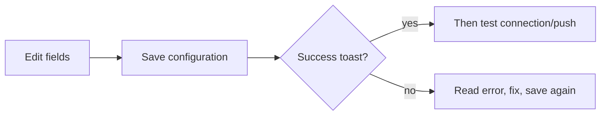

# 10 Settings (UI operations)

Settings looks crowded. For first success you usually need three wins:

1. **A model that connects** (or there is no report),  
2. **A few watchlist codes** (or there is no “who”),  
3. **(Optional) one notify channel that tests green** (or rules fire into silence).

Everything else can wait until the main path works.

> This chapter is **UI clicking only**. Cloud signups, server ports, and Docker live in the [full guide](../full-guide.md) and [beginner setup](../beginner-client-setup_EN.md).

> Habit: **Save → test → leave**. Typing without Save is the #1 “I filled it but Home still complains” story.

## How to open

| Way | Path |
| --- | --- |
| Sidebar **Settings** | Most common |
| URL `/settings` | Bookmarkable |
| Home **Start guided setup** | Good for first run |
| Deep link example | `/settings?section=ai_models&view=connections` |

Left rail = sections; some have child views. Beginner mode may hide advanced items—switch to the full list if something is missing.

## Save discipline

| Habit | Why |
| --- | --- |
| Save after edits | Home readiness reads **saved** config |
| Test after save | Avoid testing an old draft |
| Watch “unsaved changes” | Leaving may drop drafts |
| Autosave (when present) | Wait for “saved” before leaving |

Save control is often on the top or bottom toolbar—scroll once on narrow screens.

## First-time: readiness checklist

1. Open Settings or Home **Start guided setup**.  
2. Read **Overview / readiness**: needs action vs configured.  
3. Fix **AI & Models** and **watchlist** first.  
4. Save after each change.  
5. Optional smoke run when basics are green.  
6. Return Home—gap banner should ease or vanish.

## AI & Models

### Model Access (primary skill)

1. **AI & Models → Model Access** (`section=ai_models&view=connections`).  
2. **Add model service** — Anspire Open, AIHubMix, OpenAI-compatible, local Ollama, etc.  
3. Paste **API key**; set **Base URL** when required.  
4. **Fetch models** and select, or type console-enabled model names.  
5. Set **primary analysis model**.  
6. Optionally set **Agent** model (can match primary at first).  
7. **Save** → **Test connection**.

The provider picker uses a rounded search field. Success, empty, and error states from **Fetch models** appear below the action instead of squeezing it; manual model entry remains available after a failure.

### Local models

Browse catalog, pull/register, activate. Desktop may prefer bundled Ollama. Respect delete protections on catalog models.

### Task routing / generation backend (advanced)

| Concept | Meaning |
| --- | --- |
| Task routing | Which backend handles which job type |
| Default model config | Calm daily choice |
| Local CLI generation | Experimental; not fully offline; Agent tools may be unavailable |
| Fallback generation backend | After local CLI failure: fail vs try cloud default |

A **backup model on a connection** is not the same as **fallback generation backend**.

## Watchlist

Comma-separated codes, e.g. `600519,hk00700,AAPL`. Paste from tables often works; Save normalizes separators. Start with 1–3 familiar names. Home, batch analysis, and some notification scopes read this list.

To extract watchlist symbols from a screenshot, CSV / Excel file, or clipboard
text, use **View fields** on the **Intelligent Import** card. Recognition and
merge controls open in a dialog, and closing it keeps the current Settings
section in place.

## Data sources

News / search keys improve events and themes; technical-only runs may still work without them. Intel sources are often default-off. Provider panels show status and plugins when present.

## Notifications & alerts

1. Pick **one** channel you actually read.  
2. Fill Token / Webhook / Chat ID.  
3. Wait for **Autosaved**, then use **Send test** on that channel.
4. After every target passes, select events the channel does not yet receive and choose **Bind selected events** in the same dialog.
5. Wait for the routing draft to save and appear in the effective Event routing summary; only then add a second channel.

“Verified” is session evidence bound to the current config version and a one-way fingerprint of that channel's exact tested values; it expires after 30 minutes. Channel edits, failed/conflicted saves, server refreshes, and config-version changes invalidate old evidence. For multiple custom-webhook targets, only all-success is verified. Partial delivery lists the failed targets and cannot be bound.

Event routing always describes the **effective path resolved from saved configuration**, never an unsaved draft. Empty routing keeps the backend's all-configured fan-out behavior. Case and duplicates follow backend normalization, while invalid or currently unconfigured targets are reported separately.

The card and test selector cover the 14 built-in static channels. Dynamically registered trusted-plugin channels remain owned by extension/diagnostic surfaces and are never mislabeled here as built-ins.

**Alerts & Automation** is mostly routing and rate limits. Price/condition **rules** live in [Signal Center → Rules](06-signals_EN.md).

## UI language vs report language

| Setting | Changes | Does not change |
| --- | --- | --- |
| UI language | Menus and buttons | Report body language |
| Report language | Analysis body | Menu language |
| Theme | Light/dark | Business logic |

English menus + Chinese reports is valid.

## Learn later

On desktop, the category navigation uses a compact sidebar so the active settings content keeps more horizontal space. Mobile still uses the single-select dropdown.

| Section | When you need it |
| --- | --- |
| Conversation · context | Long Agent chats / compression |
| Agent behavior · Execution | Advanced Agent boundaries |
| Agent behavior · Investment Framework | Maintain the personal framework injected read-only into research; basics, new nodes, and new dimensions use configuration dialogs, existing structured content stays inline, and saved versions open in an in-page drawer where they can be copied into the current draft |
| Usage & cost | Token / spend visibility |
| Backtest · engine | Engine defaults |
| System & security · scheduling | Daily auto analysis (long-running process required) |
| Auth & security | Login protection / admin password |
| Version & updates | Desktop updates / build id |
| Advanced · config backup | Export before reinstall; import on recovery |
| Advanced · diagnostics | Troubleshooting |

### Agent behavior presets

**Agent behavior → Execution** offers Simple Q&A, Standard research, and Deep + governed as starting points. Preset status is derived from saved server values: a confirmed draft remains pending until autosave succeeds, and failed or conflicted saves never appear active. The summary also reports the effective Agent model source/readiness, Risk Agent/HITL boundary, and deep-tool state; `auto` alone is not proof that a model is configured.

Selecting a preset opens confirmation without mutating the draft. Review every old/new value plus step/timeout, memory, Critic, and multi-strategy cost effects. Confirmation submits all changes as one Agent Settings batch for autosave. Cancel, Escape, focus, and hover write nothing. After failure or conflict, discard that preset draft before retrying or loading the server version.

Presets enable Agent and clear “Agent acknowledged off,” but do not change credentials, skill lists, global Deep Research budgets, Risk Agent veto, or HITL approval policy. The default surface shows essentials; Advanced preserves the registry-owned runtime, skills, research, memory/context, and other semantic groups.

### Scheduling

When enabled, a **long-running** Web/API/Desktop process must stay up. The status card reports this API process's mode, attachment state, and server schedule time zone without substituting the browser zone. **Run once** is available only when this process is attached, the legacy batch is enabled, and no analysis is running. An accepted run is correlated through success or failure; an older server without correlation data is shown as outcome unavailable rather than treating idle as success. Versioned definitions also expose lazy **Run history** with attempts, execution/result references, errors, and notification failures; **Load more** increases the real query limit. Implementation notes: `docs/scheduled-tasks.md`.

The legacy day-batch card keeps only its switch, times, and runtime status instead of repeating deprecation and process-ownership explanations. Enabled/Disabled appears on the same row as the status title; the migration warning still appears when the legacy batch is enabled.

In a narrow Settings content column, legacy day-batch configuration and runtime status stay stacked; they become side by side only when the content area has enough room.

### Config backup

Export a saved snapshot before desktop reinstall; import reloads keys and may warn about unsaved drafts. **Roll back to the last good configuration** uses the destructive treatment, submits the current config version behind a danger confirmation, and reloads atomically. A version conflict is never auto-retried: explicitly load the latest config first. Fields actually restored by the server synchronize to their rolled-back values; other unsaved drafts and the signed-in session remain intact.

## Use cases

**A — First report tonight**  
Readiness → add one cloud connection → Save + test → watchlist `600519` → Save → Home → Workbench.

**B — English UI, Chinese reports**  
UI language English; report language `zh`; open a report and confirm body language.

**C — Rules fire, phone silent**  
Settings test push → fix token → Save → Signal Center delivery history / cooldown.

**D — Agent tools blocked**  
Local CLI path → switch Agent generation to a cloud-capable path.

**E — Reinstall desktop**  
Advanced → export backup → reinstall → import → test connection → short smoke run.

## Glossary

| Term | Meaning |
| --- | --- |
| API key | Provider credential—never screenshot publicly |
| Base URL | Root of a compatible API |
| Primary analysis model | Default model for stock/market reports |
| Task routing | Which backend handles which job |
| Readiness / config gap | What still blocks minimal analysis |
| Test push | Synthetic notification to verify a channel |

## Feature status aligned with main (2026-07)

Trust **current `origin/main`**. Older running builds may still lack entries—believe the screen.

| Capability | Status on main | UI entry | How to use this manual |
| --- | --- | --- | --- |
| **Scheduled tasks** | **Shipped, including run history** | Settings → **Scheduling** (enable, daily times, next run, run once, versioned-definition run history); Home **Today's scheduled tasks** (read-only) | See Scheduling above and [02 Home](02-home_EN.md); contract: `docs/scheduled-tasks.md` |
| **Notification channel plugins** | **Shipped** | Settings → notifications / plugin surfaces when discovery is enabled | Prove one built-in channel with **test push** first; plugin channels follow the UI list |
| **Personal investment framework** | **Structured Web editor and history shipped** | Settings → **Agent behavior → Investment Framework**; basics and new structured items use configuration dialogs, existing structures stay inline, and history uses a read-only in-page drawer | Supports decision trees, evaluation dimensions, immutable history inspection/copy-to-draft, versioned save, deactivate, and delete; see `docs/personal-investment-framework_EN.md` |
| **Local model pack import** | **Shipped** | Settings → **AI & Models → Local Models** → Import Model Pack (labels as in UI) | Catalog pull/activate still apply; import path: `docs/model-packs.md` and in-product help |
| **HITL human approvals** | **Shipped** (default off) | **Not** in primary sidebar; route `/approvals`; Home **Review human approvals** when administrator sign-in is enabled | See [01 Shell](01-shell_EN.md); contract `docs/human-approvals_EN.md`. One-shot risk-bypass approval — **not** broker trade approval |
| **Report evidence strata** | **Shipped** | Full-report Web view strata panel (labels as in UI) | See [08 Reading reports](08-reading-reports_EN.md); contract `docs/report-strata-contract_EN.md` |
| **Analysis quality offline panel** | **Shipped** (engineering / CI fixtures) | **No Web operations page**; `tests/fixtures/analysis_quality/` + local runner | Contributors: `docs/analysis-quality-panel.md`; do not document as a product sidebar feature |

For shipped capabilities, write “available on current main”. Use a single “if your UI lacks this entry, upgrade” note only when the install is older. Do **not** list shipped surfaces as “unmerged” or “coming soon”.

## Related

- [02 Home](02-home_EN.md)  
- [01 Shell](01-shell_EN.md)  
- [06 Signal center](06-signals_EN.md)  
- [Beginner client setup](../beginner-client-setup_EN.md)  
- [LLM config guide (EN)](../LLM_CONFIG_GUIDE_EN.md)  

Previous: [09 Backtest](09-backtest_EN.md) · Next: [11 Daily workflows](11-daily-workflows_EN.md)
