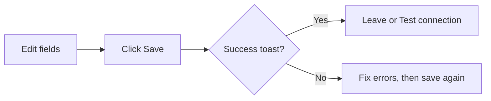

# 10 Settings (UI operations)

Path: **Settings / System settings**.

Settings is the console that makes the product runnable: models, watchlist, notifications, data sources, language, and theme. **Save after each group of edits** and wait for success before leaving the page.

> 💡 **UI only**  
> This chapter does not explain how to apply for cloud API keys or map Docker ports. See the [Full guide (EN)](../full-guide_EN.md) and [Beginner client setup](../beginner-client-setup.md) (Chinese).

## When to use it

| Scenario | Blocks to touch |
| --- | --- |
| First launch | AI models + watchlist |
| English menus, Chinese reports | UI language vs report language (independent) |
| No push messages | Notification channels + test send |
| Empty news / catalysts | Search / news keys |
| New machine / reinstall | Config backup export / import (especially desktop) |

## Save discipline (most important)

| Habit | Why |
| --- | --- |
| Save immediately | Unsaved changes leave Home showing gaps |
| Test connection after save | Avoid testing the previous config |
| Change one concern per save | Easier isolation when something breaks |

> ⚠️ **Where is Save?**  
> Often at the bottom or in a top toolbar. On narrow screens, scroll once before assuming it is missing.

## AI and models

1. Add a provider (Anspire, AIHubMix, OpenAI-compatible, local Ollama, …).  
2. Paste the API key; select or refresh the model list.  
3. Set the **primary analysis model**; optionally a separate Agent / chat model.  
4. Run **Test connection**.  
5. Local models: browse/install/register in the local-model panel when the client provides one.

### Beginner defaults

| Item | Suggestion |
| --- | --- |
| Providers | **One** stable cloud provider is enough to start |
| Primary model | Provider’s general analysis / chat recommendation |
| Agent model | Same as primary until you need to split spend |
| Advanced knobs | Keep defaults |

### Glossary

| Term | Meaning |
| --- | --- |
| **API Key** | Secret credential — never post it in chat screenshots |
| **Base URL** | Root URL for OpenAI-compatible endpoints |
| **Primary analysis model** | Default model for single-stock reports |
| **Agent / chat model** | Model for multi-turn chat; may differ |

## Basics and watchlist

- Edit the watchlist as comma-separated codes, e.g. `600519,hk00700,AAPL`.  
- After save, Home and Analysis pickers update.  
- Code formats: see [03 Analysis workbench](03-analysis-workbench_EN.md).

## Data sources and news

- Fill enhanced market or search keys as needed (Tushare, SerpAPI, Tavily, …).  
- **Technical analysis can still run without news keys**, but sentiment and catalysts degrade.  
- Free quotes work with zero config; add tokenised sources when you need stability.

## Notifications

1. Fill webhook, bot token, chat id, or mailbox fields per channel.  
2. Use **Test send** when available.  
3. Adjust verbosity / per-stock push switches as offered.  
4. Alert pushes also require enabled rules in the Signal center.

| Example channel | What you prepare |
| --- | --- |
| WeCom / Feishu | Bot webhook |
| Telegram | Bot token + chat id |
| Discord | Webhook URL |
| Email | Sender account and auth method |

> 💡 **Receive first, multiply later**  
> Enable one channel you actually read; add more only after it works.

## Language, theme, and other

| Item | Note |
| --- | --- |
| **UI language** | Menus and buttons; does not rewrite report bodies |
| **Report language** | Report text and some notification report copy (`zh` / `en` / `ko`, …) |
| **Theme** | Light / dark; often stored on-device |
| **Admin password** | When login is enabled |
| **Usage / cost** | Model spend visibility |
| **Config backup** | Import / export; export before desktop reinstall |

## Use cases

**A — Zero to first analysis**  
Add one cloud model → save → test OK → watchlist `600519` → save → Home gap clears → run Analysis.

**B — English UI, Chinese reports**  
Switch UI language only; keep report language `zh`.

**C — Notification debugging**  
Test send in Settings → fix token/webhook if needed → confirm Signal rules are enabled and not in cooldown.

## Out of scope here

Cloud account signup, server ports, Docker maps, and GitHub Actions secret lists belong in deployment docs, not this UI manual.

## Related

- [01 Shell](01-shell_EN.md)
- [02 Home](02-home_EN.md)
- [06 Signal center](06-signals_EN.md)
- [Beginner client setup](../beginner-client-setup.md) (CN)

Previous: [09 Backtest](09-backtest_EN.md) · Next: [11 Daily workflows](11-daily-workflows_EN.md)
