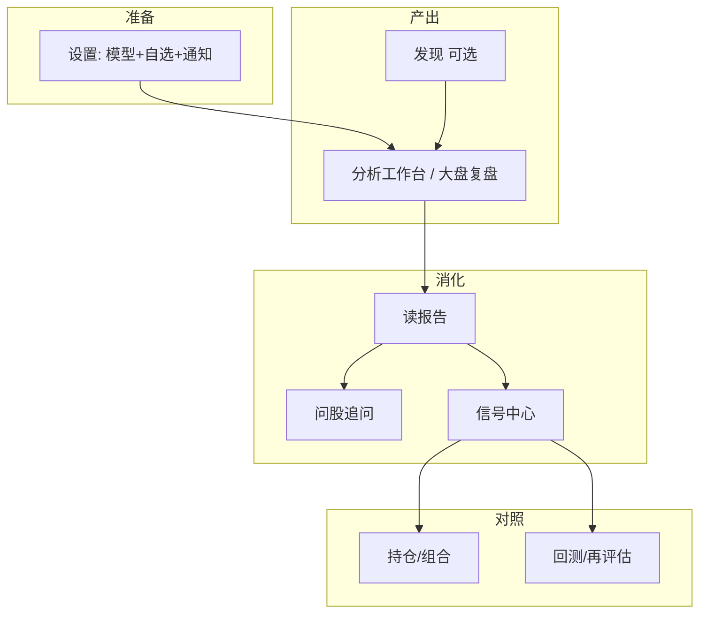

# 11 日常工作流与应用场景

## 本章你会学会

1. 用五条主链路把设置、分析、信号、持仓、复盘串起来  
2. 按「每天 5 分钟 / 深度 1 小时 / 周末复盘」固定节奏使用  
3. 按角色（新手、上班族、记账、研究、多市场）选用法  
4. 查场景菜谱与组合技，而不是每次从零摸索  
5. 避开连跑、规则风暴等反模式  

> 📘 **本章定位**  
> 前几章说明各页面的操作；本章汇总 **跨页面的使用节奏与场景**。按钮级步骤以各模块正文为准，避免与单章长文重复。

> ✅ **三条原则**  
> 1. **少而稳**：固定入口，先结论与风险，再深挖。  
> 2. **同日同票不无意义连跑**：费额度、毁复盘。  
> 3. **系统不代替下单**：输出仅供研究，**不构成投资建议**。

> 🧭 **什么时候直接打开本章**  
> - 已经会点菜单，但不知道「一天怎么过」  
> - 想找「我这种人」的用法  
> - 想抄组合技 / 问股问法 / 自动化场景  

---

## 目录速览

| 节 | 内容 |
| --- | --- |
| §1 | 五条主链路（总图） |
| §A | 固定节奏教程 |
| §B | 按角色 |
| §C | 场景菜谱表 |
| §D | 组合技（花样用法） |
| §E | 问股问法 |
| §F | 通知与定时自动化 |
| §G | 持仓相关 |
| §H | 反模式 |
| §I | 短表速查 + 卡住排障 |

---

## 1. 先认清五条主链路

> 🖼️ **配图占位** · `assets/workflows-chain-zh.png`  
> **应配内容**：（可选）信息图：配置→研究→盯盘→对照→复盘五条链路；亦可用正文 mermaid 代替实拍。  
> **拍摄要点**：若用截图拼贴，需统一简体 UI 且脱敏；优先保持 mermaid。  
> **状态**：待补图（清单：[assets/PLACEHOLDERS.md](assets/PLACEHOLDERS.md)）

| 链路 | 你在解决什么 | 关键页 |
| --- | --- | --- |
| 配置链 | 能连上模型、知道分析谁、能收到推送 | [10 设置](10-settings.md) |
| 研究链 | 从候选到一份可读报告 | [12](12-discover.md) → [03](03-analysis-workbench.md) → [08](08-reading-reports.md) |
| 盯盘链 | 不每天重读长文，只盯关键条件 | [06 信号](06-signals.md) + 通知 |
| 对照链 | 建议 vs 真实仓位 | [07 持仓](07-portfolio.md) |
| 复盘链 | 自己的用法有没有用 | [09 回测](09-backtest.md) + 信号再评估 |

---

## A. 固定节奏（教程向）

> 💡 **提示**  
> 节奏可以裁剪，但 **顺序** 尽量固定：先首页筛选 → 再信号 → 再持仓 → 最后深挖。顺序乱了容易重复提交却没有读完结果。

### A1. 每天大约 5 分钟（维护型）

适合：已经配好模型，有少量自选或持仓。

1. 打开 **首页**（`/`）：看焦点、待办，以及 **今日定时任务**（只读）。  
2. 打开 **信号中心**（铃铛 / `Cmd+K` 搜信号 / `/signals`）：状态筛 `active`，只扫动作与失效条件。  
3. 若有持仓：侧栏 **组合**（`/portfolio`），看集中度、异常、旁边 AI 建议是否对得上。  
4. 最多挑 **1 只**仍有疑问的：打开最近报告，或 **Agent / 问股** 只问一句失效条件。

> ⚠️ **注意**  
> 通知建议先保证 **一个** 渠道测试通过，再增加其他渠道（见 [10 设置](10-settings.md)）。渠道多却都未验证时，排障会更困难。

### A2. 深度研究一只股票（30～60 分钟）

适合：新标的、重仓、或周末专门研究。

0. （可选）没有标的时，先去 [12 发现](12-discover.md) 筛候选。  
1. **研究 → 分析工作台** 提交该股（可先 brief / 新手）。  
2. 按 [08 阅读报告](08-reading-reports.md) 固定顺序读：结论 → 风险 → 价位 → 资讯。  
3. 历史趋势：同一只过去几次结论是否反复变化。  
4. 问股只追问观察点与失效条件（问题里写清代码）。  
5. 需要盯价：`/signals?tab=rules&createRule=1` 建简单价格规则 → 试运行 → 启用。  
6. 若已持有：回持仓页对数量与成本，**不要**把信号动作当自动调仓。

### A3. 周末复盘「自己的用法」（不是复盘行情本身）

1. **研究 → 回测**（`/research/backtest`）：历史建议大致方向表现。  
2. 信号中心 **再评估与统计**（`/signals?tab=review`）：hit / miss、反馈。  
3. 设置里微调模型或默认策略——**不要**靠疯狂改自选制造噪音。  
4. 导出一次配置备份（高级 → 配置备份），给未来的自己留后路。

### A4. 第一次从零到第一份报告（45～90 分钟）

| 步 | 做什么 | 成功长什么样 |
| --- | --- | --- |
| 1 | 安装并打开 Web/桌面 | 能进首页 |
| 2 | 设置 → 模型接入 → 保存 → 测试连接 | 测试成功 |
| 3 | 自选填 1 个熟悉代码并保存 | 首页缺口提示减轻 |
| 4 | 工作台分析 1 只 + brief | 任务完成 |
| 5 | 按 08 读结论与风险 | 你能复述三条风险 |
| 6 | （可选）测通一个通知渠道 | 手机/群收到测试消息 |

卡住时：停下来读错误原文，优先查 Key、额度、网络，不要连点「开始分析」。

---

## B. 按角色的用法（你是谁）

### B1. 纯新手：只想先「跑通」

**目标**：今晚有一份能读完的报告，不追求完美配置。

- 设置：一个云端模型 + 1 只自选。  
- 工作台：`600519`（或你认识的票）+ 默认策略 + 新手/brief。  
- 报告：只读操作建议 + 风险三条。  
- 先不要：批量 20 只、复杂规则、多渠道通知、频繁换 Skill。

### B2. 上班族：只能早晚看一眼

**目标**：用自动化 + 推送，少点开网页。

1. 设置 → 调度：交易日固定时间自动分析自选（需长运行进程）。  
2. 通知：企业微信/飞书/Telegram **只留一个** 主力渠道，先测推送。  
3. 信号规则：只对持仓或 1～2 只重仓设价格提醒。  
4. 早上：首页看「今日定时任务」是否跑过 + 焦点 1～2 行。  
5. 晚上：信号流扫 `active`，需要再打开报告。

### B3. 持仓记账型：更在意仓位事实

**目标**：建议和真实持仓对照，而不是堆报告。

1. 组合：建账户 → 导入或手录持仓。  
2. 对持仓代码批量分析（brief），或只分析重仓。  
3. 信号中心 `scope=holdings`，优先看减仓/风险向动作。  
4. 持仓页看集中度；AI 建议只作旁注。  
5. 每周：再评估 + 更新成交，而不是每天重跑全部仓位。

### B4. 研究向：愿意深挖、愿意写笔记

**目标**：同一只票纵向对比 + 问股追问 + 自己的规则。

1. 发现或自选 → 工作台 detailed（额度够时）。  
2. 历史趋势对比多次结论。  
3. 问股固定模板（见下文「花样问法」）。  
4. 把失效价位写进规则或自有笔记。  
5. 周末回测 + 再评估，调整默认 Skill，而不是天天换。

### B5. 多市场：A 股 + 港股 + 美股混着看

| 市场 | 代码习惯 | 注意 |
| --- | --- | --- |
| A 股 | `600519`、`300750` | 别只写公司名 |
| 港股 | `hk00700` | 别漏 `hk` |
| 美股 | `AAPL` | 大小写一般按界面习惯 |

- 自选用英文逗号混写：`600519,hk00700,AAPL`。  
- 调度时区、静默时段按你实际盯盘时区设（设置 → 通知 / 调度）。  
- 大盘复盘偏 A 股气质时，不要直接当美股个股结论。

---

## C. 场景菜谱（目标 → 点哪里）

| 我想… | 推荐路径 | 花样 / 注意 |
| --- | --- | --- |
| 尽快出第一份报告 | 设置就绪 → 工作台 1 只 + brief | 不要一上来 detailed + 10 只 |
| 看市场温度 | 大盘复盘 → 首页晨报入口 | 别当个股下单指令 |
| 没有标的可分析 | 发现 → 候选转分析 | 实验能力；候选再进工作台 |
| 到价提醒 | 信号 → 规则 → 价格条件 | 先试运行再启用 |
| 手机能收到推送 | 设置通知 → 测试推送 | 先一个渠道；查推送历史 |
| 每天自动跑自选 | 设置 → 调度 + 首页只读任务 | 进程要长运行 |
| 对照真实仓位 | 组合记账 → 信号 scope=holdings | 系统不会自动买卖 |
| 报告看不懂一段 | 报告 → 继续问股 | 一次只问一件事 |
| 两只票对比 | 问股写清两代码；或各跑一份再问 | 防串上下文 |
| 看行情图不是长文 | `/stocks/代码` | 要 AI 结论仍回工作台 |
| 周末查自己靠不靠谱 | 回测 + 信号再评估 | 改的是用法，不是赌下一把 |
| 英文界面中文报告 | 设置语言分开配 | 互不影响 |
| 重装桌面不丢配置 | 高级 → 配置备份导出/导入 | 导入前看覆盖提示 |
| 省额度 | brief、少批量、问股不重写整章 | 历史对比代替连跑 |
| 本地模型试玩 | 设置 → 本地模型 | 问股工具可能受限 |
| 模型包（若界面有） | 本地模型 → Import pack | 未合入版本可能无入口 |

---

## D. 组合技（花样用法）

### D1. 「发现 → 分析 → 信号 → 持仓」漏斗

适合：想从一堆候选收到 1～2 只可盯的。

1. [12 发现](12-discover.md) 筛一轮，记下 3～5 个代码。  
2. 工作台 **brief 批量** 这 3～5 只。  
3. 历史里只精读 1～2 只（结论 + 风险）。  
4. 信号中心关掉明显噪声；对留下的建 1 条价格规则。  
5. 若准备跟踪持仓，再进组合建账——**先研究后记账**，别反着来制造幻觉仓位。

### D2. 「大盘气质 + 个股报告」双读

1. 先跑或打开最新 [大盘复盘](04-market-review.md)，用 2 分钟抓市场风险偏好。  
2. 再读个股报告的风险与催化——问自己：大盘偏防守时，这只票的逻辑是否更脆？  
3. 不要把大盘「偏多」直接理解为应对某只股票重仓。

### D3. 「报告骨架 + 单点追问」

1. 工作台用 brief/新手出骨架。  
2. 只对 **一个** 不懂的点问股（失效 / 估值假设 / 事件时间线）。  
3. 把可观察价位写进规则或笔记。  
4. 需要全文时再开 detailed **一次**，而不是问股里让它重写整篇报告。

### D4. 「静默时段 + 交易时段推送」

1. 通知里设静默时段（如 23:00–07:00）和时区。  
2. 规则只在你愿意被打扰的时段真正「吵」到你。  
3. 推送历史里区分：规则没触发 vs 渠道失败 vs 被静默/冷却吃掉。

### D5. 「命令面板高速键」

不用记所有菜单：

| 输入 | 常去 |
| --- | --- |
| `分析` / `工作台` | 分析工作台 |
| `信号` | 信号中心 |
| `持仓` / `组合` | 持仓 |
| `设置` | 设置 |
| `600519` 等代码 | 个股或分析预填（以面板结果为准） |

### D6. 「自选短、规则更短」

- 自选 5～15 只够日常；上百只适合当池子，不适合全 brief 每天烧。  
- 告警规则优先 **持仓 + 重仓**，而不是自选里每只都建。  
- 定时任务跟自选走时，自选越长，账单越长。

### D7. 「同一只票的三份材料」

研究日结束时，你最好能指着三样东西：

1. 最新报告（工作台历史）  
2. 一条 active 信号或价格规则（信号中心）  
3. （若持有）持仓行上的数量/成本（组合）  

缺哪一块，就补哪一块——这比再跑第十次分析更有用。

---

## E. 问股花样问法（可复制改写）

每次只问一件事，并写清代码。

| 场景 | 示例问法 |
| --- | --- |
| 失效条件 | 「只讨论 600519：请条目列出当前建议的失效条件；收盘跌破何价应重新评估？」 |
| 已持仓观察 | 「我已持有 hk00700。请只列加减仓前应观察的条件，不要给仓位比例。」 |
| 风险三条 | 「用三条以内概括 AAPL 主要风险，不要重复报告里的技术指标堆砌。」 |
| 事件时间线 | 「若报告提到某事件，请整理时间线与仍不确定的点。」 |
| 两标的对比 | 「对比 300750 与 002594 近阶段趋势差异与各自主要风险，不要下单指令。」 |
| 防串股 | 「请切换到 300750，清空对 600519 的讨论，只谈估值与负债。」 |
| 与持仓对照 | 「结合『我重仓、不愿频繁交易』的前提，哪些信号动作应降权看待？」 |

反面教材：「全面分析并告诉我能否重仓」——问题过大，且逼近下单指令。

---

## F. 通知与定时：自动化场景

### F1. 收盘后自动分析 + 手机摘要

1. 自选维护好当日要跑的代码。  
2. 设置 → 调度：设收盘后时间，保存。  
3. 通知：报告类路由到你的主力渠道；可开「仅推送摘要」省刷屏。  
4. 次日首页核对「今日定时任务」状态；失败的再手动补跑。

### F2. 规则响了但手机没响

排查顺序（别先删规则）：

1. 信号中心 → 推送历史：渠道错误码？  
2. 设置 → 该渠道 → 测试推送。  
3. 静默时段 / 冷却 / 最低通知等级是否吞掉。  
4. 渠道路由是否把告警指到了空渠道。

### F3. 插件渠道

部署加载了额外通知插件时，设置通知区可能多出卡片；配置方式仍是「填字段 → 测试 → 保存」。没有插件的部署不会凭空出现入口。

---

## G. 持仓相关场景

### G1. 券商 CSV 导入后第一次对照

1. 导入 → **预览** → 确认账户。  
2. 对前 3 大重仓跑 brief 分析。  
3. 信号 `scope=holdings` 扫风险向。  
4. 持仓页看行业/个股是否过集中。

### G2. 纸交易 / 模拟（若界面提供）

用模拟账户练「记账 → 分析 → 信号」闭环，再决定是否录实盘。实盘与模拟账户分开，避免看混盈亏。

### G3. 一键分析持仓

若持仓页提供批量/一键分析：先确认会跑多少只、是否 brief，避免误点烧额度。

---

## H. 反模式（尽量别这样用）

| 反模式 | 为什么糟 | 更好的做法 |
| --- | --- | --- |
| 同一只票一天跑 10 次 | 费钱、信号噪声 | 跑 1 次 + 问股 + 历史对比 |
| 规则建 50 条从不试运行 | 推送风暴或全静音 | 先 1 条试运行 |
| 只看「买入」标签 | 忽略失效与风险 | 固定阅读顺序 |
| 把大盘复盘当个股指令 | 范畴错误 | 双读：大盘气质 + 个股报告 |
| 不保存就测连接 | 就绪检查仍显示未完成 | 保存 → 测试 → 离开 |
| 本地 CLI 硬撑 Agent 工具 | 工具不可用却怪产品 | 问股走支持工具的路径 |
| 自选 200 只全 detailed 日更 | 账单爆炸 | 分层：池子 / 观察 / 重仓 |

---

## I. 场景速查（短表）

| 我想… | 去哪 |
| --- | --- |
| 第一份报告 | 分析工作台 |
| 市场温度 | 大盘复盘 |
| 找候选 | 发现 |
| 到价提醒 | 信号 → 规则 |
| 每天自动跑 | 设置 → 调度 |
| 推送 | 设置 → 通知 |
| 记账对照 | 组合 |
| 改模型 | 设置 → AI 与模型 |
| 看图 | `/stocks/代码` |
| 追问一句 | Agent / 问股 |
| 查自己准不准 | 回测 + 再评估 |

---

## 常见卡住

**信号中心是空的？** 先成功跑完个股分析。  
**持仓没有 AI 建议？** 异步加载或没有 active；对持仓跑分析即可。  
**设置填了仍提示缺口？** 多半没保存或测试未通过。  
**问股发不出去？** 查模型与是否本地 CLI 限制工具调用。  
**定时没跑？** 进程是否长运行；调度是否启用；首页任务是只读状态。  
**发现里候选很怪？** 实验能力，交叉验证后再进工作台。

---

## 相关

[02 首页](02-home.md) · [03 分析工作台](03-analysis-workbench.md) · [05 问股](05-agent-chat.md) · [06 信号中心](06-signals.md) · [07 持仓](07-portfolio.md) · [08 阅读报告](08-reading-reports.md) · [10 设置](10-settings.md) · [12 发现](12-discover.md)

上一篇：[10 设置](10-settings.md) · 下一篇：[12 发现](12-discover.md)
