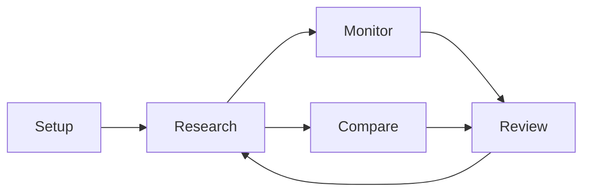

# 11 Daily workflows and application scenarios

## What you will learn

1. Combine pages into fixed daily/weekly rhythms instead of isolated clicks  
2. Choose a role-based setup (beginner, office hours, bookkeeping-first, research-heavy, multi-market)  
3. Reuse scenario recipes, combo techniques, and Agent prompt patterns  
4. Avoid high-cost anti-patterns and recover when a path is empty or stuck  

Earlier chapters teach single pages. This one shows **how to combine them**: daily/weekly rhythms, roles, concrete goals, and multi-page recipes.

Principles:

1. **Few and steady** — fixed entry points; read conclusion and risk first.  
2. **Do not re-run the same symbol repeatedly** the same day — wastes quota and confuses review.  
3. Research only — **not investment advice**.

---

## Five main chains

| Chain | Problem it solves | Pages |
| --- | --- | --- |
| Setup | Model, watchlist, push | [10 Settings](10-settings_EN.md) |
| Research | Candidate → readable report | [12](12-discover_EN.md) → [03](03-analysis-workbench_EN.md) → [08](08-reading-reports_EN.md) |
| Monitor | Track conditions without rereading long reports | [06 Signals](06-signals_EN.md) + notifications |
| Compare | Advice vs real positions | [07 Portfolio](07-portfolio_EN.md) |
| Review | Did *your* process work? | [09 Backtest](09-backtest_EN.md) + signal review |

---

## A. Fixed rhythms (tutorial)

### A1. ~5 minutes daily (maintenance)

1. **Home** — focus, todos, **Today’s scheduled tasks** (read-only).  
2. **Signal Center** (bell / palette / `/signals`) — `active` only.  
3. **Portfolio** if you bookkeep — concentration and oddities.  
4. At most **one** doubtful name — latest report or one Agent question on invalidation.

Keep **one** notify channel that tests green before stacking more.

### A2. Deep dive (30–60 minutes)

0. Optional: [12 Discover](12-discover_EN.md).  
1. Workbench with Beginner/brief.  
2. Read via [08](08-reading-reports_EN.md): conclusion → risk → levels → news.  
3. History trend for conclusion reversals on the same code.  
4. Agent for observation/invalidation (codes explicit).  
5. Simple price rule at `/signals?tab=rules`.  
6. If you hold it — match size/cost on Portfolio; signals never auto-trade.

### A3. Weekend process review

Backtest → Signal Center review/stats → light Settings tuning — not watchlist thrashing. Export a config backup once.

### A4. Zero → first report (45–90 min)

| Step | Action | Success looks like |
| --- | --- | --- |
| 1 | Open UI | Home loads |
| 2 | Model + Save + test | Connection OK |
| 3 | One watchlist code + Save | Gap banner eases |
| 4 | Workbench 1 symbol + brief | Task completed |
| 5 | Read conclusion + 3 risks | You can restate them |
| 6 | Optional: test one notify channel | Test message arrives |

---

## B. By role

### B1. Pure beginner

One cloud model + one symbol + default Skill + Beginner/brief. Skip bulk runs, complex rules, multi-channel notify.

### B2. Office hours only

Scheduling after the close + one push channel + rules only on holdings/top names. Morning: Home tasks + 1–2 focus rows. Evening: signal feed.

### B3. Bookkeeping-first

Portfolio account → analyze holdings (brief) → signals `scope=holdings` → weekly review, not daily full re-runs.

### B4. Research-heavy

Discover or watchlist → detailed when quota allows → history compare → fixed Agent templates → weekend backtest; freeze Skill choice for a while.

### B5. Multi-market

| Market | Code habit |
| --- | --- |
| A-shares | `600519` |
| HK | Prefer `hk00700` (other forms may normalize—trust the result shown) |
| US | `AAPL` |

Comma-separated watchlists; set quiet hours / schedule timezone to your actual screen time.

---

## C. Scenario recipes

| Goal | Path | Notes |
| --- | --- | --- |
| First report tonight | Settings readiness → Workbench 1× brief | Not detailed × 10 |
| Market mood | Market review | Not a single-name ticket |
| No ideas | Discover → Workbench | Experimental |
| Price alert | Signals → Rules | Dry-run first |
| Phone push | Settings → Notifications | One channel first |
| Daily auto run | Settings → Scheduling | Long-running process |
| Vs real book | Portfolio + holdings scope | No auto trade |
| One unclear paragraph | Report → Agent | One question at a time |
| Compare two names | Agent with both codes | Avoid context mix |
| Charts only | `/stocks/{code}` | AI still needs Workbench |
| Am I any good? | Backtest + review | Tune process, not next gamble |
| EN UI / ZH reports | Separate language settings | Independent |
| Reinstall desktop | Config backup export/import | Read overwrite warnings |
| Save quota | brief, small batches, point Agent questions | History beats re-runs |

---

## D. Combo techniques

### D1. Discover → analyze → signal → portfolio funnel

5 candidates → brief batch → deep-read 1–2 → 0–1 price rules → book only if you will track.

### D2. Market review + single-stock dual read

2 minutes market tone, then stock risks/catalysts. Do not translate “market bullish” into “full size that name”.

### D3. Brief skeleton + point Agent follow-up

Brief first → one Agent question (invalidation/levels) → one detailed run only if needed.

### D4. Quiet hours + session-time push

Quiet overnight; use delivery history to separate no-trigger vs channel fail vs quiet/cooldown.

### D5. Command palette shortcuts

Try keywords such as: analysis, signals, portfolio, settings, or a ticker.

### D6. Short watchlist, shorter rules

5–15 daily names; rules prefer holdings, not every watchlist row.

### D7. Three artifacts per name

Latest report + one active signal/rule + (if held) portfolio row.

---

## E. Agent prompt patterns (copy/adapt)

| Scenario | Example |
| --- | --- |
| Invalidation | “Only 600519: list invalidation conditions; which close price forces re-eval?” |
| Already holding | “I hold hk00700. List conditions before add/reduce; no position sizing.” |
| 3-minute summary | “Three bullets: core thesis + main risks for AAPL; no indicator dump.” |
| Event timeline | “If M&A/earnings appear: happened / pending / still uncertain.” |
| Compare | “Compare 300750 vs 002594 trends and risks; no order tickets.” |
| Anti-mix | “Switch to 300750 only; drop 600519 context.” |

Avoid: “Full analysis and tell me to go all-in.”

---

## F. Automation scenarios

**After-close auto + phone digest:** watchlist → schedule → one channel + optional summary-only → next day check Home scheduled tasks. Process must stay long-running.

**Rule fired, phone silent:** delivery history → test push → quiet hours/cooldown/routing — do not delete-and-recreate rules first.

**Plugin channels:** appear only if deploy loaded plugins; still fill → test → save. Contracts: `docs/notifications.md`.

---

## G. Portfolio scenarios

CSV import → preview → brief on top 3 → holdings-scope signals → concentration check.  
Paper vs live accounts stay separate. One-click analyze: count symbols and brief/detailed first.

---

## H. Anti-patterns

| Anti-pattern | Better |
| --- | --- |
| 10 runs same day | 1 run + Agent + history |
| 50 rules, no dry-run | 1 rule dry-run |
| Only read “buy” | Fixed reading order |
| Market review as stock order | Dual read |
| Type key, never Save | Save → test → leave |
| Local CLI for tool-heavy Agent | Tool-capable path |
| 200 names full detailed daily | Pool / watch / core tiers |

---

## Stuck?

| Symptom | First check |
| --- | --- |
| Empty signals | Run analysis on Workbench |
| Empty portfolio AI | Analyze holdings codes |
| Setup gap after typing | Save + test connection |
| Chat fails | Model / tool-capable backend |
| Schedule idle | Long-running process + enabled schedule |
| Notify silent | Delivery history vs Settings test push |

---

## Self-check

- [ ] Can name your default daily 5-minute path  
- [ ] Know which chain you are on (research / monitor / review)  
- [ ] HK codes prefer `hk00700` style when unsure  
- [ ] No same-day repeated re-run habit  
- [ ] At least one green notify path before relying on rules  

---

## Related

- [02 Home](02-home_EN.md)  
- [03 Analysis Workbench](03-analysis-workbench_EN.md)  
- [05 Agent chat](05-agent-chat_EN.md)  
- [06 Signal Center](06-signals_EN.md)  
- [07 Portfolio](07-portfolio_EN.md)  
- [08 Reading reports](08-reading-reports_EN.md)  
- [10 Settings](10-settings_EN.md)  
- [12 Discover](12-discover_EN.md)  

Prev: [10 Settings](10-settings_EN.md) · Next: [12 Discover](12-discover_EN.md)
