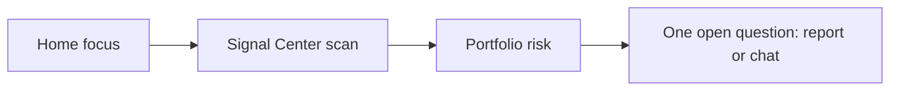

# 11 Daily workflows and UI FAQ

This chapter chains earlier modules into “how I use StockPulse every day”. If you keep only one chapter, keep this one.

> 💡 **Principle**  
> Few stable entry points. Read conclusion and risk first. Do not re-run the same symbol dozens of times without a reason.

## Recommended workflows

### A. About five minutes (maintenance)

1. **Home** (`/`) — focus and todos.  
2. **Signal Center** (bell → View all, command palette “signal”, or `/signals` — **not** in the primary sidebar) — `active` signals only.  
3. **Portfolio** sidebar (`/portfolio`; page title may say Holdings) — risk if you track holdings.  
4. One doubtful name — latest report or **Agent** chat (`/chat`) about invalidation.

**Config tip**: start with reliable delivery on one channel; add more channels later ([10 Settings](10-settings_EN.md)).

### B. Deep dive (30–60 minutes)

0. (Optional) No symbol yet? Use **Research → Discover** ([12](12-discover_EN.md)) hotspots/strategies, then **Analyze**.  
1. Submit the symbol under **Research → Analysis Workbench** (`/research/analysis`; optional Skill).  
2. Read with [08 Reading reports](08-reading-reports_EN.md).  
3. Compare **history trend**.  
4. **Agent chat** for observation / invalidation conditions (write codes clearly).  
5. Optional simple **alert rules** at `/signals?tab=rules`.

### C. Weekly process review

1. Run **Research → Backtest** (`/research/backtest`) on historical advice.  
2. Open Signal Center **Review & stats** (`/signals?tab=review`) for outcomes and useful / not-useful feedback.  
3. Tune model or default strategy in Settings — avoid noisy watchlist thrashing.

## Scenario cheat sheet

| I want to… | Go to | Note |
| --- | --- | --- |
| Get a first report fast | Research → Analysis Workbench | One ticker + Beginner |
| Market mood | Research → Market review | Separate from single-name advice |
| Price alerts | Signal Center → Rules (`/signals?tab=rules`) | Start simple |
| Track holdings | Portfolio / Holdings page | Create account first |
| Change model / key | Settings → AI | Save, then test |
| Report language | Settings report language | Independent of UI language |

## UI FAQ

**Analysis spins forever?** Check Running tasks for failures (key, quota, network, ticker format). Fix, then retry.

**UI language ≠ report language?** Expected. They are configured separately.

**Signal Center empty?** Need successful single-stock analyses with extracted signals. Very old history may not backfill.

**Portfolio has no AI suggestion?** Signals load asynchronously; empty placeholder means no active signal yet.

**CSV import fails?** Use preview; fix headers, oversolds, duplicates.

**Chat mixes tickers?** State the code; for comparison write “compare AAPL and MSFT”.

**Home always incomplete?** Confirm Save succeeded, model test passed, watchlist non-empty.

## Habits

| Habit | Why |
| --- | --- |
| Never paste API keys into chat screenshots | Quota theft |
| Always Save settings | Unsaved = not configured |
| Treat output as research input | You own risk |
| Small batches | Cost and cognitive load |

## Related

- [Manual home](README_EN.md)
- [Beginner client setup](../beginner-client-setup.md) (CN)
- [FAQ](../FAQ_EN.md)
- [Full guide](../full-guide_EN.md)

Previous: [10 Settings](10-settings_EN.md) · Back: [Manual home](README_EN.md)
