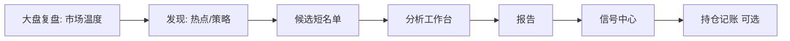
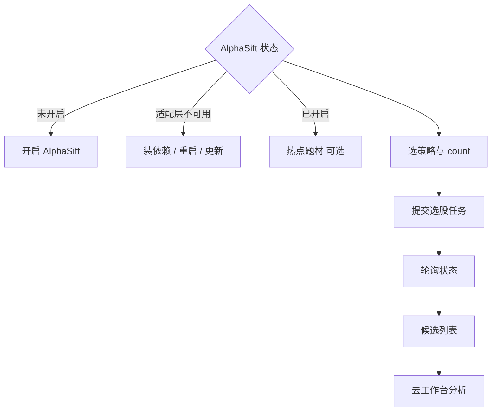

# 12 发现（AlphaSift 选股）

「发现」页的导航名是 **发现**，页面标题常常是 **AlphaSift 选股**。

它做的事是：在策略或热点题材约束下，帮你生成一份 **候选股票短名单**，再交给分析工作台深挖。

它 **不是**：

- 「保证赚钱的荐股黑箱」  
- 自动下单或自动建仓  
- 可以替代大盘复盘与个股报告的完整研究  

目前仍是 **实验能力**。

> ⚠️ **注意**  
> 结果仅供研究与辅助判断，**不构成投资建议**。交易决策与损益由你自己承担。  
> 使用前需要：相关能力开启、后端 AlphaSift 适配层与依赖可用。

> 📘 **概念**  
> **发现** = 候选漏斗的上游；**工作台** = 真正写报告；**信号** = 报告之后可管理的建议；**持仓** = 你的真实账本。顺序不要反着来。

---

## 1. 怎么进入

> 🧭 **入口**

| 方式 | 路径 |
| --- | --- |
| 导航 | **研究** → **发现** |
| 地址 | `/research/discover` |
| 命令面板 | 搜「发现」「选股」「AlphaSift」 |
| 旧路径 | `/screening` 常会跳转过来 |

### 1.1 可收藏参数示例

```text
/research/discover?market=cn&strategy=dual_low&count=3
```

| 参数 | 含义 | 备注 |
| --- | --- | --- |
| `market` | 市场 | 实现里常见默认 `cn`（A 股） |
| `strategy` | 策略标识 | 如 `dual_low`；非法时回落默认 |
| `count` | 返回数量 | 1～100，默认常见为 `3` |

参数不合法时会回落安全默认，避免坏书签把页面卡死。

---

## 2. 新手要不要用？

| 你的阶段 | 建议 |
| --- | --- |
| 还没跑通第一份个股报告 | **先跳过**，去工作台 |
| 模型未配置 / 无 API Key | 先去设置；发现也可能依赖 LLM 重排 |
| 模型已通、想找主题线索 | 可以用热点题材 |
| 想试策略筛票 | 返回数量先设 **3～10** |
| 想一天挖 50 只「金矿」 | **不适合**；发现是漏斗口，不是印钞机 |

> ✅ **推荐做法**  
> 发现 3～5 只 → brief 分析 1～2 只 → 精读风险 → 再谈自选或信号。  
> ❌ **不推荐**  
> 把候选第一名直接当买入指令；或 count=100 全 detailed 烧额度。

---

## 3. 和别的页面怎么配合



| 页面 | 分工 |
| --- | --- |
| [04 大盘复盘](04-market-review.md) | 市场气质与风险偏好 |
| **发现（本页）** | 可研究的候选池 |
| [03 分析工作台](03-analysis-workbench.md) | 真正写报告 |
| [08 阅读报告](08-reading-reports.md) | 固定顺序消化 |
| [06 信号中心](06-signals.md) | 报告之后才沉淀建议 |
| [13 个股工作区](13-stock-details.md) | 核价与 K 线，不替代报告 |

---

## 4. 页面结构（逛一圈）

> 🖼️ **配图占位** · `assets/discover-hotspots-zh.png`  
> **应配内容**：发现页：热点题材或策略选股主区域 + 候选列表/空状态之一。  
> **拍摄要点**：实验能力开启时拍摄；关闭时改拍能力说明/启用提示。  
> **状态**：待补图（清单：[assets/PLACEHOLDERS.md](assets/PLACEHOLDERS.md)）

| 区域 | 作用 |
| --- | --- |
| 启用状态 | 已开启 / 未开启 / 适配层不可用 |
| 风险提示 | 实验声明，每次都值得扫一眼 |
| 热点题材 | 题材热度、阶段、发酵路线、概念股（常默认折叠） |
| 策略选择 | AlphaSift 策略或自定义参数 |
| 参数 | 市场、策略参数、返回数量 1～100 |
| 运行选股 | 异步任务 + 状态轮询 |
| 候选结果 | 摘要、因子、风险、点「分析」 |
| 诊断条 | 缺 Key、限流、降级、日历等问题 |



---

## 5. 操作教程

### 5.1 第一次启用

1. 进入发现页 `/research/discover`。  
2. 若显示 **选股未开启**，点 **开启 AlphaSift**。  
3. 若提示 **适配层不可用**：  
   - 确认后端已安装相关依赖；  
   - 重启 Web / API / 桌面服务；  
   - 桌面端可考虑更新版本。  
4. 启用成功后再玩热点或策略。  
5. 若设置里有 AlphaSift 相关开关，与本页状态保持一致（见 [10 设置](10-settings.md)、[14 字段速查](14-settings-fields.md)）。

> 💡 **提示**  
> 发现是加速器，不是大门钥匙。开启失败时，用自选 + 工作台照样能完成主链路。

### 5.2 用热点找线索

1. 展开 **热点题材**（默认常折叠以减少噪音）。  
2. 需要新数据时点 **刷新**（避免连续重复点击，以免触发限流）。  
3. 点某个题材，看 **发酵路线 / 时间线** 与概念股。  
4. 注意质量标签：缓存回退、降级、缺失字段时，热度只当 **弱线索**。  
5. 对感兴趣的代码点 **分析** → 进入工作台（常带代码上下文）。  
6. 按 [08](08-reading-reports.md) 读风险，不追涨叙事。

> ⚠️ **注意**  
> 「暂无缓存热点」时：展开后点刷新拉取；没有数据不要硬编主题故事。

### 5.3 按策略筛一版

1. 选择策略（列表加载失败时可试自定义 / 手动参数——以界面为准）。  
2. 市场如 A 股 `cn`，`count` 先 **5**。  
3. 点 **运行选股**，等待异步任务。  
4. 轮询可能提示超时 / 网络抖动并自动重试——任务仍可能在后台跑。  
5. 若提示 **LLM 重排失败、已回退本地因子**：列表仍可看，但排序解释力变弱。  
6. 读每条：摘要、因子、风险列。  
7. 对前几名去工作台 **brief**，再决定是否进自选或 detailed。

### 5.4 任务中断与恢复

- 选股任务 ID 可能写入会话存储，刷新页面后尝试 **恢复任务状态**。  
- 若提示任务不可恢复 / 找不到：重新提交即可。  
- 离开页面再回来时，先看是否仍在「运行中」。

---

## 6. 常见提示与诊断

| 提示方向 | 你可以怎么理解 | 下一步 |
| --- | --- | --- |
| 缺少 LLM API Key | 重排或相关能力缺模型 | 设置 → 模型接入 |
| 请求过于频繁 | 限流 | 降频刷新 / 提交 |
| 数据源降级 | 结果能看但质量下降 | 当弱信号；必要时重试 |
| 暂无可用开市日 | 非交易时段或日历问题 | 更保守，或改时间再试 |
| 暂无缓存热点 | 还没拉过或缓存空 | 展开后刷新 |
| LLM 结果解析失败 | 保留了可用部分 | 读原始字段与因子 |
| 访问被拒绝 / 超时 / 网络中断 | 环境或上游问题 | 查网络、后端、代理 |
| 适配层不可用 | 依赖未装好 | 修部署后再开启 |
| 任务完成但无候选 | 上游空结果 | 换策略 / 降 count 预期 / 看诊断 |

> 📘 **概念：本地因子评分 vs LLM 重排**  
> 本地因子是可回退的打分路径；LLM 重排试图加入更「懂上下文」的排序。回退时 **不是零结果**，而是 **解释力变弱**——写在你的研究笔记里。

---

## 7. 使用案例

### 案例 A：主题线索

刷新热点 → 选你 **懂** 的行业 → 两只概念股进工作台 brief → 按 08 读风险，不追涨叙事。

### 案例 B：策略试跑短名单

策略 `count=5` → 读因子与风险列 → 第一名进工作台 → 其余先放自选观察，不要五只全 detailed。

### 案例 C：开启失败 / 实验不可用

先用自选 + 工作台跑通主链路，不要卡在发现页。

### 案例 D：漏斗用法

发现 5 只 → brief 批量 → 精读 1～2 → 信号规则 0～1 条 → 再考虑持仓记账。完整漏斗见 [11 · 组合技](11-daily-workflows.md)。

### 案例 E：和大盘一起看

先大盘复盘抓风险偏好 → 再看发现热点是否过热 → 个股报告里专门核对「题材退潮风险」。

### 案例 F：周末只做主题研究

只展开热点、不跑大 count 策略；每题材最多 2 个代码进工作台；形成主题观察清单而非交易清单。

### 案例 G：LLM 重排失败仍要用

接受本地因子排序 → 人工按你懂的行业重排 → 只分析你能解释商业模式的标的。

### 案例 H：参数书签协作

把 `/research/discover?market=cn&strategy=dual_low&count=5` 存书签；与同伴对齐同一漏斗入口（仍各自负责决策）。

---

## 8. 常见问题（FAQ）

**Q1：发现页和自选股有什么区别？**  
A：自选是你长期关心的列表；发现是一次性或阶段性的 **候选生成**。候选要进自选请主动加。

**Q2：为什么热点默认折叠？**  
A：减少首屏噪音与误刷新；需要时再展开。

**Q3：count 设 100 会更好吗？**  
A：通常不会。更长名单更难消化，也更容易刺激你无差别分析烧额度。

**Q4：策略列表加载失败怎么办？**  
A：刷新；检查 AlphaSift 状态与网络；尝试自定义参数；或暂时改用热点 / 自选。

**Q5：点「分析」后去哪了？**  
A：分析工作台发起流，带上代码；回来发现页不会自动变成报告页。

**Q6：这是官方荐股吗？**  
A：**不是。** 实验研究工具，不构成投资建议。

**Q7：非 A 股能用吗？**  
A：以当前策略与市场选项为准；许多默认路径偏 A 股 `cn`。不要假设全球市场完整覆盖。

**Q8：轮询一直转怎么办？**  
A：等自动重试；看任务失败提示；仍不行则重新提交并检查后端日志。

---

## 9. 离开前自检

| # | 自检项 | 通过标准 |
| --- | --- | --- |
| 1 | 主链路 | 已能在工作台出报告（否则发现非优先） |
| 2 | 启用状态 | 知道已开启 / 不可用原因 |
| 3 | count | ≤10 起步 |
| 4 | 诊断 | 读过降级 / 限流 / 缺 Key 提示 |
| 5 | 热点 | 缓存回退时不当强信号 |
| 6 | 下一步 | 候选进工作台，而非直接下单 |
| 7 | 额度 | 未对名单全 detailed |
| 8 | 记录 | 重要候选有简短研究笔记 |

---

## 10. 术语

| 术语 | 含义 |
| --- | --- |
| AlphaSift | 内置实验选股适配层 |
| 策略 | 一套筛选 / 评分规则 |
| 热点题材 | 主题热度与生命周期线索 |
| 发酵路线 / 时间线 | 题材如何扩散的路径 |
| 候选 | 短名单条目 |
| 本地因子评分 | 不靠 LLM 重排时的打分回退 |
| LLM 重排 | 用大模型调整候选顺序 |
| theme_heat | 将题材热度纳入评分的能力（策略相关） |
| count | 返回候选数量 |
| 适配层 | 后端与 AlphaSift 的对接层 |

---

## 11. 相关阅读

- [03 分析工作台](03-analysis-workbench.md)  
- [04 大盘复盘](04-market-review.md)  
- [08 阅读报告](08-reading-reports.md)  
- [10 设置](10-settings.md)  
- [11 日常工作流](11-daily-workflows.md)  
- [13 个股工作区](13-stock-details.md)  
- [AlphaSift 集成说明](../alphasift-integration.md)（实现向，可选）  

上一篇：[11 日常工作流](11-daily-workflows.md) · 下一篇：[13 个股工作区](13-stock-details.md)
