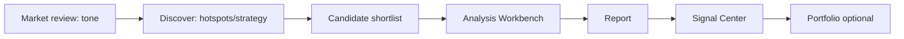
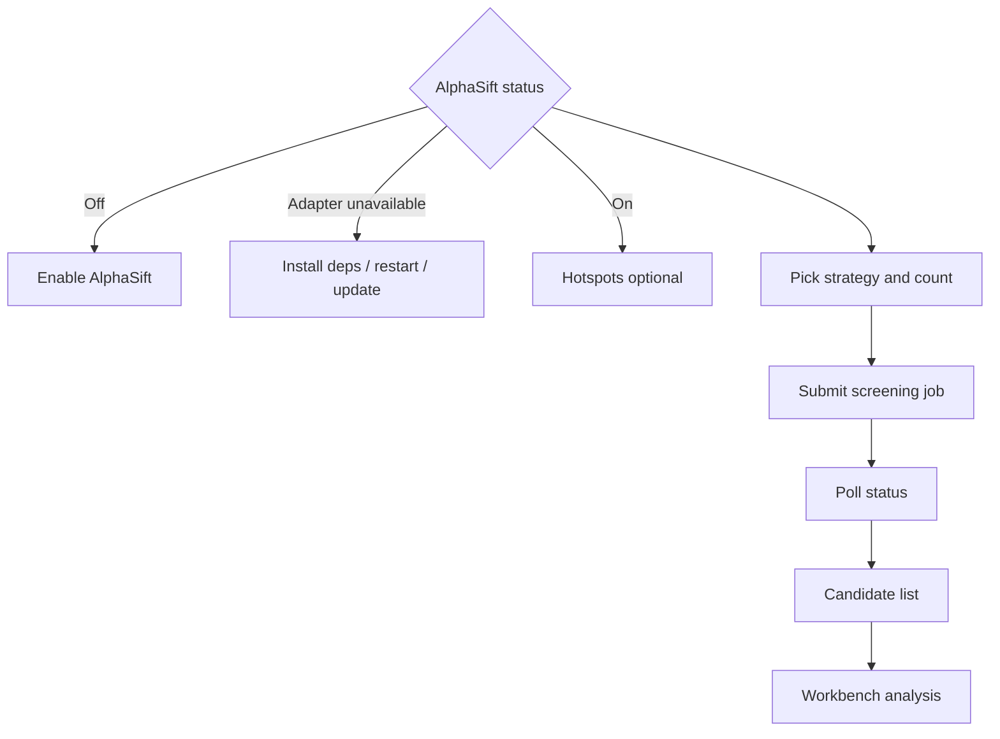

# 12 Discover (AlphaSift screening)

## What you will learn

1. Position Discover as an **experimental candidate shortlist**, not a guaranteed stock picker  
2. Enable AlphaSift, run hotspots or strategies, and hand off to Workbench  
3. Control `count`, diagnose rate limits / degradation / missing keys  
4. Keep the funnel: Discover → brief → deep read → optional signals—not reverse  

Nav label is **Discover**; the page title often says **AlphaSift screening**.

It builds a **candidate shortlist** under strategy or hotspot constraints, then you deepen names on the Analysis Workbench.

It is **not**:

- A guaranteed profitable black box  
- Auto order placement or auto portfolio build  
- A substitute for market review and full single-name reports  

The capability remains **experimental**.

> ⚠️ **Note**  
> Results are for research and judgment support — **not investment advice**. Trading decisions and P&L are yours.  
> Prerequisites: feature enabled, backend AlphaSift adapter and dependencies available.

> 📘 **Concept**  
> **Discover** = top of the candidate funnel · **Workbench** = write reports · **Signals** = manageable suggestions after reports · **Portfolio** = your real book. Do not reverse the order.

---

## 1. Entry

> 🧭 **Entry**

| Method | Path |
| --- | --- |
| Nav | **Research** → **Discover** |
| URL | `/research/discover` |
| Command palette | Try “discover”, “screening”, “AlphaSift” |
| Legacy | `/screening` often redirects |

### 1.1 Bookmarkable parameters

```text
/research/discover?market=cn&strategy=dual_low&count=3
```

| Parameter | Meaning | Notes |
| --- | --- | --- |
| `market` | Market | Common default `cn` (A-shares) |
| `strategy` | Strategy id | e.g. `dual_low`; invalid values fall back to default |
| `count` | Return size | 1–100; common default `3` |

Invalid params fall back to safe defaults so bad bookmarks do not freeze the page.

---

## 2. Should beginners use it?

| Stage | Guidance |
| --- | --- |
| First single-name report not yet working | **Skip**—use Workbench |
| Model not configured / no API key | Settings first; Discover may need LLM rerank |
| Model green, want theme clues | Hotspots are fine |
| Try strategy screening | Start `count` at **3–10** |
| Dig “50 gold mines” in a day | **Not a fit**—funnel mouth, not a mint |

> ✅ **Recommended**  
> Discover 3–5 → brief on 1–2 → read risks carefully → then watchlist or signals.  
> ❌ **Avoid**  
> Treat rank #1 as a buy ticket; or `count=100` full detailed burn.

---

## 3. How it pairs with other pages



| Page | Role |
| --- | --- |
| [04 Market review](04-market-review_EN.md) | Market tone and risk appetite |
| **Discover (this page)** | Researchable candidate pool |
| [03 Analysis Workbench](03-analysis-workbench_EN.md) | Write the report |
| [08 Reading reports](08-reading-reports_EN.md) | Fixed digestion order |
| [06 Signal Center](06-signals_EN.md) | Suggestions after reports |
| [13 Stock workspace](13-stock-details_EN.md) | Price/chart check—not a report substitute |

---

## 4. Page structure

> 🖼️ **Figure placeholder** · `assets/discover-hotspots-en.png`  
> **Capture**: Discover: hotspots or strategy area + candidates/empty state.  
> **Notes**: When experimental capability is enabled.  
> **Status**: pending — see [assets/PLACEHOLDERS.md](assets/PLACEHOLDERS.md)

| Area | Role |
| --- | --- |
| Enable status | On / off / adapter unavailable |
| Risk notice | Experimental disclaimer—worth a glance each time |
| Hotspot themes | Heat, phase, fermentation path, concept names (often collapsed) |
| Strategy pick | AlphaSift strategies or custom params |
| Parameters | Market, strategy params, count 1–100 |
| Run screening | Async job + status polling |
| Candidates | Summary, factors, risks, **Analyze** |
| Diagnostics | Missing key, rate limit, degradation, calendar issues |



---

## 5. Tutorials

### 5.1 First enable

1. Open `/research/discover`.  
2. If **screening is off**, click **Enable AlphaSift**.  
3. If **adapter unavailable**: install related backend deps; restart Web/API/Desktop; consider desktop update.  
4. Only after enable success, use hotspots or strategies.  
5. Keep Settings AlphaSift switches consistent when present ([10](10-settings_EN.md), [14](14-settings-fields_EN.md)).

> 💡 **Tip**  
> Discover is an accelerator, not the front-door key. If enable fails, watchlist + Workbench still complete the main path.

### 5.2 Hotspots for clues

1. Expand **hotspot themes** (often collapsed to reduce noise).  
2. **Refresh** when you need new data—avoid rapid re-clicks (rate limits).  
3. Open a theme: fermentation path / timeline and concept names.  
4. Quality tags (cache fallback, degradation, missing fields) → treat heat as a **weak clue**.  
5. **Analyze** interesting codes → Workbench (often with code context).  
6. Read risks via [08](08-reading-reports_EN.md)—do not chase narrative.

> ⚠️ **Note**  
> “No cached hotspots”: expand then refresh. Without data, do not invent theme stories.

### 5.3 Strategy shortlist

1. Pick a strategy (if list fails, try custom/manual params as offered).  
2. Market e.g. A-shares `cn`; `count` start at **5**.  
3. **Run screening**; wait for the async job.  
4. Poll may show timeout/network jitter and auto-retry—job may still run in the background.  
5. If **LLM rerank failed, local factors used**: list remains usable; ranking story is weaker.  
6. Read each row: summary, factors, risk columns.  
7. Top few → Workbench **brief**; decide watchlist or detailed later.

### 5.4 Task interrupt and resume

- Screening task id may live in session storage; refresh may **restore status**.  
- If unrestorable/not found: resubmit.  
- When returning to the page, check whether a job is still running.

---

## 6. Diagnostics

| Hint direction | Interpretation | Next |
| --- | --- | --- |
| Missing LLM API key | Rerank or related path needs model | Settings → model access |
| Too frequent | Rate limit | Slow refresh/submit |
| Data-source degradation | Usable but lower quality | Weak signal; retry if needed |
| No available open day | Off session or calendar issue | More conservative; try later |
| No cached hotspots | Never fetched or empty cache | Expand + refresh |
| LLM parse partial | Usable parts kept | Read raw fields and factors |
| Denied / timeout / network | Env or upstream | Network, backend, proxy |
| Adapter unavailable | Deps not ready | Fix deploy, then enable |
| Job done, zero candidates | Upstream empty | Change strategy / lower expectations / read diagnostics |

> 📘 **Concept: local factor score vs LLM rerank**  
> Local factors are a fallback scoring path. LLM rerank tries a more context-aware order. Fallback is **not empty**—it is **weaker interpretability**. Note that in your research log.

---

## 7. Use cases

**A — Theme clues** — refresh hotspots → industry you understand → two concept names brief → [08](08-reading-reports_EN.md) risks, no chase.  
**B — Strategy trial** — `count=5` → read factors/risks → #1 Workbench → rest on watchlist, not five detailed.  
**C — Enable fails** — main path via watchlist + Workbench; do not block on Discover.  
**D — Funnel** — 5 candidates → brief batch → deep-read 1–2 → 0–1 price rules → book only if tracking. Full funnel: [11](11-daily-workflows_EN.md).  
**E — With market review** — tone/risk appetite first → then hotspot heat → single-name report for theme-fade risk.  
**F — Weekend theme study** — hotspots only, no large `count`; ≤2 codes per theme to Workbench; observation list, not trade list.  
**G — LLM rerank failed** — accept local factor order → re-rank by industries you understand → analyze only names you can explain.  
**H — Parameter bookmark** — save `/research/discover?market=cn&strategy=dual_low&count=5`; align funnel entry with peers (decisions remain individual).

---

## 8. FAQ

**Q1: Discover vs watchlist?**  
Watchlist is your ongoing list; Discover is one-shot or stage candidate generation. Promote candidates to watchlist deliberately.

**Q2: Why are hotspots collapsed by default?**  
Reduce first-screen noise and accidental refresh; expand when needed.

**Q3: Is `count=100` better?**  
Usually not. Longer lists are harder to digest and encourage indiscriminate analysis spend.

**Q4: Strategy list fails to load?**  
Refresh; check AlphaSift status and network; try custom params; or fall back to hotspots/watchlist.

**Q5: After Analyze, where did I go?**  
Workbench launch flow with code; returning to Discover does not become a report page.

**Q6: Official stock recommendations?**  
**No.** Experimental research tool—not investment advice.

**Q7: Non A-share markets?**  
Depends on current strategy and market options; many defaults lean A-shares `cn`. Do not assume global coverage.

**Q8: Poll spins forever?**  
Wait auto-retry; read failure hints; resubmit and check backend logs if needed.

---

## 9. Self-check

| # | Item | Pass |
| --- | --- | --- |
| 1 | Main path | Can produce Workbench reports (else Discover is not priority) |
| 2 | Enable status | Know on / off reason |
| 3 | count | Start ≤10 |
| 4 | Diagnostics | Read degradation / rate limit / missing key |
| 5 | Hotspots | Cache fallback not treated as strong signal |
| 6 | Next step | Candidates → Workbench, not direct orders |
| 7 | Quota | No full-list detailed |
| 8 | Notes | Important candidates have a short research note |

---

## 10. Glossary

| Term | Meaning |
| --- | --- |
| AlphaSift | Built-in experimental screening adapter layer |
| Strategy | A filter/score rule set |
| Hotspot theme | Theme heat and lifecycle clues |
| Fermentation path / timeline | How a theme spreads |
| Candidate | Shortlist row |
| Local factor score | Scoring without LLM rerank |
| LLM rerank | Reorder candidates with a large model |
| theme_heat | Theme heat in scoring (strategy-related) |
| count | Number of candidates returned |
| Adapter | Backend bridge to AlphaSift |

---

## 11. Related

- [03 Analysis Workbench](03-analysis-workbench_EN.md)  
- [04 Market review](04-market-review_EN.md)  
- [08 Reading reports](08-reading-reports_EN.md)  
- [10 Settings](10-settings_EN.md)  
- [11 Daily workflows](11-daily-workflows_EN.md)  
- [13 Stock workspace](13-stock-details_EN.md)  
- [AlphaSift integration](../alphasift-integration.md) (implementation-oriented, optional)  

Prev: [11 Daily workflows](11-daily-workflows_EN.md) · Next: [13 Stock workspace](13-stock-details_EN.md)
