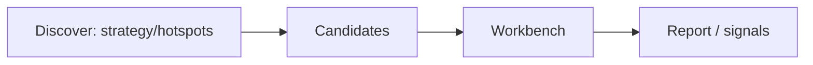

# 12 Discover (AlphaSift screening)

## Entry points and paths

| Method | Path |
| --- | --- |
| Primary nav | **Research** → **Discover** |
| Command palette | “discover”, “screening”, “AlphaSift” |
| Route | `/research/discover` |
| Legacy | `/screening` redirects when configured |
| Query params | `market`, `strategy`, `count` (see below) |

Nav label: **Discover**. Page title is often **AlphaSift screening**.

Discover builds a **candidate list** under strategy or theme constraints, then you deepen names on the Analysis Workbench. It is an **experimental** helper — not a guaranteed stock-picking black box.

> ⚠️ Experimental: research only — **not investment advice**. Requires AlphaSift enabled and a healthy backend adapter/dependencies.

## When to use

| Scenario | Approach |
| --- | --- |
| No theme idea | Expand **hotspots**, then analyze 1–2 concept names |
| Known strategy id | Pick strategy → set count → **Run screening** |
| Adapter off | **Enable AlphaSift**; on failure, check deps / restart backend |
| After candidates | Click **Analyze** → Workbench; do not treat cards as full reports |
| Beginners | Optional — finish Workbench path first |

## Boundaries vs other modules

| Module | Relation |
| --- | --- |
| Analysis Workbench | Discover yields **candidates**; full reports live on Workbench |
| Market review | Review = market temperature; Discover = **tradable shortlist** |
| Signal Center | Screening ≠ Decision Signals; signals appear after analysis |
| Settings | Enablement / related keys |

## Layout

| Area | Role |
| --- | --- |
| Enablement status | On / off / adapter unavailable |
| Risk banner | Experimental disclaimer |
| **Hotspots** | Theme heat, phase, fermentation route, concept stocks (often collapsed) |
| **Strategy** | AlphaSift strategies or custom params |
| **Parameters** | Market, strategy params, result count (1–100) |
| **Run screening** | Async job + polling |
| **Results** | Summary, factors, risks, analyze actions |

## Steps

### A. First enablement

1. Open **Research → Discover**.  
2. If disabled, click **Enable AlphaSift**.  
3. If adapter unavailable: install backend deps / restart (desktop: update/reinstall).  
4. Proceed only when enabled.

### B. Hotspots as leads

1. Expand **Hotspots**.  
2. **Refresh hotspots** when you need live ranks (rate-limit friendly).  
3. Select a theme → fermentation route + concept names.  
4. **Analyze {symbol}** → Workbench.  
5. Respect cache fallback / degraded / missing-field warnings.

### C. Strategy run

1. **Select strategy** (or manual params if list fails).  
2. Set **market** (e.g. A-shares `cn`) and **count** (integer 1–100).  
3. **Run screening**.  
4. Wait: submitted → running → done (auto-retry on poll blips).  
5. Read summaries/factors/risks; analyze interesting codes.  
6. If **LLM rerank failed → local factor scores**: list still usable; ranking story weaker.

### Bookmarkable URLs

| URL | Meaning |
| --- | --- |
| `/research/discover` | Default |
| `/research/discover?market=cn&strategy=dual_low&count=3` | Explicit market/strategy/count (subject to validation defaults) |

Invalid params fall back to safe defaults (implementation often defaults `market=cn`, a strategy such as `dual_low`, `count=3`).

## Glossary

| Term | Meaning |
| --- | --- |
| **Discover** | Nav name for AlphaSift screening page |
| **AlphaSift** | Built-in experimental screening adapter |
| **Strategy** | Screening/scoring rule pack id or params |
| **Hotspot** | Theme heat / lifecycle lead |
| **Fermentation route** | Theme timeline narrative |
| **Candidate** | Shortlist row |
| **Local factor score** | Fallback ranking without LLM rerank |
| **theme_heat** | Some strategies fold theme heat into scores |
| **count** | Max candidates returned this run |

## Beginner defaults

| Item | Suggestion |
| --- | --- |
| Required? | **No** for first-week path |
| count | 3–10 |
| Hotspot refresh | Avoid spam (rate limits) |
| Next step | Candidates → Workbench report → then signals/portfolio |

## Use cases

**A — Theme leads**  
Refresh hotspots → pick a theme you understand → analyze two concept names → read risks via [08](08-reading-reports_EN.md).

**B — Strategy trial**  
Default strategy, `count=5`, CN market → run → if local ranking fallback, still read factors → analyze #1.

**C — Enable failure**  
Adapter missing → fix backend/deps or skip Discover; use watchlist + Workbench.

**D — Stuck task**  
Poll timeout while job continues → wait for auto-retry; if dead, resubmit and check LLM key / rate limit / data source.

## Message cheat sheet

| Hint | Meaning |
| --- | --- |
| Missing LLM API key | Configure [10 Settings](10-settings_EN.md) |
| Rate limited | Slow down refresh/submit |
| Source degraded | Results weaker quality |
| No trading calendar day | Off-session / calendar issue — more caution |
| No cached hotspots | Expand and refresh |

## Related

- [03 Analysis Workbench](03-analysis-workbench_EN.md)
- [04 Market review](04-market-review_EN.md)
- [10 Settings](10-settings_EN.md)
- [AlphaSift integration](../alphasift-integration.md) (implementation-oriented)

Prev: [11 Daily workflows](11-daily-workflows_EN.md) · Next: [13 Stock workspace](13-stock-details_EN.md)
