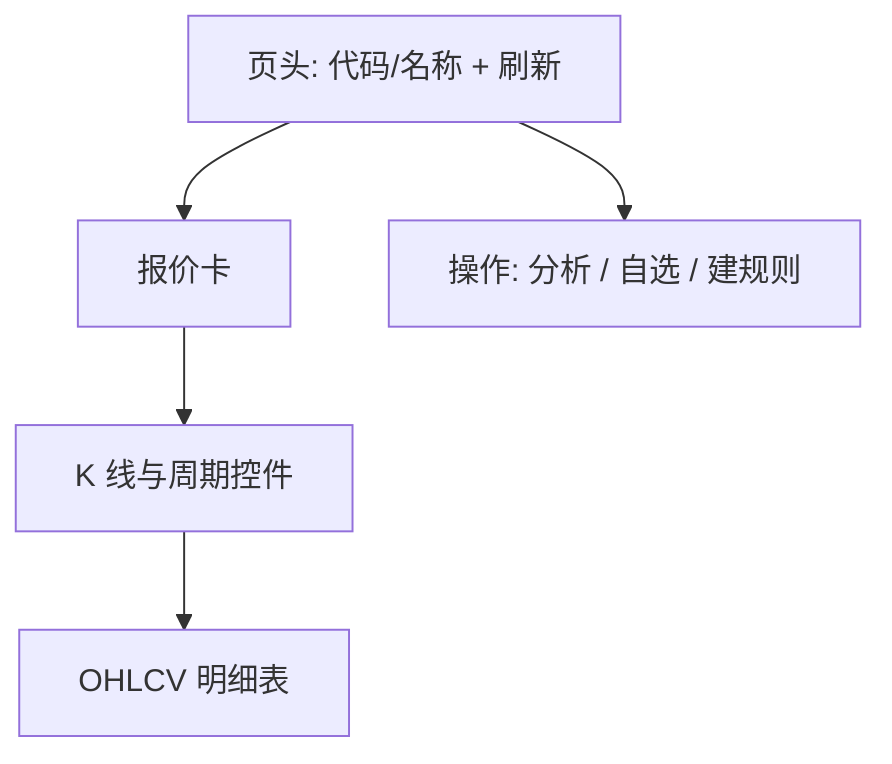

# 13 个股工作区（行情详情）

## 页面入口与操作路径

| 方式 | 具体路径 |
| --- | --- |
| 直链 | `/stocks/:stockCode`（如 `/stocks/600519`、`/stocks/AAPL`） |
| 命令面板 | 输入代码后进入相关分析/详情（以当前命令结果为准） |
| 从其它页 | 部分列表点代码会深链到本页或工作台；以实际链接为准 |
| 查询参数 | `period`、`days`（浏览器前进/后退会恢复） |

页面标题语境为 **个股工作区 / stocks.workspace**（界面文案以 `stocks.workspace.*` 为准）。

本页提供**行情快照 + K 线历史**，并一键跳到分析、自选、信号规则。它**不是**完整 AI 报告页——报告仍在 [03 分析工作台](03-analysis-workbench.md) / [08 阅读报告](08-reading-reports.md)。

> ⚠️ 行情与图表仅供研究；**不构成投资建议**。实时行情为尽力获取，可能延迟或缺失。

## 适用场景

| 场景 | 做法 |
| --- | --- |
| 快速看现价与涨跌 | 打开 `/stocks/代码`，看报价区 |
| 调 K 线周期 | 日/周/月 + 天数（1～365，默认约 90） |
| 从详情发起研究 | **分析** → 分析工作台并带上代码 |
| 盯到价 | **从此创建规则** 类入口 → 信号中心规则 Tab |
| 加入跟踪列表 | **加入自选** |

## 页面结构

| 区域 | 内容 | 说明 |
| --- | --- | --- |
| **报价** | 现价、涨跌、开高低、量等 | 空态：暂无报价 / 重试 |
| **周期** | 日线 / 周线 / 月线 | URL `period=daily\|weekly\|monthly` |
| **天数** | 回看窗口 | URL `days=1..365`；非法值回落默认 |
| **应用** | 把草稿天数写入 URL 并刷新 | 改天数后要点应用（文案以界面为准） |
| **K 线** | 收盘价走势图 | 可能注明聚合说明 |
| **明细表** | 日期、开、高、低、收、量 | 空态：暂无历史 |
| **新鲜度** | 数据新鲜度未知等提示 | 解读时更保守 |

## 操作步骤

### 打开并读报价

1. 访问 `/stocks/600519`（港股注意 `hk` 前缀规范化）。  
2. 若代码无效：显示无效说明，修正代码重进。  
3. 查看报价卡；失败时 **重试 / 刷新**。  
4. 注意涨跌颜色语义（涨/跌/平，随主题）。

### 调整历史窗口

1. 选择 **周期**（日 / 周 / 月）。  
2. 输入 **天数**（1～365）。  
3. 点击 **应用**（或等价按钮），确认地址栏 `period`/`days` 更新。  
4. 用浏览器后退可回到上一组参数（URL 为真源）。

### 从详情出发做研究

| 按钮（界面常见） | 去向 |
| --- | --- |
| **分析** | `/research/analysis` 并带 stock 上下文 |
| **加入自选** | 写入自选列表；成功有提示 |
| **创建规则 / 从此信号建规则** 类 | `/signals?tab=rules&createRule=1` 等（可能带 stock） |

## 术语表

| 术语 | 解释 |
| --- | --- |
| **个股工作区** | 单标的行情 + 历史 K 线页 |
| **period** | 日/周/月聚合周期 |
| **days** | 回看自然日窗口（实现会聚合为蜡烛） |
| **OHLCV** | 开高低收量 |
| **报价新鲜度** | 数据是否可能过时 |
| **规范化代码** | 系统对大小写、港股前缀等的统一 |

## 使用案例

**案例 A：盘中快速核价**  
打开 `/stocks/AAPL` → 看报价与当日开高低 → 不必进 AI 报告。

**案例 B：看 180 日日线**  
`period=daily&days=180` → 应用 → 读图与表 → 再点分析生成报告对照支撑压力。

**案例 C：代码写错**  
`/stocks/not-a-code` → 无效提示 → 改用 `600519`。

**案例 D：从 K 线到规则**  
确认压力位大致位置 → 创建规则 → 信号中心设上破提醒。

## 与报告页的区别

| | 个股工作区 | 分析报告 |
| --- | --- | --- |
| 主内容 | 行情与 K 线 | AI 结论、风险、叙事 |
| 是否调用大模型 | 否（本页本身） | 是 |
| 入口 | `/stocks/:code` | 工作台历史 / recordId |

## 相关

- [03 分析工作台](03-analysis-workbench.md)
- [06 信号中心](06-signals.md)
- [08 阅读报告](08-reading-reports.md)

上一篇：[12 发现](12-discover.md) · 下一篇：返回 [手册目录](README.md)
