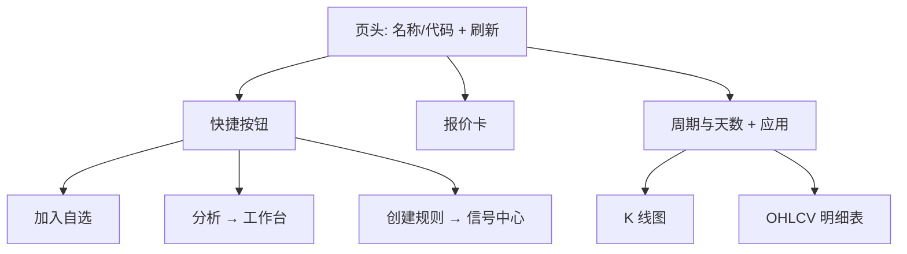
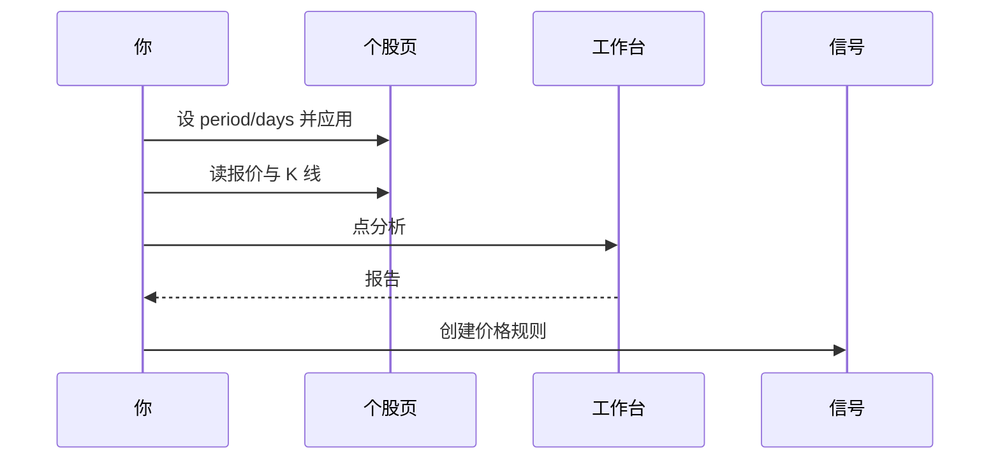

# 13 个股工作区

个股工作区是单只股票的 **行情 + K 线** 页面。地址长这样：

```text
/stocks/600519
/stocks/AAPL
/stocks/hk00700
```

它适合快速核价、调周期看图；**完整 AI 报告** 仍要去 [分析工作台](03-analysis-workbench.md)。

> ⚠️ **注意**  
> 行情为尽力获取，可能延迟、缺失或与券商终端不一致；仅供研究，**不构成投资建议**。

> 📘 **概念**  
> 个股工作区回答「**现在价多少、图长什么样**」；  
> AI 报告回答「**逻辑、风险、建议标签是什么**」。  
> 两者互补，不要互相替代。

---

## 1. 怎么进入

> 🧭 **入口**

| 方式 | 说明 |
| --- | --- |
| 地址栏 | `/stocks/:stockCode` |
| 命令面板 | 输入代码（结果以当前版本命令为准） |
| 其它页外链 | 部分列表可能链到本页 |
| 手动改 URL | 把代码换成规范化写法最稳 |

### 1.1 查询参数（浏览器前进后退可恢复）

| 参数 | 含义 | 范围 / 默认 |
| --- | --- | --- |
| `period` | K 线聚合周期 | `daily` / `weekly` / `monthly`；日线时常可省略 |
| `days` | 回看天数 | 1～365，默认约 **90** |

示例：

```text
/stocks/AAPL?period=daily&days=180
/stocks/600519?period=weekly&days=365
```

> 💡 **提示**  
> 系统会尽量把等价代码 **规范化** 到统一写法（例如大小写、前缀），并 `replace` 到规范 URL，便于缓存与分享。

---

## 2. 页面上有什么

> 🖼️ **配图占位** · `assets/stock-details-quote-chart-zh.png`  
> **应配内容**：个股工作区：报价卡 + K 线区 + 分析/自选/规则等快捷按钮。  
> **拍摄要点**：`/stocks/600519` 或 `/stocks/AAPL`；周期为日线即可。  
> **状态**：待补图（清单：[assets/PLACEHOLDERS.md](assets/PLACEHOLDERS.md)）



| 区域 | 内容 |
| --- | --- |
| **页头** | 名称或代码、说明、**刷新** |
| **快捷按钮** | 加入自选、分析、创建规则 |
| **报价卡** | 现价、涨跌、开高低、昨收、量额、更新时间等 |
| **周期与天数** | 日 / 周 / 月 + 回看天数草稿 |
| **图与表** | 聚合后的 K 线与 OHLCV 明细 |

代码无效或为空时，会看到 **无效说明**——改对代码再进。

---

## 3. 操作教程

### 3.1 快速核价（30 秒）

1. 打开 `/stocks/600519`。  
2. 看报价卡现价与涨跌。  
3. 结束。  

不必每次都跑 AI。

### 3.2 看 180 日日线再分析

1. 打开目标代码页。  
2. 周期选 **日线**，天数填 `180`。  
3. 提交 / **应用** 天数（把草稿写进 URL）。  
4. 读图与表格，形成价位直觉。  
5. 点 **分析** → 工作台带上代码 → 生成报告。  
6. 按 [08 阅读报告](08-reading-reports.md) 固定顺序读。  
7. 若要到价提醒：点 **创建规则** → 信号中心规则 Tab（常带 `createRule=1` 与股票上下文）。



### 3.3 切换周线 / 月线

1. 在周期选择里选 `weekly` 或 `monthly`。  
2. 日线数据会在前端按周期 **聚合** 展示（实现上常先取日线再聚合）。  
3. 天数仍控制回看窗口（1～365）。  
4. 用浏览器后退可回到上一组 period/days。

> ⚠️ **注意**  
> 改天数草稿后若忘记应用，图可能仍是旧窗口。养成「改完就应用」的习惯。

### 3.4 加入自选

1. 点 **加入自选**。  
2. 成功后按钮状态变为已添加（文案以界面为准）。  
3. 失败时读错误提示（网络 / 权限 / 配置）。  
4. 自选列表的批量维护仍可在 [10 设置](10-settings.md) 的自选股字段中进行。

### 3.5 刷新

报价与历史可分别失败。点 **刷新** 会重新拉取；单侧报错时可用重试，不必整页放弃。

---

## 4. 和报告页、其它页的差别

| | 个股工作区 | AI 报告 | 持仓 |
| --- | --- | --- | --- |
| 内容 | 行情与 K 线 | 结论、风险、叙事 | 你的数量与成本 |
| 是否调用大模型 | 本页本身不调用 | 通过工作台任务调用 | 不调用（行内信号另算） |
| 典型问题 | 「现在价多少」 | 「逻辑与风险是什么」 | 「我拿了多少」 |
| 主路由 | `/stocks/:code` | 工作台历史 | `/portfolio` |

> ✅ **推荐做法**  
> 核价在个股页 → 逻辑在报告 → 仓位在持仓。  
> ❌ **不推荐**  
> 只看 K 线形态就当完成研究；或把报价涨跌当成报告里的 action。

---

## 5. 使用案例

### 案例 A：盘中瞄一眼

只看报价卡；不改周期、不跑 AI。

### 案例 B：周末复盘图

周线 + 合适天数 → 标记直觉上的压力区 → 再决定要不要重跑报告。

### 案例 C：从 K 线到规则

目测压力 / 支撑 → **创建规则** → 在信号中心完善价格条件 → 试运行 → 启用。

### 案例 D：代码写错

无效态 → 换成规范代码（港股注意 `hk` 前缀等）→ 让系统规范化 URL。

### 案例 E：美股盘前

报价可能延迟或空；当「尽力」；重要决策以你信任的行情源复核。

### 案例 F：从发现跳到个股

发现候选 → 若有个股链则打开本页核价 → 再点分析。没有链就手动 `/stocks/代码`。

### 案例 G：报告里的价位要核对

报告写压力 1800 → 打开个股页看近期是否多次受阻 → 再问股讨论观察条件。

### 案例 H：自选一键加完去批量

个股页加入自选 → 设置里确认列表 → 工作台批量 brief（控制数量）。

---

## 6. 常见问题（FAQ）

**Q1：为什么没有 AI 结论？**  
A：本页不做大模型分析。请点 **分析** 去工作台。

**Q2：天数填 400 行吗？**  
A：不行。上限 365；非法值会回落默认（约 90）。

**Q3：周线数据是独立接口吗？**  
A：常见实现是日线拉取后按周 / 月聚合。若日线失败，周月也会受影响。

**Q4：刷新后还是旧价？**  
A：可能上游延迟、缓存或非交易时段。看更新时间字段；必要时对照券商。

**Q5：创建规则和信号 feed 一样吗？**  
A：不一样。创建规则进入信号中心 **规则** Tab，用于到价等提醒；feed 是建议流。

**Q6：可以同时看两只股票吗？**  
A：本页是单代码路由；可用两个浏览器标签分别打开。

**Q7：名称不显示只有代码？**  
A：报价未返回名称时会回退显示代码；等报价成功或检查代码是否正确。

**Q8：这是投资建议吗？**  
A：**不是。** 行情研究视图而已。

---

## 7. 离开前自检

| # | 自检项 | 通过标准 |
| --- | --- | --- |
| 1 | 代码 | URL 已是规范化写法 |
| 2 | 窗口 | days / period 已应用进 URL |
| 3 | 行情 | 知道尽力获取可能延迟 |
| 4 | 下一步 | 需要逻辑时已去工作台，而非只盯涨跌 |
| 5 | 规则 | 建规则前已有自己的观察价 |
| 6 | 自选 | 成功态或失败原因已知 |

---

## 8. 术语

| 术语 | 含义 |
| --- | --- |
| OHLCV | 开、高、低、收、量 |
| period | 蜡烛周期：日 / 周 / 月 |
| days | 回看窗口天数 |
| 规范化代码 | 系统统一后的代码写法 |
| 报价 quote | 最新价与盘口类摘要字段 |
| 聚合 | 由日线合成周线 / 月线 |
| 自选 watchlist | 你关心的代码列表 |
| 创建规则 | 跳到信号中心新建提醒规则 |

---

## 9. 相关阅读

- [03 分析工作台](03-analysis-workbench.md)  
- [06 信号中心](06-signals.md)  
- [08 阅读报告](08-reading-reports.md)  
- [07 持仓](07-portfolio.md)  
- [12 发现](12-discover.md)  
- [10 设置](10-settings.md)  

上一篇：[12 发现](12-discover.md) · 下一篇：[14 设置字段速查](14-settings-fields.md)
