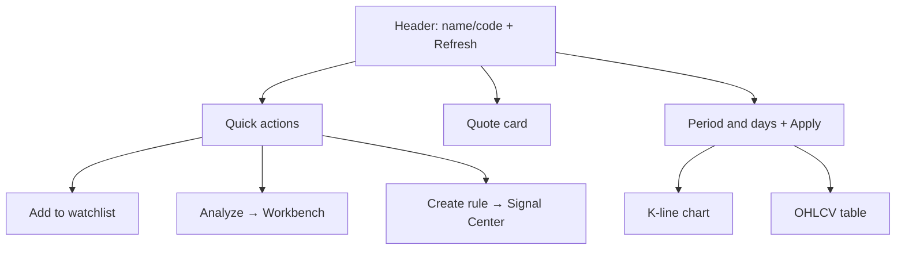
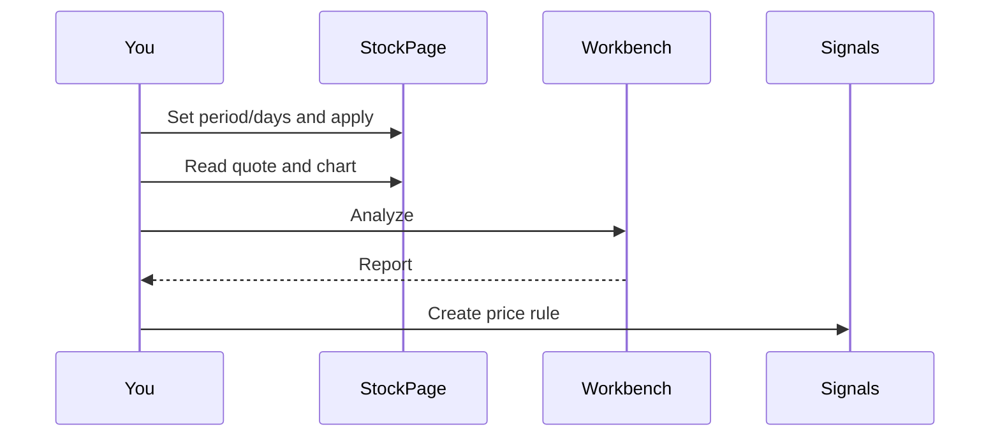

# 13 Stock workspace

## What you will learn

> 🖼️ **Figure placeholder** · `assets/stock-details-quote-chart-en.png`  
> **Capture**: Stock page: quote card + chart + Analyze/watchlist/rules actions.  
> **Notes**: /stocks/AAPL or 600519; daily period.  
> **Status**: pending — see [assets/PLACEHOLDERS.md](assets/PLACEHOLDERS.md)

1. Use `/stocks/:code` as **quotes + K-lines**, not as a full AI report  
2. Set `period` / `days`, refresh quotes, and jump to Analyze or rules  
3. Keep a clean handoff: price check here → logic on Workbench → size on Portfolio  

The stock workspace is the single-name **quotes + K-line** page. Example routes:

```text
/stocks/600519
/stocks/AAPL
/stocks/hk00700
```

It fits quick price checks and period charts. **Full AI reports** still require the [Analysis Workbench](03-analysis-workbench_EN.md).

> ⚠️ **Note**  
> Quotes are best-effort: delay, gaps, or broker differences are possible. Research only — **not investment advice**.

> 📘 **Concept**  
> Stock workspace answers **“what is the price and how does the chart look?”**  
> AI reports answer **“what is the logic, risk, and action label?”**  
> Complementary—do not substitute one for the other.

---

## 1. Entry

> 🧭 **Entry**

| Method | Notes |
| --- | --- |
| Address bar | `/stocks/:stockCode` |
| Command palette | Type a code (results depend on current version) |
| Cross-page links | Some lists may link here |
| Manual URL edit | Prefer normalized code forms |

### 1.1 Query parameters (back/forward can restore)

| Parameter | Meaning | Range / default |
| --- | --- | --- |
| `period` | Candle aggregation | `daily` / `weekly` / `monthly`; daily often omittable |
| `days` | Lookback days | 1–365; default about **90** |

Examples:

```text
/stocks/AAPL?period=daily&days=180
/stocks/600519?period=weekly&days=365
```

> 💡 **Tip**  
> The system typically **normalizes** equivalent codes (case, prefixes) and `replace`s to a canonical URL for cache and sharing.

---

## 2. What is on the page



| Area | Content |
| --- | --- |
| **Header** | Name or code, description, **Refresh** |
| **Quick actions** | Watchlist, Analyze, create rule |
| **Quote card** | Last, change, OHLC, prev close, volume/value, update time, … |
| **Period and days** | Daily / weekly / monthly + lookback draft |
| **Chart and table** | Aggregated candles and OHLCV rows |

Invalid or empty codes show an **invalid state**—fix the code and re-enter.

---

## 3. Tutorials

### 3.1 Thirty-second price check

1. Open `/stocks/600519`.  
2. Read last and change on the quote card.  
3. Stop.  

No LLM required every time.

### 3.2 180-day daily chart, then analyze

1. Open the target code page.  
2. Period **daily**, days `180`.  
3. Submit / **Apply** days (write draft into the URL).  
4. Read chart and table for level intuition.  
5. **Analyze** → Workbench with code → generate report.  
6. Read with [08 Reading reports](08-reading-reports_EN.md).  
7. For price alerts: **Create rule** → Signal Center rules (often with `createRule=1` and stock context).



### 3.3 Weekly / monthly

1. Select `weekly` or `monthly`.  
2. Daily data is typically **aggregated** in the client for weekly/monthly display (daily fetch first, then aggregate).  
3. `days` still controls lookback (1–365).  
4. Browser back restores prior period/days.

> ⚠️ **Note**  
> Changing the days draft without Apply may leave the chart on the old window. Habit: change → apply.

### 3.4 Add to watchlist

1. Click **Add to watchlist**.  
2. Success changes button state (label as shown).  
3. On failure, read the error (network / permission / config).  
4. Bulk list maintenance still available in [10 Settings](10-settings_EN.md) watchlist field.

### 3.5 Refresh

Quotes and history can fail independently. **Refresh** re-fetches; retry one side when the other is fine—no need to abandon the whole page.

---

## 4. Compared with reports and portfolio

| | Stock workspace | AI report | Portfolio |
| --- | --- | --- | --- |
| Content | Quotes and K-lines | Conclusion, risks, narrative | Your qty and cost |
| Calls large model? | Not on this page itself | Via Workbench tasks | Not for bookkeeping (row AI separate) |
| Typical question | “What is the price now?” | “What is the logic and risk?” | “How much do I hold?” |
| Main route | `/stocks/:code` | Workbench history | `/portfolio` |

> ✅ **Recommended**  
> Price check here → logic in report → size on Portfolio.  
> ❌ **Avoid**  
> Chart pattern alone as “research done”; or treating quote change as report **action**.

---

## 5. Use cases

**A — Intraday glance** — quote card only; no period change, no AI.  
**B — Weekend chart review** — weekly + suitable days → mark resistance intuition → decide whether to re-run a report.  
**C — Chart to rule** — eyeball support/resistance → **Create rule** → refine in Signal Center → dry-run → enable.  
**D — Wrong code** — invalid state → use preferred form (HK: prefer `hk` prefix; other forms may normalize) → let the system canonicalize the URL.  
**E — US premarket** — quotes may lag or be empty; treat as best-effort; re-check on a trusted source for important decisions.  
**F — From Discover** — candidate → stock link if present for price check → Analyze; else manual `/stocks/{code}`.  
**G — Verify report levels** — report resistance 1800 → stock page for recent stalls → Agent on observation conditions.  
**H — Watchlist then batch** — add here → confirm list in Settings → Workbench brief batch (control count).

---

## 6. FAQ

**Q1: Why no AI conclusion here?**  
This page does not run large-model analysis. Use **Analyze** → Workbench.

**Q2: Can `days` be 400?**  
No. Max 365; invalid values fall back to default (~90).

**Q3: Are weekly candles a separate API?**  
Common implementation: daily fetch, then weekly/monthly aggregate. Daily failure affects weekly/monthly.

**Q4: Refresh still shows old price?**  
Upstream delay, cache, or off-session. Check update-time field; compare with broker if needed.

**Q5: Is create rule the same as signal feed?**  
No. Create rule opens Signal Center **Rules** for price-style alerts; feed is the suggestion stream.

**Q6: Two symbols at once?**  
Single-code route; open two browser tabs.

**Q7: Only code, no name?**  
When quote payload lacks name, UI falls back to code; wait for quote success or verify code.

**Q8: Investment advice?**  
**No.** Research quote/chart view only.

---

## 7. Self-check

| # | Item | Pass |
| --- | --- | --- |
| 1 | Code | URL already normalized |
| 2 | Window | `days` / `period` applied into URL |
| 3 | Quotes | Accept best-effort delay |
| 4 | Next step | Logic needs Workbench, not only up/down |
| 5 | Rules | Own observation price before creating rules |
| 6 | Watchlist | Success state or known failure reason |

---

## 8. Glossary

| Term | Meaning |
| --- | --- |
| OHLCV | Open, high, low, close, volume |
| period | Candle period: daily / weekly / monthly |
| days | Lookback window in days |
| Normalized code | Canonical code form after system rewrite |
| Quote | Latest price and related summary fields |
| Aggregation | Build weekly/monthly from daily |
| Watchlist | Codes you care about |
| Create rule | Jump to Signal Center to create an alert rule |

---

## 9. Related

- [03 Analysis Workbench](03-analysis-workbench_EN.md)  
- [06 Signal Center](06-signals_EN.md)  
- [08 Reading reports](08-reading-reports_EN.md)  
- [07 Portfolio](07-portfolio_EN.md)  
- [12 Discover](12-discover_EN.md)  
- [10 Settings](10-settings_EN.md)  

Prev: [12 Discover](12-discover_EN.md) · Next: [14 Settings fields](14-settings-fields_EN.md)
