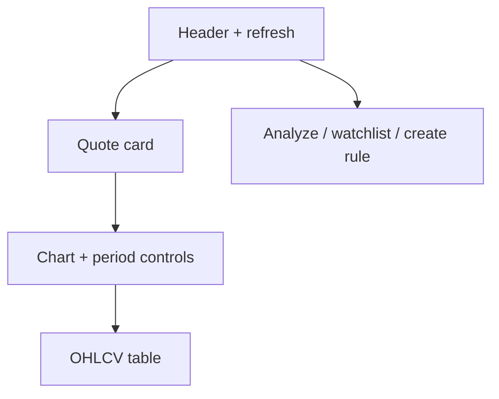

# 13 Stock workspace (quote details)

## Entry points and paths

| Method | Path |
| --- | --- |
| Direct URL | `/stocks/:stockCode` (e.g. `/stocks/600519`, `/stocks/AAPL`) |
| Command palette | Enter a code (result depends on current commands) |
| Query params | `period`, `days` (browser back/forward restores them) |

This page is a **quote + K-line workspace**, not the full AI report. Reports stay on [03 Analysis Workbench](03-analysis-workbench_EN.md) / [08 Reading reports](08-reading-reports_EN.md).

> ⚠️ Research only — **not investment advice**. Quotes are best-effort and may be delayed or missing.

## When to use

| Scenario | Approach |
| --- | --- |
| Quick last price | Open `/stocks/{code}` |
| Adjust chart window | Daily/weekly/monthly + days (1–365, default ~90) |
| Start research | **Analyze** → Workbench with symbol |
| Price alert | Create rule → Signal Center |
| Track | **Add to watchlist** |

## Layout

| Area | Content |
| --- | --- |
| **Quote** | Last, change, OHLC, volume |
| **Period** | `period=daily\|weekly\|monthly` |
| **Days** | `days=1..365` |
| **Apply** | Commit draft days into the URL |
| **Chart** | Close series (aggregation note possible) |
| **Table** | Date + OHLCV rows |
| **Freshness** | May show unknown freshness |

## Steps

1. Open `/stocks/600519` (HK codes normalize with `hk` rules).  
2. Invalid code → fix and reopen.  
3. Change **period** / **days** → **Apply** (watch the query string).  
4. **Analyze** / **watchlist** / **create rule** as needed.

## Glossary

| Term | Meaning |
| --- | --- |
| **Stock workspace** | Single-symbol quote + history page |
| **period** | Candle aggregation |
| **days** | Lookback window |
| **OHLCV** | Open/high/low/close/volume |
| **Canonical code** | Normalized symbol form |

## Use cases

**A — Intraday check** — quote only, no LLM.  
**B — 180d daily** — `period=daily&days=180` then Analyze.  
**C — Bad code** — invalid state → correct symbol.  
**D — Chart → rule** — note resistance → Signal Center rule.

## vs report page

| | Stock workspace | AI report |
| --- | --- | --- |
| Content | Market data | Narrative + risks + action |
| LLM on this page | No | Yes (via Workbench job) |

## Related

- [03 Analysis Workbench](03-analysis-workbench_EN.md)
- [06 Signal Center](06-signals_EN.md)
- [08 Reading reports](08-reading-reports_EN.md)

Prev: [12 Discover](12-discover_EN.md) · Next: [Manual index](README_EN.md)
