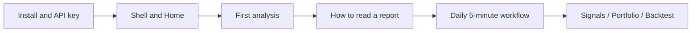

# StockPulse UI User Manual

> **Scope**: How to use the **Web workbench and desktop client UI**.  
> **Out of scope**: Deployment, Docker, GitHub Actions, full environment-variable lists, server ops.  
> For install and first API key setup, see [Beginner client setup](../beginner-client-setup.md) (Chinese). For deployment, see the [Full guide (EN)](../full-guide_EN.md).

Welcome. This manual assumes you are opening StockPulse **for the first time**. You may not yet know A-share / Hong Kong / US ticker formats, or what “Analysis”, “Signals”, and “Portfolio” each mean. We will walk through them step by step.

> 💡 **Friendly reminder**  
> Output is for **learning and research only** and is **not investment advice**. Make your own risk and compliance decisions before any real trade.

## Suggested reading order

| Your stage | Start with | Then |
| --- | --- | --- |
| Not installed / no model key yet | [Beginner client setup (EN)](../beginner-client-setup_EN.md) | Modules 01 → 02 |
| UI already opens | [01 Shell](01-shell_EN.md), [02 Home](02-home_EN.md) | [03 Analysis workbench](03-analysis-workbench_EN.md) |
| You already have a report | [08 Reading reports](08-reading-reports_EN.md) | [11 Daily workflows](11-daily-workflows_EN.md) |
| Looking for candidates | [12 Discover](12-discover_EN.md) | [03 Analysis workbench](03-analysis-workbench_EN.md) |
| Alerts or bookkeeping | [06 Signals](06-signals_EN.md), [07 Portfolio](07-portfolio_EN.md) | [09 Backtest](09-backtest_EN.md) |

Most people only need **01 + 02 + 03 + 08 + 11** in the first week.

## Module index

| Module | Description |
| --- | --- |
| [01 Shell and global actions](01-shell_EN.md) | Navigation, command palette, notification bell, language and theme |
| [02 Home](02-home_EN.md) | Today focus, todos, configuration gap prompts |
| [03 Analysis workbench](03-analysis-workbench_EN.md) | Start analysis, task progress, history and compare |
| [04 Market review](04-market-review_EN.md) | Trigger review, read review history |
| [12 Discover](12-discover_EN.md) | AlphaSift screening, hotspots, candidates → analysis (experimental) |
| [13 Stock workspace](13-stock-details_EN.md) | `/stocks/:code` quotes & K-lines; jump to analyze / watchlist / rules |
| [05 Agent chat](05-agent-chat_EN.md) | Multi-turn Q&A and strategy selection |
| [06 Signal center](06-signals_EN.md) | Suggestion pool, rules, delivery, review (**not** in primary sidebar; bell / palette / `/signals`) |
| [07 Portfolio](07-portfolio_EN.md) | Sidebar Portfolio; accounts, bookkeeping, import, risk, one-click analysis |
| [08 Reading reports](08-reading-reports_EN.md) | How to read a stock report |
| [09 Backtest](09-backtest_EN.md) | Post-hoc checks on historical AI advice |
| [10 Settings](10-settings_EN.md) | Models, watchlist, notifications, data sources in the UI |
| [11 Daily workflows](11-daily-workflows_EN.md) | Recommended flows and common UI questions |

## Quick glossary

| Term | Plain meaning |
| --- | --- |
| **Watchlist** | The list of tickers you care about; used for batch analysis and summaries |
| **Single-stock analysis** | A research report for **one** symbol (technicals, news, risk, suggestion, …) |
| **Market review** | A market-wide session summary (e.g. A-shares), not a single-name trade ticket |
| **Decision signal** | A structured, queryable “advice asset” extracted from a report for later review |
| **Strategy / Skill** | An optional analysis style pack; omit to use the system default |
| **Support / resistance** | Support is a lower zone where buying interest may appear; resistance is an upper zone where selling pressure may appear |
| **Stop-loss** | A pre-planned exit price or condition to limit losses when the thesis fails |
| **UI language vs report language** | UI language changes menus and buttons; report language changes report body text. They are **independent** |
| **Portfolio vs Holdings** | Nav often says Portfolio; page title may say Holdings — same module |
| **Agent vs Ask stock** | Nav often says Agent; page title may say Ask stock — same module |

## Languages

| Manual language | Files |
| --- | --- |
| Simplified Chinese (source) | `NN-topic.md`, `README.md` |
| English | `NN-topic_EN.md`, `README_EN.md` |

- The product UI may also offer zh-TW / ja / ko / de / es / fr / id / ms, etc. **This manual** is maintained in Simplified Chinese + English only, separate from product locales.
- Conventions: [TRANSLATION.md](TRANSLATION.md).
- Desktop first-run: [Beginner client setup (EN)](../beginner-client-setup_EN.md) · [中文](../beginner-client-setup.md)
- Figure pack naming: [assets/README.md](assets/README.md)

## Maintainer notes

- UI procedures only — no deploy/secrets runbooks here.
- Prefer **live UI** labels when they diverge; fix docs in a PR.
- Each module should document entry paths, glossary, steps, use cases, and adjacent modules.
- PRs that change routes/nav/copy should update matching `docs/ui-manual/*` pairs in the same train. Check `routes.ts`, `navigation.ts`, `uiText.ts`, settings IA, and `locales/screening.ts`.
- Modules 01–13 cover all primary business routes; 03/05/06/07/10 include deep operational maps against large page implementations. Field-level detail continues as product PRs land; binary screenshots pending [assets/README.md](assets/README.md) (#599).

**Disclaimer**: Output is for learning and research only and is not investment advice.
