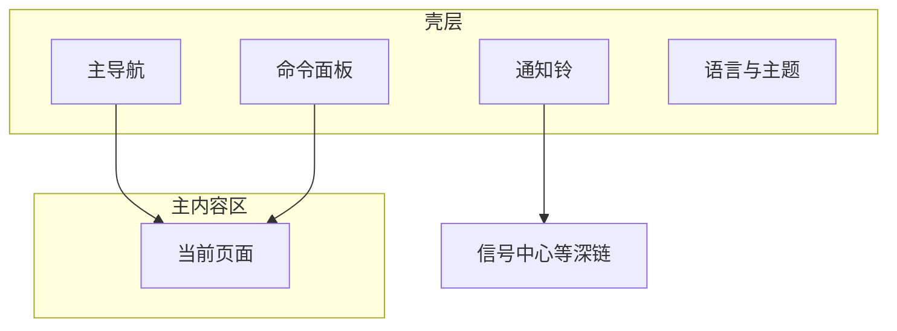

# 01 殼層：每一頁外面那一圈，先認路

> 本頁為**繁體中文**操作手冊。產品介面亦可切換為繁體；若螢幕標籤與手冊不一致，**以介面為準**。

你好。打開 StockPulse 之後，中間的內容會換，但**外面那一圈**通常還在：左側（或頂部）導航、通知鈴、搜索/命令入口、語言和主題。

這一圈就叫 **殼層**。先把它認熟，後面換到分析、持倉、設置時，你就不會「找不到回去的路」。

> 💡 這一章不教你改配置文件，只教你：**去哪點、快捷鍵是什麼、界面語言和報告語言有啥不一樣**。

> ⚠️ 產品輸出僅供研究學習，**不構成投資建議**。

---

## 你什麼時候會用到殼層

| 場景 | 用殼層的哪一塊 |
| --- | --- |
| 第一次打開，不知道功能在哪 | 主導航 |
| 想從任意頁立刻去分析 | 命令面板 `Cmd/Ctrl + K` |
| 想知道有沒有新提醒 | 通知鈴 |
| 菜單想英文、報告想中文 | 界面語言（殼層）vs 報告語言（設置） |
| 晚上看屏幕刺眼 | 主題（淺色 / 深色） |
| 開啓了登錄保護 | `/login` 登錄頁 |

---

## 整體長什麼樣

寬屏時，常見是左側導航 + 中間主內容 + 頂欄工具；窄屏時，導航可能收成漢堡菜單或頂欄抽屜——**功能還在，只是位置擠了**。

| 區域 | 常見位置 | 人話 |
| --- | --- | --- |
| 主導航 | 左側 / 頂欄 | 目錄：首頁、研究、組合、Agent、設置 |
| 主內容區 | 中間 | 你正在用的功能頁 |
| 通知鈴 | 頂欄附近 | 有沒有新信號/告警 |
| 命令面板 | 快捷鍵或搜索框 | 萬能跳轉 |

桌面客戶端和 Web 的信息架構一致；個別桌面浮動窗以實際客戶端為準。

---

## 主導航：五個一級域

當前產品把主入口收成五個域（文案以你屏幕為準）：

| 導航名 | 路由 | 裡面有什麼 | 手冊 |
| --- | --- | --- | --- |
| **首頁** | `/` | 今日焦點、待辦、配置缺口 | [02](02-home.md) |
| **研究** | 組入口常到 `/research/market` | 見下表子菜單 | 03 / 04 / 09 / 12 |
| **組合** | `/portfolio` | 持倉記賬（頁面標題常寫「持倉」） | [07](07-portfolio.md) |
| **Agent** | `/chat` | 問股多輪對話（頁面標題常寫「問股」） | [05](05-agent-chat.md) |
| **設置** | `/settings` | 模型、數據源、通知、安全 | [10](10-settings.md) |

### 「研究」裏的子項

| 子項 | 路由 | 手冊 |
| --- | --- | --- |
| 大盤復盤 | `/research/market` | [04](04-market-review.md) |
| 發現 | `/research/discover` | [12](12-discover.md) |
| 分析工作台 | `/research/analysis` | [03](03-analysis-workbench.md) |
| 回測 | `/research/backtest` | [09](09-backtest.md) |

### 側欄裏沒有、但很重要的入口

| 去哪 | 怎麼進 |
| --- | --- |
| **信號中心** `/signals` | 通知鈴、命令面板、首頁焦點行；見 [06](06-signals.md) |
| **個股工作區** `/stocks/代碼` | 命令面板或外鏈；見 [13](13-stock-details.md) |
| **登錄** `/login` | 開啓管理員認證後；受保護頁會帶 `?redirect=` |

舊路徑如 `/decision-signals`、`/alerts`、`/backtest`、`/screening` 一般會重定向到新地址。

---

## 命令面板：強烈建議學會

| 系統 | 快捷鍵 |
| --- | --- |
| macOS | `Cmd + K` |
| Windows / Linux | `Ctrl + K` |

| 你想做的事 | 可以試着輸入 |
| --- | --- |
| 跳轉頁面 | `分析`、`持倉`、`信號`、`設置`、`首頁` |
| 找股票 | `600519`、`AAPL` |
| 大盤相關 | `復盤`、`大盤` |

### 小練習：三步回到分析

1. 你正在設置頁改模型。  
2. 按 `Cmd/Ctrl + K`，輸入「分析」。  
3. 回車進入分析工作台——不必在側欄裏一層層點。

---

## 通知鈴

鈴鐺匯總較新的信號與告警提醒。

- 點某條：常會深鏈到信號詳情或歷史。  
- **查看全部**：進入信號中心。  
- 一直是空的：若你還沒跑過分析、也沒建規則，**完全正常**。

---

## 界面語言、報告語言、主題

| 開關 | 改什麼 | 不改什麼 |
| --- | --- | --- |
| **界面語言** | 菜單、按鈕、空狀態 | 報告正文語言 |
| **報告語言** | 分析報告正文（多在設置 → 報告） | 菜單語言 |
| **主題** | 淺色 / 深色 | 業務邏輯 |

所以可以：**菜單英文 + 報告中文**。兩者互不影響。

產品界面可能支持很多語言；本手冊以簡中 + 英文維護。

---

## 登錄（若開啓了認證）

1. 訪問受保護頁面時跳到 `/login`。  
2. 輸入管理員密碼登錄。  
3. 成功後回到原來的 `redirect` 目標或首頁。  
4. 改密碼：設置 → 系統與安全 → 認證與安全。

未開啓認證時，本地可能直接進業務頁，以你的部署為準。

---

## 使用案例

**案例 A：迷路了**  
任意頁 → `Cmd/Ctrl + K` → 輸入「首頁」→ 重新開始。

**案例 B：想看有沒有推送**  
點鈴鐺 → 沒有就去跑分析或建規則 → 有就點進去讀。

**案例 C：菜單想換成英文**  
在殼層或設置切換界面語言爲 English；報告語言保持中文即可。

---

## 術語

| 術語 | 人話 |
| --- | --- |
| 殼層 | 幾乎每頁都在的外框導航與工具 |
| 信息架構 IA | 菜單怎麼分組、功能怎麼擺 |
| 命令面板 | 快捷搜索跳轉 |
| 深鏈 | 帶參數的鏈接，直接打開某條信號/某段設置 |

---

## 相關

- [02 首頁](02-home.md)  
- [06 信號中心](06-signals.md)  
- [10 設置](10-settings.md)  

上一篇：返回 [手冊目錄](README.md) · 下一篇：[02 首頁](02-home.md)
