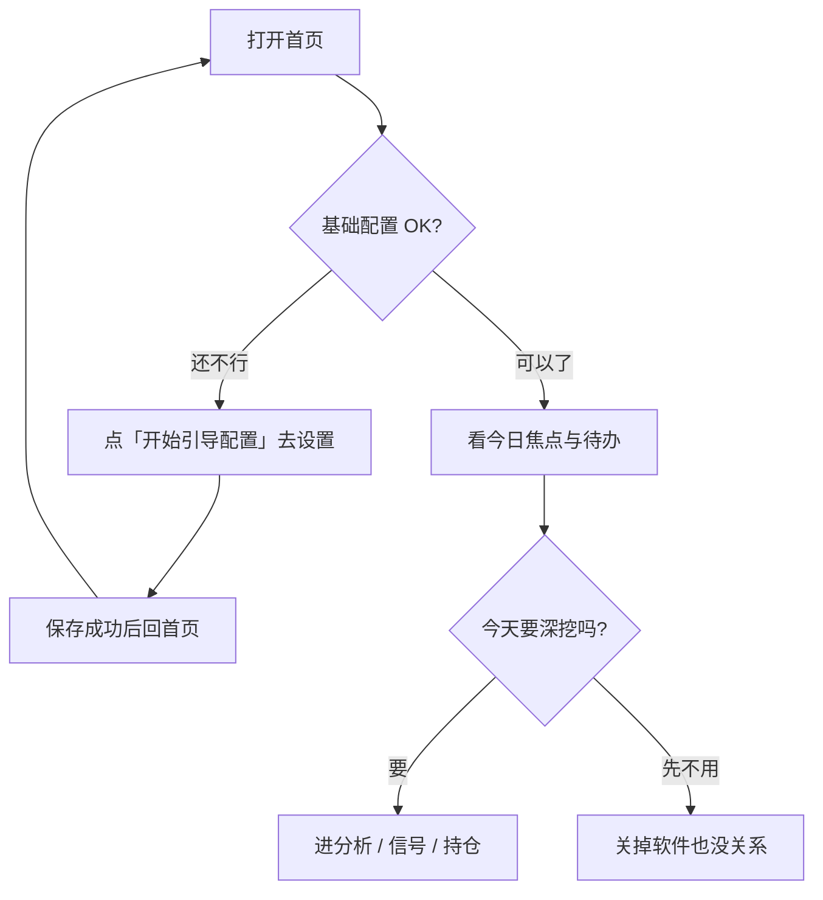

# 02 首頁：打開軟件後，先看這裡

> 本頁為**繁體中文**操作手冊。產品介面亦可切換為繁體；若螢幕標籤與手冊不一致，**以介面為準**。

你好。如果你是第一次打開 StockPulse，首頁可能會讓人有點懵：這裡沒有一大篇報告，而是幾塊卡片和提示。別急——這是故意的。

首頁的定位很簡單：**幫你決定「今天先看什麼」**，而不是一上來就把所有歷史報告塞滿屏幕。你可以把它當成「今日工作台的門口」，先掃一眼，再走進分析、信號或持倉。

> 💡 **第一次來？請先記住兩件事**  
> 1. 至少配置好一個能測通的 **AI 模型**，並點過保存。  
> 2. 自選股裏至少有 **1～3 個** 你認識的代碼（例如 `600519`）。  
> 如果這兩項沒做好，首頁會一直提醒「基礎配置未完成」。這不是壞了，是系統在保護你：配置不齊就硬跑分析，多半只會失敗、浪費額度。

> ⚠️ 首頁上的摘要、信號只供學習與研究，**不構成投資建議**。是否交易、怎麼倉位，請你自己判斷。

---

## 怎麼進入首頁

| 方式 | 你怎麼做 |
| --- | --- |
| 最常見 | 點左側（或窄屏菜單裏的）**首頁** |
| 地址欄 | 打開 `/` |
| 命令面板 | `Cmd/Ctrl + K`，輸入「首頁」 |
| 配完設置後 | 保存成功後，再點回首頁，看缺口提示有沒有消失 |

---

## 首頁適合幹什麼

| 你現在的情況 | 建議你怎麼用首頁 |
| --- | --- |
| 剛裝好，還不會用 | 先看有沒有黃色/警告條，跟着 **開始引導配置** 走 |
| 開盤前只有幾分鐘 | 掃「今日焦點」和「待辦」，只點進真正關心的 1～2 只 |
| 已經跑過分析 | 從焦點進信號詳情，或展開「最近分析」讀報告 |
| 數據加載怪怪的 | 看「首頁數據不完整」，點 **重試** |
| 只想馬上分析一隻票 | 焦點爲空時點 **開始分析**，會進分析工作台 |

---

## 頁面長什麼樣（用大白話說）

想象首頁從上到下大致是這樣：

1. **（可能有）配置未完成的提示條**——最重要，先處理它。  
2. **中間三塊核心區**：今日焦點、待辦、信號摘要。  
3. **可展開區域**：晨報（大盤）、最近分析——默認常常是收起來的，避免一屏太擠。

### 1. 「基礎配置未完成」提示條

當你還沒配好最小可用環境時，會出現類似 **基礎配置未完成** 的提示，並列出還缺什麼（例如模型、自選）。

- 點 **開始引導配置**：會跳到設置的「概覽 / 就緒」一類頁面，按檢查項補齊即可。  
- 也可以點關閉先看界面，但**真正能跑分析之前**，還是建議把缺口補上。  
- 補完後務必 **保存**，再回首頁。只改字不保存，提示不會消失。

### 2. 今日焦點

這裡展示的是：系統認爲你「最近值得看一眼」的 **有效信號（active）**，通常按時間優先。

每一行一般會看到股票名稱/代碼，以及一個方向標籤（比如觀望、持有、偏多之類——以界面為準）。

| 你看到的狀態 | 通常表示 | 建議動作 |
| --- | --- | --- |
| 有若干行 | 已經有可展示的有效信號 | 點感興趣的一行，進信號中心看詳情 |
| **暫無需要關注的信號** | 還沒跑出有效信號，或都被關掉了 | 點 **開始分析**，先完成第一份報告 |
| 加載失敗 / 數據不完整 | 拉信號時出錯 | 點重試；仍失敗再查網絡與後端是否在跑 |

點某一行後，通常會進入 **信號中心**，並帶上這隻股票的上下文，方便你繼續篩選或建規則。

### 3. 待辦

這裡的「待辦」**不是**生活類 To-Do 清單，而是偏研究用的提醒，例如：某些有效信號快過期了，或需要你再評估一下。

| 狀態 | 怎麼理解 |
| --- | --- |
| 有條目 | 系統在說：「這幾條建議可能舊了，你抽空看一眼還成不成立。」 |
| **待辦已清零** | 近期沒有這類臨期再評估事項，可以鬆一口氣 |
| 說明裏提到審批暫不顯示 | 正常：目前重點是提醒你復看，不是完整審批流 |

### 4. 信號摘要

可以把它當成一塊小儀錶盤：有效信號大概有多少、告警有沒有觸發、再評估相關數字等。

它適合回答：**「我要不要打開信號中心好好看？」**  
它不適合替代：打開每一條詳情、讀完整報告。

### 5. 可展開區：晨報與最近分析

爲了不讓首頁太吵，**晨報（最新大盤復盤入口）** 和 **最近分析** 常常默認摺疊。

- 想看市場溫度：展開晨報相關塊，沒有記錄就去跑一次 [大盤復盤](04-market-review.md)。  
- 想接着昨天的報告：展開最近分析，點進某條繼續讀。  
- 系統完整歷史請去 **研究 → 分析工作台 → 歷史**，首頁只放「最近幾條」的快捷入口。

---

## 第一次從零跑通（跟着做）

下面這條路徑，是我們最推薦給新手的：

1. 打開首頁，若有配置提示，點 **開始引導配置**。  
2. 在設置裏添加一個模型服務（如 Anspire / AIHubMix），粘貼 Key，**保存**，再 **測試連接** 直到成功。  
3. 在自選股裏填例如 `600519`（多個用英文逗號），再 **保存**。  
4. 回到首頁，確認黃色缺口提示減輕或消失。  
5. 點 **開始分析**（或導航到分析工作台），輸入 `600519`，開始分析。  
6. 等任務完成後打開報告，按 [08 閱讀報告](08-reading-reports.md) 先看結論與風險。  

若某一步失敗，先不要連點十幾次。停下來看錯誤提示，多半是 Key、額度或網絡問題，到 [10 設置](10-settings.md) 排查更有效。

---

## 每天開盤前 3 分鐘（示例習慣）

1. 打開首頁，先看待辦有沒有「快過期」的信號。  
2. 今日焦點裡最多點進 1～2 只你真正持有或盯着的票。  
3. 展開最近分析，確認昨天結論有沒有被新信息推翻的感覺（只做直覺，不做衝動下單）。  
4. 需要市場背景時，再去大盤復盤；**不要**指望首頁單獨承擔完整復盤正文。

---

## 鏈接與「跳轉」的小說明

有時你點的是舊書籤或別人分享的鏈接：

- 乾淨打開 `/`：應該停在首頁，而不是偷偷打開某份舊報告。  
- 帶 `recordId` 等分析參數的鏈接：可能被重定向到分析工作台歷史——這是爲了統一入口，不是丟書籤。  
- 無效鏈接：會提示報告或運行流無效，換一份有效歷史即可。

---

## 常見擔心

**「首頁空空的，是不是壞了？」**  
多半是還沒成功跑過分析，或還沒有 active 信號。先跑通一份報告再回來看。

**「提示配置未完成，但我明明填了 Key？」**  
檢查有沒有點 **保存**，以及測試連接是否成功。只填不存，系統仍認爲你沒配好。

**「信號中心在側欄找不到？」**  
對，它不在五個一級菜單裏。從首頁焦點、信號摘要，或頂欄 **通知鈴** 進入最省事。詳見 [06 信號中心](06-signals.md)。

---

## 今日定時任務（若你的版本有）

部分未合入/較新版本會在首頁增加 **今日定時任務** 只讀區塊：

- 看今天已經跑過或即將跑的任務（如股票分析、研究簡報、風險檢查）。  
- 狀態可能包括：運行中、等待重試、已跳過等。  
- **不能**在這裡改 cron 或新建調度；改調度仍去 **設置 → 系統與安全 → 調度**（或後臺任務文檔）。  
- 若顯示「今日暫無定時任務」，表示今天沒有相關任務，不一定是故障。

詳見倉庫 `docs/scheduled-tasks.md`（實現向）。

## 術語（白話）

| 說法 | 人話解釋 |
| --- | --- |
| 注意力中樞 | 首頁的職責：先幫你排序「今天看什麼」 |
| 今日焦點 | 優先展示的有效 AI 建議摘要 |
| 待辦 | 需要你再瞅一眼的研究提醒（常與信號臨期有關） |
| 有效信號 active | 還沒被關掉、作廢、歸檔的結構化建議 |
| 引導配置 | 從首頁跳進設置就緒檢查的快捷按鈕 |
| 晨報 | 首頁語境下，多半是最新大盤復盤的入口，不是個股買賣單 |

---

## 相關閱讀

- [01 殼層](01-shell.md)（導航、命令面板、通知鈴）  
- [03 分析工作台](03-analysis-workbench.md)  
- [06 信號中心](06-signals.md)  
- [10 設置](10-settings.md)  
- [小白客戶端安裝](../../../beginner-client-setup.md)  

上一篇：[01 殼層](01-shell.md) · 下一篇：[03 分析工作台](03-analysis-workbench.md)
