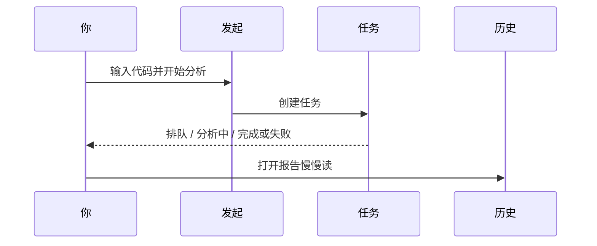

# 03 分析工作台：在這裡生成第一份（和第一百份）個股報告

> 本頁為**繁體中文**操作手冊。產品介面亦可切換為繁體；若螢幕標籤與手冊不一致，**以介面為準**。

你好。如果首頁是「門口」，那分析工作台就是 **真正開工的房間**。

在這裡，你輸入股票代碼、可選一個分析風格（策略 Skill），點開始，系統會去拉行情與資訊，再請大模型寫出一份研究報告。你可以同時盯着任務進度，也可以之後在歷史裡把舊報告翻出來對比。

> 💡 **和「大盤復盤」差在哪？**  
> - **分析工作台**：研究「某一隻股票」  
> - **大盤復盤**：研究「整個市場今天什麼氣質」  
> 大盤再強，也不等於你手裡的那隻一定強。個股結論請以個股報告為準。

> ⚠️ 報告只供研究學習，**不構成投資建議**。每跑一次通常都會消耗模型額度，先小批量試，再放大。

---

## 怎麼走進這個房間

| 方式 | 路徑 |
| --- | --- |
| 導航 | **研究** → **分析工作台** |
| 命令面板 | `Cmd/Ctrl + K`，搜「分析」「工作台」 |
| 地址 | `/research/analysis` |
| 從首頁 | 焦點爲空時的 **開始分析** |
| 從個股行情頁 | `/stocks/代碼` 上的 **分析** 按鈕 |

地址欄裏可能還有這些參數（收藏某一狀態時有用）：

| 參數 | 含義 |
| --- | --- |
| `segment=launch` | 發起分析（默認常可省略） |
| `segment=tasks` | 運行中任務 |
| `segment=history` | 歷史與對比 |
| `recordId=…` | 打開某一份歷史報告 |
| `stock=…` | 預填股票代碼 |

---

## 三個分段：你可以把它想成三條傳送帶

工作台通常分成三段。不用一次學完：日常只要記住 **發起 → 看任務 → 讀歷史**。

| 分段 | 你在幹什麼 | 什麼時候點 |
| --- | --- | --- |
| **發起與批量** | 填代碼、選策略、提交 | 想產生新報告時 |
| **運行中任務** | 看排隊、進行中、失敗原因 | 剛提交之後；卡住時 |
| **歷史與對比** | 打開舊報告、對比趨勢、刪除 | 讀結果、周末復盤時 |

---

## 發起分析：一步一步來（推薦新手照做）

### 第一次只分析 1 只

1. 進入 **發起** 分段。  
2. 在輸入框填代碼，例如：  
   - A 股：`600519`  
   - 港股：`hk00700`（記得 `hk`）  
   - 美股：`AAPL`  
3. **策略 Skill** 先不選，用系統默認，少一個變量。  
4. 若有 **新手模式** 或報告 **brief（簡要）**，建議打開——先讀懂骨架，再追求長文。  
5. 點 **開始分析**。  
6. 界面往往會把你帶到 **運行中任務**；此時請耐心等，不要連點十幾次「開始」。  
7. 看到完成後，點 **查看報告**，或到歷史裡打開。

### 代碼格式小抄（真的很重要）

| 市場 | 推薦寫法 | 容易錯的地方 |
| --- | --- | --- |
| A 股 | `600519`、`300750` | 只寫公司名不寫代碼 |
| 港股 | `hk00700` | 漏掉 `hk` |
| 美股 | `AAPL`、`BRK.B` | 大小寫亂（建議大寫） |
| 日股 / 韓股等 | `7203.T`、`005930.KS` | 漏交易所後綴 |

不確定代碼時，優先用輸入框的自動完成；或先到 [個股工作區](13-stock-details.md) 看行情是否對得上名稱。

### 批量：什麼時候用，怎麼用才不頭疼

當你自選已經穩定、模型也測通了，可以一次提交多隻：

1. 從自選一鍵填入，或手動用逗號拼多個代碼。  
2. 確認當前的新手/專業、策略設置，是你希望 **這一整批都沿用** 的。  
3. 提交後到任務列表，逐個看誰成功、誰失敗。  
4. **部分失敗很常見**：不要假設「點了就全部成功」。失敗的單獨重跑即可。

新手建議：一次 **3～10 只**。一次上百隻，容易又貴又難讀。

### 智能導入：截圖和表格也能變成代碼列表

界面提供從 **圖片 / CSV / Excel / 剪貼板** 識別代碼的能力時：

1. 選文件或粘貼。  
2. **一定先人工核對**識別結果：高置信可以默認勾選，中低置信請你自己點確認。  
3. 確認無誤再合併到待分析列表並提交。

導入失敗時，常見原因是：圖太糊、文件太大、編碼不是 UTF-8/GBK、表頭沒有「代碼」列。改完再試一次通常就好。

---

## 運行中任務：進度條在說什麼

| 你看到的狀態 | 人話 | 你可以做什麼 |
| --- | --- | --- |
| 排隊 | 還在等輪到它 | 喝口水；避免重複提交同一隻 |
| 分析中 / 運行中 | 正在拉數據 + 調用模型 | 可打開「運行流」看卡在哪一步（進階） |
| 完成 | 報告 gener 好了 | 點查看報告 |
| 失敗 | 中途出錯 | 讀錯誤原文；查 Key、額度、網絡、數據源 |
| 列表空 | 當前沒有任務 | 回發起分段 |

**運行流（Run Flow）** 是給願意排障的人看的：把一次任務拆成若干階段（例如取行情、取新聞、生成正文）。普通使用可以先忽略；只有「一直轉圈」時再打開它，能少猜很多。

---

## 歷史與對比：報告住在這裡

分析完成後，報告會出現在 **歷史** 分段：

1. 左側（或列表區）點某一條記錄。  
2. 右側看摘要；需要全文時打開 Markdown 抽屜。  
3. 用 **歷史趨勢** 看同一隻股票過去幾次結論是否來回翻燒餅——這比單看今天一句「買入」更重要。  
4. 清理垃圾記錄時可用多選刪除；**刪除不可恢復**，確認框請認真讀。

收藏某一份報告：帶上 `segment=history&recordId=數字` 的鏈接即可。

閱讀順序請跟 [08 閱讀報告](08-reading-reports.md)：先結論與風險，再價位與資訊。

---

## 策略 Skill：要不要選？

**策略 / Skill** 是「分析時更看重什麼」的風格包，例如更偏趨勢、質量、事件等（列表以產品實際為準）。

| 選擇 | 適合 |
| --- | --- |
| 不選（默認） | 第一次跑通、對比基線 |
| 選一個你理解的 | 你明確想用某種研究視角 |
| 頻繁換來換去 | 不推薦；結論會更難縱向對比 |

策略 **不是**「穩賺開關」。它改變側重點，不消滅風險。

---

## 費用與心態（說在前面）

- 每跑一次，通常都會調用大模型，也可能訪問新聞接口。  
- **detailed（詳細）+ 大批量 + 反覆重跑** 最容易把額度燒掉。  
- 同一天對同一隻股票無意義連跑，除了費錢，還容易在信號中心堆出一堆噪聲。  

更穩的節奏是：想清楚問題 → 跑 1 次 → 認真讀 → 有需要再問股追問。

---

## 使用案例（可以直接當劇本）

### 案例 A：人生第一份報告

配置好模型與自選 → 工作台只輸入 `600519` → 新手 + brief → 開始 → 完成後只讀「操作建議 + 風險三條」→ 覺得不夠再開全文或換專業模式。

### 案例 B：周末批跑 8 只自選

確認 8 個代碼格式 → brief + 默認策略 → 批量提交 → 任務列表盯進度 → 失敗的 2 只單獨重跑 → 歷史裡精讀最重倉的 3 只 → 對需要盯價的 1 只去信號中心建規則。

### 案例 C：任務失敗了

錯誤裏寫模型/401/餘額 → 去設置測連接。  
寫超時/網絡 → 檢查後端是否在跑、網絡是否穩，再重試一次。  
寫數據源 → 到設置數據源看 Key 與狀態，必要時先無新聞跑技術面。

### 案例 D：從行情頁跳過來

在 `/stocks/AAPL` 看完圖，點 **分析** → 工作台應帶上代碼 → 直接開始，少一次手敲。

---

## 術語（白話）

| 術語 | 人話 |
| --- | --- |
| 分析工作台 | 生成個股 AI 報告的主頁面 |
| 分段 segment | 發起 / 任務 / 歷史 三塊工作區 |
| 策略 Skill | 可選的分析風格包 |
| 運行流 | 單次任務內部階段記錄，用來排障 |
| recordId | 歷史報告的編號，可寫在鏈接裏 |
| brief / detailed | 報告詳略 |
| 批量 | 一次提交多隻股票的任務 |

---

## 相關閱讀

- [08 閱讀報告](08-reading-reports.md)  
- [05 問股對話](05-agent-chat.md)  
- [06 信號中心](06-signals.md)  
- [13 個股工作區](13-stock-details.md)  
- [10 設置](10-settings.md)  

上一篇：[02 首頁](02-home.md) · 下一篇：[04 大盤復盤](04-market-review.md)
