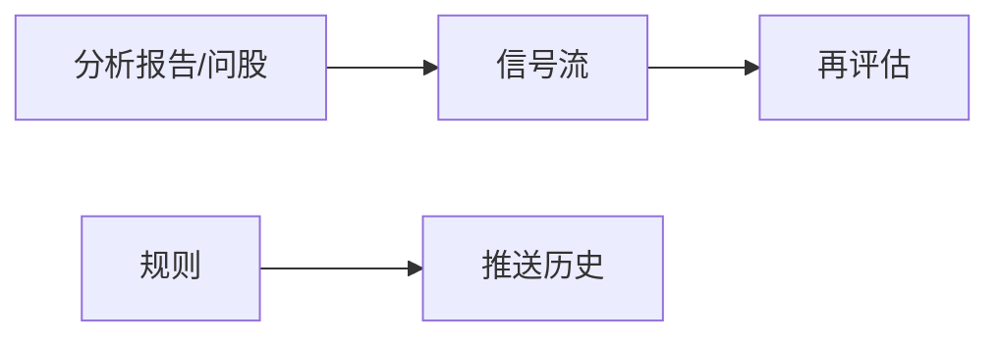

# 06 信號中心：把「建議」變成可以回看的記錄

> 本頁為**繁體中文**操作手冊。產品介面亦可切換為繁體；若螢幕標籤與手冊不一致，**以介面為準**。

你好。跑完分析後，報告很長，你不可能每天把所有長文重讀一遍。信號中心的作用，就是把報告裡比較關鍵的 **方向性建議**，整理成一條條可以篩選、可以關閉、可以事後打分的記錄。

請先建立正確預期：

- 信號是 **研究筆記 + 結構化標籤**，不是自動下單系統。  
- 系統 **不會** 替你買入或賣出。  
- 鈴鐺有時是空的——如果你還沒跑過分析、也沒建告警規則，空是正常的。

> ⚠️ 所有信號內容僅供學習研究，**不構成投資建議**。

---

## 重要：側欄可能找不到「信號」

信號中心 **不在** 五個一級導航（首頁 / 研究 / 組合 / Agent / 設置）裏。請用下面任一方式進入：

| 方式 | 怎麼做 |
| --- | --- |
| 通知鈴 | 頂欄鈴鐺 → 「查看全部」或點某條通知 |
| 命令面板 | `Cmd/Ctrl + K`，搜「信號」「信號中心」 |
| 地址欄 | `/signals` |
| 首頁 | 點「今日焦點」裏的某一行 |
| 持倉頁 | 從 AI 建議相關入口跳轉（常帶持倉範圍） |

常用深鏈（可以收藏）：

| 鏈接 | 打開什麼 |
| --- | --- |
| `/signals?tab=feed` | 信號流 |
| `/signals?tab=rules` | 規則 |
| `/signals?tab=rules&createRule=1` | 規則並嘗試新建 |
| `/signals?tab=history` | 推送歷史 |
| `/signals?tab=review` | 再評估與統計 |
| `/signals?scope=holdings` | 只看持倉相關 |
| `/signals?stock=600519` | 帶上某隻股票上下文 |

舊地址 `/decision-signals`、`/alerts` 一般會自動跳過來，老書籤通常還能用。

---

## 四個 Tab，各管一件事

你可以把它想成四個抽屜：

| Tab 名稱 | 人話職責 | 什麼時候去 |
| --- | --- | --- |
| **信號流** | 瀏覽、篩選、關閉、反饋建議 | 每天掃一眼 |
| **規則** | 設置「到價/漲跌/指標」等提醒 | 想盯盤時 |
| **推送歷史** | 查「到底有沒有通知出去」 | 手機沒響時 |
| **再評估與統計** | 事後算算方向準不準 | 周末復盤時 |

---

## 信號流：日常最常用的抽屜

### 建議你怎麼設篩選

第一次打開時，推薦：

1. 狀態先只看 **進行中 / active**（還有效的）。  
2. 若你記了持倉，範圍選 **持倉**；否則選 **全部** 或 **自選**。  
3. 先不要批量作廢——先點進詳情讀完，再決定關不關。

### 打開一條詳情時，優先看什麼

不用把所有字段背下來。按這個順序就很夠用：

1. **動作（action）**：偏多、觀望、減倉……是方向標籤。  
2. **風險摘要**：最壞可能發生什麼。  
3. **失效條件**：什麼情況下這套邏輯該作廢。  
4. **價位計劃**（若有）：支撐、壓力、止損、目標——可能殘缺，殘缺時不要腦補。  
5. **置信度 / 期限**：模型有多「敢說」、大概看多長。  
6. **來源報告**：點回去讀完整敘事。

### 關閉、作廢、歸檔、反饋

- 當你認爲這條建議過時了，可以 **關閉 / 作廢 / 歸檔**（具體按鈕以界面為準）。  
- 系統通常會彈出確認框：請看清楚，**很多終態不能一鍵改回 active**。  
- **有用 / 無用** 反饋：幫助你日後看統計，也可以當作自己的閱讀標記。

### 列表空空的？

| 提示方向 | 常見原因 | 下一步 |
| --- | --- | --- |
| 暫無決策信號 | 還沒成功分析，或報告沒提出結構化建議 | 去分析工作台跑 1 只 |
| 該股暫無最新有效信號 | 沒有 active，或已過期 | 重新分析，或放寬狀態篩選 |
| 鈴鐺爲空 | 既沒有新信號，也沒有告警觸發 | 正常；先完成分析或建規則 |

### 想自己記一條建議？——手工創建

如果你做了獨立研究，想把結論結構化存下來：

1. 點 **創建信號**（文案以界面為準）。  
2. 填寫代碼、市場、動作；可選入場區間、止損、目標、置信度。  
3. 注意：來源會固定爲 **手動**，不會僞裝成「分析生成」。  
4. 預覽滿意後提交。若命中去重，系統可能提示已有相同信號。

---

## 規則：讓系統在條件滿足時提醒你

規則 Tab 解決的是：「別盯盤盯到眼瞎，到價叫我一聲。」

### 新建一條簡單規則（新手劇本）

1. 打開 `/signals?tab=rules&createRule=1`，或點新建。  
2. 類型先選最容易懂的 **價格突破**（上破/下破，以選項為準）。  
3. 標的先寫 **一隻你熟悉的股票**，不要一上來「全市場」。  
4. 若有 **試運行 / dry-run**，先跑一次看觀察值是否合理。  
5. **保存並啓用**。  
6. 通知渠道請先保證設置裏 **至少有一個能測通** 的渠道（見 [10 設置](10-settings.md)）。

### 使用規則時的溫和建議

- **冷卻時間** 不要設成 0：否則條件一直滿足時，你會收到風暴般的提醒。  
- 規則列表爲空是正常的：系統不會在你沒建規則時隨便推送。  
- 可以從某條信號點 **從此信號創建規則**，少填一些字段。

規則類型還可能包括：漲跌幅、放量、均線/RSI/MACD、持倉風險、大盤狀態等——以你界面上的選項為準。選你能解釋給自己聽的類型，比選「最高級」更重要。

---

## 推送歷史：手機沒響時來這裡

當規則觸發或通知發出後，歷史 Tab 幫你回答兩個問題：

1. **觸發了沒有？**（規則側）  
2. **各個渠道成功了沒有？**（通知側，可能在 `history=notifications`）

排查順序建議：

1. 歷史裡是否有觸發記錄。  
2. 若有觸發、渠道失敗：去設置做 **測試推送**，檢查 Token/Webhook 是否過期。  
3. 若測試成功但實際沒響：看冷卻、範圍是否選錯、規則是否其實沒啓用。

---

## 再評估與統計：周末給自己打分，而不是打臉

這個 Tab 用來做 **事後驗證**：過去的 active 建議，方向後來大概對不對。

使用心態很重要：

- 樣本很少時，勝率數字 **幾乎沒有意義**。  
- 過新的信號可能還在冷卻窗口，暫時算不了。  
- 統計常常是 **全局已復盤** 口徑：你在信號流裏篩了「持倉」，統計數字也不一定跟着變——頁面若寫了「全局」，請相信它，不是 bug。

常見操作：

| 操作 | 說明 |
| --- | --- |
| 運行後驗 | 按安全默認補算缺失/可重試結果，一般不會無腦重算全部 |
| 看 hit / miss / unable | 命中、未命中、無法評估 |
| 決策風格重評估 | 對有來源報告的信號換風格預覽；可能被風控阻斷或因缺報告而不可用 |

---

## 使用案例（親切版）

### 案例 A：第一份報告跑完後

「我分析完 600519 了，然後呢？」  
→ 打開信號流，狀態選 active，找到這隻票，只讀動作、風險、失效條件。若完全不符合你的判斷，點「無用」或關閉即可，**不必強迫自己執行**。

### 案例 B：我想在 1800 元附近被提醒

→ 規則 → 價格條件 → 試運行 → 啓用。觸發後先看推送歷史是否成功，再決定要不要打開最新報告。

### 案例 C：我明明開了 Telegram，怎麼沒消息？

→ 推送歷史看渠道錯誤 → 設置裏測試推送 → 修好後再等下一次觸發。不要先把規則刪了重建十遍。

### 案例 D：我只想看持倉的風險向建議

→ `scope=holdings`，動作篩減倉/賣出/提醒類（以界面選項為準），逐條讀失效條件，再回 [持倉頁](07-portfolio.md) 對數量。

---

## 術語（白話）

| 術語 | 人話 |
| --- | --- |
| Decision Signal | 可查詢的一條結構化建議記錄 |
| active | 還有效 |
| closed / archived / expired / invalidated | 各種「結束態」 |
| action | 方向標籤（買/加/持/觀/減/賣/迴避等） |
| horizon | 大概看多長（日內、幾天、波段…） |
| confidence | 置信度：越高越「敢說」，不代表越正確 |
| invalidation | 邏輯被打破的條件 |
| scope | 全部 / 持倉 / 自選 |
| dry-run | 先試跑，不急着正式打擾你 |
| outcome / 後驗 | 事後對照價格路徑算分 |

更完整的字段契約見倉庫文檔 [DecisionSignal 專題](../../../decision-signals.md)（偏技術，可選）。

---

## 相關閱讀

- [08 閱讀報告](08-reading-reports.md)  
- [07 持倉](07-portfolio.md)  
- [09 回測](09-backtest.md)  
- [10 設置](10-settings.md)（通知渠道）  
- [03 分析工作台](03-analysis-workbench.md)  

上一篇：[05 問股對話](05-agent-chat.md) · 下一篇：[07 持倉](07-portfolio.md)
