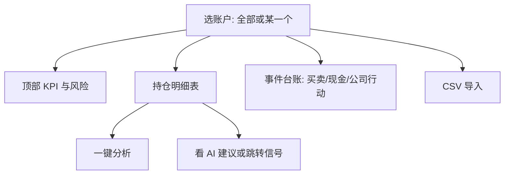

# 07 持倉（組合）：把賬記清楚，再談風險

> 本頁為**繁體中文**操作手冊。產品介面亦可切換為繁體；若螢幕標籤與手冊不一致，**以介面為準**。

你好。持倉模塊解決的是一件很樸素的事：**你自己的賬戶裏，現在到底有什麼、成本大概多少、風險有沒有擠在一處**。

它和 AI 信號是合作關係，不是替代關係：

- 持倉記錄的是 **你的事實**（成交、現金、分紅等）。  
- AI 信號是 **研究建議**，可以顯示在持倉行旁邊作參考。  
- 系統 **不會** 根據信號自動幫你買賣調倉。

> 💡 **名字爲什麼有時叫「組合」，有時叫「持倉」？**  
> 側欄導航文案常見是 **組合**；進到頁面後標題更常是 **持倉管理**。這是同一功能，不是兩個產品。找不到時搜「持倉」「portfolio」即可。

> ⚠️ 盈虧數字與 AI 建議都只供研究記錄，**不構成投資建議**。紙交易（若有）請與實盤分開看。

---

## 怎麼進入

| 方式 | 路徑 |
| --- | --- |
| 側欄 | **組合** |
| 地址 | `/portfolio` |
| 命令面板 | 搜「持倉」「組合」 |

---

## 這個頁面適合你嗎？

| 你的情況 | 建議 |
| --- | --- |
| 只想試用 AI 報告 | 可以先不建持倉，不影響分析 |
| 想對照「建議 vs 真實倉位」 | 建議建 1 個賬戶，至少錄幾筆 |
| 有券商導出 CSV | 用導入，但請先預覽 |
| 想練手不敢動真倉 | 若界面提供紙交易/模擬賬戶，用它練流程 |

---

## 頁面結構（逛一遍就不會慌）

### 賬戶切換

- **全部賬戶**：適合看總覽；很多「寫入」操作可能被攔住，需要先點進具體賬戶。  
- **某一個賬戶**：記賬、導入、刪流水時請確認選對了——選錯賬戶就像記錯賬本，很煩人。

### 成本法

界面可能提供 **FIFO（先進先出）** 與 **平均成本** 等（以標籤為準）。

換成本法會改變「成本價、盈虧」的 **展示口徑**，不會抹掉你真實的歷史成交。長期自己對比時，建議 **固定一種**，否則數字跳來跳去會懷疑人生。

### KPI 與風險條（讀感覺，不讀小數點後八位）

常見會看到：總權益、總市值、現金、匯率狀態、集中度、回撤、止損接近、與持倉相關的 AI 風險信號匯總等。

如果出現「實時行情盡力獲取」「匯率與成本部分口徑」這類局限提示，請把數字當成 **方向感**，而不是會計師籤字版。

### 持倉表

每一行大致是：代碼、數量、成本、現價、市值、浮動盈虧、操作（分析）、有時還有 AI 建議摘要。

- AI 列可能 **轉一會兒才出來**；沒有 active 信號時顯示空佔位是正常的。  
- 點 **分析**：任務會跑到分析工作台，不是在本頁直接生成長文。

---

## 從零建賬：最穩的五步

1. **新建賬戶**：名稱必填；券商、基礎貨幣、市場按你的真實情況填（或先填大概）。  
2. **選中這個賬戶**（不要停在「全部」）。  
3. **錄一筆買入**：代碼、日期、價格、數量；費用能填就填。  
4. 看持倉表數量與成本是否符合預期。  
5. 故意試一筆 **超量賣出**：若被攔截，說明保護在工作——這是好事。

然後再錄出現實中的賣出、出入金、分紅等。

---

## 三種流水，分別記什麼

| 類型 | 你在記什麼 | 典型字段 |
| --- | --- | --- |
| **買賣 trade** | 股票成交 | 代碼、買/賣、價格、數量、費稅、日期 |
| **現金 cash** | 出入金等 | 流入/流出、金額、幣種、日期 |
| **公司行動 corporate** | 分紅、拆股等 | 生效日、類型、每股分紅或拆股比例 |

臺賬區通常支持按日期、代碼、方向篩選，以及分頁瀏覽。刪錯一行會有確認；有些情況會 **禁止刪除**（保護一致性）。

### 分紅怎麼記（示例）

選對賬戶 → 選公司行動 → 現金分紅 → 填生效日與每股分紅 → 提交 → 回來看現金與成本是否按你的預期變化。若與券商不一致，先核對除權日與是否已含稅，再改流水。

---

## CSV 導入：請對預覽溫柔一點

導入能省大量時間，但也是最容易「一鍵導入、一鍵後悔」的地方。請按這個節奏：

1. 選中正確賬戶。  
2. 打開 **CSV 導入**，選擇文件。  
3. 選擇券商模板或通用模板（列表爲空時換通用）。  
4. 先 **解析 / 預覽（dry-run）**，不要直接提交。  
5. 抽查 3 只股票的方向、數量、價格、日期。  
6. 確認無誤再 **正式寫入（commit）**。  
7. 刷新後，用券商 App 對一下數量。

| 常見問題 | 你可以怎麼做 |
| --- | --- |
| 表頭對不上 | 換模板或按提示改列名 |
| 亂碼 | 另存 UTF-8 再試 |
| 重複導入 | 看系統是否提示冪等；仍以預覽為準，必要時先清測試賬戶 |
| 超賣 | 預覽階段改掉錯誤賣出 |

---

## 和 AI 信號一起用

| 現象 | 怎麼理解 |
| --- | --- |
| 行內有簡短 AI 建議 | 有可展示的最新 active 信號 |
| 一直是空 | 可能沒信號，或還在異步加載 |
| 提示降級 | 展示不完整，請點進信號中心或報告 |
| 想看持倉池全部建議 | 打開 `/signals?scope=holdings` |

更好的日常節奏是：

開盤前看持倉集中度與回撤 → 對最不放心的 1 只點分析或進信號中心 → 讀完再生效你的交易計劃（計劃在你腦子裡，不在自動下單裏）。

---

## 使用案例

### 案例 A：我只有三筆歷史成交

新建賬戶 → 手工錄三筆 → 看總市值是否大致合理 → 結束。不必一上來就搞 CSV。

### 案例 B：券商導出了一大表

新建「實盤」賬戶 → dry-run 預覽總筆數 → 抽查茅臺/某隻核心持倉 → commit → 與 App 對數量。

### 案例 C：持倉有了，AI 列空白

對持倉代碼在工作台跑一輪分析 → 回持倉刷新 → 或直接打開信號中心持倉範圍。

### 案例 D：多賬戶都有同一隻票

一鍵分析時若提示選賬戶，請選對賬本，避免上下文掛錯。

---

## 術語（白話）

| 術語 | 人話 |
| --- | --- |
| 賬戶 | 一本獨立的賬 |
| 成本法 | 怎麼算「我的成本價」 |
| FIFO | 先買的先賣出來匹配成本 |
| 平均成本 | 攤成一個均價 |
| 已實現 / 未實現 | 賣掉鎖定的 vs 還拿在手裡的浮動 |
| 集中度 | 錢是不是都堆在少數幾隻上 |
| 回撤 | 從高點滑下來多少的感覺 |
| 公司行動 | 分紅、拆股等公司層面的變動 |
| 紙交易 | 模擬賬戶（若產品提供） |

---

## 相關閱讀

- [06 信號中心](06-signals.md)  
- [03 分析工作台](03-analysis-workbench.md)  
- [11 日常工作流](11-daily-workflows.md)  

上一篇：[06 信號中心](06-signals.md) · 下一篇：[08 閱讀報告](08-reading-reports.md)
