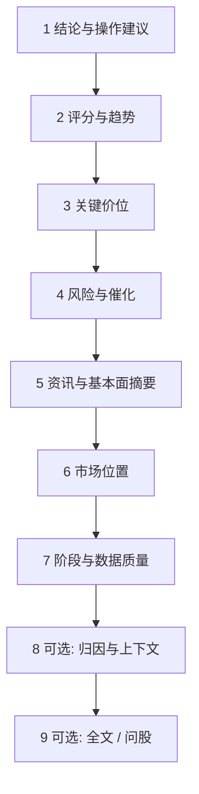

# 08 閱讀報告：別被長文嚇到，按這個順序讀就好

> 本頁為**繁體中文**操作手冊。產品介面亦可切換為繁體；若螢幕標籤與手冊不一致，**以介面為準**。

你好。第一份報告生成出來時，很容易陷入兩種極端：

- 從頭讀到尾，讀完什麼也記不住；或  
- 只瞄了一眼「買入/觀望」，就準備行動。

更穩妥的方式是：**帶着三個問題讀**——

1. 系統現在更偏多、偏空，還是觀望？  
2. 最重要的風險是什麼？  
3. 如果看錯了，什麼條件算失效？  

把這三個問題答清楚，這份報告就「讀值了」。其餘指標名詞，可以以後再慢慢學。

> ⚠️ 即便出現「買入」字樣，也只是研究輸出的標籤與敘述，**不構成投資建議**。倉位與交易由你自己決定。

---

## 報告從哪裡打開

個股報告一般 **沒有** 單獨的一級菜單，常見入口：

| 入口 | 說明 |
| --- | --- |
| 分析工作台 → 歷史 | 最完整、最常用 |
| 任務完成提示 | 點「查看報告」 |
| 首頁 → 最近分析 | 快捷入口 |
| 信號詳情 → 來源報告 | 從建議跳回完整敘事 |
| 問股前的報告頁 | 繼續追問時帶着上下文 |

大盤復盤報告請去 [04 大盤復盤](04-market-review.md)，不要和個股操作建議混着讀。

---

## 新手模式與專業模式

| 模式 | 讀感 | 適合 |
| --- | --- | --- |
| 新手 / Beginner | 更短、更保守、少堆字段 | 第一次讀、只想抓重點 |
| 專業 | 結構更全、可看數據上下文與長文 | 想核對證據、降級原因 |
| brief / detailed | 發起分析時的詳略 | 先 brief 骨架，再 detailed |

同一次分析記錄，在不同展示模式下「看起來多少」可能不同，但底層結論通常同源。覺得新手太短，可以開專業或打開全文 Markdown，**不一定**是系統沒分析完。

---

## 推薦閱讀順序（請儘量固定）

固定順序的好處是：你每次都知道自己讀到哪一步，不容易被中間的新聞段落帶走。

### 第 1 步：結論與操作建議（先定方向感）

看敘述性的操作建議，以及結構化的 **action**（如買入、加倉、持有、觀望、減倉、賣出、迴避、提醒等）。

| 常見方向 | 溫柔的理解方式 |
| --- | --- |
| 買入 / 加倉 | 系統偏積極，仍要看風險與失效條件 |
| 持有 | 已有倉可繼續觀察，不是無腦加倉 |
| 觀望 | 證據不足或震蕩，空倉/輕倉等待很常見 |
| 減倉 / 賣出 | 偏防守，請結合你真實倉位 |
| 迴避 | 明確不參與，不等於叫你立刻做空 |
| 提醒 | 先讀「爲什麼提醒」 |

### 第 2 步：評分與趨勢（知道「溫度」）

情緒分、趨勢判斷之類，是「偏強還是偏弱」的量化味道。  
請記住：**分數高 ≠ 保證賺錢**。

### 第 3 步：關鍵價位（把抽象變成可觀察）

| 詞 | 人話 |
| --- | --- |
| 支撐 | 往下走時，歷史上比較容易有人願意買的區域 |
| 壓力 | 往上走時，歷史上比較容易遇到賣壓的區域 |
| 止損思路 | 錯了怎麼認輸離場，用來限制單筆傷害 |
| 目標 / 止盈思路 | 邏輯成立時可能關注的上方區域，**不是承諾** |

如果價位寫得很殘缺，不要自行腦補成精確交易計劃。

### 第 4 步：風險與催化（先聽壞消息）

風險警報、利好催化都要看，但建議 **先讀風險**。  
催化請當「線索」：去核驗公告或新聞，而不是當成已經發生的確定事件。

### 第 5 步：資訊與基本面摘要

注意時間戳。過時新聞混進摘要時，你的任務是識別「這還重要嗎」，而不是全盤接受。

### 第 6 步：市場位置（尤其 A 股主題時）

它在講：你這隻票大概處在什麼題材角色（主線還是邊緣等）。缺證據時，寧可不下結論。

### 第 7 步：階段與數據質量（決定你信幾分）

| 情況 | 爲什麼結論可能更「慫」 |
| --- | --- |
| 盤前 | 今天的故事還沒開演 |
| 盤中 | 日線可能還沒收完（partial） |
| 數據降級 / 缺失 | 系統不該瞎編，應降低置信 |
| 質量分較差 | 輸入塊很多沒進來 |

報告裡若有 **數據上下文 / 輸入數據塊** 面板，會標註哪些數據 available、missing、fetch_failed、stale……  
這表示「**這次進模型的輸入**」如何，不等於「全世界數據源永遠壞了/永遠好」。

### 第 8～9 步：歸因、全文、問股（可選）

- 歸因：解釋「爲什麼偏多/偏空」的權重感。  
- 全文 Markdown：適合需要引用段落時。  
- **繼續問股**：把失效條件、價位依據問清楚，見 [05](05-agent-chat.md)。

---

## 報告頁上還能做什麼

| 操作 | 適合場景 |
| --- | --- |
| 加入 / 移出自選 | 以後批量分析、首頁摘要 |
| 歷史趨勢 | 看系統是不是翻燒餅 |
| 繼續問股 | 某一段讀不懂 |
| 運行流 | 任務階段排障（進階） |
| 跳到信號 | 已提取 Decision Signal 時 |

---

## 使用案例

### 案例 A：報告寫觀望，股價卻大漲

先看是不是盤中、數據是否降級 → 壓力位是否已明顯被放量突破 → 歷史趨勢是否一貫偏謹慎 → 用問股問：「若收盤站上某某價，觀察條件怎麼調整？」  
請不要逼模型保證「還能漲多少」。

### 案例 B：只有三分鐘

只做三步：看 action → 風險前三條 → 支撐/壓力/止損有沒有寫清。其餘摺疊，明天再讀。

### 案例 C：上下文一片 missing

記下缺的是新聞還是行情 → 去設置補數據源 → 同一代碼再跑一次 → 對比質量是否變好。數據很差時，不要加重倉敘事。

### 案例 D：信號和報告好像不一致

以 **更新的報告 + 信號生命周期** 為準。舊報告 + 已關閉信號，不要拼成一套新故事。

---

## 閱讀紀律（送給未來的自己）

- 震蕩市裏多看觀望/持有，往往是特性，不是軟件壞了。  
- 日線未完成時，降低對盤中豪言壯語的權重。  
- 同一天無意義連跑同一隻，既費錢也製造噪聲信號。  
- 讀完仍不確定，就 **觀望**——觀望也是一種決定。

---

## 術語速查

| 術語 | 一句話 |
| --- | --- |
| action | 結構化方向標籤 |
| operation_advice | 敘述性操作建議 |
| partial bar | 還沒走完的日線 |
| Analysis Context | 進入模型的數據塊清單與質量 |
| invalidation | 邏輯失效條件 |
| 來源報告 | 信號/問股所依附的那次歷史記錄 |

---

## 相關閱讀

- [03 分析工作台](03-analysis-workbench.md)  
- [05 問股對話](05-agent-chat.md)  
- [06 信號中心](06-signals.md)  
- [04 大盤復盤](04-market-review.md)  

上一篇：[07 持倉](07-portfolio.md) · 下一篇：[09 回測](09-backtest.md)
