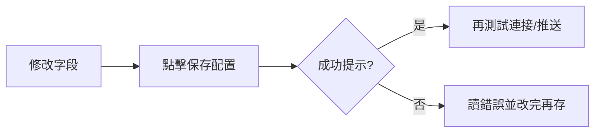

# 10 設置

設置項很多，上手時優先搞定這三件：

1. **模型能連上**（否則沒有報告）；  
2. **自選股有幾個代碼**（否則不知道分析誰）；  
3. **（可選）通知渠道能測通**（否則規則響了你收不到）。

其它項目，等主鏈路跑通再慢慢加，完全來得及。

> 💡 這一章只講 **界面怎麼點**。申請雲廠商賬號、服務器端口、Docker 映射，請看 [完整指南](../../../full-guide.md) 與 [客戶端安裝](../../../beginner-client-setup.md)。

> ⚠️ 改完配置後，請養成習慣：**先保存，再測試，再離開**。只改輸入框不點保存，是新手最常見的「明明填了卻還提示未完成」。

---

## 怎麼進入設置

| 方式 | 路徑 |
| --- | --- |
| 側欄 **設置** | 最常用 |
| 地址 `/settings` | 可收藏 |
| 首頁「開始引導配置」 | 會進就緒檢查，適合第一次 |
| 深鏈示例 | `/settings?section=ai_models&view=connections` |

左側是 **分段**，有的分段還有 **子視圖**。新手模式可能把高級項藏起來——若找不到某項，看看是否要切換到完整/專業列表。

---

## 最重要的紀律：保存

請把設置頁想象成一份表格：你填完格子，還需要「提交」。

| 好習慣 | 爲什麼 |
| --- | --- |
| 改完就保存 | 首頁就緒檢查讀的是已保存配置 |
| 保存後再測試 | 避免測到舊草稿 |
| 留意「有未保存修改」 | 離開頁面可能會丟草稿 |
| 部分自動保存 | 等到「已自動保存」再走 |

保存按鈕常在頂部或底部工具條；窄屏請滾動找一次，別改了半天沒提交。

---

## 第一次配置：跟着就緒檢查走

1. 打開設置，或從首頁點 **開始引導配置**。  
2. 看 **概覽 / 就緒**：哪些是「待處理」，哪些是「已配置」。  
3. 優先點開待處理項，通常是 **AI 與模型** 和 **自選**。  
4. 每一處改完都保存。  
5. 若有 **簡短試跑**，在基礎項齊全後點一次，驗證最小鏈路。  
6. 回首頁，確認缺口提示消失或明顯減輕。

---

## AI 與模型：讓報告「生得出來」

### 模型接入（你最該先會的）

1. 進入 **AI 與模型 → 模型接入**（`section=ai_models&view=connections`）。  
2. **添加模型服務**，選 Anspire Open、AIHubMix、OpenAI 兼容或本地 Ollama 等（以列表為準）。  
3. 粘貼 **API Key**；若需要，填 **Base URL**。  
4. **獲取模型** 並勾選，或手動填控制臺已開通的模型名。  
5. 指定 **主分析模型**（寫個股/大盤報告時默認用它）。  
6. 需要的話，再指定 **問股 / Agent 模型**（可以先與主模型相同）。  
7. **保存** → **測試連接**（或 JSON 冒煙）。  

看到測試成功，你已經跨過最大的門檻。

### 本地模型

在 **本地模型** 子視圖可瀏覽推薦、拉取/註冊、激活。桌面端可能自帶或優先使用本機 Ollama。  
刪模型時若提示受保護，請相信界面：有些目錄模型不能隨便刪。

**模型包導入（部分版本 / 進行中的能力）**  
若界面提供「導入模型包 / Import pack」一類入口：可導入版本化的本地模型包歸檔，綁定快照後再激活。是否出現以你安裝的版本為準；主分支若尚未包含該能力，請勿按不存在的按鈕操作。相關 PR 合入後，入口仍在 **AI 與模型 → 本地模型** 一帶。

### 任務路由與生成方式（進階，但很實用）

| 概念 | 含義 |
| --- | --- |
| 任務路由 | 不同類型的活（寫報告、問股工具）走哪條後端 |
| 默認模型配置 | 最省心的日常選擇 |
| 本地 CLI 生成 | 實驗能力：用本機命令行程序生成；**不等於完全離線**，且問股工具可能不可用 |
| 備用生成方式 | 本地 CLI 失敗後，是直接報錯還是再試雲端默認配置 |

如果你只是想「主模型掛了換另一個雲端模型」，請在連接裏配置 **備用模型**，不要和「備用生成方式」搞混。

### 可靠性

超時、重試之類。沒有明確故障時，**保持默認** 就好。

---

## 自選股：告訴系統你關心誰

自選股列表（常在基礎/就緒相關配置裏，字段名可能是「自選股列表」）是手動分析、定時任務和許多通知的基礎輸入。

**怎麼填更省事：**

- 推薦英文逗號：`600519,hk00700,AAPL`  
- 從表格粘貼時，中文逗號、頓號、空格、換行也常能識別，保存後會規範成英文逗號。  
- 先寫 1～3 個你認識的代碼，比一上來貼 200 個更友好。

改完請保存。之後首頁、批量分析、部分通知範圍都會讀這份列表。

---

## 數據源：錦上添花，但很有用

| 子視圖 | 你在配什麼 |
| --- | --- |
| 行情與資訊 | 增強行情、新聞搜索 Key 等 |
| 情報源 | 社區/情報類，多半默認關 |
| 數據提供方 | Provider 狀態與插件 |

不配新聞，也常常能跑出 **偏技術面** 的基礎分析；但輿情、事件、催化會變薄。  
用 Anspire 時，有時同一個 Key 也能兼顧新聞相關能力（以界面字段為準）；用其它聚合平臺時，可能需要 SerpAPI/Tavily 等。

---

## 通知與告警

### 通知 → 渠道

設置裏的通知區通常以**渠道卡片**展示（企業微信、飛書、Telegram、Discord、郵件等，以界面列表為準）：

1. 先只開 **一個** 你每天會看的渠道。  
2. 點開卡片，填 Webhook / Bot Token / Chat ID 等字段。  
3. 卡片上會顯示大致是否「已配置 / 未配置」。  
4. 用 **測試推送** 驗證（有的測試走當前草稿且不落庫——看按鈕旁說明）。  
5. **保存配置**。通了再加第二個渠道。

還可配置 **通知渠道路由**（哪類事件走哪些渠道）。字段說明見 [14 設置字段速查](14-settings-fields.md) 或字段旁幫助。

**通知渠道插件**  
部署側可掛載額外通知渠道插件（示例見倉庫 `examples/plugins/example-notification-channel/`）。界面是否單獨列出插件渠道，取決於部署是否加載了對應插件；配置字段仍出現在通知/相關分類下。詳見 `docs/notifications.md`、`docs/plugin-extension-contract.md`。

### 告警與自動化

這裡主要是 **推送路由、行爲與頻控、事件監控**。  
「價格到了提醒我」這類規則，在 [信號中心 → 規則](06-signals.md) 裏建。

---

## 報告語言 vs 界面語言

| 設置 | 改什麼 | 不改什麼 |
| --- | --- | --- |
| 界面語言 | 按鈕、菜單、空狀態 | 報告正文語言 |
| 報告語言 | 分析報告等正文 | 菜單語言 |
| 主題 | 淺色/深色 | 業務邏輯 |

菜單可以 English，報告可以中文。  
產品 UI 支持多語言；手冊多語言見 [i18n/README.md](i18n/README.md)。

---

## 系統與安全 · 調度

在 **系統與安全 → 調度**（或文案接近的定時任務區）可：

- 開啓/關閉自動分析；  
- 設置每日執行時間；  
- 查看下次執行；  
- 需要時 **立即執行一次**（以界面與權限為準）。

保存後，需要 **長運行** 的 Web / API / Desktop 進程才會按點執行。  
首頁的 **今日定時任務** 只讀展示當日運行情況，不在這裡改規則。

更完整的任務類型（含研究簡報、風險檢查等）與 API 合同見 `docs/scheduled-tasks.md`。

---

## 個人投資框架（當前以 API / 後端爲主）

產品已提供**版本化個人投資框架**的後端與 API（創建、更新版本、啓停、歷史）。  
**當前階段通常沒有完整的獨立 Web 編輯頁**；分析裝配側有穩定讀取邊界，但不等於界面上處處可見「已按你的框架執行」。

若後續版本在設置或其它頁增加編輯入口，以界面為準。合同說明見 `docs/personal-investment-framework.md`。

---

## 其它分段，用到再學

| 分段 | 什麼時候才需要認真看 |
| --- | --- |
| 對話 · 上下文 | 問股很長、想調壓縮策略時 |
| Agent 行爲 | 要改 Agent 執行邊界時（進階） |
| 用量與成本 | 想知道錢 / token 花哪了 |
| 回測 · 引擎 | 改回測引擎默認（進階） |
| 認證與安全 | 開啓登錄保護、修改管理員密碼 |
| 版本與更新 | 桌面端檢查更新、確認構建號 |
| 高級 · 配置備份 | 重裝前導出；出問題時導入 |
| 高級 · 診斷 | 排障時給自己或給協助者看 |

調度說明見上文 **系統與安全 · 調度**。

### 配置備份

- **導出**：留下一份已保存配置的備份。  
- **導入**：會覆蓋備份裏出現的鍵並重載；若有未保存草稿，會警告你。  
桌面端升級或重裝前，先導出一次配置備份。

---

## 離開頁面時的提示

| 提示 | 意思 |
| --- | --- |
| 有未保存修改 | 先保存或放棄 |
| 離開設置頁？ | 你要走了，草稿可能丟 |
| 放棄模型草稿？ | 模型表單還沒存 |
| 導入會覆蓋草稿 | 導入比本地未保存更優先覆蓋 |

---

## 使用案例

### 案例 A：今晚只想跑通第一份報告

就緒檢查 → 模型接入添加一個雲端服務 → 保存並測試成功 → 自選填 `600519` 並保存 → 回首頁 → 去工作台分析。

### 案例 B：菜單英文、報告中文

界面語言切 English；報告語言保持 `zh`。打開報告確認正文仍是中文即可。

### 案例 C：規則會觸發，手機沒消息

通知渠道測試推送 → 修 Token → 保存 → 再看信號中心推送歷史與冷卻。

### 案例 D：問股不能用工具

任務路由/生成後端顯示本地 CLI 限制 → 問股改走支持工具的雲端路徑，或換模型接入方式。

### 案例 E：要重裝桌面端

高級 → 配置備份 → 導出 → 重裝 → 導入 → 測連接 → 簡短試跑。

---

## 術語

| 術語 | 含義 |
| --- | --- |
| API Key | 訪問模型服務的鑰匙，勿截圖外傳 |
| Base URL | 兼容接口的服務地址根路徑 |
| 主分析模型 | 寫報告默認用的模型 |
| 任務路由 | 哪種活走哪條後端 |
| 就緒 / 配置缺口 | 最小可分析還差什麼 |
| 測試推送 | 發一條假消息驗證渠道 |
| 通知渠道路由 | 哪類事件走哪些通知渠道 |
| 調度 | 按設定時間自動跑分析等任務 |

字段級說明：設置頁字段旁的幫助，或 [14 設置字段速查](14-settings-fields.md)。

## 相關閱讀

- [02 首頁](02-home.md)  
- [01 導航與頂欄](01-shell.md)  
- [06 信號中心](06-signals.md)  
- [客戶端安裝](../../../beginner-client-setup.md)  
- [LLM 配置指南](../../../LLM_CONFIG_GUIDE.md)  
- [定時任務說明](../../../scheduled-tasks.md)  
- [個人投資框架](../../../personal-investment-framework.md)  

上一篇：[09 回測](09-backtest.md) · 下一篇：[11 日常工作流](11-daily-workflows.md)
